# 4 - NAT

## 4.1 - Présentation

Par défaut, les machines virtuelles sont configurées pour accéder au réseau via le mode NAT.

Ce mode d'accès au réseau permet à la machine virtuelle d'accéder automatiquement au réseau et à Internet sans créer de conflit dans votre réseau et sans aucune configuration de votre part.

En effet, en utilisant le mode NAT, les adresses IP seront distribuées aux machines virtuelles par VirtualBox et non par le serveur DHCP de votre réseau.

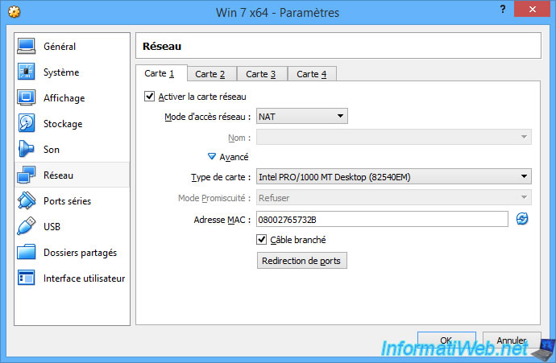

Si vous le souhaitez, vous pouvez changer le type de carte réseau qui sera émulé par VirtualBox pour la machine virtuelle.

Cela peut permettre de résoudre des problèmes de compatibilité avec certains systèmes d'exploitation ou certains Live CD qui ne supporteraient pas celle utilisée par défaut.

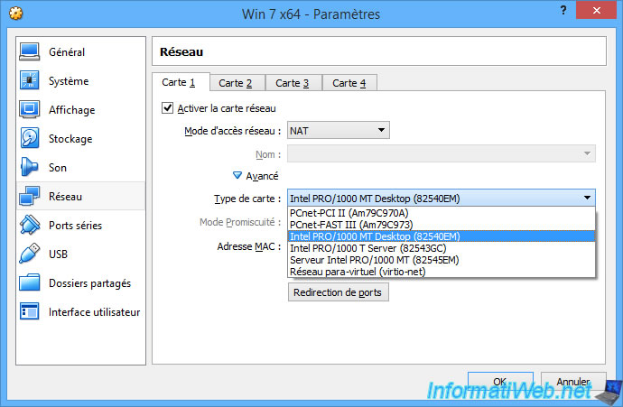

Le problème avec le mode NAT, c'est que vous ne pourrez pas accéder aux services de votre machine virtuelle depuis un ordinateur de votre réseau, car votre machine virtuelle se trouvera derrière une passerelle (émulée par VirtualBox).

Comme vous pouvez le voir, notre ordinateur physique possède l'adresse IP "10.0.0.5" et le masque de sous-réseau "255.255.255.0".

Donc, notre PC se trouve sur le réseau : 10.0.0.x.

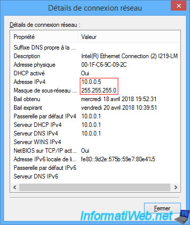

Alors que la machine virtuelle se trouve sur le réseau 10.0.2.x et qu'elle se trouve derrière la passerelle "10.0.2.2".

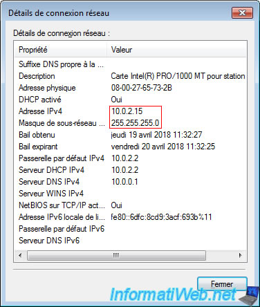

Donc, nous ne pouvons pas accéder à notre machine virtuelle directement car elle ne se trouve pas dans le même réseau que la machine hôte.

Pour régler ce problème, il est possible d'utiliser le mode d'accès réseau "Accès par pont" mais cela place la VM dans le réseau physique comme vu dans la partie 1 du TP.

Donc si vous souhaitez conserver la séparation entre réseau virtuel et réseau physique, vous pouvez aussi configurer la redirection de ports (ou port forwarding en anglais) de la passerelle virtuelle créée par VirtualBox pour pouvoir accéder à un service de votre machine virtuelle depuis n'importe quel PC du réseau physique.

Pour cela, retournez dans les paramètres réseau de votre machine virtuelle et cliquez sur : Redirection de ports.

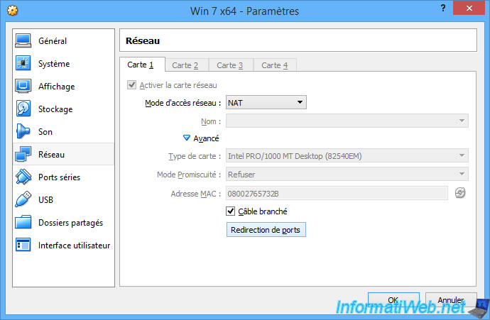

La fenêtre "Règles de redirection de ports" apparait.

Cliquez sur l'icône + située à droite.

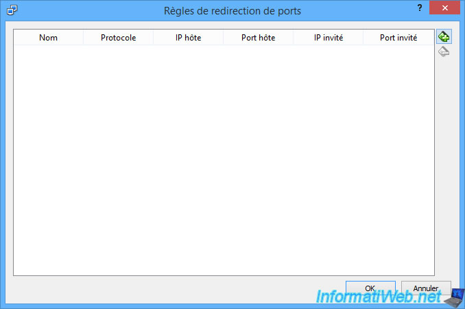

Pour créer une nouvelle règle de redirection de port, vous devrez indiquer :

- un **nom** : par exemple : IIS (serveur web)

- le **protocole** utilisé : TCP ou UDP (pour les serveurs web, il s'agit du protocole TCP).

- l'**IP hôte** : facultatif. Cela est utile si cette règle doit concerner une seule interface réseau (carte réseau) quand la machine physique en a plusieurs. Dans ce TP, il faut mettre l'adresse de la machine physique (10.0.0.34 dans mon exemple, à remplacer par votre adresse de votre machine physique).

- le **port hôte** : le port du PC hôte via lequel les autres ordinateurs du réseau pourront accéder au serveur web tournant dans votre machine virtuelle. Dans ce TP, on va utiliser le port 8081 pour la VM 1 et le port 8082 pour la VM 2.

- **IP invité** : facultatif. Cela est utile si cette règle doit concerner une seule interface réseau (carte réseau) quand la machine virtuelle en a plusieurs. Dans ce TP, il faut mettre l'adresse de la machine virtuelle (10.0.2.15 dans mon exemple. C'est la configuration par défaut de VirtualBox, mais vérifiez la votre).

- **Port invité** : le port de destination. Par exemple si notre serveur web écoute sur le port 80 (HTTP) dans notre machine virtuelle, nous devons indiquer : 80. C'est le cas pour nos 2 VM car IIS écoute sur ce port.

Cliquez sur OK pour valider une règle.

Pour la VM 1 (port 8081 de l'hôte redirigé vers port 80 de la VM) :

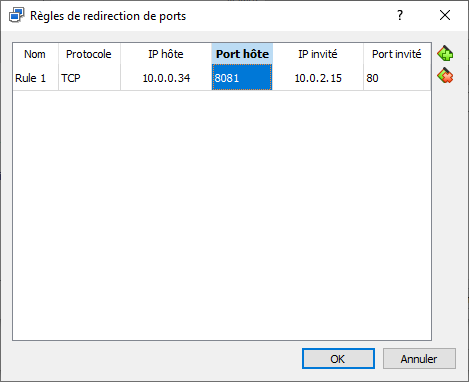

Pour la VM 2 (port 8082 de l'hôte redirigé vers port 80 de la VM) :

Maintenant, nous pouvons accéder aux serveurs web de nos deux machines virtuelles, depuis une autre machine physique du réseau physique, en utilisant :

- l'adresse IP de notre PC hôte (10.0.0.34 dans mon exemple)
- les ports indiqués dans la colonne "Port hôte" (8081 et 8082)

On vérifie que la page personnalisée est la bonne selon le n° de port utilisé :

Exemple de connexion à la VM 1 : <http://10.0.0.34:8081>

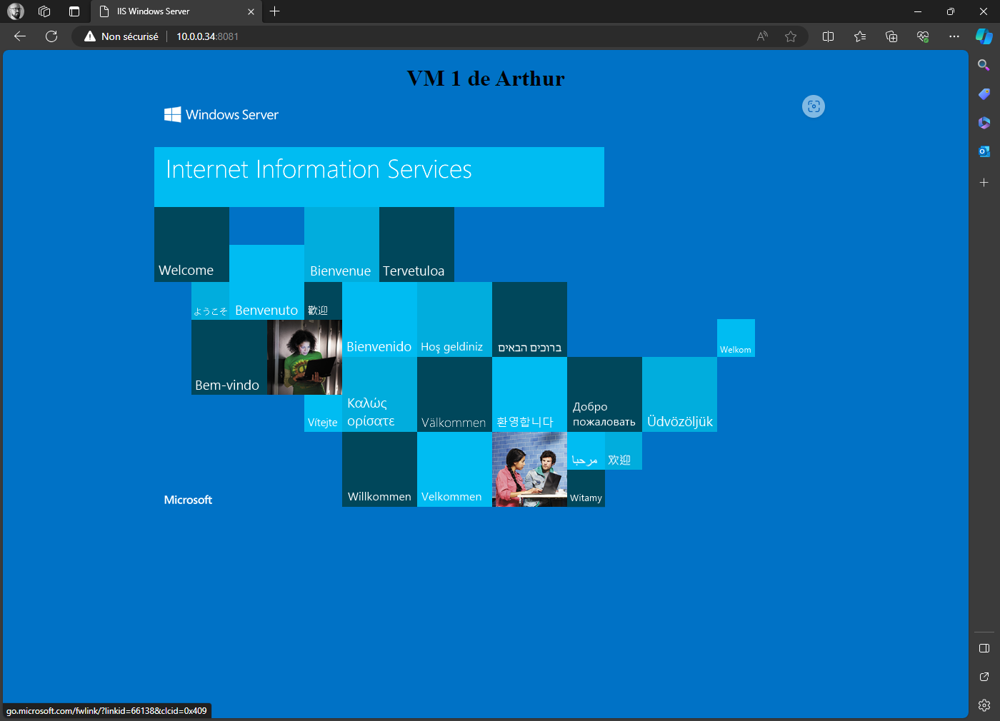

Exemple de connexion à la VM 2 : <http://10.0.0.34:8082>

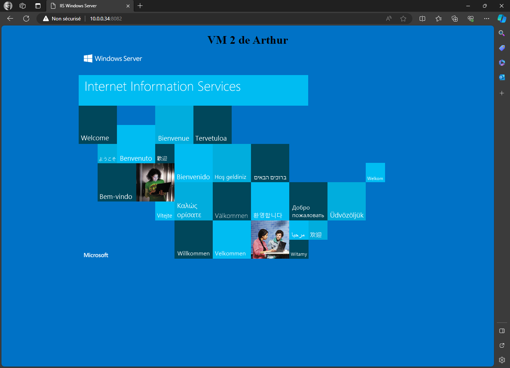

**Réseaux NAT**

Avec VirtualBox, vous pouvez aussi créer des réseaux NAT supplémentaires.

Néanmoins, par défaut, il n'y en a aucun de créé.

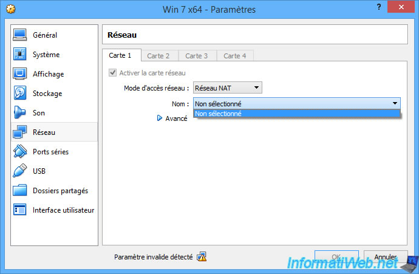

Pour créer un nouveau réseau NAT, allez dans le menu : Fichier -\> Préférences.

Ensuite, cliquez sur "Réseau", puis sur l'icône +.

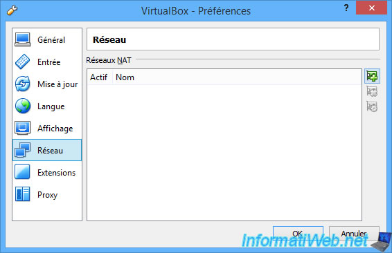

Par défaut, votre nouveau réseau NAT sera nommé : NatNetwork.

Pour le configurer, sélectionnez-le et cliquez sur l'icône représentant un engrenage.

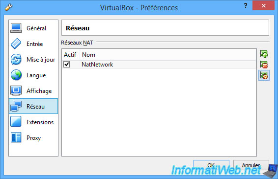

Pour chaque réseau NAT, vous pourrez choisir :
- l'identifiant réseau à utiliser (aussi appelé CIDR pour Classless Inter-Domain Routing).
- la possibilité d'activer ou non le serveur DHCP de VirtualBox pour ce réseau. Le désactiver peut être pratique pour apprendre à créer son propre serveur DHCP sous Linux ou Windows Server en VM.
- de supporter aussi l'IPv6 ou non.
- de créer des redirections de ports comme expliqué précédemment.

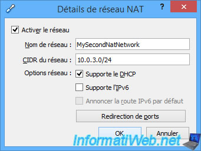

Dans ce cas-ci, vous pourrez rediriger des ports en IPV4 et/ou en IPv6.

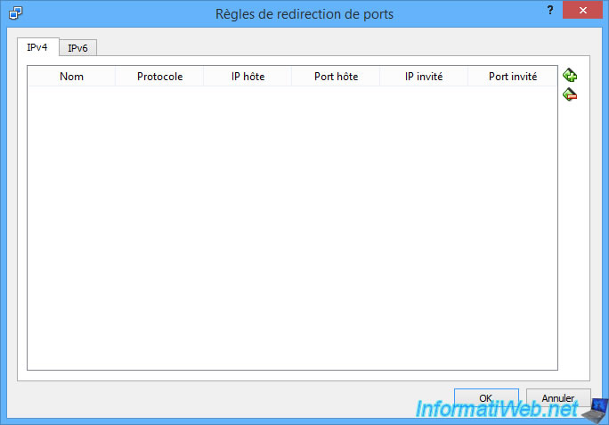

Voilà notre nouveau réseau NAT.

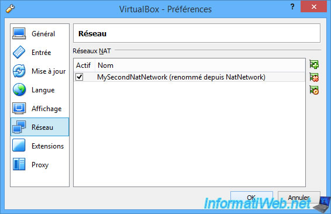

Dans les paramètres de votre machine virtuelle, retournez dans la partie "Réseau" et sélectionnez :
- le mode d'accès réseau : Réseau NAT
- le nom de votre nouveau réseau NAT. Dans notre cas : MySecondNatNetwork.

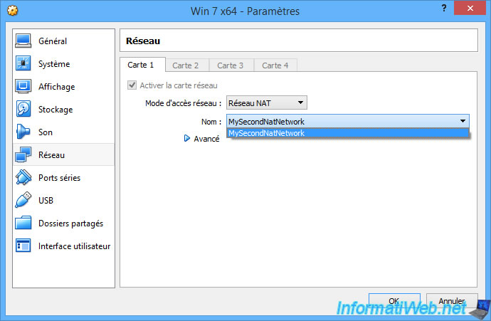

Comme vous pouvez le voir, notre machine virtuelle a bien reçu une adresse IP qui correspond bien à l'ID réseau "10.0.3.0/24" configuré précédemment.

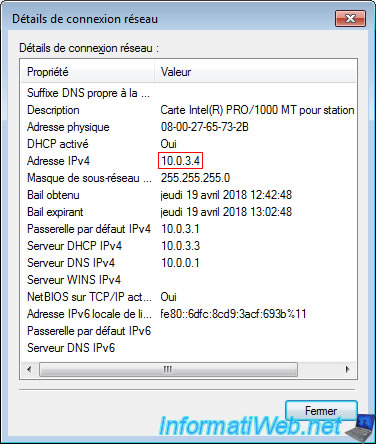

## 4.2 - Travail à faire

- Configurez vos machines virtuelles en mode NAT.

- Configurez les cartes réseau de vos machines virtuelles en client DHCP.

- Affichez la configuration réseau de votre machine virtuelle et vérifiez qu'elle a bien reçu ses paramètres de la part du serveur DHCP intégré à VirtualBox

Commande ipconfig /all et regarder la ligne "Serveur DHCP"

- Configurez une règle de redirection de port pour chaque VM, pour que le serveur IIS de chaque VM soit accessible depuis le réseau physique respectivement sur les ports 8081 et 8082.

- accédez à votre machine virtuelle depuis une machine physique du réseau physique

- accédez à votre machine virtuelle depuis la machine hôte

