**==Objectifs :==**

Etablir une connexion sécurisée (authentifiée et chiffrée) en interface graphique vers un ordinateur Windows
Découvrir le protocole RDP (Remote Desktop Protocol)
Configurer et utiliser les logiciels Connexion Bureau à Distance client et serveur

**==Pré-requis :==** deux ordinateurs Windows
le réseau est correctement configuré sur les machines, elles communiquent entre elles

**==Introduction== :**

Pour se connecter à un ordinateur à partir d’un autre ordinateur, plusieurs protocoles sont disponibles. En effet, la compatibilité des systèmes d’exploitation rend plus facile l’utilisation de certains protocoles plutôt que d’autres. Ces systèmes d’exploitation sont dotés de spécificités bien particulières car ils n’ont pas les mêmes langages ni les mêmes manière de fonctionner, de réagir, de nous présenter les choses. Nous pouvons avoir des systèmes à interfaces graphiques, d’autres sans, en ligne de commande (CLI = Command Line Interface).

Dans ce TP, nous allons nous connecter graphiquement à distance à un ordinateur Windows pourvu d'interface graphique (GUI = Graphic User Interface). Il nous sera donc nécessaire d'utiliser un protocole de Bureau à Distance. Nous allons utiliser le protocole RDP (Remote Desktop Protocol). Nous établirons une connexion entre 2 machines Windows.

**==Configuration du serveur==**

**==Le protocole RDP==**

Le protocole RDP pour Remote Desktop Protocol est un protocole qui permet de se connecter à distance à une autre machine (poste de travail ou serveur), en visualisant l'environnement de la machine distante (interface graphique, programmes, etc.). Généralement, le protocole RDP est utilisé pour administrer un serveur Windows Server à partir d'un autre serveur ou d'un poste de travail.

Une connexion établie avec le protocole RDP s'appuie sur le port 3389 et sur le protocole de transport TCP (ou UDP, selon la configuration). Ce numéro de port peut être personnalisé, comme pour d'autres services tels que le SSH.

Ce protocole n'est pas nouveau puisqu'il existe depuis Windows NT 4.0, bien qu'il ait continué d'évoluer au fil des versions de Windows. Au-delà de permettre à l'utilisateur de visualiser l'environnement de la machine distante, le RDP prend en charge d'autres fonctionnalités comme le partage du presse-papiers, ainsi la redirection des disques locaux et des imprimantes dans la session distante. Par exemple, grâce à la redirection d'une imprimante locale sur la machine distante via le protocole RDP, il est possible d'imprimer sur l'imprimante locale un document situé sur la machine distante.

**==Configuration==**

Le protocole RDP (Remote Desktop Protocol, ou Protocole de Bureau à Distance) sous Windows est simple à activer. Il faut suivre le mode opératoire suivant :

Accédez aux paramètres de Windows 10
Puis Système
Ensuite dans le menu de gauche, cliquez sur Bureau à distance

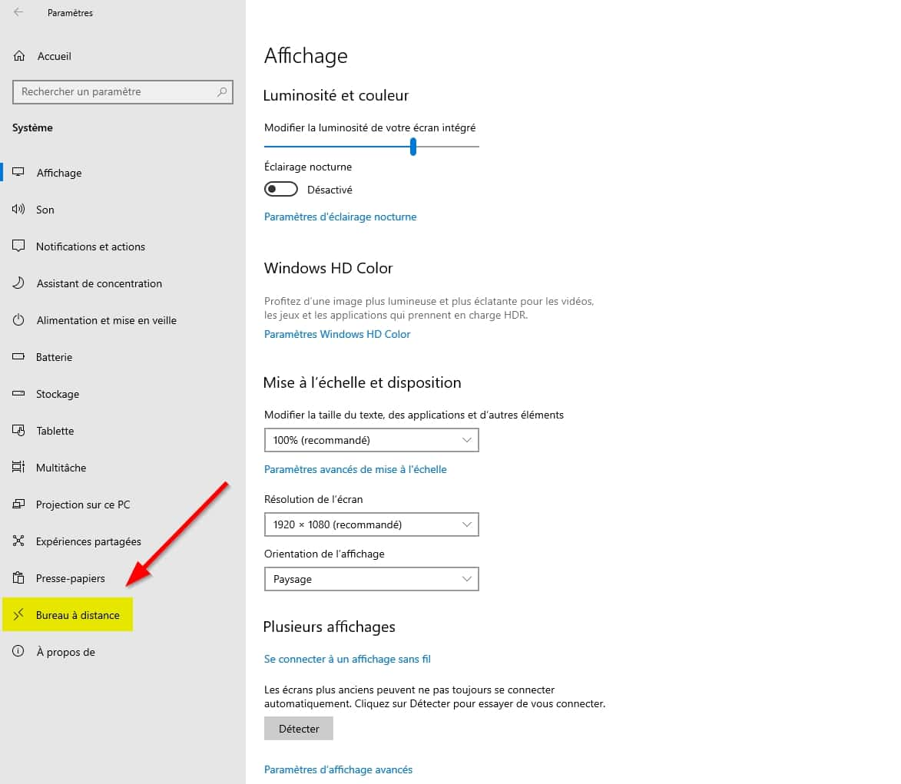

Activer le bureau à distance puis sur la popup cliquez sur Confirmer

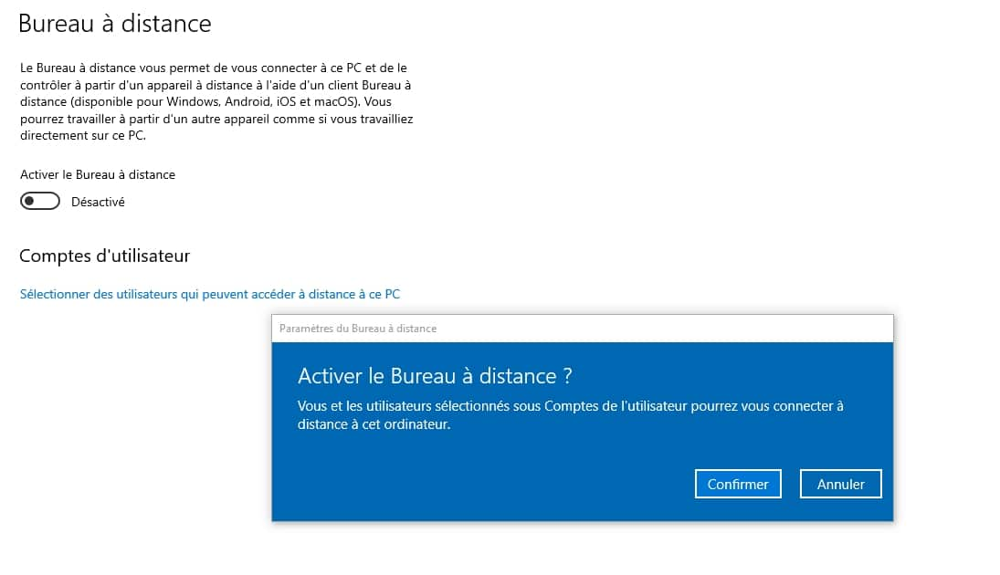
Ce dernier s’active et donne accès à différents paramètres notamment :
Configurer la mise en veille pour éviter que le PC ne s’éteigne et reste accessible à distance
Gérer le profil réseau public et privé pour rendre le PC visible sur le réseau

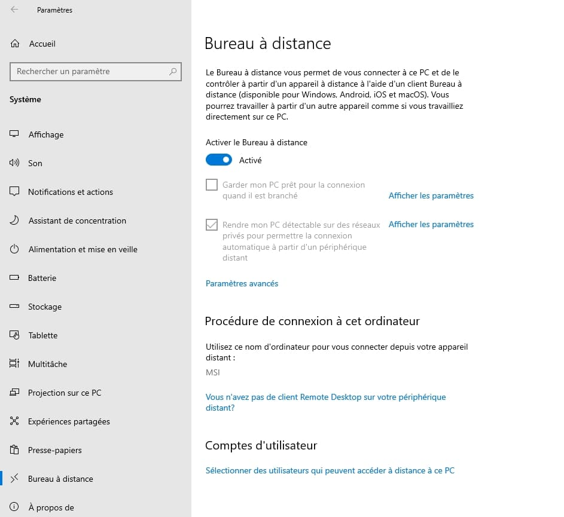

Dans paramètres avancés, vous pouvez désactiver l’authentification au niveau du réseau dit Network Level Authentication (NLA). Ce dernier est actif par défaut.

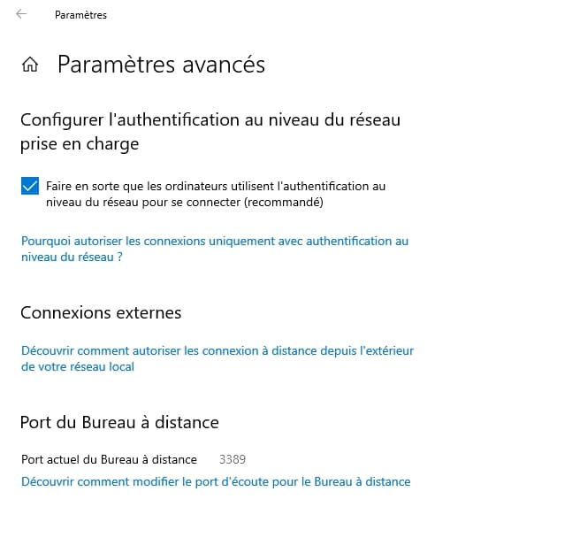

Puis tout en bas dans Comptes d’utilisateur, vous définissez les utilisateurs autorisés à se connecter au bureau à distance. Il y a de forte chance que votre utilisateur Windows soit déjà autorisé, si vous souhaitez en ajouter d’autres, cliquez sur Ajouter

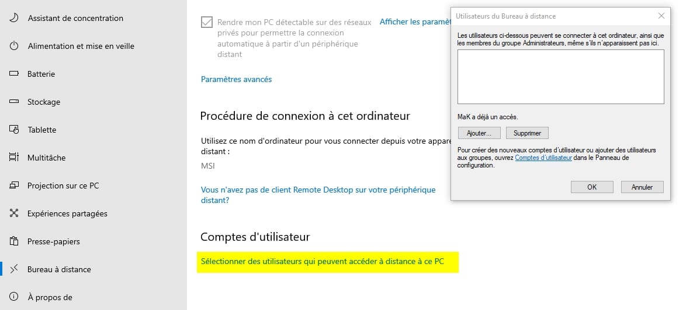

Il est aussi possible de lancer la commande via (Windows + R) suivante :

systempropertiesremote

Cela ouvre cette fenêtre dans laquelle on coche dans la section Bureau à distance l'option Autoriser les connexions à distance à cet ordinateur

On peut décocher N'autoriser que l'authentification NLA et cliquer sur le bouton Sélectionnez des utilisateurs pour gérer les accès avec les comptes locaux ou laisser cocher la case pour plus de sécurité à l'aide d'une authentification réseau

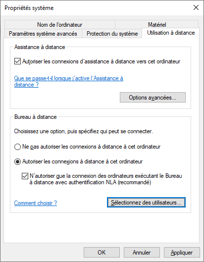

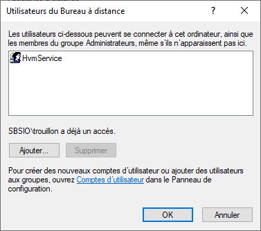

**==Configuration du client==**

**==Le Bureau à Distance==**

Le Bureau à distance est une application qui va permettre d'effectuer une connexion à distance à une autre machine en utilisant le protocole RDP. Il s'agit d'un service Windows utilisé pour l'accès à distance sur un PC / un serveur.

Comme évoqué précédemment, un administrateur système peut gérer un serveur à distance via une connexion Bureau à distance. Cela est vrai aussi pour un poste de travail, que ce soit en Windows 10, Windows 11 ou des versions plus anciennes. On peut affirmer que le Bureau à distance est intéressant dans plusieurs scénarios, dont l'administration à distance et la téléassistance.

Toutefois, il est important de préciser que si l'on se connecte sur un poste de travail avec le Bureau à distance, l'utilisateur ne peut pas voir ce que vous faites à l'écran. Il y a une perte de visibilité pour la personne située devant l'écran, que ce soit sur un ordinateur ou un serveur. C'est une contrainte importante lorsque l'on effectue de la téléassistance.

**==Configuration==**

Sous Windows et Windows Server, l'application native "Connexion Bureau à distance" (ou mstsc.exe) permet d'établir une connexion à distance (via RDP) sur une autre machine. Il suffit de préciser le nom complet (DNS) de la machine sur laquelle on souhaite se connecter, ou éventuellement son nom court ou son adresse IP. Toutefois, il est recommandé d'utiliser le nom complet. Ensuite, on clique sur "Connexion" et il faudra s'authentifier avec un compte utilisateur (disposant des autorisations nécessaires).

Pour obtenir un autre client de Bureau à Distance (web, MacOS, iOS, iPadOS, ChromeOS, Android, Windows) : [Remote Desktop clients for Remote Desktop Services and remote PCs - Windows Server \| Microsoft Learn](https://learn.microsoft.com/en-us/windows-server/remote/remote-desktop-services/clients/remote-desktop-clients)

Ouvrez l’utilitaire de connexion de bureau à distance natif fourni avec Windows

Ce client est accessible :

Par le menu Démarrer \> Accessoires Windows \> connexion de bureau à distance
Par la commande mstsc

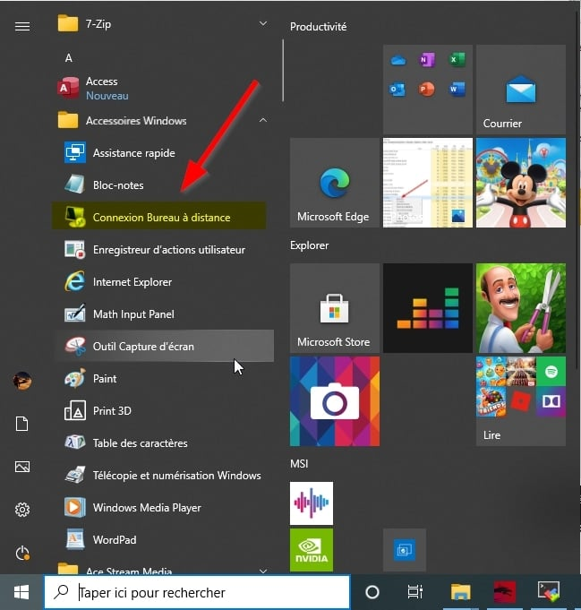

Saisissez le nom ou l'adresse IP du serveur auquel se connecter :

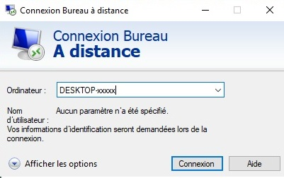

Si vous n'avez pas entré d'identifiant, on vous demandera de le faire :

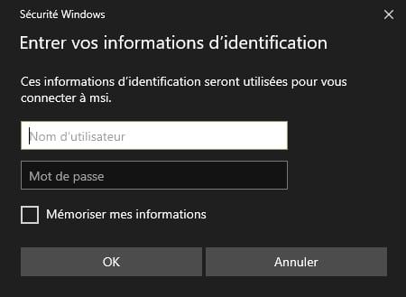

Avec les options affichées :

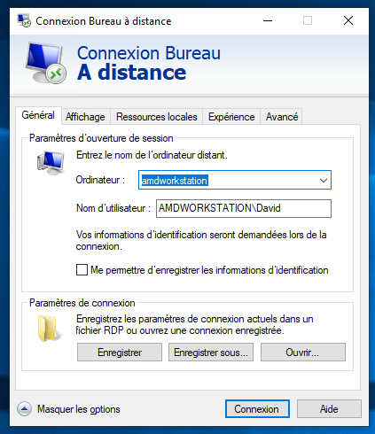

Lors de la toute première connexion au serveur, le serveur vous demande de vérifier et de valider l'identité de celui-ci au moyen de son empreinte numérique.

Répondez oui pour accepter le certificat. Si vous cochez la case correspondante, ce certificat sera installé sur le client et il ne sera pas nécessaire de valider à nouveau l'identité de ce serveur lors des prochaines connexions.

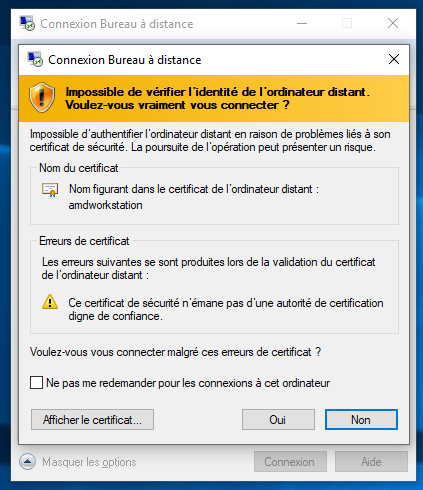

Options avancées :

Affichage, couleurs et résolution :

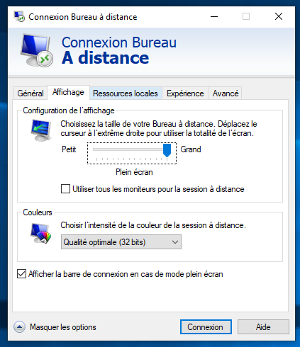

Connexion des périphériques locaux (audio, clavier, imprimante, presse papier) :

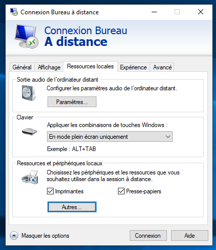

Autres périphériques à connecter :

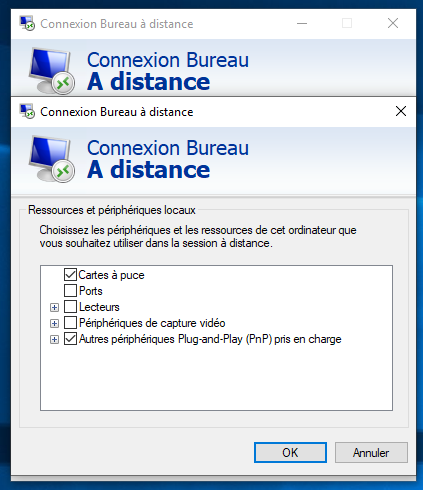

Performances en fonction du réseau :

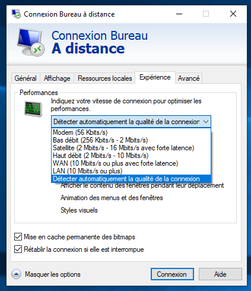

Sécurité et authentification :

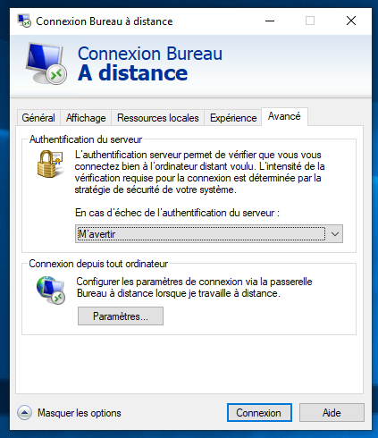

**==Autoriser le bureau à distance sur le pare-feu Windows Defender==**

Ouvrez les sécurité de Windows en double cliquant sur l’icône bouclier dans la zone de notification de Windows 10
Puis cliquez sur Pare-feu et protection du réseau
Ensuite dans la liste cliquez sur Autoriser une application ou une fonctionnalité via le Pare-feu de Windows
Puis cliquez sur modifier les paramètres
Cochez privée sur Bureau à distance. Je vous déconseille d’autoriser les connexions pour la partie public.
Enfin cliquez sur OK

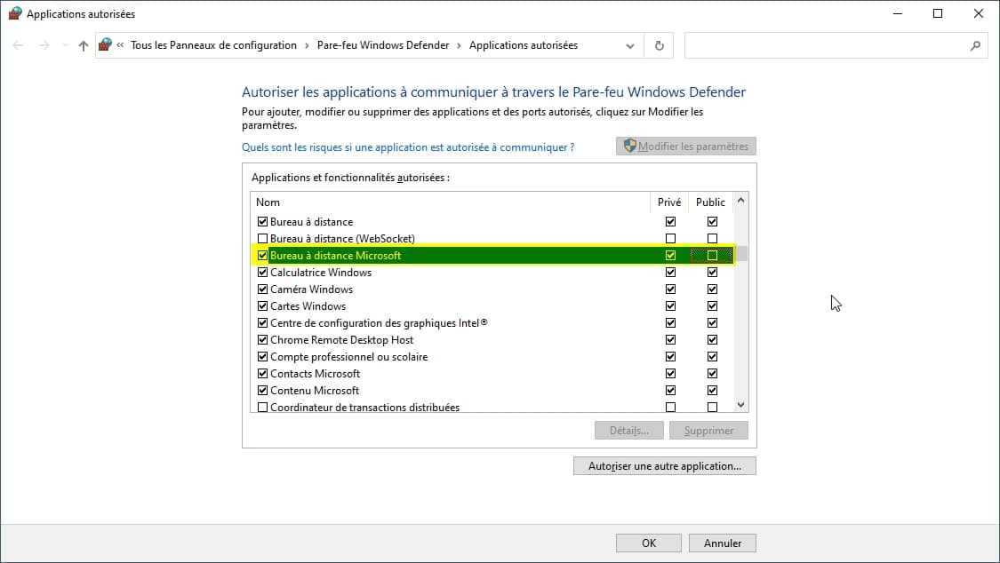

