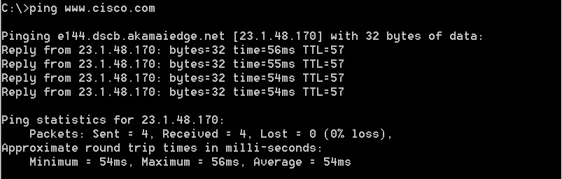
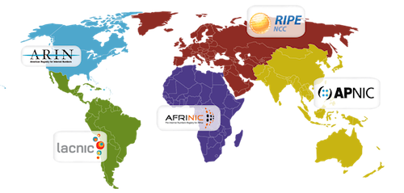

**Travaux pratiques– Suivi de la connectivité Internet**
- **Objectifs**
- Déterminer la connectivité réseau vers un hôte de destination.
- Tracer une route vers un serveur distant à l'aide de la commande tracert.
- **Contexte/scénario**
Les données transitent d'un appareil source vers un appareil cible via un chemin appelé route. Le suivi d'une route répertorie chaque appareil de routage qui achemine un paquet de la source à la destination sur un réseau. Les logiciels de traçage de route indiquent chaque élément emprunté par ces données.

Ce logiciel de traçage s'exécute généralement dans une ligne de commande comme suit:

**tracert** \<destination network name or end device address\>

(Systèmes Microsoft Windows)

ou

**traceroute** \<destination network name or end device address\>

(Systèmes UNIX, Linux et appareils Cisco, tels que des commutateurs et des routeurs)

**Tracert** et **traceroute** déterminent la route empruntée par les paquets dans un réseau IP.

L'outil **tracert** (ou **traceroute**) est souvent utilisé pour dépanner les réseaux. En affichant la liste des routeurs traversés, l'utilisateur peut identifier le chemin emprunté pour atteindre une destination particulière sur le réseau ou les interréseaux. Chaque routeur représente un point de connexion entre deux réseaux par lequel a été transféré le paquet de données. Le nombre de routeurs traversés correspond au nombre de sauts effectués par les données depuis la source jusqu'à la destination.

La liste affichée permet d'identifier les problèmes de flux de données lors de la tentative d'accès à un service tel qu'un site Web. Elle permet également d'effectuer des tâches telles que le téléchargement de données. Si plusieurs sites web (miroirs) sont disponibles pour le même fichier de données, il est possible de tracer chaque miroir pour déterminer le plus rapide.

Deux commandes traceroute entre la même source et la même destination exécutées à des moments différents peuvent produire des résultats différents. Cela s'explique par le «maillage» des réseaux interconnectés. Ceux-ci bénéficient du fait qu'Internet et les protocoles Internet sont capables de choisir différents chemins pour envoyer des paquets.

Des outils de traçage de route basés sur une ligne de commande sont généralement intégrés au système d'exploitation de l'appareil final. Cet exercice doit être effectué sur un ordinateur disposant d'un accès à Internet et d'un accès à une ligne de commandes.
- **Ressources requises**
Un PC avec un accès Internet  

**Scénario**

Via une connexion Internet, vous allez utiliser deux programmes de suivi de route pour examiner le chemin Internet menant aux réseaux de destination. Tout d'abord, vous allez vérifier la connectivité à un site web. Ensuite, vous allez utiliser l'utilitaire **tracert** sur la ligne de commande Windows. Enfin, vous allez utiliser un outil traceroute basé sur le web ( <http://www.monitis.com/traceroute/>).

- **Déterminez la connectivité réseau vers un hôte de destination.**
Pour tracer la route jusqu'à un réseau distant, le PC doit disposer d'une connexion opérationnelle à Internet. Utilisez la commande **ping** pour tester si un hôte est accessible. Les paquets de données sont envoyés à l'hôte distant avec des instructions de réponse. Le PC détermine si chaque paquet reçoit une réponse et le temps nécessaire pour que les paquets traversent le réseau.
- À l'invite de commande, saisissez **ping [www.cisco.com](http://www.cisco.com)** afin de déterminer si cette adresse est accessible.

La première ligne affiche le nom de domaine complet (FQDN) e144.dscb.akamaiedge.net dans m'exemple. Elle est suivie de l'adresseIP 23.1.48.170 dans l'exemple. Cisco héberge le même contenu web sur différents serveurs dans le monde entier (appelés miroirs). Par conséquent, selon votre emplacement géographique, le nom de domaine complet et l'adresseIP seront différents.

Quatre requêtes ping ont été envoyées et une réponse a été reçue pour chaque requête ping. Étant donné que chaque requête ping a reçu une réponse, la perte de paquets correspond à 0%. En moyenne, il a fallu 54ms (54millisecondes) pour acheminer les paquets sur le réseau. Une milliseconde correspond à 1/1000e de seconde. Vos résultats seront probablement différents.

- Envoyez maintenant une requête ping aux sites Web des organismes d'enregistrement Internet locaux situés dans différentes parties du monde afin de déterminer s'il est accessible:
Europe : [**www.ripe.ne**t](http://www.ripe.net)

Afrique: [**www.afrinic.net**](http://www.afrinic.net)

Australie: [**www.apnic.net**](http://www.apnic.net)

Amérique du Sud: [**www.lacnic.net**](http://www.lacnic.net)

Amérique du Nord: [**www.arin.net**](http://www.arin.net)

**Remarque:** au moment de la rédaction de ce document, l'organisme d'enregistrement Internet local européen [www.ripe.net](http://www.ripe.net/) ne répond pas aux requêtes d'écho ICMP.

Ces sites Web seront utilisés dans la Partie2 avec la commande **tracert**.

- **Tracez une route vers un serveur distant à l'aide de la commande tracert.**
Une fois que vous avez utilisé **ping** pour déterminer si vous pouvez accéder aux sites Web choisis, vous devez utiliser **tracert** pour déterminer le chemin pour atteindre le serveur distant. Examinez en détail chaque segment de réseau traversé.  

Suivant la taille de votre fournisseur d'accès Internet (FAI) et l'emplacement des hôtes source et de destination, les routes tracées peuvent passer par des sauts et des FAI différents. Chaque «tronçon» représente un routeur. Un routeur est un type d'ordinateur spécialisé qui permet de diriger le trafic sur Internet. Imaginez que vous effectuez un voyage en voiture dans plusieurs pays en utilisant de nombreuses autoroutes. À plusieurs endroits pendant le voyage, vous arrivez à des embranchements sur la route où vous avez la possibilité de choisir entre plusieurs autoroutes. Maintenant, imaginez qu'à chaque embranchement sur la route se trouve un dispositif qui vous oriente vers l'autoroute correcte vous permettant ainsi d'accéder à votre destination finale. C'est exactement le rôle d'un routeur pour les paquets sur un réseau.  

Étant donné que les ordinateurs communiquent avec des nombres décimaux ou hexadécimaux, plutôt qu'avec des mots, les routeurs sont identifiés grâce à leur adresseIP. L'outil **traceroute** indique le chemin emprunté par un paquet de données sur le réseau pour atteindre sa destination finale. L'outil **traceroute** vous donne également une idée de la vitesse du trafic sur chaque segment du réseau. Des paquets sont envoyés à chaque routeur sur le chemin et le temps de retour est mesuré en millisecondes.

Chaque saut dans les résultats de **tracert** indique les routes que les paquets empruntent lors de leur déplacement vers la destination finale. Le PC envoie trois paquets de requête d'écho ICMP à l'hôte distant. Chaque routeur présent dans le chemin décrémente la valeur de durée de vie de 1 avant de la passer au système suivant. Décrémenter signifie compter à rebours. Lorsque la valeur de durée de vie décrémentée atteint 0, le routeur renvoie un message ICMP de dépassement de délai à la source avec son adresse IP et l'heure actuelle. Lorsque la destination finale est atteinte, une réponse d'écho ICMP est envoyée à l'hôte source.
- À l'invite de commande, déterminez la route vers [www.cisco.com](http://www.cisco.com/).
C:\Users\User1\> **tracert** [www.cisco.com](http://www.cisco.com)

Tracing route to e144.dscb.akamaiedge.net \[23.67.208.170\]

over a maximum of 30hops:

1 1 ms \<1 ms \<1 ms 192.168.1.1

2 14 ms 7 ms 7 ms 10.39.0.1

3 10ms 8ms 7ms 172.21.0.118

4 11ms 11ms 11ms 70.169.73.196

5 10 ms 9 ms 11 ms 70.169.75.157

6 60 ms 49 ms \* 68.1.2.109

7 43 ms 39 ms 38 ms Equinix-DFW2.netarch.akamai.com \[206.223.118.102\]

8 33 ms 35 ms 33 ms a23-67-208-170.deploy.akamaitechnologies.com \[23.67.208.170\] Trace complete.

Par exemple, l'hôte source envoie trois paquets de requêtes d'écho ICMP au premier saut (192.168.1.1) avec la valeur de durée de vie de1. Lorsque le routeur192.168.1.1 reçoit les paquets de requête d'écho, il décrémente la valeur de durée de vie à0. Le routeur renvoie un message ICMP de dépassement de délai à la source. Ce processus se poursuit jusqu'à ce que l'hôte source envoie les trois derniers paquets de requêtes d'écho ICMP avec des valeurs de durée de vie de8 (numéro de saut8 dans le résultat ci-dessus), ce qui correspond à la destination finale. Dès que les paquets de requête d'écho ICMP arrivent à leur destination finale, le routeur répond à la source avec des réponses d'écho ICMP.

Pour les sauts2 et3, ces adressesIP sont des adresses privées. Ces routeurs constituent la configuration typique du POP (Point-of-Presence) du fournisseur d'accès à Internet (FAI). Les appareils POP connectent les utilisateurs au réseau d'un fournisseur d'accès à Internet (FAI).
- Exécutez maintenant une commande **tracert** vers les sites Web des organismes d'enregistrement Internet locaux de la Partie1.
Europe : [**www.ripe.net**](http://www.ripe.net)  

Afrique: [**www.afrinic.net**](http://www.afrinic.net)

Australie: [**www.apnic.net**](http://www.apnic.net)

Amérique du Sud: [**www.lacnic.net**](http://www.lacnic.net)

Amérique du Nord: [**www.arin.net**](http://www.arin.net)

Enregistrez la sortie de traceroute dans un fichier texte pour l'examiner ultérieurement, utilisez le chevron supérieur droite (\>), nommez le fichier de la sortie comme il convient, puis enregistrez-le dans le répertoire actuel. Dans cet exemple, la sortie de traceroute est enregistrée dans le fichier C:\Users\User1\cisco-traceroute.txt.

C:\Users\User1\> **traceroute [www.cisco.com](http://www.cisco.com) \> cisco-traceroute.txt**

Vous pouvez maintenant saisir la commande **type cisco-traceroute.txt** pour afficher la sortie de traceroute stockée dans le fichier texte.
