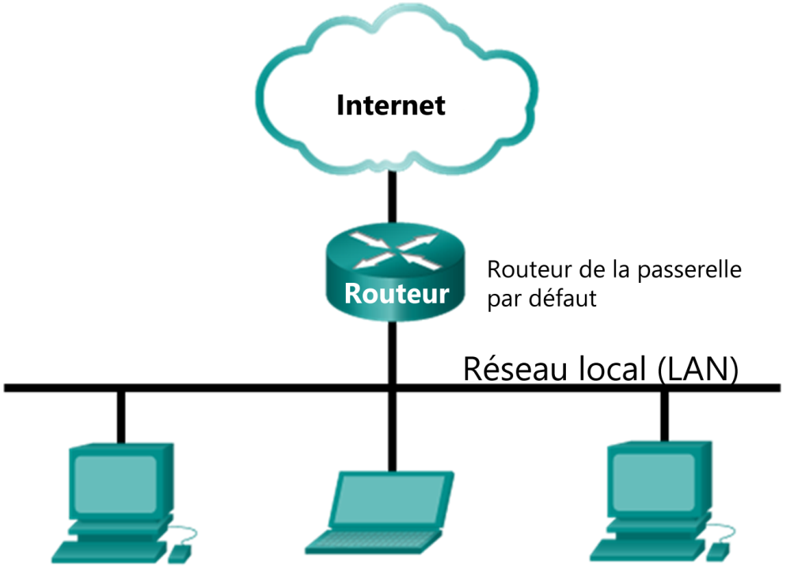
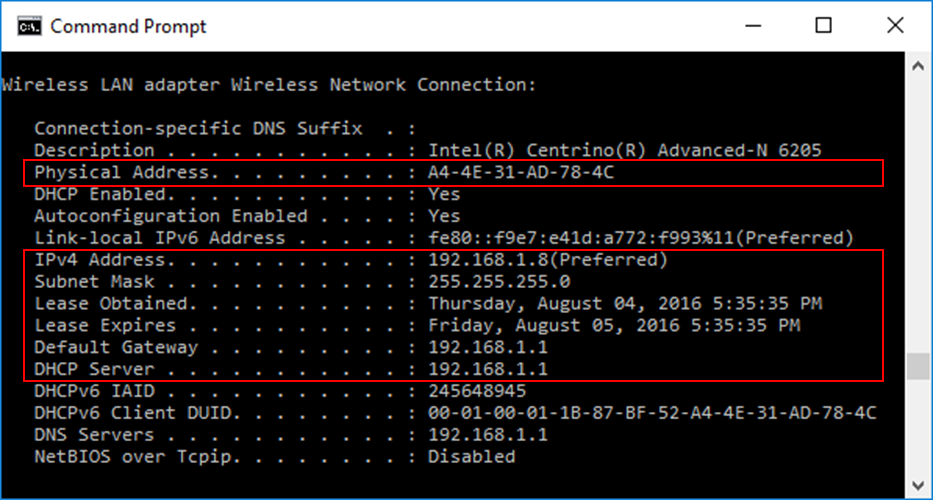
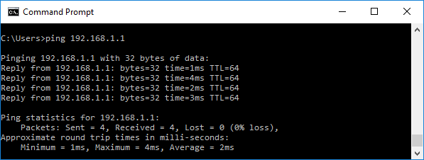
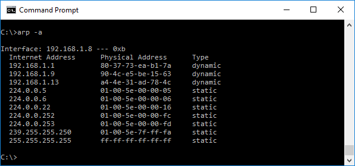
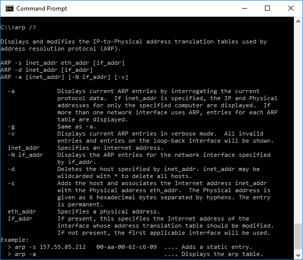

**Travaux pratiques– Le protocole ARP**
- **Topologie**

- **Objectifs**
**Afficher les entrées du cache ARP sur l'ordinateur**
- Accédez à l'invite de commandes Windows.
- Utilisez la commande **arp** de Windows pour afficher le cache de la table ARP locale sur l'ordinateur.
- **Contexte/scénario**
Le protocole ARP (Address Resolution Protocol) est utilisé par TCP/IP pour mapper une adresse IPv4 de couche 3 à une adresse MAC de couche 2. Lorsqu'une trame Ethernet est transmise sur le réseau, elle doit posséder une adresse MAC de destination. Pour détecter dynamiquement l'adresse MAC d'une destination connue, l'appareil source envoie une requête ARP sur le réseau local. L'appareil auquel correspond l'adresse IPv4 de destination répond à cette requête avec une réponse ARP et son adresse MAC est enregistrée dans le cache ARP.

Tous les appareils sur le réseau LAN conservent leur propre cache ARP. Le cache ARP est une petite zone de la mémoire RAM contenant les réponses ARP. En affichant le cache ARP d'un ordinateur, vous aurez accès à l'adresse IPv4 et l'adresse MAC de tous les appareils sur le réseau LAN avec lesquels cet ordinateur a échangé des messages ARP.
- **Ressources requises**
- 1\. Ordinateur Windows10 avec accèsInternet
- Des ordinateurs supplémentaires sur le réseau local (LAN) seront utilisés pour répondre aux requêtes **ping**. Si aucun ordinateur supplémentaire n'est disponible sur le réseau LAN, l'adresse de passerelle par défaut sera utilisée pour répondre aux requêtes **ping**.
- **Générer du trafic ARP**
Dans cette partie de ces travaux pratiques, vous exécuterez une commande ping sur un autre ordinateur du réseau local (LAN) et générerez des requêtes et des réponses ARP.
- **Récupérez les adresses d'interface de votre ordinateur.**
Pour réaliser ces travaux pratiques, vous devrez récupérer l'adresse IPv4 et l'adresse MAC de votre ordinateur.
- Ouvrez une fenêtre de commandes, tapez **ipconfig /all**, puis appuyez sur Entrée.
- Identifiez la carte réseau utilisée par l'ordinateur pour accéder au réseau. Enregistrez l'adresse IPv4 et l'adresse MAC (adresse physique) de l'interface de votre ordinateur.

- Demandez à votre voisin de vous communiquer l'adresse IPv4 de son ordinateur et donnez-lui l'adresse IPv4 du vôtre. Ne lui fournissez pas votre adresse MAC pour le moment.
Notez les adresses IPv4 de la passerelle par défaut et des autres ordinateurs présents sur le réseau LAN.

\_\_\_\_\_\_\_\_\_\_\_\_\_\_\_\_\_\_\_\_\_\_\_\_\_\_\_\_\_\_\_\_\_\_\_\_\_\_\_\_\_\_\_\_\_\_\_\_\_\_\_\_\_\_\_\_\_\_\_\_\_\_\_\_\_\_\_\_\_\_\_\_\_\_\_\_\_\_\_\_\_\_\_\_
- Ouvrez une fenêtre d'invite de commandes. Utilisez la commande **ping** pour tester la connectivité à l'adresse de passerelle par défaut identifiée à l’étape1c.

- Envoyez une requête ping vers les adresses IPv4 des autres ordinateurs sur le réseau LAN qui ont été fournies par les membres de votre équipe.
**Remarque**: si l'ordinateur d'un membre de votre équipe ne répond pas à vos requêtes ping, c'est peut-être parce que le pare-feu de son ordinateur bloque ces requêtes. Si nécessaire, désactivez le pare-feu de l'ordinateur. N’oubliez pas de le ré-activer ensuite!
- **Examinez les entrées du cache ARP sur l'ordinateur.**
Une fois que l'ordinateur a reçu la réponse ARP, l'association de l'adresse MAC à l'adresse IPv4 est stockée dans la mémoire cache de l'ordinateur. Ces entrées seront stockées sur la mémoire cache pendant une très courte durée (de 15à45secondes), puis, si elles ne sont pas utilisées, elles seront supprimées.
- **Consultez les entrées du cache ARP sur un ordinateurWindows.**
  1.  Ouvrez une fenêtre d'invite de commandes sur l'ordinateur. À l'invite, saisissez **arp -a**, puis appuyez sur Entrée.

La commande **arp -a** affiche les entrées placées dans la mémoire cache de l'ordinateur. Dans l'exemple, l'ordinateur présente des entrées pour la passerelle par défaut (192.168.1.1) et pour les deux ordinateurs sur le même réseauLAN (192.168.1.9 et 192.168.1.13).

Que se passe-t-il lorsque vous exécutez la commande **arp -a** sur votre ordinateur?

\_\_\_\_\_\_\_\_\_\_\_\_\_\_\_\_\_\_\_\_\_\_\_\_\_\_\_\_\_\_\_\_\_\_\_\_\_\_\_\_\_\_\_\_\_\_\_\_\_\_\_\_\_\_\_\_\_\_\_\_\_\_\_\_\_\_\_\_\_\_\_\_\_\_\_\_\_\_\_\_\_\_\_\_

\_\_\_\_\_\_\_\_\_\_\_\_\_\_\_\_\_\_\_\_\_\_\_\_\_\_\_\_\_\_\_\_\_\_\_\_\_\_\_\_\_\_\_\_\_\_\_\_\_\_\_\_\_\_\_\_\_\_\_\_\_\_\_\_\_\_\_\_\_\_\_\_\_\_\_\_\_\_\_\_\_\_\_\_
- La commande **arp** a d'autres utilités sur un ordinateur Windows. Saisissez **arp /?** dans l'invite de commandes et appuyez sur Entrée. Les options de commande **arp** vous permettent d'afficher, d'ajouter ou de supprimer des entrées de la tableARP si nécessaire.

Quelle option permet de supprimer une entrée du cache ARP?

Quel sera le résultat de l'envoi d'une commande **arp –d \***?
- **Observations**
  1.  Quel est le bénéfice de conserver des entrées de cache ARP dans la mémoire de l'ordinateur source?
\_\_\_\_\_\_\_\_\_\_\_\_\_\_\_\_\_\_\_\_\_\_\_\_\_\_\_\_\_\_\_\_\_\_\_\_\_\_\_\_\_\_\_\_\_\_\_\_\_\_\_\_\_\_\_\_\_\_\_\_\_\_\_\_\_\_\_\_\_\_\_\_\_\_\_\_\_\_\_\_\_\_\_\_\_\_\_

\_\_\_\_\_\_\_\_\_\_\_\_\_\_\_\_\_\_\_\_\_\_\_\_\_\_\_\_\_\_\_\_\_\_\_\_\_\_\_\_\_\_\_\_\_\_\_\_\_\_\_\_\_\_\_\_\_\_\_\_\_\_\_\_\_\_\_\_\_\_\_\_\_\_\_\_\_\_\_\_\_\_\_\_\_\_\_
- Si l'adresse IPv4 de destination n'est pas située sur le même réseau que l'hôte source, quelle adresse MAC sera utilisée comme adresse MAC cible de destination dans la trame?
\_\_\_\_\_\_\_\_\_\_\_\_\_\_\_\_\_\_\_\_\_\_\_\_\_\_\_\_\_\_\_\_\_\_\_\_\_\_\_\_\_\_\_\_\_\_\_\_\_\_\_\_\_\_\_\_\_\_\_\_\_\_\_\_\_\_\_\_\_\_\_\_\_\_\_\_\_\_\_\_\_\_\_\_\_\_\_

\_\_\_\_\_\_\_\_\_\_\_\_\_\_\_\_\_\_\_\_\_\_\_\_\_\_\_\_\_\_\_\_\_\_\_\_\_\_\_\_\_\_\_\_\_\_\_\_\_\_\_\_\_\_\_\_\_\_\_\_\_\_\_\_\_\_\_\_\_\_\_\_\_\_\_\_\_\_\_\_\_\_\_\_\_\_\_
