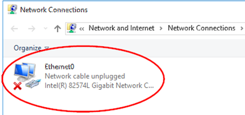
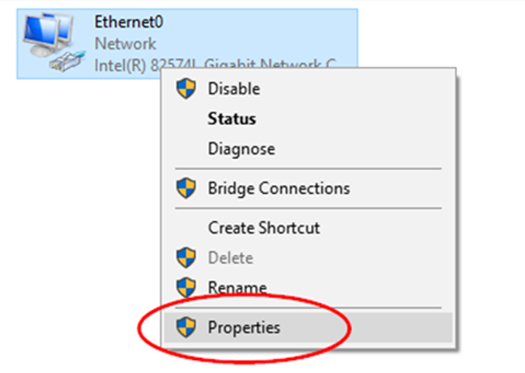
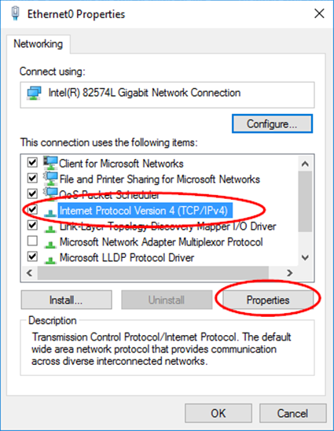
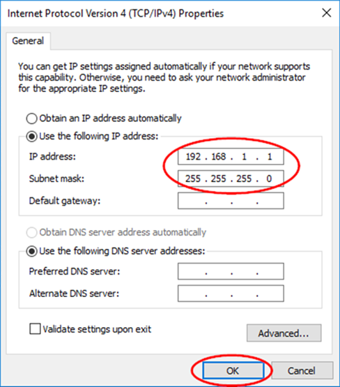
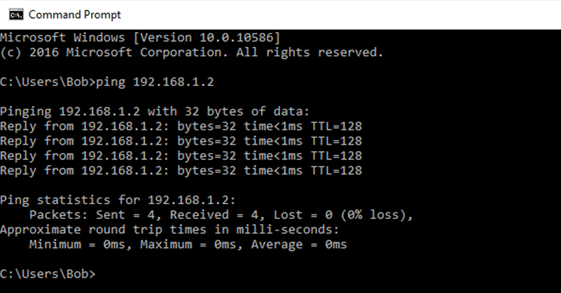

**Travaux pratiques– Configuration manuelle d’adresses IPv4**
- **Topologie**

- **Objectifs**
- Créer un réseau Peer to peer simple et vérifier la connectivité physique.
- Affecter diverses adresses IPv4 à des hôtes et en observer les effets sur la communication réseau.
- **Contexte/Préparation**
Dans le cadre de ces travaux pratiques, vous allez créer un réseau Peer to peer simple en utilisant deux ordinateurs et un câble de croisement Ethernet. Vous devrez également affecter diverses adresses IPv4 aux ordinateurs hôtes et en déterminer les effets sur leur capacité à communiquer.
- **Ressources requises**
- 2ordinateurs (Windows10) avec au moins une carte réseau Ethernet filaire sur chacun
- 1câble de croisement Ethernet pour relier les ordinateurs (fourni par le formateur)
  1.  **Connectez les ordinateurs en vue de créer un réseau Peer to peer.**
      1.  Préparez le câble de croisement Ethernet fourni par le formateur pour relier les deux ordinateurs.
Remarque: (configuration facultative) les ordinateurs peuvent être connectés à un commutateur à l'aide de deux câbles droits. Les instructions suivantes supposent que vous utilisez un câble de croisement.
- Branchez l'une des extrémités du câble à la carte réseau Ethernet de PC-A. Branchez l'autre extrémité du câble à la carte réseau du PC-B. Lorsque vous insérez le câble, vous devez entendre un clic indiquant que le connecteur du câble est correctement inséré à l'intérieur du port.
- **Vérifiez la connectivité physique.**
  1.  Une fois le câble de croisement Ethernet branché aux deux ordinateurs, examinez chaque port Ethernet. Un témoin de liaison (généralement vert ou orange) indique que la connectivité physique est établie entre les deux cartes réseau. Débranchez le câble d'un ordinateur, puis reconnectez-le afin de vérifier que le témoin s'éteint puis se rallume.
  2.  Sur le PC-A, cliquez avec le bouton droit de la souris sur **Démarrer** et sélectionnez **Connexions réseau**.
  3.  En cas de problème avec la connexion du câble réseau, Ethernet0 affichera **Câble réseau débranché** et un X rouge à la place de l'icône. Dans ce cas, répétez les étapes1et2 pour résoudre le problème. Demandez également à votre formateur de vérifier que vous utilisez bien un câble de croisement Ethernet.

- **Configurez les paramètres IPv4 sur les PC-A et PC-B.**
  1.  Configurez l'adressage IPv4 manuel sur les PC-A et PC-B afin qu'ils puissent communiquer via le protocole TCP/IP. Sur le PC-A, cliquez avec le bouton droit de la souris sur l'icône **Ethernet0**, comme dans cet exemple, puis cliquez sur **Propriétés**.

- Dans la fenêtre Propriétés Ethernet0, sélectionnez **Protocole Internet version4 (TCP/IPv4)** et cliquez sur le bouton **Propriétés**.

- Sélectionnez **Utiliser l'adresseIPv4 suivante** et saisissez l'adresseIPv4 **192.168.1.1** et le masque de sous-réseau **255.255.255.0**. Cliquez sur **OK**\> **Fermer** pour quitter la fenêtre Propriétés Ethernet0.

- Répétez les étapes3a à3c pour PC-B en utilisant l'adresseIPv4 **192.168.1.2** et le masque de sous-réseau **255.255.255.0**.
- **Vérifiez la connectivité IPv4 entre les deux ordinateurs.**
**Remarque**: pour tester la connectivité TCP/IP entre les PC, le pare-feu Windows doit être momentanément désactivé sur les deux ordinateurs. Une fois les tests terminés, il devra être réactivé. Pour accéder au pare-feu Windows, cliquez sur **Paramètres**\> **Réseau & Internet**\> **Ethernet**\> **Pare-feu Windows**\> **Activer/Désactiver le pare-feu Windows**.
- À présent que les deux ordinateurs sont physiquement connectés et correctement configurés avec des adresses IPv4, assurez-vous qu'ils parviennent à communiquer. La commande **ping** est un moyen simple de vérifier si la communication s'effectue.
- Depuis le PC-A, cliquez avec le bouton droit de la souris sur **Démarrer**, puis sélectionnez **Invite de commandes**.
- À l'invite de commandes, saisissez **ping 192.168.1.2**. Si la requête **ping** réussit, elle vérifie la connectivité réseau et si PC-A peut communiquer avec PC-B.

- Répétez cette procédure et envoyez une requête **ping 192.168.1.1** depuis le PC-B.
- Fermez l'invite de commandes sur chaque ordinateur.
- **Modifiez l'adresseIPv4 du PC-B.**
  1.  Sur le PC-B, cliquez avec le bouton droit de la souris sur **Démarrer**, sélectionnez **Connexions réseau** et cliquez avec le bouton droit de la souris sur l'icône **Ethernet0**. Dans le menu déroulant, sélectionnez **Propriétés**.
  2.  Sélectionnez **Protocole Internet version4 (TCP/IPv4)**. Cliquez sur **Propriétés**.
  3.  Modifiez l'adresse IPv4 logique du PC-B de 192.168.1.2 en **192.168.2.2** et conservez la valeur 255.255.255.0 pour le masque de sous-réseau.
  4.  Cliquez sur **OK** pour fermer la fenêtre **Protocole Internet version4 (TCP/IPv4)**. Cliquez sur le bouton Fermer pour quitter la fenêtre **Propriétés Ethernet0**.
- **Testez la connectivité réseau entre les deux ordinateurs.**
  1.  Depuis le PC-B, cliquez avec le bouton droit de la souris sur Démarrer, puis sélectionnez **Invite de commandes**.
  2.  À l'invite de commandes, saisissez **ping 192.168.2.2**, puis appuyez sur Entrée. A-t-elle abouti? Expliquez votre réponse.
\_\_\_\_\_\_\_\_\_\_\_\_\_\_\_\_\_\_\_\_\_\_\_\_\_\_\_\_\_\_\_\_\_\_\_\_\_\_\_\_\_\_\_\_\_\_\_\_\_\_\_\_\_\_\_\_\_\_\_\_\_\_\_\_\_\_\_\_\_\_\_\_\_\_\_\_\_\_\_\_\_\_\_\_

\_\_\_\_\_\_\_\_\_\_\_\_\_\_\_\_\_\_\_\_\_\_\_\_\_\_\_\_\_\_\_\_\_\_\_\_\_\_\_\_\_\_\_\_\_\_\_\_\_\_\_\_\_\_\_\_\_\_\_\_\_\_\_\_\_\_\_\_\_\_\_\_\_\_\_\_\_\_\_\_\_\_\_\_
- Quel type d'appareil réseau permettrait aux ordinateurs de communiquer alors qu'ils se trouvent sur des réseaux différents?
\_\_\_\_\_\_\_\_\_\_\_\_\_\_\_\_\_\_\_\_\_\_\_\_\_\_\_\_\_\_\_\_\_\_\_\_\_\_\_\_\_\_\_\_\_\_\_\_\_\_\_\_\_\_\_\_\_\_\_\_\_\_\_\_\_\_\_\_\_\_\_\_\_\_\_\_\_\_\_\_\_\_\_\_
- **Modifiez l'adresseIPv4 du PC-A.**
  1.  Sur le PC-A, cliquez avec le bouton droit de la souris sur **Démarrer**, sélectionnez **Connexions réseau** et cliquez avec le bouton droit de la souris sur l'icône **Ethernet0**. Dans le menu déroulant, sélectionnez **Propriétés**.
  2.  Sélectionnez **Protocole Internet version4 (TCP/IPv4)**. Cliquez sur **Propriétés**.
  3.  Modifiez l'adresse IPv4 logique du PC-A de 192.168.1.1 en 192.168.2.99 et conservez la valeur 255.255.255.0 pour le masque de sous-réseau. Cliquez sur **OK** pour fermer la fenêtre du **Protocole Internet version4 (TCP/IPv4)**. Cliquez sur **Fermer** pour quitter la fenêtre **Propriétés Ethernet0**.
Les deux ordinateurs sont toujours sur le même réseau Ethernet physique. Sont-ils à présent sur le même réseau IPv4 logique?

\_\_\_\_\_\_\_\_\_\_\_\_\_\_\_\_\_\_\_\_\_\_\_\_\_\_\_\_\_\_\_\_\_\_\_\_\_\_\_\_\_\_\_\_\_\_\_\_\_\_\_\_\_\_\_\_\_\_\_\_\_\_\_\_\_\_\_\_\_\_\_\_\_\_\_\_\_\_\_\_\_\_\_\_
- **Testez la connectivité réseau entre les deux ordinateurs.**
  1.  Sur le PC-B, répétez l'étape4b pour accéder à l'invite de commandes Windows.
  2.  À l'invite de commandes, saisissez ping 192.168.2.99, puis appuyez sur Entrée. A-t-elle abouti? Expliquez votre réponse.
\_\_\_\_\_\_\_\_\_\_\_\_\_\_\_\_\_\_\_\_\_\_\_\_\_\_\_\_\_\_\_\_\_\_\_\_\_\_\_\_\_\_\_\_\_\_\_\_\_\_\_\_\_\_\_\_\_\_\_\_\_\_\_\_\_\_\_\_\_\_\_\_\_\_\_\_\_\_\_\_\_\_\_\_
- **Réactivez le pare-feu (facultatif – uniquement si le pare-feu était activé à l'origine).**
Afin de s'assurer que l'ordinateur est protégé des accès non autorisés, réactivez le pare-feu Windows.

Pour accéder au pare-feu Windows, cliquez sur **Paramètres\> Réseau & Internet\> Ethernet\> Pare-feu Windows\> Activer/Désactiver le pare-feu Windows**.
