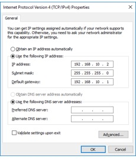

**Travaux pratiques– Configuration d’un routeur comme passerelle**
- **Objectifs**
- Connecter un PC à un réseau distant via un routeur.
- Configurer l'ordinateur avec une passerelle appropriée.
- Vérifier la configuration de l'ordinateur via l'invite de commandes.
- **Contexte/scénario**
Pour qu'un ordinateur communique avec un réseau distant et vers Internet, il doit être connecté à un appareil réseau: le routeur, appelé aussi passerelle.

- **Pré-requis**
Connectez-vous au réseau local et notez les paramètres réseau (adresse IP, masque et passerelle) obtenus dynamiquement par le protocole DHCP.

- **Affectez à l’ordinateur une adresse, un masque et une passerelle par défaut.**
  1.  Cliquez avec le bouton droit de la souris sur **Démarrer**\> et sélectionnez **Connexions réseau**.
  2.  Dans cet exemple, cliquez avec le bouton droit de la souris sur **Connexion au réseau local** pour la connexion filaire. Sélectionnez **Propriétés**.

- Double-cliquez sur l'option **Protocole Internet version4 (TCP/IPv4**) pour ouvrir la fenêtre des propriétés TCP/IP.

- Vous devez définir une configuration d'adressageIPv4 statique comportant une adresseIPv4, un masque de sous-réseau et l'adresse de passerelle par défaut. Pour saisir les données d'adresses, cliquez sur le bouton **Utiliser l'adresseIPv4 suivante**.

- Dans les champs AdresseIPv4, masque de sous-réseau et passerelle, saisissez les valeurs auparavant obtenues via DHCP, comme dans l’exemple ci-dessous. Les informations du serveur DNS ne sont pas nécessaires à ce stade.

- Quand vous avez terminé, cliquez sur **OK** pour revenir à la fenêtre Propriétés du protocole Internet (TCP/IPv4). Cliquez sur **OK** pour accepter les modifications.
Une fois les modifications appliquées, vous revenez à la fenêtre Connexions réseau.
- Dans la mesure où les ordinateurs de vos voisins sont sur le même réseau, leur adresse IPv4 est similaire, leur masque de sous-réseau est identique, de même que leur passerelle par défaut.
À votre avis, pourquoi les adresses IPv4 sont différentes, mais les masques de sous-réseau et les passerelles par défaut sont les mêmes?

\_\_\_\_\_\_\_\_\_\_\_\_\_\_\_\_\_\_\_\_\_\_\_\_\_\_\_\_\_\_\_\_\_\_\_\_\_\_\_\_\_\_\_\_\_\_\_\_\_\_\_\_\_\_\_\_\_\_\_\_\_\_\_\_\_\_\_\_\_\_\_\_\_\_\_\_\_\_\_\_\_\_\_\_

\_\_\_\_\_\_\_\_\_\_\_\_\_\_\_\_\_\_\_\_\_\_\_\_\_\_\_\_\_\_\_\_\_\_\_\_\_\_\_\_\_\_\_\_\_\_\_\_\_\_\_\_\_\_\_\_\_\_\_\_\_\_\_\_\_\_\_\_\_\_\_\_\_\_\_\_\_\_\_\_\_\_\_\_

\_\_\_\_\_\_\_\_\_\_\_\_\_\_\_\_\_\_\_\_\_\_\_\_\_\_\_\_\_\_\_\_\_\_\_\_\_\_\_\_\_\_\_\_\_\_\_\_\_\_\_\_\_\_\_\_\_\_\_\_\_\_\_\_\_\_\_\_\_\_\_\_\_\_\_\_\_\_\_\_\_\_\_\_
- **Vérifiez la configuration de l'adresse IPv4.**
  1.  Cliquez avec le bouton droit de la souris sur **Démarrer**, puis sélectionnez **Invite de commandes**.
  2.  À l'invite de commandes, saisissez **ipconfig /all** pour vérifier l'adresseIPv4 et la passerelle par défaut configurées lors de l'étape précédente.
- **Testez la connectivité vers un réseau distant.**
  1.  À l'invite de commandes, testez la connectivité avec un réseau distant en saisissant **ping 8.8.8.8**.
  2.  En principe, cette requête ping doit aboutir. Si elle n'aboutit pas, effectuez les étapes de résolution de problèmes appropriées, notamment en vérifiant les affectations d'adresse IPv4, de masque de sous-réseau et de passerelle par défaut.
  3.  Par quels équipements réseau cette requête est-elle passée pour aboutir? \_\_\_\_\_\_\_\_\_\_\_\_\_\_\_\_\_\_\_\_
  4.  Quelle commande permet de le vérifier? Testez-la. \_\_\_\_\_\_\_\_\_\_\_\_\_\_\_\_\_\_\_\_\_\_\_\_\_\_
