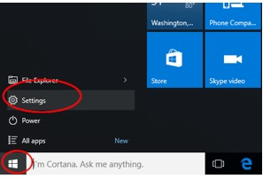
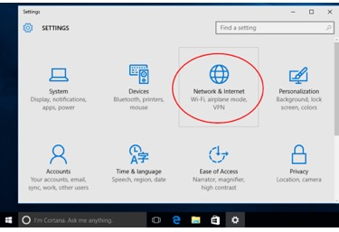
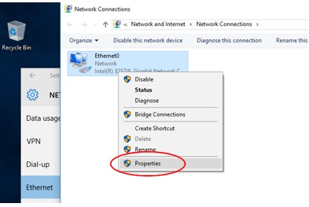
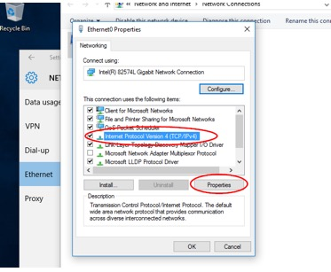
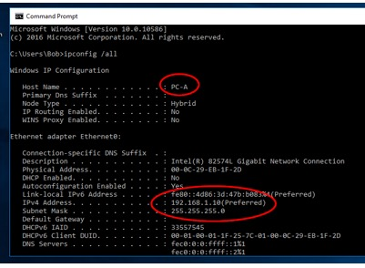
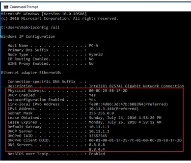
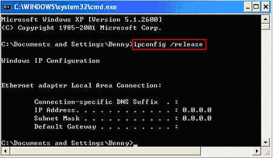
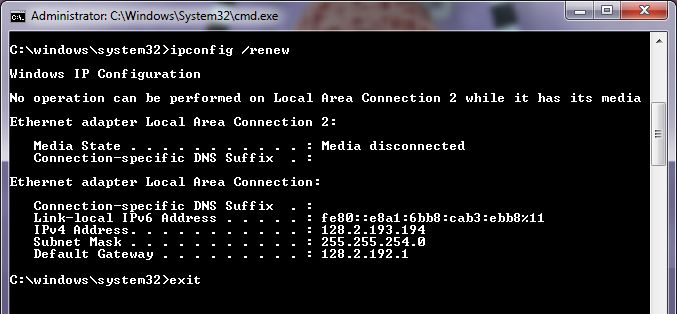

**Travaux pratiques– Observation de la configuration réseau dynamique DHCP**
- **Objectifs**
- Observer l'obtention et le renouvellement automatiques d'une configuration réseau avec DHCP
- Gérer le bail DHCP à l'aide des commandes ipconfig /release et ipconfig /renew.
- **Contexte/scénario**
Le protocole de configuration dynamique des hôtes en réseau (DHCP) est utilisé pour fournir automatiquement une configuration réseau complète aux hôtes : adresse IP, masque, passerelle, serveurs DNS… Les hôtes qui démarrent sur le réseau envoient une demande de configuration en broadcast (diffusion générale à tous les hôtes du réseau), et un serveur DHCP y répond, en proposant les paramètres TCP/IP au demandeur, pour une durée limitée mais renouvelable, appelée le bail DHCP.
- **Ressources requises**
- 1ordinateur (Windows10) avec connexion au réseau local.

- 

- **Consulter la configuration des hôtes**
  1.  **Configurer l'adressageIP dynamique sur les ordinateurs.**
      1.  Cliquez sur **Démarrer**, puis sur **Paramètres**.

- Dans la fenêtre Paramètres, cliquez sur **Réseau et Internet**.

- Dans le panneau de gauche, sélectionnez **votre carte réseau**, puis cliquez sur le lien **Modifier les options de l'adaptateur**.

- La fenêtre Connexions réseau affiche les interfaces réseau disponibles sur l'ordinateur. Faites un clic droit sur votre interface réseau, puis sélectionnez **Propriétés**.

- Sélectionnez **Protocole Internet version4 (TCP/IPv4)**, puis cliquez sur **Propriétés**.

**Remarque**: vous pouvez également cliquer deux fois sur **Protocole Internet version4 (TCP/IPv4)** pour afficher la fenêtre Propriétés.
- Sélectionnez **Obtenir une adresseIP automatiquement**. Sélectionnez **Obtenir l'adresse du serveur DNS automatiquement**. Cliquez sur **OK**.

**Étape 2 : Vérifiez les paramètres réseau obtenus dynamiquement**

Utilisez l'invite de commandes pour vérifier les paramètres et la connectivité du PC.
- Lancez une **Invite de commandes**.
- Vérifiez les paramètres de votre ordinateur à l'aide de la commande **ipconfig /all**.

Examinez ensuite les informations détaillées de votre configuration réseau:

Repérez les informations indiquant que l'ordinateur est configuré en adressage dynamique, c'est-à-dire qu'il est un client DHCP

Quelle est l'adresseIP du serveur DHCP?

\_\_\_\_\_\_\_\_\_\_\_\_\_\_\_\_\_\_\_\_\_\_\_\_\_\_\_\_\_\_\_\_\_\_\_\_\_\_\_\_\_\_\_\_\_\_\_\_\_\_\_\_\_\_\_\_\_\_\_\_\_\_\_\_\_\_\_\_\_\_\_\_\_\_\_\_\_\_\_\_\_\_\_\_

À quelle date le bail a-t-il été obtenu?

\_\_\_\_\_\_\_\_\_\_\_\_\_\_\_\_\_\_\_\_\_\_\_\_\_\_\_\_\_\_\_\_\_\_\_\_\_\_\_\_\_\_\_\_\_\_\_\_\_\_\_\_\_\_\_\_\_\_\_\_\_\_\_\_\_\_\_\_\_\_\_\_\_\_\_\_\_\_\_\_\_\_\_\_

À quelle date le bail arrive-t-il à expiration?

\_\_\_\_\_\_\_\_\_\_\_\_\_\_\_\_\_\_\_\_\_\_\_\_\_\_\_\_\_\_\_\_\_\_\_\_\_\_\_\_\_\_\_\_\_\_\_\_\_\_\_\_\_\_\_\_\_\_\_\_\_\_\_\_\_\_\_\_\_\_\_\_\_\_\_\_\_\_\_\_\_\_\_\_

**Partie 2 : Gérer le bail DHCP**
- **Gérer le bail DHCP**
Utilisez l'invite de commandes pour gérer le bail DHCP
- Lancez une Invite de commandes.
- Résiliez le bail DHCP en saisissant la commande **ipconfig /release  
  **

- Que se passe-t'il ?

- Vérifiez votre configuration actuelle avec la commande ipconfig /all
- Renouveler votre bail DHCP en saisissant la commande **ipconfig /renew  
  **

- Que se passe-t-il ?

- Vérifiez votre configuration avec la commande ipconfig /all

- A quoi sert le bail DHCP ?

- Faites une recherche sur le web pour expliquer le fonctionnement des échanges entre un serveur DHCP et un client, en particulier pour les phases suivantes :
  - Demande d'un bail
  - Attribution d'un bail
  - Demande de renouvellement
  - Résiliation

