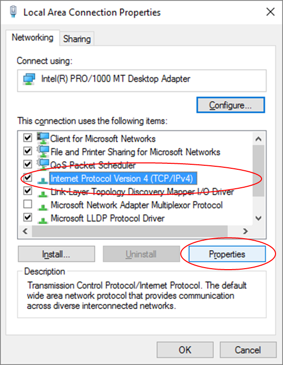
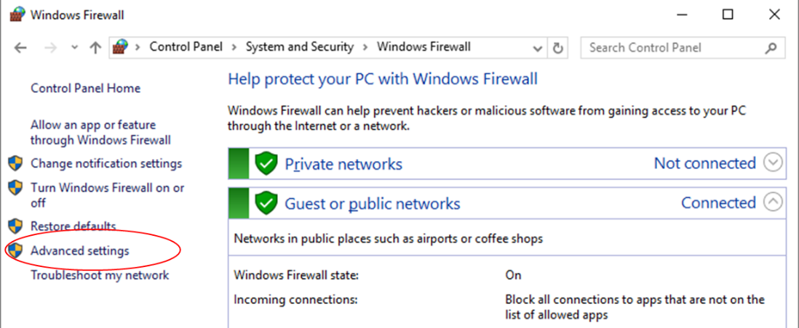
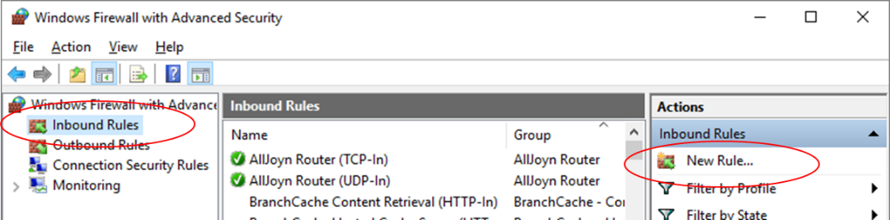
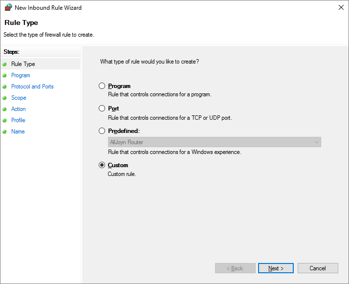
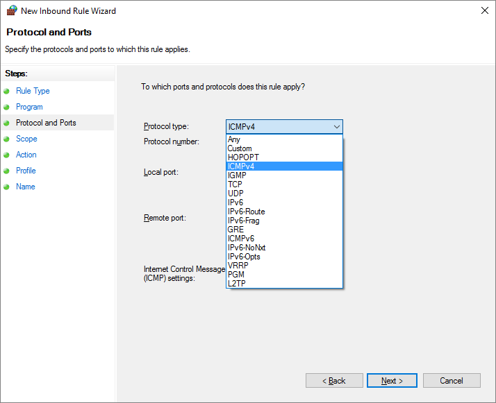
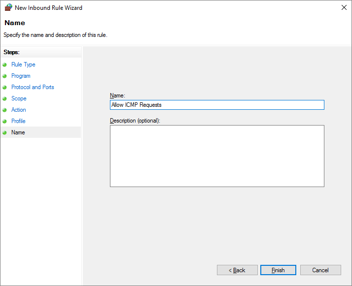
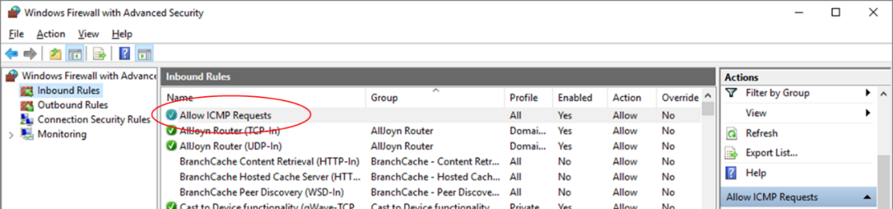
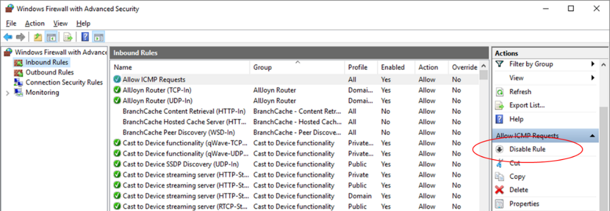

**Travaux pratiques– Configuration des paramètres de base du pare-feu**
- **Topologie**

- **Table d'adressage**
| **Appareil** | **Interface** | **AdresseIP** | **Masque de sous-réseau** |
|--------------|---------------|----------------|---------------------------|
| PC-A         | Carte réseau  | 192.168.1.10   | 255.255.255.0             |
| PC-B         | Carte réseau  | 192.168.1.11   | 255.255.255.0             |
- **Objectifs**
- Accéder aux paramètres du pare-feu Windows pour ajouter une nouvelle règle de pare-feu.
- Créer une règle de pare-feu pour autoriser les requêtes ping.
- Supprimer la nouvelle règle de pare-feu pour rétablir les paramètres précédents.
- **Contexte/scénario**
Si les membres de votre équipe ne parviennent pas à envoyer de requêtes ping à votre ordinateur, il est possible que votre pare-feu les bloque. De nombreux travaux pratiques de cette formation vous invitent à désactiver le pare-feu Windows afin de permettre aux requêtes et aux réponses ping de s'exécuter correctement. La désactivation du pare-feu n'est pas une pratique recommandée dans un réseau professionnel réel. Dans ces travaux pratiques, vous allez créer une règle de pare-feu afin d'autoriser les requêtes ping sans exposer l'ordinateur à d'autres types d'attaques. Elle décrit également comment désactiver la nouvelle règle ICMP une fois que vous avez terminé les travaux pratiques.
- **Ressources requises**
- 2ordinateurs (Windows10)
- Un câble Ethernet, comme illustré dans la topologie
  1.  **Vérifiez que le pare-feu Windows est actif et bloque les requêtes ICMP.**
      1.  Cliquez avec le bouton droit sur **Démarrer**. Sélectionnez **Connexions réseau**.
      2.  Cliquez avec le bouton droit sur l'adaptateur réseau souhaité, puis sélectionnez **Propriétés**.
      3.  Sélectionnez **Protocole Internet version4 (TCP/IPv4)**. Cliquez sur **Propriétés**pour configurer les deux ordinateurs avec les adresses IP statiques figurant dans la table d'adressage. Il n'est pas nécessaire de configurer la passerelle par défaut ou le serveur DNS dans ce TP, car les deux ordinateurs se trouvent sur le même réseau IP et utilisent des adresses IP plutôt que des noms de domaine.

- Ouvrez une fenêtre d'invite de commandes sur le PC-A en cliquant avec le bouton droit sur **Démarrer**\> **Invite de commandes**. Envoyez une requête **ping** à l'adresseIP attribuée au PC-B. En principe, cette requête **ping** doit échouer. Répétez la commande **ping** sur le PC-B vers l'adresse attribuée au PC-A. Les commandes **ping** des deux ordinateurs doivent échouer, car le pare-feu Windows est actif et bloque les requêtes ping ICMP.
**Remarque**: si la requête **ping** aboutit sur l'un des ordinateurs, vérifiez que le pare-feu Windows est bien activé sur les deux ordinateurs.
- **Créez une règle de trafic entrant autorisant le trafic ICMP via le pare-feu.**
  1.  Configurez les paramètres du pare-feu sur le PC-A. Cliquez sur **Démarrer** et saisissez **pare-feu**. Sélectionnez **Pare-feu Windows** dans la liste des résultats.
  2.  Dans le volet gauche de la fenêtre Pare-feu Windows, cliquez sur **Paramètres avancés**.

- Dans la fenêtre des fonctions de sécurité avancées, choisissez l'option **Règles de trafic entrant** dans la barre latérale gauche, puis cliquez sur **Nouvelle règle…** dans la barre latérale droite.

- En cliquant sur **Nouvelle Règle…**, vous ouvrez l'**Assistant Nouvelle règle de trafic entrant**. Dans l'écran Type de règle, cliquez sur la case d'option **Personnalisée**, puis cliquez sur **Suivant**.

- Dans le volet gauche, cliquez sur l'option **Protocole et ports**, et au moyen du menu déroulant Type de protocole, sélectionnez **ICMPv4**, puis cliquez sur **Suivant**.

Citez trois protocoles, à part ICMP, qui peuvent être filtrés par une nouvelle règle de pare-feu.
- TCP : connexions entre applications sur des machine distantes

- UDP : Non fiable et sans connexions mais rapide et efficaces

- FTP : Protocole de transfert de fichier entre des systèmes distants
  6.  Dans le volet de gauche, cliquez sur l'option **Nom**, puis, dans le champ Nom, saisissez **Autoriser les demandes ICMP**. Cliquez sur **Terminer**.

Cette nouvelle règle doit permettre aux membres de l'équipe de recevoir des réponses **ping** du PC-A. Répétez les commandes de l'étape2 pour ajouter cette règle sur le PC-B.
- Testez la nouvelle règle de pare-feu en effectuant une nouvelle fois les commandes ping décrites à l'étape1. Ces requêtes ping devraient aboutir.
Si ce n'est pas le cas, passez en revue les paramètres du pare-feu pour vérifier que la nouvelle règle est correctement configurée.
- **Désactivez ou supprimez la nouvelle règle ICMP.**
Une fois que les travaux pratiques sont terminés, vous pouvez désactiver ou même supprimer la règle que vous avez créée à l'étape2. L'option **Désactiver la règle** vous laisse la possibilité de réactiver cette règle plus tard. La suppression de la règle supprime cette dernière définitivement de la liste des règles de trafic entrant.
- Dans la fenêtre de sécurité avancée, dans le volet de gauche, cliquez sur **Règles de trafic entrant**, puis localisez la règle que vous avez créée à l'étape1.

- Pour la désactiver, cliquez sur l'option **Désactiver la règle**. Lorsque vous choisissez cette option, cette option devient **Activer la règle**. Vous pouvez basculer entre Désactiver la règle et Activer la règle. Le statut de la règle s'affiche également dans la colonne Activée de la liste Règles de trafic entrant.

- Pour supprimer définitivement la règle ICMP, cliquez sur **Supprimer**. Si vous choisissez cette option, vous devez recréer la règle pour autoriser les réponses ICMP.
- Effectuez les commandes **ping** de l'étape1 afin de vérifier que le pare-feu bloque de nouveau les requêtes ping.
