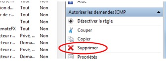

**Travaux pratiques– Utilisation de Wireshark pour voir le trafic ICMP**
- 
- **Topologie**

- **Objectifs**

**Partie1: Capturer et analyser les donnéesICMP locales avec Wireshark**

**Partie2: Capturer et analyser les donnéesICMP distantes avec Wireshark**

- **Contexte/Scénario**

Wireshark est un analyseur de protocoles (analyseur de paquets) utilisé pour dépanner les réseaux, effectuer des analyses, développer des logiciels et des protocoles et s'informer. L'analyseur «capture» chaque unité de données de protocole (PDU) des flux de données circulant sur le réseau. Il permet de décoder et d'analyser leur contenu conformément aux spécificationsRFC ou autres appropriées.

Cet outil est utile pour toutes les personnes intervenant au niveau des réseaux. Vous pouvez vous en servir dans le cadre de la plupart des travaux pratiques des coursCCNA, à des fins d'analyse de données et de dépannage. Au cours de ces travaux pratiques, vous utiliserez Wireshark pour capturer les adresses IP des paquets de données ICMP et les adresses MAC de trames Ethernet.

- **Ressources requises**

- 1ordinateur Windows équipé d'un accès à Internet
- Des ordinateurs supplémentaires sur un réseau local (LAN) seront utilisés pour répondre aux requêtes ping.

- **Capturer et analyser les donnéesICMP locales avec Wireshark**

Dans la partie1 de ces travaux pratiques, vous exécuterez une commande ping sur un autre ordinateur du réseau local (LAN) et capturerez des requêtes et des réponses ICMP dans Wireshark. Vous examinerez également les trames capturées pour obtenir des informations spécifiques. Cette analyse devrait vous aider à mieux comprendre la façon dont les en-têtes de paquet sont utilisés pour transporter les données vers leur destination.

- **Récupérez les adresses d'interface de votre ordinateur.**

Dans le cadre de ces travaux pratiques, il vous faudra récupérer l'adresseIP de votre ordinateur et l'adresse physique de sa carte réseau, également appelée adresse MAC.

- Ouvrez une fenêtre de commandes, tapez **ipconfig /all**, puis appuyez sur Entrée.

- Notez l'adresseIP et l'adresse physique (MAC) de l'interface de votre ordinateur.

- Demandez à un membre de l'équipe de fournir l'adresseIP de son ordinateur et donnez-lui l'adresseIP de votre ordinateur. Ne lui fournissez pas votre adresse MAC pour le moment.

- **Démarrez Wireshark en Administrateur et commencez à capturer des données.**

- Sur votre ordinateur, exécutez **Wireshark** avec les droits Administrateur.

- Une fois que Wireshark démarre, cliquez sur **Interface List** (Liste d'interfaces).

**Remarque**: cliquer sur la première icône d'interface dans la barre d'icônes permet également d'ouvrir la liste d'interfaces.

- Dans la fenêtre Wireshark: Capture Interfaces (Wireshark: interfaces de capture), sélectionnez la case à cocher en regard de l'interface connectée à votre réseau local (LAN).

**Remarque**: si plusieurs interfaces sont répertoriées et que vous ne savez pas quelle interface sélectionner, cliquez sur le bouton **Details** (Détails), puis sur l'onglet **802.3 (Ethernet)**. Vérifiez que l'adresse MAC correspond à ce que vous avez noté à l'étape1b. Fermez la fenêtre Interface Details (Détails de l'interface) après avoir vérifié l'interface appropriée.

**Remarque**: si aucun interface n'est répertoriée, c'est probablement que Wireshark n'a pas été lancé avec les droits Administrateur, ou qu'il a été mal installé (composant manquant).

- Après avoir sélectionné l'interface appropriée, cliquez sur **Start** (Démarrer) pour lancer la capture des données.

Les informations commencent à défiler vers le bas à partir de la section supérieure dans Wireshark. Les lignes de données s'affichent en différentes couleurs selon le protocole.

- Ces informations peuvent défiler très rapidement selon la nature des communications survenant entre votre ordinateur et le réseau local (LAN). Nous pouvons appliquer un filtre pour faciliter l'affichage et la manipulation des données capturées par Wireshark. Dans le cadre de ces travaux pratiques, nous nous concentrerons uniquement sur l'affichage des unités de données de protocole (PDU) (ping) ICMP. Tapez **icmp** dans la zone Filter (Filtre) en haut de Wireshark et appuyez sur Entrée ou cliquez sur le bouton **Apply** (Appliquer) pour afficher uniquement les unités de données de protocole (PDU) (ping) ICMP.

- Ce filtre fait disparaître toutes les données de la fenêtre supérieure, mais la capture du trafic dans l'interface se poursuit. Affichez la fenêtre d'invite de commandes que vous avez ouverte précédemment et envoyez une requête ping à l'adresseIP que vous avez reçue du membre de votre équipe. Notez que les données commencent à apparaître à nouveau dans la fenêtre supérieure de Wireshark.

**Remarque**: si l'ordinateur du membre de votre équipe ne répond pas à vos requêtes ping, c'est peut-être parce que le pare-feu de son ordinateur bloque ces requêtes. Consultez l'AnnexeA: Autoriser le trafic ICMP via un pare-feu pour savoir comment autoriser le trafic ICMP via le pare-feu sous Windows.

- Arrêtez la capture des données en cliquant sur l'icône **Stop Capture** (Arrêter la capture).

- **Examinez les données capturées.**

À l'étape3, examinez les données qui ont été générées par les requêtes ping de l'ordinateur du membre de votre équipe. Les données Wireshark s'affichent dans trois sections: 1) la section supérieure affiche la liste des trames PDU capturées avec un résumé des informations de paquetIP, 2) la section centrale liste les informations PDU correspondant à la trame sélectionnée dans la partie supérieure de l'écran et fractionne une trame PDU capturée en fonction de ses couches de protocole, et 3) la section du bas affiche les données brutes de chaque couche. Les données brutes sont affichées sous forme hexadécimale et décimale.

- Cliquez sur les premières trames PDU de requête ICMP dans la partie supérieure de Wireshark. Notez que la colonne Source contient l'adresseIP de votre ordinateur, tandis que la colonne Destination contient l'adresseIP de l'ordinateur de votre équipier auquel vous avez envoyé des requêtes ping.

- Tandis que cette trame PDU est toujours sélectionnée dans la partie supérieure, accédez à la section centrale. Cliquez sur le signe plus à gauche de la ligne EthernetII pour afficher les adresses MAC de la destination et de la source.

L'adresse MAC de la source correspond-elle à l'interface de votre ordinateur?

Oui l'adresse mac correspond a celle de mon ordinateur après avoir vérifier sur le CMD via mon poste et via le logiciel Wireshark sur le poste du membre de mon équipe.

L'adresse MAC de la destination dans Wireshark correspond-elle à celle de l'ordinateur du membre de votre équipe?

Oui l'adresse mac correspond a celle de l'ordinateur du membre du membre de mon équipe après avoir vérifier sur wiresharp et après vérification sur le poste distant à l'aide du CMD.

Comment votre ordinateur obtient-il l'adresse MAC de l'ordinateur destinataire des requêtes ping?

Il Vérifie la table ARP locale (Addresse Resolution Protocol) ou soit en français Protocol de Résolution d'Adresses, pour vérifier si cette adresse MAC est connue sinon il envoie une requête de type "Who has"

Si l'ordinateur est actif il envoie une réponse et fournis son adresse MAC

-Ensuite après la réponse de la machine distante, l'adresse MAC est enregistré sur la table ARP locale permettant ainsi une accélération au niveau de la communication.

**Remarque**: dans l'exemple précédent d'une requête ICMP capturée, les données ICMP sont encapsulées dans une unité de données de protocole (PDU) de paquet IPv4 (en-tête IPv4) qui est ensuite encapsulée dans une PDU de trame EthernetII (en-tête EthernetII) en vue de sa transmission sur le réseau local (LAN).

- **Capturer et analyser les donnéesICMP distantes avec Wireshark**

Dans la partie2, vous enverrez des requêtes ping aux hôtes distants (les hôtes ne figurant pas sur le réseau local (LAN)) et vous examinerez les données générées à partir de ces requêtes ping. Ensuite, vous déterminerez en quoi ces données diffèrent des données examinées dans la partie1.

- **Commencez par capturer les données sur l'interface.**
  1.  Cliquez sur l'icône **Interface List** (Liste d'interfaces) pour afficher à nouveau la liste des interfaces d'ordinateur.

- Vérifiez que la case à cocher en regard de l'interface LAN est sélectionnée, puis cliquez sur **Start** (Démarrer).

- Une fenêtre vous invite à enregistrer les données capturées précédemment avant de commencer une autre capture. Il n'est pas nécessaire d'enregistrer ces données. Cliquez sur **Continue without Saving** (Continuer sans enregistrer).

- Le processus de capture étant actif, envoyez une requête ping aux trois URL de sites web suivantes:
  1.  [www.yahoo.com](http://www.yahoo.com)
  2.  [www.cisco.com](http://www.cisco.com)
  3.  [www.google.com](http://www.google.com)

**Remarque**: lorsque vous envoyez une requête ping aux URL indiquées, notez que le serveur de noms de domaine (DNS) traduit l'URL en adresseIP. Notez l'adresseIP reçue pour chaque URL.

- Vous pouvez arrêter la capture des données en cliquant sur l'icône **Stop Capture** (Arrêter la capture).

- **Examen et analyse des données provenant des hôtes distants.**

- Examinez les données capturées dans Wireshark, examinez les adressesIPetMAC des trois emplacements auxquels vous avez envoyé des requêtes ping. Indiquez les adressesIPetMAC de destination pour les trois emplacements dans l'espace prévu à cet effet.

1er emplacement:

IP: 87.248.119.251

MAC: 00 50 56 9f 00 3a 04 d4

2ème emplacement:

IP: 72.163.4.185

MAC: 00 50 56 9f 00 3a 04 d4

3ème emplacement:

IP: 216.58.214.164

MAC: 00 50 56 9f 00 3a 04 d4

- Qu'y a-t-il d'important à retenir de ces informations?
Les adresses Mac sont les même sur chaque domaine après l'execution du protocole ICMP.

- En quoi ces informations diffèrent-elles des informations de requêtes ping locales que vous avez reçues dans la partie1?
Dans le cas ou on est sur un réseau local les adresse MAC sont toute différent mais pour celle de réseau provonant d'un autre réseau internet les Adresse MAC sont les même sont distribuer en 00 50 56 9f 00 3a 04 d4 .

- Pourquoi Wireshark affiche-t-il l'adresse MAC réelle des hôtes locaux, mais pas l'adresse MAC réelle des hôtes distants?
Les hôtes locaux font partie du propre réseau et on chacun une adresse MAC attribuer par défaut. Pour les hôtes distant un routeur empêche de diffuser la vraie adresse MAC des hôtes distant. De ce fait le routeur, attribut une adresse MAC unique soit non réelle pour les hôtes provonant d'un autre réseau

- **Rappel: Autoriser le trafic ICMP via le pare-feu Windows Defender**

Si les membres de votre équipe ne parviennent pas à envoyer de requêtes ping à votre ordinateur, il est possible que votre pare-feu les bloque. Cette annexe explique comment créer une règle sur le pare-feu afin d'autoriser les requêtes ping. Elle décrit également comment désactiver la nouvelle règle ICMP une fois que vous avez terminé les travaux pratiques.

**Étape 1 Créez une règle de trafic entrant autorisant le trafic ICMP via le pare-feu.**

À partir du Panneau de configuration, cliquez sur l'option **Système et sécurité**.

Dans la fenêtre Système et sécurité, cliquez sur **Pare-feu Windows**.

Dans le volet gauche de la fenêtre Pare-feu Windows, cliquez sur **Paramètres avancés**.

Dans la fenêtre des fonctions de sécurité avancées, choisissez l'option **Règles de trafic entrant** dans la barre latérale gauche, puis cliquez sur **Nouvelle règle…** dans la barre latérale droite.

Cette action démarre l'Assistant Nouvelle règle de trafic entrant. Dans l'écran Type de règle, cliquez sur la case d'option **Personnalisée**, puis cliquez sur **Suivant**.

Dans le volet gauche, cliquez sur l'option **Protocole et ports**, et au moyen du menu déroulant Type de protocole, sélectionnez **ICMPv4**, puis cliquez sur **Suivant**.

Dans le volet de gauche, cliquez sur l'option **Nom** et dans le champ Nom, tapez **Autoriser les demandes ICMP**.Cliquez sur **Terminer**.

Cette nouvelle règle doit permettre aux membres de votre équipe de recevoir des réponses ping de votre ordinateur.

**Étape 2 Désactivation ou suppression de la nouvelle règle ICMP.**

Une fois que les travaux pratiques sont terminés, vous pouvez désactiver ou même supprimer la règle que vous avez créée à l'étape1. L'option **Désactiver la règle** vous permet d'activer la règle à nouveau plus tard. La suppression de la règle supprime cette dernière définitivement de la liste des règles de trafic entrant.

Dans la fenêtre des fonctions de sécurité avancées, dans le volet gauche, cliquez sur **Règles de trafic entrant**, puis localisez la règle que vous avez créée à l'étape 1.

Pour désactiver la règle, cliquez sur l'option **Désactiver la règle**. Lorsque vous choisissez cette option, celle-ci se transforme en **Activer la règle**. Vous pouvez basculer entre Désactiver la règle et Activer la règle. Le statut de la règle s'affiche également dans la colonne Activée de la liste Règles de trafic entrant.

Pour supprimer définitivement la règle ICMP, cliquez sur **Supprimer**. Si vous choisissez cette option, vous devez recréer la règle pour autoriser les réponses ICMP.

