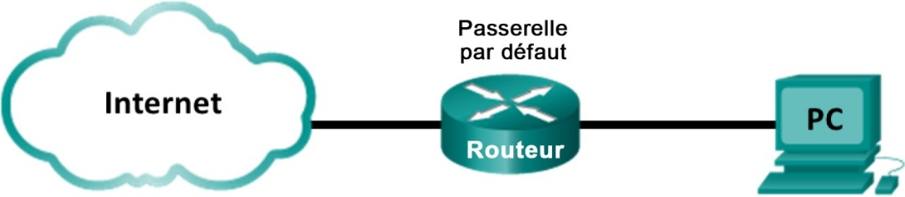
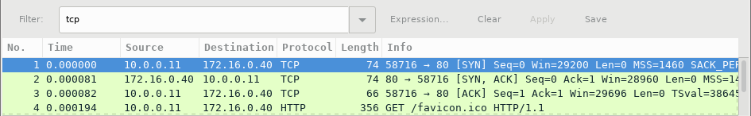
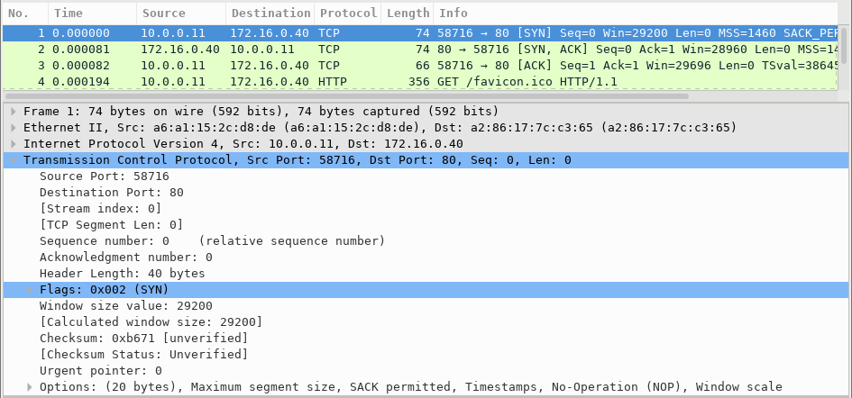
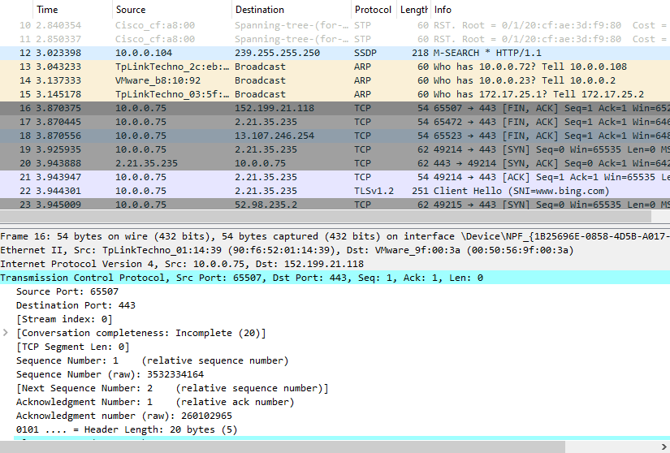
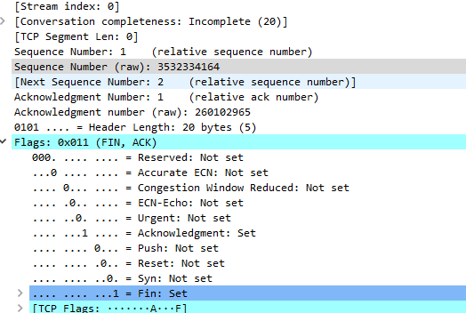
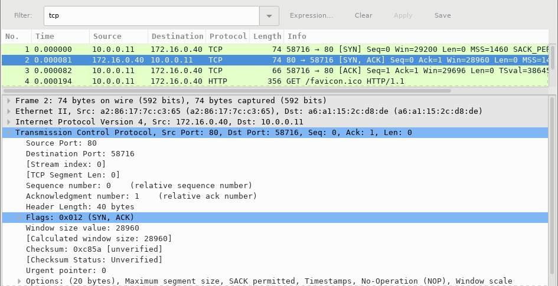
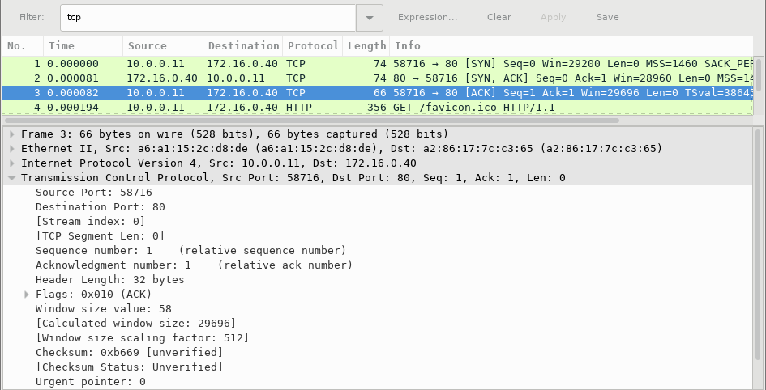

**Travaux pratiques – Utilisation de Wireshark pour observer la connexionTCP en trois étapes**
- 
**Topologie**

- 
- **Objectifs**

**Partie1: Préparer les hôtes pour la capture du trafic**

**Partie2: Analyser la connexion TCP en 3 étapes à l'aide de Wireshark**

- **Contexte/scénario**

Au cours de ces travaux pratiques, vous utiliserez Wireshark pour capturer et examiner les paquets générés entre le navigateur de l'ordinateur en utilisant le protocole HTTP (Hypertext Transfer Protocol) et un serveur web, tel que [www.google.com](http://www.google.com). Lorsqu'une application, comme le protocole HTTP ou FTP (File Transfer Protocol) démarre d'abord sur un hôte, TCP utilise la connexion en trois étapes pour établir une session TCP fiable entre les deux hôtes. Par exemple, lorsqu'un ordinateur utilise un navigateur web pour naviguer sur Internet, une connexion en trois étapes est lancée et une session est établie entre l'ordinateur hôte et le serveur web. Un ordinateur peut avoir des sessions TCP actives, multiples et simultanées avec différents sites web.

- **Ressources requises**

- Poste de travail avec Wireshark
- Accès Internet

- **Préparer les hôtes pour la capture du trafic**

- Démarrez le navigateur web sur le poste client

- Démarrez une capture de trafic dans Wireshark

- Consultez un nouveau site web sur Internet depuis le navigateur

- Stoppez la capture dans Wireshark

- **Analyser la connexion TCP en 3 étapes à l'aide de Wireshark**

- **Appliquez un filtre à la capture enregistrée.**

- Appliquez un filtre **tcp** à la capture. Dans cet exemple, les 3premières trames représentent le trafic d'intérêt.

- **Examinez les informations au sein des paquets, y compris les adressesIP, les numéros de port TCP et les indicateurs de contrôle TCP.**

- Dans cet exemple, la trame1 correspond au début de la connexion en trois étapes entre l'ordinateur client et le serveur web. Dans le volet de la liste des paquets (section supérieure de la fenêtre principale), sélectionnez le premier paquet, le cas échéant.

- Cliquez sur la **flèche** à gauche du protocole TCP (Transmission Control Protocol) dans le volet de détails des paquets pour développer et examiner les données TCP. Localisez les informations sur les ports source et de destination.

- Cliquez sur la **flèche** à gauche des indicateurs. Une valeur de 1 signifie que l'indicateur est défini. Repérez l'indicateur défini dans ce paquet.

**Remarque**: vous devrez peut-être modifier la taille des fenêtres du haut et du milieu dans Wireshark pour afficher les informations nécessaires.

Quel est le numéro du port source TCP?

Dans mon cas le numéro de port source est 65507 en ligne 16

Comment classifieriez-vous le port source? (voir [Liste de ports logiciels — Wikipédia (wikipedia.org)](https://fr.wikipedia.org/wiki/Liste_de_ports_logiciels))

Il s'agit d'un port non enregistrer par l'IANA il n'a pas d'UDP mais un TCP.

Plage de port dynamique «haute»[Microsoft RPC](https://fr.wikipedia.org/w/index.php?title=Microsoft_RPC&action=edit&redlink=1)[**(en)**](https://en.wikipedia.org/wiki/Microsoft_RPC)(MS-[RPC](https://fr.wikipedia.org/wiki/Remote_procedure_call)) sous Windows 2008 et postérieur, cf. port 135

*From \<<https://fr.wikipedia.org/wiki/Liste_de_ports_logiciels>\>*

Quel est le numéro du port de destination TCP?

C'est le port 443

Comment classifieriez-vous le port de destination? (voir [Liste de ports logiciels — Wikipédia (wikipedia.org)](https://fr.wikipedia.org/wiki/Liste_de_ports_logiciels))

C'est un port classifié par l'IANA il a un UDP et TCP ce port est généralement utiliser pour le protocole NNSP

Quel est l'indicateur (flag)? (plusieurs réponses possibles)

L'indicateur flag indique 0x011 il utilise les protocole FIN, et ACK.

Quel est le numéro d'ordre relatif (n° de séquence) ?

Numéro de séquence 260102965
- Sélectionnez le paquet suivant dans la connexion en trois étapes. Dans cet exemple, il s'agit de la trame2. C'est la réponse du serveur web à la requête initiale de démarrage d'une session.

Quelles sont les valeurs des ports source et de destination?

Port 65472

Quel est l'indicateur (flag)? (plusieurs réponses possibles)

Quels sont les numéros d'ordre relatif (n° de séquence) et d'accusé de réception?

- Enfin, sélectionnez le troisième paquet dans la connexion en trois étapes.

Examinez le troisième et dernier paquet de la connexion.

Quel est l'indicateur (flag)? (plusieurs réponses possibles)

Les numéros d'ordre relatif (n° de séquence) et d'accusé de réception sont définis sur 1 comme point de départ. La connexion TCP est désormais établie et la communication entre l'ordinateur source et le serveur web peut commencer.

- 
Des centaines de filtres sont disponibles dans Wireshark. Un réseau de grande taille peut avoir de nombreux filtres et de nombreux types de trafic. Indiquez trois filtres qui pourraient être utiles à un administrateur réseau.

De quelles autres façons Wireshark pourrait-il être utilisé dans un réseau de production?

Whireshark et principalement utilisé pour :

- Les débogage et résolution de problèmes pour pouvoir analyser des trafic réseau

- Surveiller le réseau : Whireshark génére des rapports détaillé sur le trafic réseau

- Dévelopement de test de logiciel : Peut être utiliser pour déboger des applications réseau pour pouvoir résoudre les problème de compatibilité.

