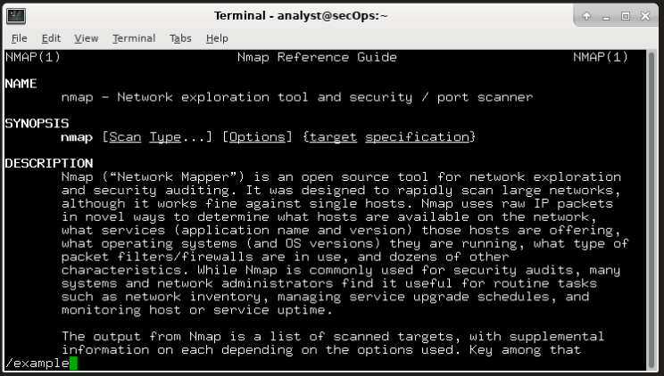
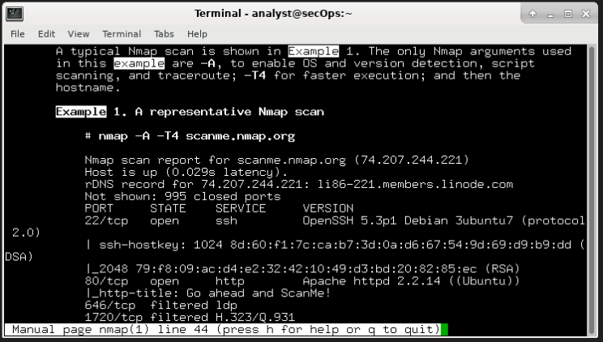

**Travaux pratiques– Découvrir Nmap**

**Topologie**

**Objectifs**

**Partie1: Découvrir Nmap**
**Partie2: Rechercher des ports ouverts**

**Contexte/scénario**

L'analyse des ports fait généralement partie d'une attaque de reconnaissance. Diverses méthodes d'analyse des ports peuvent être utilisées. Nous allons étudier comment se servir de l'utilitaire de Nmap. Nmap est un utilitaire réseau puissant qui est utilisé pour la découverte du réseau et pour l'audit de sécurité.

**Ressources requises**

Poste de travail CyberOps VM
Accès Internet

**Instructions**

**Partie1: Découvrir Nmap**

Dans cette partie, vous allez utiliser les pages de manuel pour en savoir plus sur Nmap.

La commande **man** \[ *program \|utility \| function*\] affiche les pages de manuel associées aux arguments. Les pages de manuel correspondent aux manuels de référence trouvés sur les systèmes d'exploitation Unix et Linux. Ces pages incluent ces sections: Nom, Synopsis, Descriptions, Exemples et Voir aussi.

1.1.a. Lancez le poste de travail virtuel CyberOps.

1.1.b. Ouvrez un terminal.

1.1.c. À l'invite du terminal, saisissez **man nmap**.

\[analyst@secOps ~\]\$ **man nmap**

Qu'est-ce que Nmap?

Nmap est un logiciel aidant ainsi la découverte réseau

À quoi Nmap sert-il?

cet outil permet de scanner les diférent réseau et de scanner en local.

1.1.d. Lorsque vous êtes sur la page du manuel, vous pouvez utiliser les touches fléchées haut/bas pour faire défiler les pages. Vous pouvez également appuyer sur la barre d'espace pour avancer d'une page à la fois.

Pour rechercher un terme ou une expression spécifique, saisissez une barre oblique (/) ou un point d'interrogation (?) suivi de ce terme ou de cette expression. La barre oblique permet d'effectuer une recherche vers l'avant dans tout le document, tandis que le point d'interrogation effectue une recherche en arrière dans le document. La touche **n** permet d'accéder à la correspondance suivante.

Saisissez **/example** et appuyez sur ENTRÉE. Cette opération permet de rechercher le mot **example** vers l'avant dans les pages du manuel.

1.1.e. Dans le premier exemple, trois correspondances s'affichent. Pour accéder à la correspondance suivante, appuyez sur **n**.

Regardez l'exemple1.

Quelle est la commande **nmap** utilisée?

La commande est nmap -v scanme.nmap.org ce qui permet de scanner le réseau en mode verbos.

Utilisez la fonction de recherche pour répondre aux questions suivantes.

À quoi sert le commutateur -A?

Permet d'activer la détection de la version de l'OS

À quoi sert le commutateur -T4?
Execution rapide

1.1.f.Faites défiler la page pour en savoir plus sur nmap. Saisissez «**q**» lorsque vous avez terminé.

**Partie2: Analyse des ports ouverts**

Dans cette partie, vous allez utiliser les commutateurs issus de l'exemple des pages de manuel Nmap pour analyser votre hôte local, votre réseau local et un serveur distant à scanme.nmap.org.

**Étape2.1 : Analysez votre hôte local.**

2.1.a. Si nécessaire, ouvrez un terminal sur la machine virtuelle. À l'invite, saisissez **nmap -A -T4 localhost**.

Selon votre réseau local et vos périphériques, l'analyse peut durer de quelques secondes à quelques minutes.

\[analyst@secOps ~\]\$ **nmap -A -T4 localhost**

Starting Nmap 7.40 ( <https://nmap.org> ) at 01/05/2017 17:20 EDT

Nmap scan report for localhost (127.0.0.1)

Host is up (0.000056s latency).

Other addresses for localhost (not scanned): ::1

rDNS record for 127.0.0.1: localhost.localdomain

Not shown: 996 closed ports

PORT STATE SERVICE VERSION

21/tcp open ftp vsftpd 2.0.8 or later

\| ftp-anon: Anonymous FTP login allowed (FTP code 230)

\|\_-rw-r--r-- 1 0 0 0 Apr 19 15:23 ftp_test

\<some output omitted\>

2.1.b. Vérifiez les résultats et répondez aux questions suivantes.

Quels sont les ports et les services ouverts?

Starting Nmap 7.80 ( <https://nmap.org> ) at 2024-03-08 07:54 EST

Nmap scan report for localhost (127.0.0.1)

Host is up (0.000067s latency).

Other addresses for localhost (not scanned): ::1

Not shown: 997 closed ports

PORT STATE SERVICE VERSION

21/tcp open ftp vsftpd 2.0.8 or later

\| ftp-anon: Anonymous FTP login allowed (FTP code 230)

\|\_-rw-r--r-- 1 0 0 0 Mar 26 2018 ftp_test

\| ftp-syst:

\| STAT:

\| FTP server status:

\| Connected to 127.0.0.1

\| Logged in as ftp

\| TYPE: ASCII

\| No session bandwidth limit

\| Session timeout in seconds is 300

\| Control connection is plain text

\| Data connections will be plain text

\| At session startup, client count was 1

\| vsFTPd 3.0.3 - secure, fast, stable

\|\_End of status

22/tcp open ssh OpenSSH 8.2 (protocol 2.0)

23/tcp open telnet Openwall GNU/\*/Linux telnetd

Service Info: Host: Welcome; OS: Linux; CPE: cpe:/o:linux:linux_kernel

Service detection performed. Please report any incorrect results at <https://nmap.org/submit/> .

Nmap done: 1 IP address (1 host up) scanned in 18.96 seconds

Les port ouvert sur cet machine sont le port 21 tcp/ftp, port 22 open ssh et 23 tcp telnet

Pour chacun des ports ouverts, notez le logiciel qui fournit les services.

**Étape2.2 : Analysez votre réseau**

**AVERTISSEMENT: avant d'utiliser Nmap sur un réseau, demandez l'autorisation des propriétaires du réseau.**

2.2.a. À l'invite de commande du terminal, saisissez **ip address** pour déterminer l'adresse IP et le masque de sous-réseau de cet hôte. Dans cet exemple, l'adresse IP de cette machine virtuelle est 10.0.2.15 et le masque de sous-réseau est 255.255.255.0.

\[analyst@secOps ~\]\$ **ip address**

\<output omitted\>

2: enp0s3: \<BROADCAST,MULTICAST,UP,LOWER_UP\> mtu 1500 qdisc fq_codel state UP group default qlen 1000

link/ether 08:00:27:ed:af:2c brd ff:ff:ff:ff:ff:ff

==inet 10.0.2.15/24==brd 10.0.2.255 étendue dynamique globale enp0s3

valid_lft 85777sec preferred_lft 85777sec

inet6 fe80። a 00:27 ff:feed:af2c/64 lien de portée

valid_lft forever preferred_lft forever

Enregistrez l'adresse IP et le masque de sous-réseau de votre machine virtuelle.

À quel réseau votre machine virtuelle appartient-elle?

2.2.b. Pour localiser les autres hôtes sur ce réseau local, saisissez **nmap -A -T4 *network***

***Network doit être au format : address/prefix***. Le dernier octet de l'adresseIP doit être remplacé par un zéro. Par exemple, l'adresse IP 10.0.0.10, où .0.0.10 correspond à la partie hôte. Par conséquent, l'adresse réseau est 10.0.0.0. /8 est le préfixe. Il s'agit du raccourci pour le masque de sous-réseau255.0.0.0. Si le masque de réseau votre machine virtuelle est différent, recherchez votre préfixe dans le «tableau de conversion CIDR» sur Internet. Par exemple, 255.255.0.0 correspond à /16. L'adresse réseau 10.0.0.0/8 est utilisée dans cet exemple

**Remarque**: cette opération peut prendre un certain temps, surtout si plusieurs périphériques sont connectés au réseau. Dans un environnement de production, l'analyse peut prendre de très longues minutes.

\[analyst@secOps ~\]\$ **nmap -A -T4 10.0.0.0/8**

Starting Nmap 7.40 ( <https://nmap.org> ) at 01/05/2017 17:13 EDT

\<output omitted\>

Nmap scan report for 10.0.0.10

Host is up (0.00019s latency).

Not shown: 997 closed ports

PORT STATE SERVICE VERSION

21/tcp open ftp vsftpd 2.0.8 or later

\| ftp-anon: Anonymous FTP login allowed (FTP code 230)

\|\_-rw-r—r— 1 0 0 0 26 mars 2018 ftp_test

\| ftp-syst:

\| STAT:

\| FTP server status:

\| Connected to 10.0.2.15

\| Logged in as ftp

\| TYPE: ASCII

\| No session bandwidth limit

\| Session timeout in seconds is 300

\| Control connection is plain text

\| Data connections will be plain text

\| At session startup, client count was 1

\| vsFTPd 3.0.3 - secure, fast, stable

\|\_End of status

22/tcp open ssh OpenSSH 8.2 (protocol 2.0)

23/tcp open telnet Openwall GNU/\*/Linux telnetd

Service Info: Host: Welcome; OS: Linux; CPE: cpe:/o:linux:linux_kernel

Post-scan script results:
\| clock-skew:
\| 0s:
\| 10.0.0.4
\| 10.0.0.3
\|\_ 10.0.0.2
Service detection performed. Please report any incorrect results at <https://nmap.org/submit/> .
Nmap done: 256 IP addresses (4 hosts up) scanned in 346.89 seconds

Comment d'hôtes sont activés?

Dans vos résultats Nmap, répertoriez les adressesIP des hôtes qui se trouvent sur le même réseau local que votre machine virtuelle. Répertoriez certains des services qui sont disponibles sur les ordinateurs hôtes détectés.

2.2c. À l'invite du terminal, saisissez **nmap -A -T4 10.0.0.10**
Quels sont les ports ouverts sur cette machine ? A quels services et protocoles correspondent-ils ? Donnez un maximum de détails sur les logiciels qui fournissent ces services (nom, version…)

nmap -A -T4 10.0.0.10
Starting Nmap 7.80 ( <https://nmap.org> ) at 2024-03-08 08:07 EST
Nmap scan report for 10.0.0.10
Host is up (0.0031s latency).
Not shown: 992 closed ports
PORT STATE SERVICE VERSION
21/tcp open ftp Microsoft ftpd
\| ftp-syst:
\|\_ SYST: Windows_NT
22/tcp open ssh OpenSSH for_Windows_8.1 (protocol 2.0)
\| ssh-hostkey:
\| 3072 9a:32:08:0c:61:58:24:b1:c6:bd:d6:27:53:55:69:d7 (RSA)
\| 256 fa:fe:c1:e3:53:84:39:77:b4:78:d2:bb:d5:2f:d2:9c (ECDSA)
\|\_ 256 18:8c:ef:3f:66:1b:41:f0:f8:bd:4d:84:71:19:28:bc (ED25519)
80/tcp open http Microsoft IIS httpd 10.0
\| http-methods:
\|\_ Potentially risky methods: TRACE
\|\_http-server-header: Microsoft-IIS/10.0
\|\_http-title: VM 1 de Quentin
135/tcp open msrpc Microsoft Windows RPC
139/tcp open netbios-ssn Microsoft Windows netbios-ssn
445/tcp open microsoft-ds Windows 10 Education 19045 microsoft-ds (workgroup: SBSIO)
3389/tcp open ms-wbt-server Microsoft Terminal Services
\| rdp-ntlm-info:
\| Target_Name: SBSIO
\| NetBIOS_Domain_Name: SBSIO
\| NetBIOS_Computer_Name: S124-01
\| DNS_Domain_Name: SBSIO.BTS
\| DNS_Computer_Name: s124-01.SBSIO.BTS
\| DNS_Tree_Name: SBSIO.BTS
\| Product_Version: 10.0.19041
\|\_ System_Time: 2024-03-08T13:07:27+00:00
\| ssl-cert: Subject: commonName=s124-01.SBSIO.BTS
\| Not valid before: 2023-12-03T11:45:52
\|\_Not valid after: 2024-06-03T11:45:52
\|\_ssl-date: 2024-03-08T13:07:32+00:00; 0s from scanner time.
5357/tcp open upnp Microsoft IIS httpd
Service Info: Host: S124-01; OS: Windows; CPE: cpe:/o:microsoft:windows

Host script results:
\|\_clock-skew: mean: -12m00s, deviation: 26m49s, median: 0s
\|\_nbstat: NetBIOS name: S124-01, NetBIOS user: \<unknown\>, NetBIOS MAC: 04:d4:c4: aa:a9:b1 (Asustek Computer)
\| smb-os-discovery:
\| OS: Windows 10 Education 19045 (Windows 10 Education 6.3)
\| OS CPE: cpe:/o:microsoft:windows_10::-
\| Computer name: s124-01
\| NetBIOS computer name: S124-01\x00
\| Domain name: SBSIO.BTS
\| Forest name: SBSIO.BTS
\| FQDN: s124-01.SBSIO.BTS
\|\_ System time: 2024-03-08T14:07:27+01:00
\| smb-security-mode:
\| account_used: guest
\| authentication_level: user
\| challenge_response: supported
\|\_ message_signing: disabled (dangerous, but default)
\| smb2-security-mode:
\| 2.02:
\|\_ Message signing enabled but not required
\| smb2-time:
\| date: 2024-03-08T13:07:27
\|\_ start_date: N/A

Service detection performed. Please report any incorrect results at <https://nmap> .org/submit/ .
Nmap done: 1 IP address (1 host up) scanned in 30.31 seconds

**Étape2.3 : Analysez un serveur distant.**

2.3.a. Ouvrez un navigateur web et accédez à l'adresse **scanme.nmap.org**. Veuillez lire le message posté.

Quel est l'objectif de ce site?

2.3.b. À l'invite du terminal, saisissez **nmap -A -T4 scanme.nmap.org**.

\[analyst@secOps Desktop\]\$ **nmap -A -T4 scanme.nmap.org**

Starting Nmap 7.40 ( <https://nmap.org> ) at 01/05/2017 16:46 EDT
Nmap scan report for scanme.nmap.org (45.33.32.156)
Host is up (0.040s latency).
Other addresses for scanme.nmap.org (not scanned): 2600:3c01::f03c:91ff:fe18:bb2f
Not shown: 992 closed ports
PORT STATE SERVICE VERSION
22/tcp open ssh OpenSSH 6.6.1p1 Ubuntu 2ubuntu2.8 (Ubuntu Linux; protocol 2.0)
\| ssh-hostkey:
\| 1024 ac:00:a0:1a:82:ff:cc:55:99:dc:67:2b:34:97:6b:75 (DSA)
\| 2048 20:3d:2d:44:62:2a:b0:5a:9d:b5:b3:05:14:c2:a6:b2 (RSA)
\|\_ 256 96:02:bb:5e:57:54:1c:4e:45:2f:56:4c:4a:24:b2:57 (ECDSA)
25/tcp filtered smtp
80/tcp open http Apache httpd 2.4.7 ((Ubuntu))

\|\_http-server-header: Apache/2.4.7 (Ubuntu)
\|\_http-title: Go ahead and ScanMe!
135/tcp filtered msrpc
139/tcp filtered netbios-ssn
445/tcp filtered microsoft-ds
593/tcp filtered http-rpc-epmap
4444/tcp filtered krb524
9929/tcp open nping-echo Nping echo
31337/tcp open tcpwrapped
Service Info: OS: Linux; CPE: cpe:/o:linux:linux_kernel

Service detection performed. Please report any incorrect results at <https://nmap.org/submit/> .
Nmap done: 1 IP address (1 host up) scanned in 23.96 seconds

2.3.c. Vérifiez les résultats et répondez aux questions suivantes.

:
Quels sont les ports et les services ouverts?

Quels sont les ports et les services filtrés?

Quelle est l'adresseIP du serveur?

Quel est le système d'exploitation?

**Questions de réflexion**

Nmap est un outil puissant pour l'exploration et la gestion du réseau. Comment Nmap peut-il contribuer à la sécurité du réseau?

Permet de detecter des dispositif actifs il peut analyser et detecter les dispositifs actifs et ceux inconnue ou non autorisé

Il peut identifier des services et des ports ouverts, pour vérifier les services vulnérable ou mal configurés.

Détection des vulnérabilités potentielle cela permet de corriger les vulnérabilité connues

Comment Nmap peut-il être utilisé par un hacker comme outil néfaste?
Ce logiciel est utilisé pour scanners des réseau actifs pour préparer des attaques

Permet aussi de vérifier la vulnérabilités des systèmes d'exploitation.

En identifiant les dispositifs vulnérables sur le réseau, les hackers peuvent exploiter ces vulnérabilités pour accéder à des systèmes et des données sensibles, puis éventuellement escalader leurs privilèges pour obtenir un accès plus étendu au réseau.

