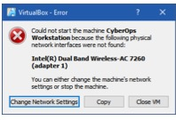
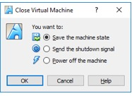

**Travaux pratiques - Installation d'une machine virtuelle**
- 
- **Objectifs**
**Partie1: Préparer un ordinateur personnel pour la virtualisation**

**Partie2: Importer une machine virtuelle dans un inventaire VirtualBox**
- 
- **Contexte/scénario**
La puissance et les ressources informatiques des ordinateurs ont considérablement augmenté ces 10dernières années. Le fait d'avoir des processeurs multi cœurs et de grands volumes de mémoire RAM nous permet de mettre en œuvre la virtualisation. Avec la virtualisation, un ou plusieurs ordinateurs virtuels fonctionnent au sein d'un ordinateur physique. Les ordinateurs virtuels s'exécutent sur des ordinateurs physiques. Souvent, l'ordinateur virtuel est appelé invité et l'ordinateur physique est appelé hôte. Toute personne possédant un ordinateur et un système d'exploitation moderne peut utiliser des ordinateurs virtuels.

Un fichier image de machine virtuelle a été créé pour être installé sur votre ordinateur. Durant cet atelier, vous téléchargerez et importerez ce fichier image à l'aide d'une application de virtualisation du poste de travail, telle que VirtualBox.
- 
- **Ressources requises**
- Un ordinateur avec un minimum de 8 Go de mémoire vive et 45 Go d'espace disque disponible
- Un accès Internet haut débit pour télécharger Oracle VirtualBox et les fichier d'image de la machine virtuelle
- 
- **Instructions**
  1.  **Préparer un ordinateur hôte à la virtualisation**
Dans la première partie, vous téléchargerez et installerez un logiciel de virtualisation du poste de travail, puis vous téléchargerez un fichier image qui peut être utilisé pour compléter les ateliers du cours. Dans le cadre de cet atelier, la machine virtuelle s'exécute sous Linux.

- **Téléchargez et installez VirtualBox.**
VMware Player et Oracle VirtualBox sont deux programmes de virtualisation que vous pouvez télécharger et installer pour prendre en charge le fichier image. Au cours de ces travaux pratiques, vous utiliserez VirtualBox.
- Accédez au site <http://www.oracle.com/technetwork/server-storage/virtualbox/downloads/index.html>.
- Sélectionnez et téléchargez le fichier d'installation correspondant à votre système d'exploitation.
- Une fois que vous avez téléchargé le fichier d'installation de VirtualBox, exécutez l'installateur et acceptez les paramètres d'installation par défaut.

- **Téléchargez le fichier image de la machine virtuelle.**
Le fichier image a été créé selon les normes de l'Open Virtualization Format (OVF). OVF est un standard OpenSource pour intégrer et distribuer des appareils virtuels. Un package OVF comporte plusieurs fichiers situés dans un répertoire. Ce dernier est ensuite distribué en tant que package OVF. Ce package contient tous les fichiers OVF nécessaires au déploiement de la machine virtuelle. La machine virtuelle utilisée dans cet atelier a été exportée selon les normes OVF.
- Suivez les instructions du professeur pour accéder aux machines virtuelles.
- Copiez les fichiers d'image **cyberops_workstation.ova** et **security_onion.ova** et notez l'emplacement de la machine virtuelle téléchargée.

- **Importer la machine virtuelle dans l'inventaire VirtualBox**
Dans la deuxième partie, vous importerez l'image de la machine virtuelle dans VirtualBox, puis vous démarrerez la machine virtuelle.

- **Importez le fichier de la machine virtuelle dans VirtualBox.**
  1.  Ouvrez **VirtualBox**. Cliquez sur **File \> Import Appliance…** pour importer l'image de la machine virtuelle.
  2.  Spécifiez l'emplacement du fichier .OVA et cliquez sur **Next**.
  3.  La fenêtre de l'appliance présente les paramètres suggérés dans l'archive OVA. Passez en revue les paramètres par défaut et modifiez le cas échéant. Cliquez sur **Import** pour continuer.
  4.  Une fois que le processus d'importation est terminé, la nouvelle machine virtuelle s'ajoute à l'inventaire de VirtualBox visible dans le panneau latéral gauche. La machine virtuelle est désormais prête à être utilisée.

- **Démarrez la machine virtuelle et connectez-vous.**
  1.  Sélectionnez et démarrez une machine virtuelle nouvellement importée. La machine virtuelle CyberOps Workstation est utilisée comme exemple dans ce laboratoire.
  2.  Cliquez sur la flèche verte **Start** dans la partie supérieure de la fenêtre de l'application VirtualBox. Si la boîte de dialogue suivante s'affiche, cliquez sur **Change Network Settings** et configurez votre adaptateur ponté. Cliquez sur le menu déroulant en regard du champ Name et choisissez votre adaptateur réseau (celui-ci varie en fonction de l'ordinateur).

**Remarque**: Si votre réseau n'est pas configuré avec les services DHCP, cliquez sur **Change Network Settings** et sélectionnez **NAT** dans le menu déroulant Attached to. Les paramètres réseau sont également accessibles via **Settings** dans le gestionnaire Oracle VirtualBox ou via **Devices** \> **Network** \> **Network Setting**s dans le menu de la machine virtuelle. Vous devrez peut-être désactiver, puis activer l'adaptateur réseau pour que la modification soit prise en compte.

- Cliquez sur **OK**. Une nouvelle fenêtre s'affiche et le processus de démarrage de la machine virtuelle commence.
- Une fois que le processus de démarrage est terminé, la machine virtuelle vous demandera un nom d'utilisateur et un mot de passe. Utilisez les informations d'identification suivantes pour vous connecter à la machine virtuelle:
Nom d'utilisateur: **analyst**

Mot de passe: **cyberops**

Un environnement de poste de travail sera affiché: une barre de lancement se trouve en bas de l'écran, des icônes sur le poste de travail et un menu d'application en haut de l'écran.

**Remarque**: Notez le fonctionnement du clavier et de la souris. Lorsque vous cliquez sur la fenêtre de la machine virtuelle, votre souris et votre clavier activeront le système d'exploitation de l'invité. Le système d'exploitation de votre hôte ne détectera plus le texte saisi ni les mouvements de la souris. Appuyez sur la touche **CTRL** pour basculer le fonctionnement du clavier et de la souris sur le système d'exploitation de l'hôte.

- **Familiarisez-vous avec la machine virtuelle.**

La machine virtuelle que vous venez d'installer va vous permettre de réaliser de nombreux travaux pratiques intégrés à ce cours. Familiarisez-vous avec les icônes de la liste ci-dessous:

La barre de lancement comprend les icônes suivantes (de gauche à droite):
- Show the desktop (Afficher le bureau)
- Application de terminal
- Application de gestion des fichiers
- Application de navigateur (Firefox)
- Outil de recherche de fichiers
- Répertoire de base de l'utilisateur actuel

Toutes les applications associées au cours se trouvent sous **Applications Menu \> CyberOPs**.

- Répertoriez les applications du menu CyberOPs.
- Ouvrez l'application **Terminal Emulator**. Saisissez **ip address** dans l'invite de commande pour identifier l'adresse IP de votre machine virtuelle.

Quelles sont les adresses IP attribuées à votre machine virtuelle?

Dans cet machine Linux on a inet 10.0.2.15 et brd(broadcast) 10.0.2.255
- Localisez et lancez votre navigateur web.

Pouvez-vous accéder à votre moteur de recherche préféré?

oui

- **Arrêtez les machines virtuelles.**
Lorsque vous en avez terminé avec la machine virtuelle, vous pouvez enregistrer l'état de la machine virtuelle pour une utilisation ultérieure ou l'arrêter.

**Arrêt de la machine virtuelle à l'aide de l'interface graphique:**

Dans le menu **File** de VirtualBox, sélectionnez **Close...**

Cliquez sur le bouton radio **Save the machine state**, puis sur **OK**. La prochaine fois que vous démarrerez la machine virtuelle, vous pourrez reprendre votre travail avec une machine dans le même état que celle que vous venez de quitter.

Les deux autres options sont:

**Envoyer le signal d'arrêt**: simule l'action d'appuyer sur le bouton d'alimentation d'un ordinateur physique

**Mettre la machine hors tension**: simule l'action de débrancher un ordinateur physique

**Arrêter la machine virtuelle à l'aide de l'interface de ligne de commande:**

Pour arrêter la machine virtuelle à l'aide de la ligne de commande, utilisez les options de menu de la machine virtuelle ou saisissez la commande **sudo shutdown -h now** dans une fenêtre de terminal et spécifiez le mot de passe **cyberops** lorsque vous y êtes invité.

**Redémarrage de la machine virtuelle:**

Pour redémarrer la machine virtuelle, utilisez les options de menu de la machine virtuelle ou saisissez la commande **sudo reboot** dans un terminal et spécifiez le mot de passe **cyberops** lorsque vous y êtes invité.

**Remarque**: vous pouvez utiliser le navigateur de cette machine virtuelle pour lancer votre recherche sur les problèmes de sécurité. En utilisant la machine virtuelle, vous évitez d'infecter votre ordinateur avec des malwares.
- 
- **Remarques générales**

Quels sont les avantages et les inconvénients de l'utilisation d'un ordinateur virtuel?
