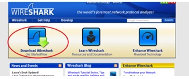
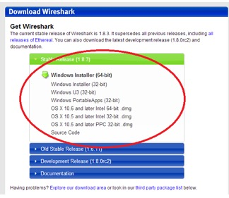
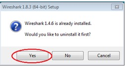
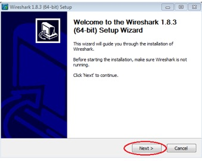
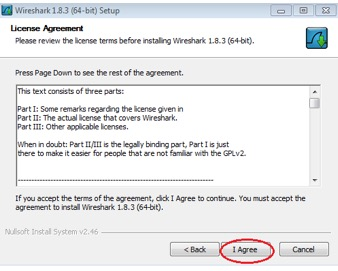
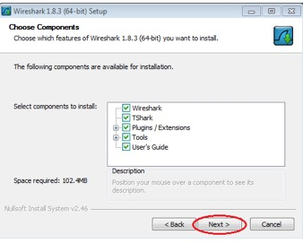
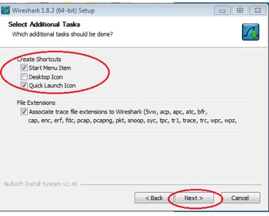
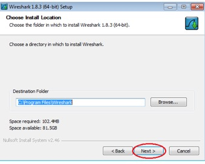
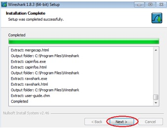
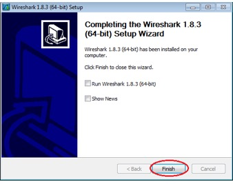

**Travaux pratiques– Installation de Wireshark**
- **Objectifs**
Télécharger et installer Wireshark

**Compétences** :

- Télécharger et installer un logiciel de capture et d'analyse de trafic réseau
- Capturer et analyser du trafic local
- Capturer et analyser du trafic distant
- Examiner les champs d'en-tête d'une trame Ethernet, d'un paquet IP, d'un segment TCP ou UDP
- Examiner les champs de requête et de réponse d'un protocole applicatif
- Expliquer les modèles en couches
- Expliquer les mécanismes d'encapsulation et de désencapsulation
- Situer les données capturées dans les modèles de référence OSI et TCP/IP

- **Contexte/Scénario**
Wireshark est un analyseur de protocoles (analyseur de paquets) utilisé pour dépanner les réseaux, effectuer des analyses, développer des logiciels et des protocoles et s'informer. L'analyseur «capture» chaque unité de données de protocole (PDU) des flux de données circulant sur le réseau. Il permet de décoder et d'analyser leur contenu conformément aux spécificationsRFC ou autres appropriées.

Cet outil est utile pour toutes les personnes intervenant au niveau des réseaux. Vous pouvez vous en servir dans le cadre de la plupart des travaux pratiques des coursCisco NetAcad, ainsi qu'en production dans l'exploitation d'un réseau réel, à des fins d'analyse de données et de dépannage. Ces travaux pratiques contiennent des instructions permettant de télécharger et d'installer Wireshark.

- **Ressources requises**
1ordinateur Windows équipé d'un accès à Internet

- **Télécharger et installer Wireshark**
Wireshark est devenu le programme standard d'analyse de paquets pour les ingénieurs réseau. Ce logiciel open source est disponible pour de nombreux systèmes d'exploitation différents, y compris Windows, Mac et Linux. Dans ces travaux pratiques, vous téléchargerez et installerez le logiciel Wireshark sur votre ordinateur.

**Remarque**: avant de télécharger Wireshark, vérifiez auprès de votre formateur ou de votre responsable quelle est la politique de téléchargement des logiciels de votre école ou organisation.

**L**'utilisation d'un analyseur de paquets tel que Wireshark peut constituer une infraction à la stratégie de sécurité de l'établissement de formation ou de l’organisation. Nous vous recommandons d'obtenir une autorisation avant d'exécuter Wireshark dans le cadre de ces travaux pratiques. L'utilisation d'un analyseur de paquets tel que Wireshark peut poser problème et contrevenir à la charte informatique. Analyser le trafic d'un réseau sans l'accord de son gestionnaire peut également constituer une infraction à la loi, car cette pratique s'apparente à une attaque passive (écoute non autorisée).

- **Téléchargez Wireshark.**
  1.  Wireshark peut être téléchargé à partir de [www.wireshark.org](http://www.wireshark.org/).

- Cliquez sur **Download Wireshark**.

- Sélectionnez la version logicielle dont vous avez besoin en fonction de l'architecture et du système d'exploitation de votre ordinateur. Par exemple, si vous disposez d'un ordinateur 64bits exécutant Windows, choisissez **Windows Installer (64-bit)** (Programme d'installation de Windows (64bits)).

Une fois que vous avez effectué votre sélection, le téléchargement doit commencer. L'emplacement du fichier téléchargé dépend de votre navigateur et du système d'exploitation que vous utilisez. Pour les utilisateurs Windows, l'emplacement par défaut est le dossier **Téléchargements**.

**Étape 2 : Installez Wireshark.**

- Le fichier téléchargé se nomme **Wireshark-win64-x.x.x.exe**, où **x** représente le numéro de version. Cliquez deux fois sur le fichier pour lancer la procédure d'installation.

- Répondez à tous les messages de sécurité qui s'affichent à l'écran. Si vous disposez déjà d'une copie de Wireshark sur votre ordinateur, vous serez invité à désinstaller l'ancienne version avant d'installer la nouvelle. Nous vous recommandons de supprimer l'ancienne version de Wireshark avant d'installer une autre version. Cliquez sur **Oui** pour désinstaller la version précédente de Wireshark.

- Si c'est la première fois que vous installez Wireshark, ou après avoir terminé la procédure de désinstallation, accédez à l'assistant de configuration de Wireshark. Cliquez sur **Suivant**.

- Continuez à progresser dans la procédure d'installation. Cliquez sur **I Agree** (J'accepte) lorsque la fenêtre contenant la licence d'utilisation s'affiche.

- Conservez les paramètres par défaut dans la fenêtre Choose Components (Choisir les composants) et cliquez sur **Next** (Suivant).

- Choisissez les options de raccourci souhaitées et cliquez sur **Next** (Suivant).

- Vous pouvez modifier l'emplacement d'installation de Wireshark, mais à moins que vous ne disposiez d'un espace disque limité, nous vous recommandons de conserver l'emplacement par défaut.

- Pour enregistrer des données réseau en temps réel, il faut que **WinPcap** soit installé sur votre ordinateur. Si WinPcap est déjà installé sur votre ordinateur, la case à cocher Install (Installer) sera désélectionnée. Si la version de WinPcap que vous avez installée est antérieure à la version fournie avec Wireshark, il est recommandé d'autoriser l'installation de la version la plus récente en sélectionnant la case à cocher **Install WinPcap x.x.x** (numéro de version) (Installer WinPcap).

- Finalisez l'installation au moyen de l'Assistant si vous installez WinPcap.

- Wireshark commence à installer ses fichiers et affiche une fenêtre distincte indiquant l'état de l'installation. Cliquez sur **Next** (Suivant) une fois l'installation terminée.

- Cliquez sur **Finish** (Terminer) pour terminer le processus d'installation de Wireshark.

