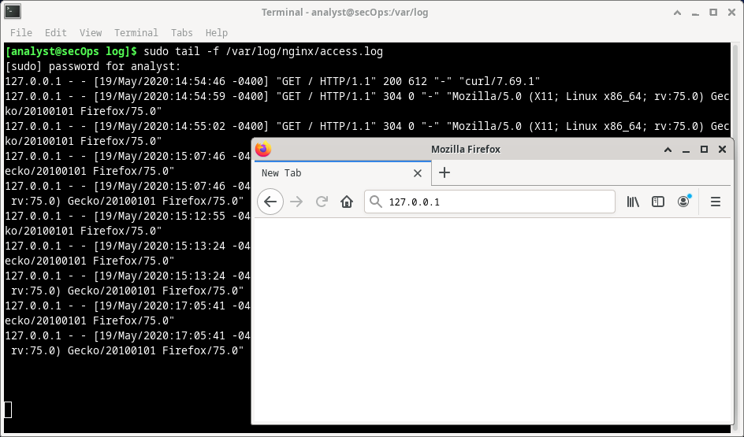
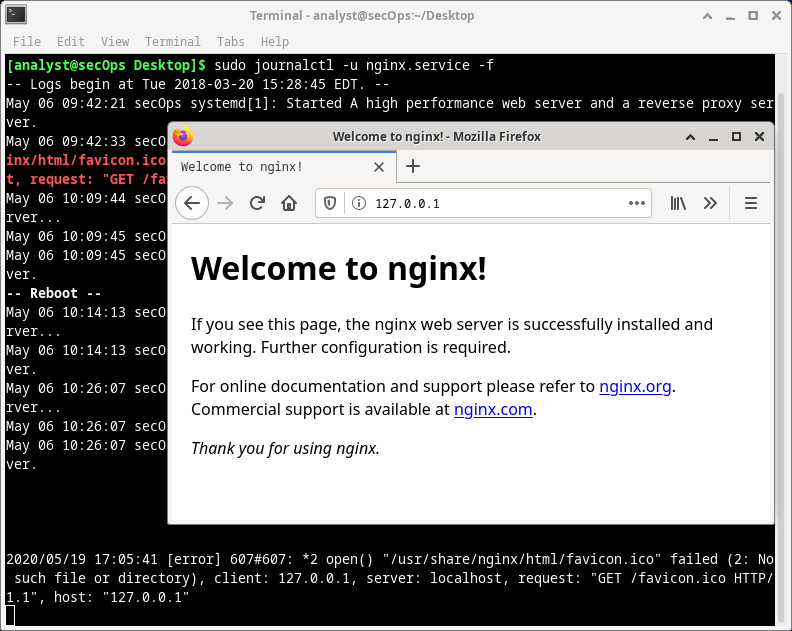

- **TP - Localiser les fichiers journaux**
- 
- **Objectifs**

Au cours de ces travaux pratiques, vous allez vous familiariser avec la localisation et la manipulation de fichiers journaux Linux.

**Partie 1: Présentation des fichiers journaux**

**Partie 2: Localisation des fichiers journaux dans des systèmes inconnus**

**Partie 3: Surveillance des fichiers journaux en temps réel**
- 
- **Ressources requises**
- Poste de travail virtuel CyberOps
- 
- **Instructions**

- **Présentation des fichiers journaux**

Les fichiers journaux (ou journaux) sont des fichiers utilisés par les ordinateurs pour enregistrer les événements. Les logiciels, les processus d'arrière-plan, les services ou les transactions entre les services, y compris le système d'exploitation lui-même, peuvent générer des événements. Les fichiers journaux dépendent de l'application qui les génère. C'est au développeur de l'application de se conformer aux conventions de dénomination des fichiers journaux. La documentation du logiciel devrait inclure des informations sur ses fichiers journaux.

- **Exemple de fichier journal d'un serveur web**

Comme les fichiers journaux permettent essentiellement de suivre des événements spécifiques, le type d'informations stockées varie en fonction de l'application ou des services qui génèrent ces événements.

- Examinez l'entrée de journal unique ci-dessous. Elle a été générée par Apache, un serveur web très utilisé.

\[Wed Mar 22 11:23:12.207022 2017\] \[core:error\] \[pid 3548:tid 4682351596\] \[client 209.165.200.230\] File does not exist: /var/www/apache/htdocs/favicon.ico

L'entrée de journal ci-dessus représente l'enregistreur d'événements web d'Apache. Quelques éléments d'information sont importants dans les transactions web, y compris l'adresseIP du client, les date et heure, ainsi que les détails de la transaction. L'entrée ci-dessus peut être divisée en cinq parties principales:

**Horodatage:** cette partie a été enregistrée lorsque l'événement a eu lieu. Il est très important de synchroniser correctement l'horloge du serveur, car cela permet de suivre et de relier les événements entre eux avec précision.

**Type:** il s'agit du type d'événement. Dans ce cas, il s'agissait d'une erreur.

PID: **contient des informations sur l'ID de processus utilisé par Apache à ce moment.**

**Client:** enregistre l'adresse IP du client à l'origine de la requête.

**Description:** contient une description de l'événement.

En vous basant sur l'entrée de journal ci-dessus, décrivez ce qui s'est passé.

Utilisez la commande **cat** ci-dessous pour afficher un exemple de fichier journal du serveur web. Cet exemple de fichier se trouve dans /var/log:

\[analyst@secOps ~\]\$ **cat /var/log/logstash-tutorial.log**

83.149.9.216 - - \[04/Jan/2015:05:13:42 +0000\] "GET /presentations/logstash-monitorama-2013/images/kibana-search.png HTTP/1.1" 200 203023 "<http://semicomplete.com/presentations/logstash-monitorama-2013/>" "Mozilla/5.0 (Macintosh; Intel Mac OS X 10_9_1) AppleWebKit/537.36 (KHTML, like Gecko) Chrome/32.0.1700.77 Safari/537.36"

83.149.9.216 - - \[04/Jan/2015:05:13:42 +0000\] "GET /presentations/logstash-monitorama-2013/images/kibana-dashboard3.png HTTP/1.1" 200 171717 "<http://semicomplete.com/presentations/logstash-monitorama-2013/>" "Mozilla/5.0 (Macintosh; Intel Mac OS X 10_9_1) AppleWebKit/537.36 (KHTML, like Gecko) Chrome/32.0.1700.77 Safari/537.36"

83.149.9.216 - - \[04/Jan/2015:05:13:44 +0000\] "GET /presentations/logstash-monitorama-2013/plugin/highlight/highlight.js HTTP/1.1" 200 26185 "<http://semicomplete.com/presentations/logstash-monitorama-2013/>" "Mozilla/5.0 (Macintosh; Intel Mac OS X 10_9_1) AppleWebKit/537.36 (KHTML, like Gecko) Chrome/32.0.1700.77 Safari/537.36”

\<some output omitted\>

La sortie ci-dessus peut-elle être encore considérée comme transaction web? Expliquez pourquoi la sortie de la commande **cat** se trouve dans un format différent de celui de la seule entrée indiquée au point (a).

- **Exemple de fichier de journal du système d'exploitation**

N'importe quel logiciel peut inclure des fichiers journaux, y compris le système d'exploitation lui-même. Habituellement, Linux utilise le répertoire /var/log pour stocker les divers fichiers log, y compris les journaux du système d'exploitation. Les systèmes d'exploitation modernes sont des logiciels complexes et utilisent, par conséquent, plusieurs fichiers distincts pour enregistrer les événements. Cette section passe rapidement en revue le fichier /var/log/messages.

- Stocké dans /var/log, le fichier de messages contient divers événements système. Le branchement d'une nouvelle clé USB, la mise en disponibilité d'une carte réseau et un nombre excessif de tentatives de connexion root qui ont échoué sont quelques exemples des événements enregistrés dans le fichier /var/log/messages. Utilisez la commande **more** pour afficher le contenu du fichier /var/log/messages. Contrairement à la commande **cat**, **more** permet une navigation progressive dans le fichier. Appuyez sur **Entrée** pour avancer une ligne à la fois ou sur **Espace** pour avancer d'une page entière. Appuyez sur **q** ou **CTRL + C** pour abandonner et quitter la commande **plus**.

**Remarque**: la commande **sudo** est requise, car le fichier de messages appartient à l'utilisateur root.

\[analyst@secOps ~\]\$ **sudo more /var/log/messages**

\[sudo\] password for analyst:

Mar 20 08:34:38 secOps kernel: \[6.149910\] random: crng init done

Mar 20 08:34:40 secOps kernel: \[8.280667\] floppy0: no floppy controllers found

Mar 20 08:34:40 secOps kernel: \[8.280724\] work still pending

Mar 20 08:35:16 secOps kernel: \[ 44.414695\] hrtimer: interrupt took 5346452 ns

Mar 20 14:28:29 secOps kernel: \[21239.566409\] pcnet32 0000:00:03.0 enp0s3: link down

Mar 20 14:28:33 secOps kernel: \[21243.404646\] pcnet32 0000:00:03.0 enp0s3: link up, 100Mbps, full-duplex

Mar 20 14:28:35 secOps kernel: \[21245.536961\] pcnet32 0000:00:03.0 enp0s3: link down

Mar 20 14:28:43 secOps kernel: \[21253.427459\] pcnet32 0000:00:03.0 enp0s3: link up, 100Mbps, full-duplex

Mar 20 14:28:53 secOps kernel: \[21263.449480\] pcnet32 0000:00:03.0 enp0s3: link down

Mar 20 14:28:57 secOps kernel: \[21267.500152\] pcnet32 0000:00:03.0 enp0s3: link up, 100Mbps, full-duplex

Mar 20 14:29:01 secOps kernel: \[21271.551499\] pcnet32 0000:00:03.0 enp0s3: link down

Mar 20 14:29:05 secOps kernel: \[21275.389707\] pcnet32 0000:00:03.0 enp0s3: link up, 100Mbps, full-duplex

Mar 22 06:01:40 secOps kernel: \[0.000000\] Linux version 4.8.12-2-ARCH (builduser@andyrtr) (gcc version 6.2.1 20160830 (GCC) ) \#1 SMP PREEMPT Fri Dec 2 20:41:47 CET 2016

Mar 22 06:01:40 secOps kernel: \[0.000000\] x86/fpu: Supporting XSAVE feature 0x001: 'x87 floating point registers'

Mar 22 06:01:40 secOps kernel: \[0.000000\] x86/fpu: Supporting XSAVE feature 0x002: 'SSE registers'

Mar 22 06:01:40 secOps kernel: \[0.000000\] x86/fpu: Supporting XSAVE feature 0x004: 'AVX registers'

Mar 22 06:01:40 secOps kernel: \[0.000000\] x86/fpu: xstate_offset\[2\]: 576, xstate_sizes\[2\]: 256

Mar 22 06:01:40 secOps kernel: \[0.000000\] x86/fpu: Enabled xstate features 0x7, context size is 832 bytes, using 'standard' format.

Mar 22 06:01:40 secOps kernel: \[0.000000\] x86/fpu: Using 'eager' FPU context switches.

\<some output omitted\>

Notez que les événements énumérés ci-dessus sont très différents des événements de serveur web. Comme le système d'exploitation lui-même génère ce journal, tous les événements enregistrés sont en relation avec le système d'exploitation lui-même.

- Si nécessaire, saisissez **Ctrl + C** pour quitter la commande précédente.

- Les fichiers journaux sont très importants pour le dépannage. Supposons qu'un utilisateur de ce système spécifique ait signalé que toutes les opérations de réseau étaient lentes vers 4h20 du matin le 19 Mai.

Les entrées de journal illustrées ci-dessus permettent-elles de prouver cet événement? Si tel est le cas, à quelles lignes? Expliquez votre réponse.  

- **Localisation des fichiers journaux dans des systèmes inconnus**

Le poste de travail virtuel CyberOps comprend nginx, un serveur web léger. Cette section montre comment localiser et afficher les journaux nginx avec le poste de travail virtuel CyberOps.

**Remarque**: nginx a été installé sur le poste de travail virtuel CyberOps avec ses paramètres par défaut. Avec les paramètres par défaut, son fichier de configuration global se trouve sous /etc/nginx/nginx.conf, son fichier journal d'accès se trouve sous /var/log/nginx/access.log et les erreurs sont redirigées vers la fenêtre du terminal. Toutefois, les analystes en sécurité ont l'habitude de travailler sur des ordinateurs sur lesquels les informations sur l'installation des outils et des services sont inconnues. Cette section décrit le processus de localisation de ces fichiers pour nginx, mais n'est pas exhaustive. Néanmoins, il s'agit d'un bon exercice pour apprendre à localiser et à afficher les fichiers journaux sur des systèmes inconnus.

- Lorsque vous travaillez avec un nouveau logiciel, la première étape consiste à étudier sa documentation. Celle-ci fournit des informations importantes concernant le logiciel, y compris des informations sur ses fichiers journaux. Utilisez la commande **man** pour afficher la page du manuel de nginx:

\[analyst@secOps ~\]\$ **man nginx**

NGINX(8) BSD System Manager's Manual NGINX(8)

NOM

nginx — HTTP and reverse proxy server, mail proxy server

SYNOPSIS

nginx \[-?hqTtVv\] \[-c file\] \[-g directives\] \[-p prefix\] \[-s signal\]

DESCRIPTION

Nginx est un serveur HTTP proxy inverse, ainsi qu'un serveur proxy

de messagerie. Il est connu pour ses hautes performances, sa stabilité, son large éventail de fonctionnalités, sa configuration facile

et sa faible consommation de ressources.

\<some output omitted\>

- Faites défiler la page jusqu'à la section de journalisation de nginx. La documentation confirme que nginx prend en charge la journalisation. L'emplacement de ses fichiers journaux est défini au moment de la compilation.

\[PARTIAL OUTPUT EXTRACTED FROM NGINX MANUAL PAGE\]

JOURNAL DE DÉBOGAGE

Pour activer un journal de débogage, reconfigurez nginx afin d'inclure le débogage:

./configure --with-debug …

puis définissez le niveau de débogage d'error_log:

error_log /path/to/log debug;

Il est également possible d'activer le débogage pour une adresse IP particulière:

events {

debug_connection 127.0.0.1;

}

- Cette page du manuel contient également des informations sur les fichiers utilisés par nginx. Faites défiler l'écran vers le bas pour afficher les fichiers d'exploitation de nginx dans la section Files:

FILES

%%PID_PATH%%

Contains the process ID of nginx. The contents of this file are

not sensitive, so it can be world-readable.

%%CONF_PATH%%

The main configuration file.

%%ERROR_LOG_PATH%%

Error log file.

****

Les sorties ci-dessus vous aident à déduire que nginx prend en charge la journalisation et qu'il enregistre les événements dans des fichiers journaux. Cette sortie fait aussi allusion à l'existence d'un fichier de configuration pour nginx.

- Avant de chercher les fichiers nginx, utilisez les commandes **ps** et **grep** pour vous assurer que nginx est exécuté sur la machine virtuelle.

**Remarque**: utilisez **man** pour en savoir plus sur les commandes **ps** et **grep**.

\[analyst@secOps ~\]\$ **ps ax \| grep nginx**

415 ? Ss 0:00 nginx: master process /usr/bin/nginx -g pid /run/nginx.pid; error_log stderr;

416 ? S 0:00 nginx: worker process

1207 pts/0 S+ 0:00 grep nginx

La sortie ci-dessus confirme que nginx est en cours d'exécution. En outre, la sortie affiche également les paramètres utilisés lors du démarrage de nginx. L'ID de processus de nginx est stocké dans /run/nginx.pid et les messages d'erreur sont redirigés vers le terminal.

**Remarque**: si nginx n'est pas en cours d'exécution, saisissez **sudo /usr/sbin/nginx** à l'invite de commandes pour démarrer le service à l'aide de la configuration par défaut.

**Remarque**: Si vous devez redémarrer nginx, vous pouvez arrêter le service avec la commande **sudo pkill nginx**. Pour démarrer nginx avec la configuration personnalisée au cours des travaux pratiques précédents, exécutez la commande: **sudo nginx -c custom_server.conf**, puis testez le serveur en ouvrant un navigateur web et allez à l'URL: 127.0.0.1:81.:8080. Si vous souhaitez lancer **nginx** avec une configuration par défaut, commencez avec la commande: **sudo /usr/sbin/nginx**, uis ouvrez un navigateur web et allez à l'URL: 127.0.0.1.

Comme l'emplacement des fichiers journaux n'a pas été spécifié, recherchez leur emplacement dans le fichier de configuration nginx.

- De par sa conception, le poste de travail virtuel CyberOps utilise autant que possible des emplacements et des définitions par défaut. Habituellement, le répertoire /var/log contient divers fichiers journaux pour différents services et applications, tandis que les fichiers de configuration sont stockés sous le répertoire /etc. Même si la page du manuel de nginx n'a pas fourni pas l'emplacement exact de ses fichiers journaux, elle a confirmé non seulement que nginx prend en charge la journalisation, mais faisait aussi allusion à l'emplacement d'un fichier de configuration. Comme l'emplacement des fichiers journaux peut souvent être personnalisé dans les fichiers de configuration, l'étape suivante la plus logique consiste à utiliser la commande **ls** pour rechercher un fichier de configuration nginx sous /etc:

\[analyst@secOps ~\]\$ **ls /etc/**

adjtime host.conf mke2fs.conf rc_maps.cfg

apache-ant hostname mkinitcpio.conf request-key.conf

apparmor.d hosts mkinitcpio.d request-key.d

arch-release ifplugd modprobe.d resolv.conf

avahi initcpio modules-load.d resolvconf.conf

bash.bash_logout inputrc motd rpc

bash.bashrc iproute2 mtab rsyslog.conf

binfmt.d iptables nanorc securetty

ca-certificates issue netconfig security

crypttab java-7-openjdk netctl services

dbus-1 java-8-openjdk netsniff-ng shadow

default kernel nginx shadow-

depmod.d krb5.conf nscd.conf shells

dhcpcd.conf ld.so.cache nsswitch.conf skel

dhcpcd.duid ld.so.conf ntp.conf ssh

dkms ld.so.conf.d openldap ssl

drirc libnl openvswitch sudoers

elasticsearch libpaper.d os-release sudoers.d

environment lightdm pacman.conf sudoers.pacnew

ethertypes locale.conf pacman.conf.pacnew sysctl.d

\<output omitted\>

- **Notez la présence du dossier nginx sous** /etc **dans la sortie ci-dessus. En utilisant** ls **à nouveau, plusieurs fichiers s'affichent, y compris le fichier nginx.conf.**

\[analyst@secOps ~\]\$ **ls -l /etc/nginx/**

total 48

-rw-r--r-- 1 root root 2730 Mar 21 16:02 custom_server.conf

-rw-r--r-- 1 root root 1077 Nov 18 15:14 fastcgi.conf

-rw-r--r-- 1 root root 1007 Nov 18 15:14 fastcgi_params

-rw-r--r-- 1 root root 2837 Nov 18 15:14 koi-utf

-rw-r--r-- 1 root root 2223 Nov 18 15:14 koi-win

-rw-r--r-- 1 root root 2743 Jan 6 15:41 mal_server.conf

-rw-r--r-- 1 root root 3957 Nov 18 15:14 mime.types

-rw-r--r-- 1 root root 3264 Mar 22 13:34 nginx.conf

-rw-r--r-- 1 root root 3261 Oct 19 16:42 nginx.conf.working

-rw-r--r-- 1 root root 636 Nov 18 15:14 scgi_params

-rw-r--r-- 1 root root 664 Nov 18 15:14 uwsgi_params

-rw-r--r-- 1 root root 3610 Nov 18 15:14 win-utf

- Utilisez la commande **cat** pour répertorier le contenu sous /etc/nginx/nginx.conf. Vous pouvez également utiliser **more ou less** pour afficher le fichier et **nano** ou **SciTE** pour le modifier. Ces outils permettent de naviguer plus facilement dans les fichiers texte longs (seule la sortie de la commande cat est affichée ci-dessous).

\[analyst@secOps ~\]\$ **cat /etc/nginx/nginx.conf**

\#user html;

worker_processes 1;

\#error_log logs/error.log;

\#error_log logs/error.log notice;

\#error_log logs/error.log info;

\#pid logs/nginx.pid;

events {

worker_connections 1024;

}

\<some output omitted\>

**Remarque**: Les lignes commençant par «#» correspondent à des commentaires et sont ignorées par nginx.

- Un examen rapide du fichier de configuration révèle qu'il s'agit d'un fichier de configuration nginx. Comme il n'est fait aucune mention directe de l'emplacement des fichiers journaux nginx, il est très probable que nginx utilise les valeurs par défaut. Conformément à la convention de stockage des fichiers journaux sous /var/log, utilisez la commande **ls** pour afficher son contenu:

\[analyst@secOps ~\]\$ **ls -l /var/log/**

total 5708

-rw-r----- 1 root log 188962 Apr 19 10:35 auth.log

-rw-rw---- 1 root utmp 384 Apr 19 10:05 btmp

-rw-rw---- 1 root utmp 1536 Mar 22 08:50 btmp.1

-rw-r----- 1 root log 849038 Apr 19 10:05 daemon.log

-rw-r----- 1 root log 4416 Apr 19 09:45 errors.log

-rw-r----- 1 root log 1819814 Apr 19 10:05 everything.log

-rw------- 1 root root 32032 Apr 19 10:05 faillog

drwxr-sr-x+ 4 root systemd-journal 4096 Mar 20 15:28 journal

-rw-r----- 1 root log 927701 Apr 19 09:45 kernel.log

-rw-rw-r-- 1 root utmp 292292 Mar 26 11:03 lastlog

drwx--x--x 2 root lightdm 4096 Apr 19 09:45 lightdm

-rw-r--r-- 1 analyst analyst 24464 Apr 19 10:05 logstash-tutorial.log

-rw-r----- 1 root log 1673153 Apr 19 10:05 messages

drwxr-xr-x 2 root root 4096 Apr 19 10:28 nginx

-rw-r--r-- 1 http root 989 Dec 2 10:30 nginx-logstash.log

drwxr-xr-x 2 root root 4096 Jul 4 2014 old

-rw-r--r-- 1 root root 97655 Apr 17 12:52 pacman.log

drwxr-xr-x 2 snort snort 4096 Mar 26 11:03 snort

-rw-r----- 1 root log 563 Apr 19 09:45 syslog.log

-rw------- 1 root root 64064 Mar 26 11:03 tallylog

-rw-r----- 1 root log 216 Apr 17 13:04 user.log

-rw-rw-r-- 1 root utmp 70272 Apr 19 09:45 wtmp

-rw-r--r-- 1 root root 24756 Apr 19 09:45 Xorg.0.log

-rw-r--r-- 1 root root 25585 Apr 17 14:43 Xorg.0.log.old

- Comme indiqué ci-dessus, le répertoire **/var/log** contient un sous-répertoire nommé **nginx**. Utilisez la commande **ls** pour répertorier le contenu de **/var/log/nginx**.

**Remarque**: Comme **/var/log/nginx** appartient à l'utilisateur **http** , vous devez exécuter **ls** en tant que **root** en la faisant précéder de la commande **sudo** .

\[analyst@secOps ~\]\$ **sudo ls -l /var/log/nginx**

\[sudo\] password for analyst:

total 16

-rw-r— 1 journal http 0 18 mai 17:53 access.log

-rw-r— 1 http log 175 mai 6 09:42 access.log.1.gz

-rw-r----- 1 http log 593 May 5 16:58 access.log.2.gz

-rw-r— 1 http log 193 juil. 19 2018 access.log.3.gz

-rw-r— 1 http log 425 avr. 19 2018 access.log.4.gz

Il s'agit très probablement des fichiers journaux utilisés par nginx. Passez à la section suivante pour surveiller ces fichiers et obtenir confirmation qu'il s'agit bien de fichiers de journaux nginx.

**Remarque**: Votre sortie peut être différente Les fichiers journaux .GZ ci-dessus ont été générés par un service de rotation de journaux. Les systèmes Linux mettent souvent en oeuvre un service pour effectuer la rotation des journaux afin de limiter la taille de chacun d'eux. Le service de rotation des journaux utilise le dernier fichier journal, le compresse et l'enregistre sous un autre nom (access.log.1.gz, access.log.2.gz, etc). Un nouveau fichier journal principal vide est créé et utilisé pour stocker les dernières entrées.  

- **Surveillance des fichiers journaux en temps réel**

Comme vu dans les sections précédentes, les fichiers journaux peuvent être affichés avec de nombreux outils de présentation de texte. Alors que les commandes **cat**, **more**, **less** et **nano** peuvent être utilisées pour travailler avec des fichiers journaux, elles ne sont pas adaptées pour les surveiller en temps réel. Les développeurs ont conçu divers outils permettant de surveiller les fichiers journaux en temps réel. Certains outils sont basés sur du texte, tandis que d'autres ont une interface graphique. Ces travaux pratiques se concentrent sur **tail**, un outil simple mais efficace, disponible dans pratiquement tous les systèmes Unix.

- **Utilisation de la commande tail**

La commande **tail** affiche la fin d'un fichier texte. Par défaut, **tail** affiche les dix (10) dernières lignes d'un fichier texte.

**Remarque**: Si vous ne voyez aucune entrée de journal, naviguez jusqu'à 127.0.0.1 dans un navigateur Web et actualisez la page quelques fois.

- Utilisez la commande **tail** pour afficher la fin du fichier **/var/log/nginx/access.log**.

\[analyst@secOps ~\]\$ **sudo tail /var/log/nginx/access.log**

\[sudo\] password for analyst:

127.0.0.1 - - \[21/May/2017:15:32:32 -0400\] "GET / HTTP/1.1" 304 0 "-" "Mozilla/5.0 (X11; Linux i686; rv:50.0) Gecko/20100101 Firefox/50.0"

127.0.0.1 - - \[21/May/2017:15:32:34 -0400\] "GET / HTTP/1.1" 304 0 "-" "Mozilla/5.0 (X11; Linux i686; rv:50.0) Gecko/20100101 Firefox/50.0"

127.0.0.1 - - \[21/May/2017:15:32:41 -0400\] "GET / HTTP/1.1" 200 612 "-" "Mozilla/5.0 (X11; Linux i686; rv:50.0) Gecko/20100101 Firefox/50.0"

127.0.0.1 - - \[21/May/2017:15:32:41 -0400\] "GET /favicon.ico HTTP/1.1" 404 169 "-" "Mozilla/5.0 (X11; Linux i686; rv:50.0) Gecko/20100101 Firefox/50.0"

127.0.0.1 - - \[21/May/2017:15:32:44 -0400\] "GET / HTTP/1.1" 304 0 "-" "Mozilla/5.0 (X11; Linux i686; rv:50.0) Gecko/20100101 Firefox/50.0"

127.0.0.1 - - \[22/May/2017:11:20:27 -0400\] "GET /favicon.ico HTTP/1.1" 404 169 "-" "Mozilla/5.0 (X11; Linux i686; rv:50.0) Gecko/20100101 Firefox/50.0"

127.0.0.1 - - \[22/May/2017:12:49:26 -0400\] "GET / HTTP/1.1" 304 0 "-" "Mozilla/5.0 (X11; Linux i686; rv:50.0) Gecko/20100101 Firefox/50.0"

127.0.0.1 - - \[22/May/2017:12:49:50 -0400\] "GET / HTTP/1.1" 304 0 "-" "Mozilla/5.0 (X11; Linux i686; rv:50.0) Gecko/20100101 Firefox/50.0"

127.0.0.1 - - \[22/May/2017:12:49:53 -0400\] "GET / HTTP/1.1" 200 612 "-" "Mozilla/5.0 (X11; Linux i686; rv:50.0) Gecko/20100101 Firefox/50.0"

127.0.0.1 - - \[22/May/2017:13:01:55 -0400\] "GET /favicon.ico HTTP/1.1" 404 169 "-" "Mozilla/5.0 (X11; Linux i686; rv:50.0) Gecko/20100101 Firefox/50.0"

\[analyst@secOps ~\]\$

**Remarque**: Si vous ne voyez aucune entrée de journal, naviguez jusqu'à 127.0.0.1 dans un navigateur Web et actualisez la page quelques fois.

- Utilisez l'option **–n** pour spécifier le nombre de lignes que **tail** doit afficher depuis la fin du fichier.

\[analyst@secOps ~\]\$ **sudo tail -n 5 /var/log/nginx/access.log**

127.0.0.1 - - \[22/May/2017:11:20:27 -0400\] "GET /favicon.ico HTTP/1.1" 404 169 "-" "Mozilla/5.0 (X11; Linux i686; rv:50.0) Gecko/20100101 Firefox/50.0"

127.0.0.1 - - \[22/May/2017:12:49:26 -0400\] "GET / HTTP/1.1" 304 0 "-" "Mozilla/5.0 (X11; Linux i686; rv:50.0) Gecko/20100101 Firefox/50.0"

127.0.0.1 - - \[22/May/2017:12:49:50 -0400\] "GET / HTTP/1.1" 304 0 "-" "Mozilla/5.0 (X11; Linux i686; rv:50.0) Gecko/20100101 Firefox/50.0"

127.0.0.1 - - \[22/May/2017:12:49:53 -0400\] "GET / HTTP/1.1" 200 612 "-" "Mozilla/5.0 (X11; Linux i686; rv:50.0) Gecko/20100101 Firefox/50.0"

127.0.0.1 - - \[22/May/2017:13:01:55 -0400\] "GET /favicon.ico HTTP/1.1" 404 169 "-" "Mozilla/5.0 (X11; Linux i686; rv:50.0) Gecko/20100101 Firefox/50.0"

\[analyst@secOps ~\]\$

- Vous pouvez utiliser la commande **tail** avec l'option **-f** pour surveiller access.log nginx en temps réel. **-f**, qui est l'abréviation de follow (suivre) indique à **tail** d'afficher en permanence la fin d'un fichier de texte donné. Dans une fenêtre de terminal, exécutez **tail** avec l'option **–f**:

**\[analyst@secOps log\]\$ sudo tail -f /var/log/nginx/access.log**

\[sudo\] password for analyst:

127.0.0.1 - - \[21/Mar/2017:15:32:32 -0400\] "GET / HTTP/1.1" 304 0 "-" "Mozilla/5.0 (X11; Linux i686; rv:50.0) Gecko/20100101 Firefox/50.0"

127.0.0.1 - - \[21/Mar/2017:15:32:34 -0400\] "GET / HTTP/1.1" 304 0 "-" "Mozilla/5.0 (X11; Linux i686; rv:50.0) Gecko/20100101 Firefox/50.0"

127.0.0.1 - - \[21/Mar/2017:15:32:41 -0400\] "GET / HTTP/1.1" 200 612 "-" "Mozilla/5.0 (X11; Linux i686; rv:50.0) Gecko/20100101 Firefox/50.0"

127.0.0.1 - - \[21/Mar/2017:15:32:41 -0400\] "GET /favicon.ico HTTP/1.1" 404 169 "-" "Mozilla/5.0 (X11; Linux i686; rv:50.0) Gecko/20100101 Firefox/50.0"

127.0.0.1 - - \[21/Mar/2017:15:32:44 -0400\] "GET / HTTP/1.1" 304 0 "-" "Mozilla/5.0 (X11; Linux i686; rv:50.0) Gecko/20100101 Firefox/50.0"

127.0.0.1 - - \[22/Mar/2017:11:20:27 -0400\] "GET /favicon.ico HTTP/1.1" 404 169 "-" "Mozilla/5.0 (X11; Linux i686; rv:50.0) Gecko/20100101 Firefox/50.0"

127.0.0.1 - - \[22/Mar/2017:12:49:26 -0400\] "GET / HTTP/1.1" 304 0 "-" "Mozilla/5.0 (X11; Linux i686; rv:50.0) Gecko/20100101 Firefox/50.0"

127.0.0.1 - - \[22/Mar/2017:12:49:50 -0400\] "GET / HTTP/1.1" 304 0 "-" "Mozilla/5.0 (X11; Linux i686; rv:50.0) Gecko/20100101 Firefox/50.0"

127.0.0.1 - - \[22/Mar/2017:12:49:53 -0400\] "GET / HTTP/1.1" 200 612 "-" "Mozilla/5.0 (X11; Linux i686; rv:50.0) Gecko/20100101 Firefox/50.0"

127.0.0.1 - - \[22/Mar/2017:13:01:55 -0400\] "GET /favicon.ico HTTP/1.1" 404 169 "-" "Mozilla/5.0 (X11; Linux i686; rv:50.0) Gecko/20100101 Firefox/50.0"

Comme précédemment, **tail** affiche les 10dernières lignes du fichier. Toutefois, notez que **tail** ne se ferme pas après avoir affiché des lignes. L'invite de commande n'est pas visible, ce qui indique que **tail** est toujours en cours d'exécution.

**Remarque**: Votre fichier /var/log/access.log peut être vide en raison de la rotation des fichiers journaux. Un fichier /var/log/access.log vide ne vous empêche de poursuivre les travaux pratiques.

- Alors que **tail** est en cours d'exécution dans la fenêtre du terminal, cliquez sur l'icône de navigateur web du dock pour ouvrir une fenêtre de navigateur web. Redimensionnez la fenêtre du navigateur web de sorte qu'elle vous permette de voir le bas de la fenêtre du terminal où **tail** est toujours en cours d'exécution.

**Remarque**: dans la capture d'écran ci-dessous, l'utilisateur a appuyé plusieurs fois sur la touche Entrée dans la fenêtre de terminal **tail** en cours d'exécution. Il s'agit uniquement d'un outil de visualisation, car la commande **tail** ne traite aucune entrée lorsqu'elle est exécutée avec **–f**. Les lignes vides supplémentaires facilitent la détection des nouvelles entrées, car elles sont affichées au bas de la fenêtre du terminal.

- Dans la barre d'adresse du navigateur web, saisissez **127.0.0.1** et appuyez sur Entrée. Il s'agit de l'adresse de la machine virtuelle elle-même, qui indique au navigateur de se connecter à un serveur web exécuté sur l'ordinateur local. Une nouvelle entrée doit être consignée dans le fichier /var/log/nginx/access.log. Actualisez la page web pour afficher les entrées ajoutées dans le journal.

127.0.0.1 - - \[23/Mar/2017:09:48:36 -0400\] "GET / HTTP/1.1" 200 612 "-" "Mozilla/5.0 (X11; Linux i686; rv:50.0) Gecko/20100101 Firefox/50.0"

Comme **tail** est toujours en cours d'exécution, elle doit afficher la nouvelle entrée au bas de la fenêtre du terminal. En dehors de l'horodatage, votre entrée devrait ressembler à celui ci-dessus.

**Remarque**: Firefox stocke les pages en cache pour une utilisation ultérieure. Si une page est déjà en cache, forcez Firefox à ignorer le cache et à placer des requêtes web, puis rechargez la page en appuyant sur **\<CTRL+Maj+R\>.**

- Comme le fichier journal est mis à jour par nginx, nous pouvons affirmer avec certitude que /var/log/acess.log est en fait le fichier journal utilisé par nginx.

- Saisissez **Ctrl + C** pour mettre fin à la session de surveillance de la commande tail.

- **OUTIL BONUS: Journalctl**

Le poste de travail virtuel CyberOps repose sur Arch Linux. En tant que distribution Linux, Arch Linux est conçu pour être léger, minimaliste et simple. Dans le cadre de cette philosophie de conception, Arch Linux utilise systemd comme système init. Sous Linux, le processus init est le premier processus chargé lors du démarrage de l'ordinateur. Init est directement ou indirectement le parent de tous les processus exécutés sur le système. Il est lancé par le noyau au démarrage et continue de s'exécuter jusqu'à ce que l'ordinateur s'arrête. Init est généralement associé à l'ID de processus1.

Un système init est un ensemble de règles et de conventions régissant la façon dont l'espace utilisateur dans un système Linux donné est créé et mis à la disposition de l'utilisateur. Les systèmes Init spécifient également des paramètres tels que les fichiers de configuration généraux, la structure de journalisation et la gestion des services.

Systemd est un système init moderne conçu pour unifier la configuration et le comportement des services sur toutes les distributions Linux. Il est de plus en plus adopté par des distributions Linux majeures. Arch Linux dépend de systemd pour la fonctionnalité init. Le poste de travail virtuel CyberOps utilise également systemd.

system-journald (ou simplement journald) est le service de journalisation d'événements de systemd et utilise des fichiers binaires de type «append only» comme fichiers journaux. Notez que journald n'empêche pas l'utilisation d'autres systèmes de journalisation comme syslog et rsyslog.

Cette section fournit un bref aperçu de journalctl, un utilitaire journald utilisé pour l'affichage des journaux et la surveillance en temps réel.

- Dans une fenêtre de terminal du poste de travail virtuel CyberOps, exécutez la commande journalctl sans aucune option pour afficher toutes les entrées de journal (cette opération peut être assez longue):

**\[analyst@secOps ~\]\$ journalctl**

Remarque: à ce stade, vous ne voyez pas les messages des autres utilisateurs et du système.

Les utilisateurs des groupes «adm», «systemd-journal», «wheel» peuvent voir tous les messages.

Transmettez -q pour désactiver cet avis.

-- Logs begin at Fri 2014-09-26 14:13:12 EDT, end at Fri 2017-03-31 09:54:58 EDT

Sep 26 14:13:12 dataAnalyzer systemd\[1087\]: Starting Paths.

Sep 26 14:13:12 dataAnalyzer systemd\[1087\]: Reached target Paths.

Sep 26 14:13:12 dataAnalyzer systemd\[1087\]: Starting Timers.

Sep 26 14:13:12 dataAnalyzer systemd\[1087\]: Reached target Timers.

Sep 26 14:13:12 dataAnalyzer systemd\[1087\]: Starting Sockets.

Sep 26 14:13:12 dataAnalyzer systemd\[1087\]: Reached target Sockets.

Sep 26 14:13:12 dataAnalyzer systemd\[1087\]: Starting Basic System.

Sep 26 14:13:12 dataAnalyzer systemd\[1087\]: Reached target Basic System.

Sep 26 14:13:12 dataAnalyzer systemd\[1087\]: Starting Default.

Sep 26 14:13:12 dataAnalyzer systemd\[1087\]: Reached target Default.

Sep 26 14:13:12 dataAnalyzer systemd\[1087\]: Startup finished in 18ms.

Sep 26 14:14:24 dataAnalyzer systemd\[1087\]: Stopping Default.

\<some output omitted\>

La sortie commence avec une ligne semblable à celle ci-dessous, indiquant la date et l'heure auxquelles le système a lancé la journalisation. Notez que l'horodatage varie d'un système à un autre.

-- Logs begin at Fri 2014-09-26 13:22:51 EDT, end at Fri 2017-03-31 10:12:19 EDT. –-

journalctl intègre un certain nombre de fonctionnalités telles que le défilement de la page, les messages codés par couleur et plus encore. Utilisez les touches fléchées haut/bas du clavier pour faire défiler la sortie vers le haut/bas une ligne à la fois. Utilisez les flèches gauche/droite du clavier pour faire défiler la sortie latéralement et afficher les entrées de journal qui s'étendent au-delà des limites de la fenêtre du terminal. La touche **\<ENTER\>** affiche la ligne suivante, tandis que la barre d'espace affiche la page suivante dans la sortie. Appuyez sur la touche **q** pour quitter journalctl.

Notez le message d'aide fourni par journalctl:

Remarque: à ce stade, vous ne voyez pas les messages des autres utilisateurs et du système.

Les utilisateurs des groupes «adm», «systemd-journal», «wheel» peuvent voir tous les messages.

Transmettez -q pour désactiver cet avis.

Ce message vous rappelle que, comme l'utilisateur «analyst» est un utilisateur régulier et pas un membre des groupes adm, systemd-journal ou wheel, les entrées du journal ne sont pas toutes affichées par journalctl. Il stipule également qu'en exécutant journalctl avec l'option –q, vous supprimez le message d'aide.

Comment pouvez-vous exécuter **journalctl** et voir toutes les entrées du journal?

- **journalctl** inclut des options permettant de filtrer la sortie. Utilisez l'option **–b** pour afficher les entrées de journal liées au démarrage:

\[analyst@secOps ~\]\$ **sudo journalctl -b**

-- Logs begin at Fri 2014-09-26 13:22:51 EDT, end at Fri 2017-03-31 10:18:04 EDT. --

Mar 31 05:54:43 secOps systemd-journald\[169\]: Time spent on flushing to /var is 849us for 0 entries.

Mar 31 05:54:43 secOps kernel: Linux version 4.8.12-2-ARCH (builduser@andyrtr) (gcc version 6.2.1 20160830 (GCC) ) \#1 SMP PREEM

Mar 31 05:54:43 secOps kernel: x86/fpu: Supporting XSAVE feature 0x001: 'x87 floating point registers'

Mar 31 05:54:43 secOps kernel: x86/fpu: Supporting XSAVE feature 0x002: 'SSE registers'

Mar 31 05:54:43 secOps kernel: x86/fpu: Supporting XSAVE feature 0x004: 'AVX registers'

Mar 31 05:54:43 secOps kernel: x86/fpu: xstate_offset\[2\]: 576, xstate_sizes\[2\]: 256

Mar 31 05:54:43 secOps kernel: x86/fpu: Enabled xstate features 0x7, context size is 832 bytes, using 'standard' format.

Mar 31 05:54:43 secOps kernel: x86/fpu: Using 'eager' FPU context switches.

Mar 31 05:54:43 secOps kernel: e820: BIOS-provided physical RAM map:

Mar 31 05:54:43 secOps kernel: BIOS-e820: \[mem 0x0000000000000000-0x000000000009fbff\] usable

Mar 31 05:54:43 secOps kernel: BIOS-e820: \[mem 0x000000000009fc00-0x000000000009ffff\] reserved

Mar 31 05:54:43 secOps kernel: BIOS-e820: \[mem 0x00000000000f0000-0x00000000000fffff\] reserved

Mar 31 05:54:43 secOps kernel: BIOS-e820: \[mem 0x0000000000100000-0x000000007ffeffff\] usable

\<some output omitted\>

- Pour voir les entrées liées au dernier démarrage, ajoutez **-1** à la commande ci-dessus. Pour voir les entrées liées aux deux derniers démarrages, ajoutez l'option **-2**.

\[analyst@secOps ~\]\$ **sudo journalctl –b -2**

-- Logs begin at Fri 2014-09-26 13:22:51 EDT, end at Fri 2017-03-31 10:21:03 EDT. --

Mar 22 09:35:11 secOps systemd-journald\[181\]: Time spent on flushing to /var is 4.204ms for 0 entries.

Mar 22 09:35:11 secOps kernel: Linux version 4.8.12-2-ARCH (builduser@andyrtr) (gcc version 6.2.1 20160830 (GCC) ) \#1 SMP PREEM

Mar 22 09:35:11 secOps kernel: x86/fpu: Supporting XSAVE feature 0x001: 'x87 floating point registers'

Mar 22 09:35:11 secOps kernel: x86/fpu: Supporting XSAVE feature 0x002: 'SSE registers'

Mar 22 09:35:11 secOps kernel: x86/fpu: Supporting XSAVE feature 0x004: 'AVX registers'

Mar 22 09:35:11 secOps kernel: x86/fpu: xstate_offset\[2\]: 576, xstate_sizes\[2\]: 256

Mar 22 09:35:11 secOps kernel: x86/fpu: Enabled xstate features 0x7, context size is 832 bytes, using 'standard' format.

Mar 22 09:35:11 secOps kernel: x86/fpu: Using 'eager' FPU context switches.

Mar 22 09:35:11 secOps kernel: e820: BIOS-provided physical RAM map:

Mar 22 09:35:11 secOps kernel: BIOS-e820: \[mem 0x0000000000000000-0x000000000009fbff\] usable

Mar 22 09:35:11 secOps kernel: BIOS-e820: \[mem 0x000000000009fc00-0x000000000009ffff\] reserved

Mar 22 09:35:11 secOps kernel: BIOS-e820: \[mem 0x00000000000f0000-0x00000000000fffff\] reserved

Mar 22 09:35:11 secOps kernel: BIOS-e820: \[mem 0x0000000000100000-0x000000007ffeffff\] usable

Mar 22 09:35:11 secOps kernel: BIOS-e820: \[mem 0x000000007fff0000-0x000000007fffffff\] ACPI data

Mar 22 09:35:11 secOps kernel: BIOS-e820: \[mem 0x00000000fec00000-0x00000000fec00fff\] reserved

Mar 22 09:35:11 secOps kernel: BIOS-e820: \[mem 0x00000000fee00000-0x00000000fee00fff\] reserved

\<some output omitted\>

- Utilisez l'option **--list-boots** pour répertorier les démarrages précédents:

\[analyst@secOps ~\]\$ **sudo journalctl –-list-boots**

-144 fbef03a1b59c40429f3e083613ab775a Fri 2014-09-26 13:22:51 EDT—Fri 2014-09-26 14:05:00 EDT

-143 69ebae646d6b41f0b3de9401cb3aa591 Fri 2014-09-26 14:05:07 EDT—Fri 2014-09-26 20:35:29 EDT

-142 73a305f65dea41e787b164411dfc6750 Fri 2014-09-26 20:35:34 EDT—Fri 2014-09-26 20:52:22 EDT

-141 48a113d5d2f44979a849c9c0d9ecdfa2 Fri 2014-09-26 20:52:33 EDT—Fri 2014-09-26 21:08:35 EDT

-140 002af74c3fc44008a882384f546c438d Fri 2014-09-26 21:08:45 EDT—Fri 2014-09-26 21:16:39 EDT

-139 f3ca1d06495c4e26b367e6867f03374c Fri 2014-09-26 21:16:47 EDT—Fri 2014-09-26 21:50:19 EDT

-138 bd232f288e544a79aa3bc444e02185a8 Fri 2014-09-26 21:50:28 EDT—Fri 2014-09-26 22:33:13 EDT

-137 2097c11f249c431aa8ad8da31a5b26d1 Fri 2014-09-26 22:40:39 EDT—Fri 2014-09-26 23:55:46 EDT

-136 b24d5e718a724b18b352e9b2daed3db6 Sat 2014-09-27 10:57:32 EDT—Sat 2014-09-27 14:26:43 EDT

-135 5a189fc68352484a8b40cd719ff7dd41 Sat 2014-09-27 19:44:23 EDT—Sat 2014-09-27 22:50:24 EDT

-134 d0be08c1f26642a1a20bb70bfc7b722c Mon 2014-09-29 09:17:14 EDT—Mon 2014-09-29 12:12:10 EDT

-133 b00b0d4c07464071b0d3cac4eb79dda3 Mon 2014-09-29 12:39:12 EDT—Mon 2014-09-29 13:24:38 EDT

\<some output omitted\>

- Utilisez **--since “\<time range\>”** pour spécifier la plage de temps pour laquelle les entrées de journal doivent être affichées. Les deux commandes ci-dessous affichent toutes les entrées de journal générées au cours des deux dernières heures et le dernier jour, respectivement:

\[analyst@secOps ~\]\$ **sudo journalctl –-since "2 hours ago"**

-- Logs begin at Fri 2014-09-26 13:22:51 EDT, end at Fri 2017-03-31 10:28:29 EDT. --

Mar 31 09:54:45 secOps kernel: 00:00:00.008577 main 5.1.10 r112026 started. Verbose level = 0

Mar 31 09:54:45 secOps systemd\[1\]: Time has been changed

Mar 31 09:54:45 secOps systemd\[1\]: Started Rotate log files.

Mar 31 09:54:45 secOps ovsdb-server\[263\]: 2017-03-31T13:54:45Z\|00001\|ovsdb_server\|INFO\|ovsdb-server (Open vSwitch) 2.6.1

Mar 31 09:54:45 secOps ovsdb-server\[263\]: ovs\|00001\|ovsdb_server\|INFO\|ovsdb-server (Open vSwitch) 2.6.1

Mar 31 09:54:45 secOps kernel: openvswitch: Open vSwitch switching datapath

Mar 31 09:54:45 secOps systemd\[1\]: Started Open vSwitch Daemon.

Mar 31 09:54:45 secOps dhcpcd\[279\]: enp0s3: soliciting an IPv6 router

Mar 31 09:54:45 secOps ovs-vswitchd\[319\]: 2017-03-31T13:54:45Z\|00001\|ovs_numa\|INFO\|Discovered 1 CPU cores on NUMA node 0

Mar 31 09:54:45 secOps ovs-vswitchd\[319\]: 2017-03-31T13:54:45Z\|00002\|ovs_numa\|INFO\|Discovered 1 NUMA nodes and 1 CPU cores

Mar 31 09:54:45 secOps ovs-vswitchd\[319\]: ovs\|00001\|ovs_numa\|INFO\|Discovered 1 CPU cores on NUMA node 0

Mar 31 09:54:45 secOps ovs-vswitchd\[319\]: ovs\|00002\|ovs_numa\|INFO\|Discovered 1 NUMA nodes and 1 CPU cores

Mar 31 09:54:45 secOps ovs-vswitchd\[319\]: 2017-03-31T13:54:45Z\|00003\|reconnect\|INFO\|unix:/run/openvswitch/db.sock: connecting..

Mar 31 09:54:45 secOps ovs-vswitchd\[319\]: 2017-03-31T13:54:45Z\|00004\|reconnect\|INFO\|unix:/run/openvswitch/db.sock: connected

Mar 31 09:54:45 secOps ovs-vswitchd\[319\]: ovs\|00003\|reconnect\|INFO\|unix:/run/openvswitch/db.sock: connecting…

Mar 31 09:54:45 secOps ovs-vswitchd\[319\]: ovs\|00004\|reconnect\|INFO\|unix:/run/openvswitch/db.sock: connected

Mar 31 09:54:45 secOps ovs-vswitchd\[319\]: 2017-03-31T13:54:45Z\|00005\|ovsdb_idl\|WARN\|Interface table in Open_vSwitch database la

Mar 31 09:54:45 secOps ovs-vswitchd\[319\]: 2017-03-31T13:54:45Z\|00006\|ovsdb_idl\|WARN\|Mirror table in Open_vSwitch database lacks

\<some output omitted\>

\[analyst@secOps ~\]\$ **sudo journalctl –-since "1 day ago"**

-- Logs begin at Fri 2014-09-26 13:22:51 EDT, end at Fri 2017-03-31 10:26:48 EDT. --

Mar 30 05:54:43 secOps systemd-journald\[169\]: Time spent on flushing to /var is 849us for 0 entries.

Mar 30 05:54:43 secOps kernel: Linux version 4.8.12-2-ARCH (builduser@andyrtr) (gcc version 6.2.1 20160830 (GCC) ) \#1 SMP PREEM

Mar 30 05:54:43 secOps kernel: x86/fpu: Supporting XSAVE feature 0x001: 'x87 floating point registers'

Mar 30 05:54:43 secOps kernel: x86/fpu: Supporting XSAVE feature 0x002: 'SSE registers'

Mar 30 05:54:43 secOps kernel: x86/fpu: Supporting XSAVE feature 0x004: 'AVX registers'

Mar 30 05:54:43 secOps kernel: x86/fpu: xstate_offset\[2\]: 576, xstate_sizes\[2\]: 256

Mar 31 05:54:43 secOps kernel: x86/fpu: Enabled xstate features 0x7, context size is 832 bytes, using 'standard' format.

Mar 30 05:54:43 secOps kernel: x86/fpu: Using 'eager' FPU context switches.

Mar 30 05:54:43 secOps kernel: e820: BIOS-provided physical RAM map:

Mar 30 05:54:43 secOps kernel: BIOS-e820: \[mem 0x0000000000000000-0x000000000009fbff\] usable

Mar 30 05:54:43 secOps kernel: BIOS-e820: \[mem 0x000000000009fc00-0x000000000009ffff\] reserved

Mar 30 05:54:43 secOps kernel: BIOS-e820: \[mem 0x00000000000f0000-0x00000000000fffff\] reserved

\<some output omitted\>

- journalctl permet également d'afficher les entrées de journal associées à un service spécifique avec l'option –u. La commande ci-dessous affiche les entrées de journal liées à nginx:

\[analyst@secOps ~\]\$ **sudo journalctl –u nginx.service**

-- Logs begin at Fri 2014-09-26 13:22:51 EDT, end at Fri 2017-03-31 10:30:39 EDT. --

Oct 19 16:47:57 secOps systemd\[1\]: Starting A high performance web server and a reverse proxy server…

Oct 19 16:47:57 secOps nginx\[21058\]: 2016/10/19 16:47:57 \[warn\] 21058#21058: conflicting server name "localhost" on 0.0.0.0:80,

Oct 19 16:47:57 secOps systemd\[1\]: nginx.service: PID file /run/nginx.pid not readable (yet?) after start: No such file or dire

Oct 19 16:47:57 secOps systemd\[1\]: Started A high performance web server and a reverse proxy server.

Oct 19 17:40:09 secOps nginx\[21058\]: 2016/10/19 17:40:09 \[error\] 21060#21060: \*1 open() "/usr/share/nginx/html/favicon.ico" fai

Oct 19 17:40:09 secOps nginx\[21058\]: 2016/10/19 17:40:09 \[error\] 21060#21060: \*1 open() "/usr/share/nginx/html/favicon.ico" fai

Oct 19 17:41:21 secOps nginx\[21058\]: 2016/10/19 17:41:21 \[error\] 21060#21060: \*2 open() "/usr/share/nginx/html/favicon.ico" fai

Oct 19 17:41:21 secOps nginx\[21058\]: 2016/10/19 17:41:21 \[error\] 21060#21060: \*2 open() "/usr/share/nginx/html/favicon.ico" fai

Oct 19 18:36:33 secOps systemd\[1\]: Stopping A high performance web server and a reverse proxy server…

Oct 19 18:36:33 secOps systemd\[1\]: Stopped A high performance web server and a reverse proxy server.

-- Reboot --

Oct 19 18:36:49 secOps systemd\[1\]: Starting A high performance web server and a reverse proxy server…

Oct 19 18:36:49 secOps nginx\[399\]: 2016/10/19 18:36:49 \[warn\] 399#399: conflicting server name "localhost" on 0.0.0.0:80, ignor

Oct 19 18:36:49 secOps systemd\[1\]: nginx.service: PID file /run/nginx.pid not readable (yet?) after start: No such file or dire

Oct 19 18:36:49 secOps systemd\[1\]: Started A high performance web server and a reverse proxy server.

\<some output omitted\>

**Remarque**: dans systemd, les services sont décrits comme des unités. La plupart des packages d'installation de service créent et activent des unités durant le processus d'installation.

- Comme **tail –f**, **journalctl** prend également en charge la surveillance en temps réel. Utilisez l'option –f pour indiquer à journalctl de *suivre* un journal spécifique. Appuyez sur **Ctrl + C** pour sortir.

\[analyst@secOps ~\]\$ **sudo journalctl -f**

\[sudo\] password for analyst:

-- Logs begin at Fri 2014-09-26 13:22:51 EDT. --

Mar 31 10:34:15 secOps filebeat\[222\]: 2017/03/31 14:34:15.077058 logp.go:232: INFO No non-zero metrics in the last 30s

Mar 31 10:34:40 secOps sudo\[821\]: pam_unix(sudo:session): session closed for user root

Mar 31 10:34:45 secOps filebeat\[222\]: 2017/03/31 14:34:45.076057 logp.go:232: INFO No non-zero metrics in the last 30s

Mar 31 10:35:15 secOps filebeat\[222\]: 2017/03/31 14:35:15.076118 logp.go:232: INFO No non-zero metrics in the last 30s

Mar 31 10:35:45 secOps filebeat\[222\]: 2017/03/31 14:35:45.076924 logp.go:232: INFO No non-zero metrics in the last 30s

Mar 31 10:36:15 secOps filebeat\[222\]: 2017/03/31 14:36:15.076060 logp.go:232: INFO No non-zero metrics in the last 30s

Mar 31 10:36:45 secOps filebeat\[222\]: 2017/03/31 14:36:45.076122 logp.go:232: INFO No non-zero metrics in the last 30s

Mar 31 10:37:15 secOps filebeat\[222\]: 2017/03/31 14:37:15.076801 logp.go:232: INFO No non-zero metrics in the last 30s

Mar 31 10:37:30 secOps sudo\[842\]: analyst : TTY=pts/0 ; PWD=/home/analyst ; USER=root ; COMMAND=/usr/bin/journalctl -f

Mar 31 10:37:31 secOps sudo\[842\]: pam_unix(sudo:session): session opened for user root by (uid=0)

\<some output omitted\>

- journalctl prend également en charge le mélange des options pour obtenir l'ensemble de filtres souhaité. La commande ci-dessous surveille les événements système de nginx en temps réel.

\[analyst@secOps ~\]\$ **sudo journalctl -u nginx.service -f**

-- Logs begin at Fri 2014-09-26 13:22:51 EDT. --

Mar 23 10:08:41 secOps systemd\[1\]: Stopping A high performance web server and a reverse proxy server…

Mar 23 10:08:41 secOps systemd\[1\]: Stopped A high performance web server and a reverse proxy server.

-- Reboot --

Mar 29 11:28:06 secOps systemd\[1\]: Starting A high performance web server and a reverse proxy server…

Mar 29 11:28:06 secOps systemd\[1\]: nginx.service: PID file /run/nginx.pid not readable (yet?) after start: No such file or directory

Mar 29 11:28:06 secOps systemd\[1\]: Started A high performance web server and a reverse proxy server.

Mar 29 11:31:45 secOps systemd\[1\]: Stopping A high performance web server and a reverse proxy server…

Mar 29 11:31:45 secOps systemd\[1\]: Stopped A high performance web server and a reverse proxy server.

-- Reboot --

Mar 31 09:54:51 secOps systemd\[1\]: Starting A high performance web server and a reverse proxy server…

Mar 31 09:54:51 secOps systemd\[1\]: nginx.service: PID file /run/nginx.pid not readable (yet?) after start: No such file or directory

Mar 31 09:54:51 secOps systemd\[1\]: Started A high performance web server and a reverse proxy server.

- Alors que la commande ci-dessus est en cours d'exécution, ouvrez une nouvelle fenêtre de navigateur web et tapez 127.0.0.1 (configuration par défaut) ou 127.0.0.1:8080 (custom_server.conf) dans la barre d'adresse. journalctl devrait afficher une erreur liée à un fichier favicon.ico manquant en temps réel: Utilisez Ctrl+C pour quitter journalctl.

- **Remarques générales**

Les fichiers journaux sont extrêmement importants pour le dépannage.

Même si l'emplacement des fichiers journaux respecte une certaine convention, le choix final revient au développeur.

En règle générale, les informations de fichier journal (emplacement, noms de fichiers, etc.) sont incluses dans la documentation. Si la documentation ne fournit pas d'informations utiles sur les fichiers journaux, effectuez à la fois une recherche sur le web et sur le système.

Les horloges doivent toujours être synchronisées pour que tous les systèmes aient l'heure correcte. Si les horloges ne sont pas correctement définies, il est très difficile de retracer les événements.

Il est important de comprendre quand certains événements spécifiques ont eu lieu. De plus, les événements provenant de différentes sources sont souvent analysés en même temps.

