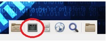

**TP - Se familiariser avec le shell**
- 
- **Objectifs**
Au cours de ces travaux pratiques, vous allez utiliser la ligne de commande Linux pour gérer les fichiers et les répertoires, et pour effectuer quelques tâches d'administration de base.

**Partie 1: Principes de base de Shell**

**Partie 2: Copier, supprimer et déplacer des fichiers**
- 
- **Matériel conseillé**
- Poste de travail CyberOps VM
- 
- **Instructions**

- **Notions de base sur le shell**

Le terme «shell» désigne l'interpréteur de commandes sous Linux. Également connu sous le nom de Terminal, Ligne de commande et Invite de commande, le shell permet d'interagir de manière efficace avec un ordinateur Linux.

- **Accéder à la ligne de commande**

- Connectez-vous au poste de travail virtuel CyberOps avec le nom d'utilisateur **analyst** et le mot de passe **cyberops**. Le compte **analyst** servira d'exemple de compte utilisateur pendant l'intégralité des travaux pratiques.

- Pour accéder à la ligne de commande, cliquez sur l'icône **terminal** située sur le dock, en bas de l'écran de la machine virtuelle. L'émulateur de terminal s'ouvre.

- **Afficher les pages de manuel à partir de la ligne de commande**

Vous pouvez afficher l'aide de la ligne de commande à l'aide de la commande **man**. Une page man, abréviation de page de manuel, est une documentation intégrée sur les commandes Linux. Les pages man offrent des informations détaillées sur les commandes et leurs options.

- Pour en savoir plus sur les pages de manuel, saisissez:

\[analyst@secOps ~\]\$ **man man**

Indiquez le nom de quelques sections des pages man.

- Tapez **q** pour quitter la page man.

- Utilisez la commande **man** pour en savoir plus sur la commande **cp** :

\[analyst@secOps ~\]\$ **man cp**

Quelle est la fonction de la commande **cp**?

Quelle commande utiliseriez-vous pour obtenir plus d'informations sur la commande **pwd**? Quelle est la fonction de la commande **pwd**?

- **Créez et modifiez des répertoires.**

Au cours de cette étape, vous utiliserez les commandes de changement de répertoire (**cd**), de création de répertoire (**mkdir**) et de liste de répertoire (**ls**).

**Remarque**: «Répertoire» est synonyme de «Dossier». Les termes dossier et répertoire sont souvent utilisés de manière interchangeable dans ces travaux pratiques.

- Tapez **pwd** dans l'invite.

\[analyst@secOps ~\]\$ **pwd**

/home/analyst

Quel est le répertoire actif?

- Accédez au répertoire **/home/analyst** si ce n'est pas le répertoire actif. Saisissez **cd /home/analyst**

\[analyst@secOps ~\]\$ **cd /home/analyst**

- Saisissez **ls -l** dans l'invite de commande pour obtenir la liste des fichiers et des dossiers qui se trouvent dans le dossier actif. L'option **-l** (pour liste) affiche la taille du fichier, ses autorisations, ses paramètres de propriété, sa date de création et bien plus encore.

\[analyst@secOps ~\]\$ **ls -l**

total 20

drwxr-xr-x 2 analyst analyst 4096 Mar 22 2018 Desktop

drwxr-xr-x 3 analyste 4096 avr. 2 14:44 Téléchargements

drwxr-xr-x 9 analyst analyst 4096 Jul 19 2018 lab.support.files

drwxr-xr-x 2 analyst analyst 4096 Mar 21 2018 second_drive

-rw-r--r-- 1 analyst analyst 255 Apr 17 16:42 space.txt

- Dans le répertoire actif, utilisez la commande **mkdir** pour créer trois dossiers: **cyops_folder1**, **cyops_folder2**, and **cyops_folder3**. Saisissez **mkdir cyops_folder1** et appuyez sur **Entrée**. Répétez ces étapes pour créer **cyops_folder2** et **cyops_folder3**.

\[analyst@secOps ~\]\$ **mkdir cyops_folder1**

\[analyst@secOps ~\]\$ **mkdir cyops_folder2**

\[analyst@secOps ~\]\$ **mkdir cyops_folder3**

\[analyst@secOps ~\]\$

- Saisissez**ls -l** pour vérifier que les dossiers ont bien été créés:

\[analyst@secOps ~\]\$ **ls -l**

total 32

drwxr-xr-x 2 analyst analyst 4096 Aug 16 15:01 cyops_folder1

drwxr-xr-x 2 analyst analyst 4096 Aug 16 15:02 cyops_folder2

drwxr-xr-x 2 analyst analyst 4096 Aug 16 15:02 cyops_folder3

drwxr-xr-x 2 analyst analyst 4096 Sep 26 2014 Desktop

drwx------ 3 analyst analyst 4096 Jul 14 11:28 Downloads

drwxr-xr-x 8 analyst analyst 4096 Jul 25 16:27 lab.support.files

drwxr-xr-x 2 analyst analyst 4096 Mar 3 15:56 second_drive

-rw-r--r-- 1 analyst analyst 254 Aug 16 13:38 space.txt

- Saisissez **cd /home/analyst/cyops_folder3** dans l'invite de commande et appuyez sur **Entrée**.

\[analyst@secOps ~\]\$ **cd /home/analyst/cyops_folder3**

\[analyst@secOps cyops_folder3\]\$

Dans quel répertoire vous trouvez-vous maintenant?

**Remarque**: dans l'invite **\[analyst@secOps ~\]\$** ci-dessus: le symbole **~** représente le répertoire de base de l'utilisateur actuel. Dans cet exemple, le répertoire de base de l'utilisateur actuel est **/home/analyst**. Après exécution de la commande **cd /home/analyst/cyops_folder3**, le répertoire de base de l'utilisateur actuel devient **/home/analyst/cyops_folder3**.

**Remarque**: le signe **\$** (dollar) indique des privilèges d'utilisateur standard. Si un signe **\#** (hashtag) s'affiche dans l'invite de commande, celui-ci indique des privilèges élevés (**utilisateur root**).

**Remarque**: si ces symboles, conventions et concepts de base ne changent pas, l'invite d'une fenêtre de terminal sous Linux reste tout de même hautement personnalisable. Par conséquent, la structure de l'invite observée sur le poste de travail virtuel CyberOps sera probablement différente de l'invite sur les autres installations Linux.

**Défi:** tapez la commande **cd ~** et décrivez ce qui se passe.

Pourquoi?

- Utilisez la commande **mkdir** pour créer un nouveau dossier nommé **cyops_folder4** à l'intérieur du dossier **cyops_folder3**:

\[analyst@secOps ~\]\$ **mkdir /home/analyst/cyops_folder3/cyops_folder4**

\[analyst@secOps ~\]\$

- Utilisez la commande **ls -l** pour vérifier que le dossier a été créé.

analyst@secOps ~\]\$ **ls –l /home/analyst/cyops_folder3**

total 4

drwxr-xr-x 2 analyst analyst 4096 Aug 16 15:04 cyops_folder4

- Jusqu'ici, nous avons utilisé des *chemins d'accès complets ou absolus.* Les chemins absolus désignent les chemins qui commencent à la racine (/). Il est également possible d'utiliser des *chemins relatifs.* Les chemins d'accès relatifs réduisent le volume de texte à taper. Pour comprendre comment sont formés les chemins d'accès relatifs, vous devez savoir à quoi correspondent les répertoires **.** et **..** (point et double point). Depuis le répertoire **cyops_folder3**, émettez une commande **ls – la**:

analyst@secOps ~\]\$ **ls –la /home/analyst/cyops_folder3**

total 12

drwxr-xr-x 3 analyst analyst 4096 Aug 16 15:04 .

drwxr-xr-x 20 analyst analyst 4096 Aug 16 15:02 ..

drwxr-xr-x 2 analyst analyst 4096 Aug 16 15:04 cyops_folder4

L'option **-a** indique à **ls** d'afficher tous les fichiers. Notez les listes **.** et **..** affichées par **ls**. Ces listes sont utilisées par le système d'exploitation pour assurer le suivi de l'utilisation du répertoire actuel (.) et du répertoire parent (..) Notez l'utilisation de **.** et **..** lorsque vous utilisez la commande **cd** pour changer de répertoire. Si vous utilisez la commande **cd** pour passer au répertoire **.**, aucun changement de répertoire visible ne se produit, car **.** désigne le répertoire actuel.

- Passez du répertoire actuel au répertoire /home/analyst/cyops_folder3:

\[analyst@secOps ~\]\$ **cd /home/analyst/cyops_folder3**

\[analyst@secOps cyops_folder3\]\$

- Tapez **cd .**

\[analyst@secOps cyops_folder3\]\$ **cd .**

\[analyst@secOps cyops_folder3\]\$

Que se passe-t-il?

- Passer au répertoire **..** revient en fait à passer au répertoire qui se trouve un niveau plus haut. Ce répertoire est également appelé *répertoire parent*. Tapez **cd ..**

\[analyst@secOps cyops_folder3\]\$ **cd ..**

\[analyst@secOps ~\]\$

Que se passe-t-il?

**Quel serait le répertoire actuel si vous exécutiez la commande cd .. pour** \[analyst@secOps ~\]\$**?**

Quel serait le répertoire actuel si vous exécutiez la commande **cd ..** pour \[analyst@secOps home\]\$?

Quel serait le répertoire actuel si vous exécutiez la commande **cd ..** pour \[analyst@secOps /\]\$?

- **Rediriger les sorties.**

Il existe un autre opérateur de ligne de commande puissant dans Linux appelé *redirect*. Représenté par le symbole **\>**, cet opérateur permet de rediriger la sortie d'une commande vers un emplacement autre que la fenêtre de terminal actuelle (par défaut).

- Utilisez la commande **cd** pour passer au répertoire **/home/analyst/** (**~)**:

\[analyst@secOps /\]\$ **cd /home/analyst/**

\[analyst@secOps ~\]\$

- Utilisez la commande **echo** pour envoyer un message par écho. Étant donné qu'aucune sortie n'a été définie, l'écho sera transmis à la fenêtre de terminal actuelle:

analyst@secOps ~\]\$ **echo Il s'agit d'un message envoyé au terminal par écho.**

Il s'agit d'un message envoyé au terminal par écho.

- Utilisez l'opérateur **\>** pour transmettre la sortie de l'écho à un fichier de texte plutôt qu'à l'écran:

analyst@secOps ~\]\$ **echo Il s'agit d'un message envoyé au terminal par écho. \> fichier_texte.txt**

Aucune sortie ne s'affiche.

Ce résultat était-il prévisible? Expliquez votre réponse.

- Notez que même si le fichier **fichier_texte.txt** n'existait pas, il a été créé automatiquement avant l’exécution de la commande echo, pour recevoir la sortie générée par la commande **echo**. Utilisez la commande **ls -l** pour vérifier si le fichier a été créé.

\[analyst@secOps ~\]\$ **ls –l fichier_texte.txt**

-rw-r--r-- 1 analyst analyst 50 Feb 24 16:11 some_text_file.txt

- Utilisez la commande **cat** pour afficher le contenu du fichier texte **fichier_texte.txt**:
\[analyst@secOps ~\]\$ **cat fichier_texte.txt**

Il s'agit d'un message envoyé au terminal par écho.

- Utilisez de nouveau l'opérateur **\>** pour transmettre une autre sortie d'écho au fichier texte **fichier_texte.txt**:

analyst@secOps ~\]\$ **echo Il s'agit d'un message DIFFÉRENT envoyé de nouveau au terminal par écho. \> fichier_texte.txt**

- Utilisez de nouveau la commande **cat** pour afficher le contenu du fichier texte **fichier_texte.txt**:

\[analyst@secOps ~\]\$ **cat fichier_texte.txt**

Il s'agit d'un message DIFFÉRENT envoyé de nouveau au terminal par écho.

Qu'est-il arrivé au fichier texte? Expliquez votre réponse.

- **Rediriger un fichier texte et y ajouter des données.**

- Semblable à l'opérateur **\>**, l'opérateur **\>\>** permet également de rediriger les données vers les fichiers. La différence est que **\>\>** ajoute les données à la fin du fichier ciblé, sans modifier le contenu actuel. Pour ajouter un message au fichier fichier_texte.txt, exécutez la commande ci-dessous:

\[analyst@secOps ~\]\$ **echo Il s'agit d'une autre ligne de texte. Elle sera AJOUTÉE au fichier de sortie. \>\> fichier_texte.txt**

- Utilisez la commande **cat** pour afficher de nouveau le contenu du fichier texte **some_text_file.txt** :

\[analyst@secOps ~\]\$ **cat fichier_texte.txt**

Il s'agit d'un message DIFFÉRENT envoyé de nouveau au terminal par écho.

Il s'agit d'une autre ligne de texte. Elle sera AJOUTÉE au fichier de sortie.

Qu'est-il arrivé au fichier texte? Expliquez votre réponse.

- **Utiliser des fichiers cachés dans Linux.**

- Dans Linux, les fichiers dont le nom commence par un «.» (point) ne sont pas affichés par défaut. Bien que les fichiers «.» (point) n'ont pas d'autre particularité, ils sont appelés fichiers cachés pour cette raison. Par exemple, les fichiers **.fichier5**, **.fichier6**, **.fichier7** sont des fichiers cachés.

**Remarque**: ne confondez pas les fichiers «.» (point) avec le symbole «**.**» qui est l'indicateur de répertoire. Le nom des fichiers masqués commence par un point, suivi de plusieurs caractères, tandis que le répertoire «.» (point) est un répertoire masqué dont le nom comporte uniquement un point.

- Utilisez la commande **ls -l** pour afficher les fichiers stockés dans le répertoire de base de l'analyste (home/analyst).

\[analyst@secOps ~\]\$ **ls –l**

Combien de fichiers sont affichés?

- Utilisez la commande **ls-la** pour afficher tous les fichiers dans le répertoire de base de l'utilisateur analyst, y compris les fichiers cachés.

\[analyst@secOps ~\]\$ **ls –la**

Combien de fichiers s'affichent maintenant, plus qu'avant? Expliquez votre réponse.

**Est-il également possible de masquer des dossiers entiers en ajoutant un point avant leur nom? Y-a-t-il des répertoires dans la sortie de la commande ls-la ci-dessus?**

Donnez trois exemples de fichiers cachés affichés dans la sortie de la commande **ls-la** ci-dessus.

- Tapez la commande **man ls** à l'invite pour en savoir plus sur la commande **ls**.

\[analyst@secOps ~\]\$ **man ls**

- Utilisez la flèche vers le bas (une seule ligne à la fois) ou la barre d'espace (une page à la fois) pour faire défiler la page vers le bas jusqu'à ce que vous trouviez la commande **-a** utilisée ci-dessus. Lisez sa description pour vous familiariser avec la commande **ls -a** .

- **Copier, supprimer et déplacer des fichiers**

- **Copier des fichiers**

- La commande **cp** sert à copier des fichiers dans le système de fichiers local. Lorsque vous utilisez la commande **cp**, une nouvelle copie du fichier est créée et placée dans l'emplacement spécifié, sans modifier le fichier d'origine. Le premier paramètre correspond au fichier source et le second à la destination. Lancez la commande ci-dessous pour copier **fichier_texte\_.txt** du répertoire de base vers le dossier **cyops_folder2**:

\[analyst@secOps ~\]\$ **cp fichier_texte.txt cyops_folder2/**

**Identifiez les paramètres dans la commande cp ci-dessus.**

**Question:**

**Quels sont les fichiers source et de destination? (Utilisez les chemins d'accès complets pour représenter les paramètres.)**

- Utilisez la commande **ls** pour vérifier que **fichier_texte.txt** est maintenant dans le dossier **cyops_folder2:**

\[analyst@secOps ~\]\$ **ls cyops_folder2/**

fichier_texte.txt

- Utilisez la commande **ls** pour vérifier que **fichier_texte.txt** est également dans le répertoire de base:

\[analyst@secOps ~\]\$ **ls -l**

total 36

drwxr-xr-x 2 analyst analyst 4096 Aug 16 15:01 cyops_folder1

drwxr-xr-x 2 analyst analyst 4096 Aug 16 15:11 cyops_folder2

drwxr-xr-x 3 analyst analyst 4096 Aug 16 15:04 cyops_folder3

drwxr-xr-x 2 analyst analyst 4096 Sep 26 2014 Desktop

drwx------ 3 analyst analyst 4096 Jul 14 11:28 Downloads

drwxr-xr-x 8 analyst analyst 4096 Jul 25 16:27 lab.support.files

drwxr-xr-x 2 analyst analyst 4096 Mar 3 15:56 second_drive

-rw-r--r-- 1 analyst analyst 142 Aug 16 15:09 fichier_texte.txt

-rw-r--r-- 1 analyst analyst 254 Aug 16 13:38 space.txt

- **Supprimer des fichiers et des répertoires**

- Utilisez la commande **rm** pour supprimer des fichiers. Lancez la commande ci-dessous pour supprimer le fichier **fichier_texte.txt** du répertoire de base. La commande **ls**est ensuite utilisée pour montrer que le fichier **fichier_texte.txt** a été supprimé du répertoire de base:

\[analyst@secOps ~\]\$ **rm some_text_file.txt**

\[analyst@secOps ~\]\$ **ls -l**

total 32

drwxr-xr-x 2 analyst analyst 4096 Aug 16 15:01 cyops_folder1

drwxr-xr-x 2 analyst analyst 4096 Aug 16 15:11 cyops_folder2

drwxr-xr-x 3 analyst analyst 4096 Aug 16 15:04 cyops_folder3

drwxr-xr-x 2 analyst analyst 4096 Sep 26 2014 Desktop

drwx------ 3 analyst analyst 4096 Jul 14 11:28 Downloads

drwxr-xr-x 8 analyst analyst 4096 Jul 25 16:27 lab.support.files

drwxr-xr-x 2 analyst analyst 4096 Mar 3 15:56 second_drive

-rw-r--r-- 1 analyst analyst 254 Aug 16 13:38 space.txt

- Dans Linux, les répertoires sont considérés comme un type de fichier. À ce titre, la commande **rm** sert également à supprimer des répertoires, mais l'option **- r** (récursive) doit être utilisée. Notez que tous les fichiers et tous les répertoires dans un répertoire donné sont également supprimés lorsque vous supprimez un répertoire parent avec l'option -r. Exécutez la commande ci-dessous pour supprimer le dossier **cyops_folder1** et son contenu:

\[analyst@secOps ~\]\$ **rm –r cyops_folder1**

\[analyst@secOps ~\]\$ **ls -l**

total 28

drwxr-xr-x 2 analyst analyst 4096 Aug 16 15:11 cyops_folder2

drwxr-xr-x 3 analyst analyst 4096 Aug 16 15:04 cyops_folder3

drwxr-xr-x 2 analyst analyst 4096 Sep 26 2014 Desktop

drwx------ 3 analyst analyst 4096 Jul 14 11:28 Downloads

drwxr-xr-x 8 analyst analyst 4096 Jul 25 16:27 lab.support.files

drwxr-xr-x 2 analyst analyst 4096 Mar 3 15:56 second_drive

-rw-r--r-- 1 analyst analyst 254 Aug 16 13:38 space.txt

- **Déplacer des fichiers et des répertoires**

- Le processus utilisé pour déplacer des fichiers est similaire à celui utilisé pour les copier. La différence est que lorsqu'un fichier est déplacé il est supprimé de son emplacement d'origine. Utilisez les commandes **mv** pour déplacer des fichiers dans le système de fichiers local. Comme les commandes **cp**, la commande mv requiert également des paramètres de fichier source et de destination. Lancez la commande ci-dessous pour déplacer le fichier **fichier_texte.txt** du répertoire **/home/analyst/cyops_folder2** vers le répertoire de base:

\[analyst@secOps ~\]\$ **mv cyops_folder2/some_text_file.txt .**

\[analyst@secOps ~\]\$ **ls –l cyops_folder2/**

total 0

\[analyst@secOps ~\]\$ **ls –l /home/analyst/**

total 32

drwxr-xr-x 2 analyst analyst 4096 Aug 16 15:13 cyops_folder2

drwxr-xr-x 3 analyst analyst 4096 Aug 16 15:04 cyops_folder3

drwxr-xr-x 2 analyst analyst 4096 Sep 26 2014 Desktop

drwx------ 3 analyst analyst 4096 Jul 14 11:28 Downloads

drwxr-xr-x 8 analyst analyst 4096 Jul 25 16:27 lab.support.files

drwxr-xr-x 2 analyst analyst 4096 Mar 3 15:56 second_drive

-rw-r--r-- 1 analyst analyst 142 Aug 16 15:11 some_text_file.txt

-rw-r--r-- 1 analyst analyst 254 Aug 16 13:38 space.txt

Quelle est la meilleure commande à utiliser pour accomplir la tâche?
- 
- **Remarques générales  
  **
Quels sont les avantages de la ligne de commande Linux?

