TP – Contrôler et gérer les ressources système sous Windows
- 
- **Objectifs**
Au cours de ces travaux pratiques, vous allez utiliser des outils d'administration pour contrôler et gérer les ressources système sous Windows.

**Partie 1: Démarrer et arrêter les services de routage et d'accès à distance**

**Partie 2: Utiliser l'utilitaire de gestion informatique**

**Partie 3: Configurer les outils d'administration.**
- 
- **Ressource recommandée**
- Une machine virtuelle Windows avec accès Internet
- 
- **Instructions**
  1.  **Démarrer et arrêter les services de routage et d'accès à distance**

Vous allez observer ce qui se produit lorsqu'un service est arrêté, puis redémarré. Dans cette partie, vous allez utiliser les services de routage et d'accès à distance comme exemple. Ce service permet d'utiliser l'appareil local comme routeur ou comme serveur d'accès à distance.

- Cliquez sur **Panneau de configuration** \> Cliquer sur **Centre Réseau et partage**.

**Remarque**: si votre panneau de configuration est défini sur **Afficher par: catégorie**, passez-le sur **Afficher par: grandes icônes** ou sur **Afficher par: petites icônes**. Ce TP nécessite l'utilisation de l'un de ces paramètres.

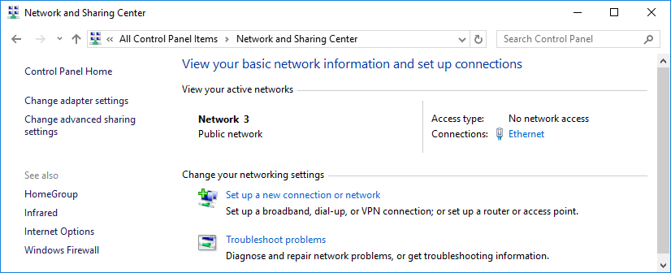
- Cliquez sur **Modifier les paramètres de la carte** dans le volet de gauche. Réduisez la taille de la fenêtre **Connexions réseau** et laissez-la ouverte.
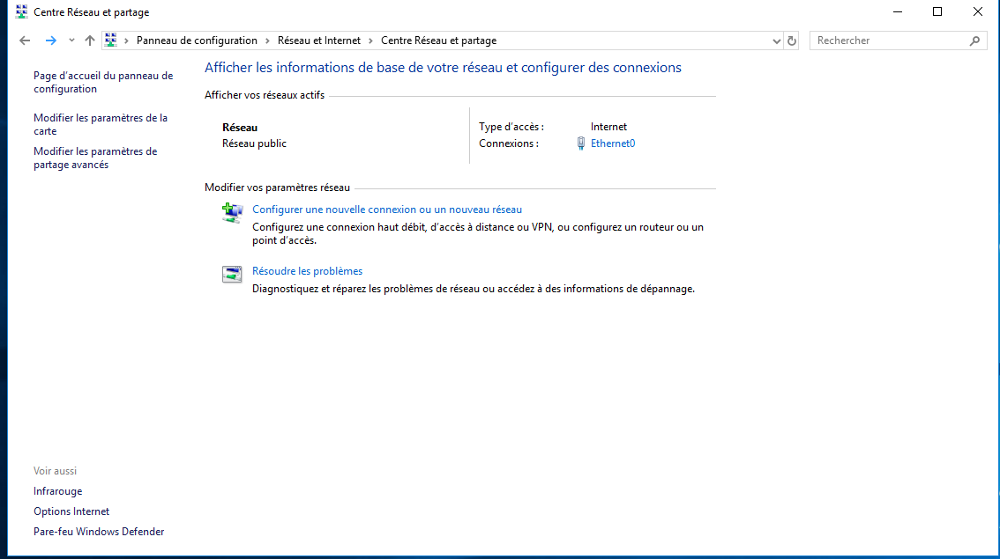

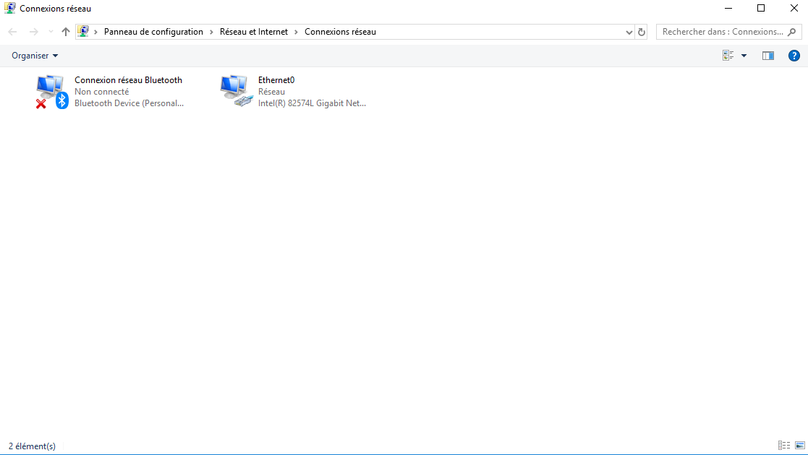
- Accédez aux **Outils d'administration.** (Naviguez au **Panneau de configuration** \> Cliquez sur **Outils d'administration**)

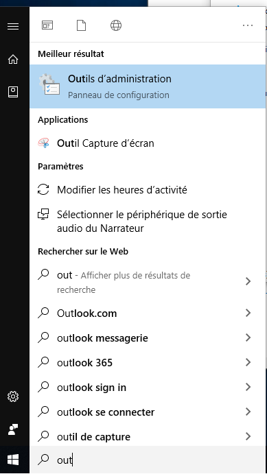

- Dans la fenêtre **Outils d'administration**, double-cliquez sur l'icône **Analyseur de performances**.

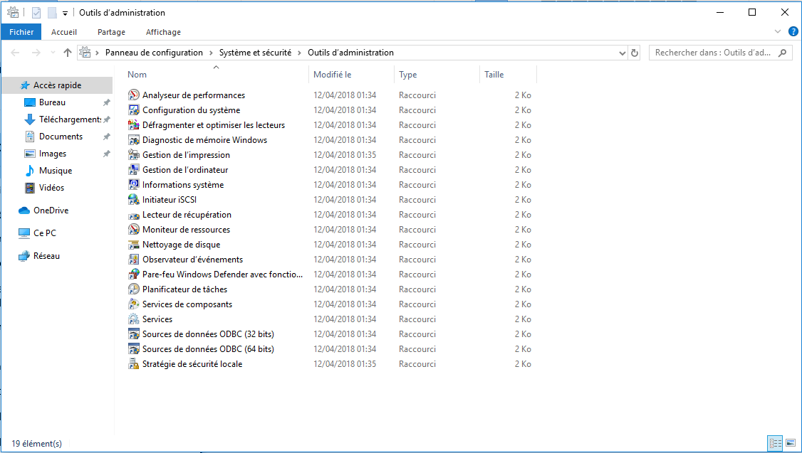

- Dans la fenêtre **Analyseur de performances**, assurez-vous que l' **Analyseur de performances**sous l'en-tête Outil de surveillance dans le volet gauche est mis en surbrillance. Cliquez sur l'icône **Figer l'affichage** (bouton pause) pour arrêter l'enregistrement.

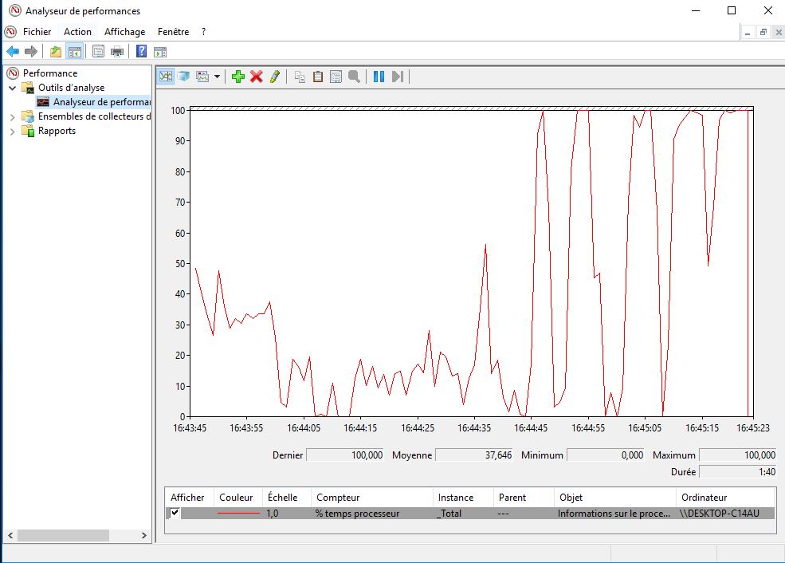

- Cliquez avec le bouton droit et sélectionnez **Effacer** pour effacer le graphique. Laissez cette fenêtre ouverte.
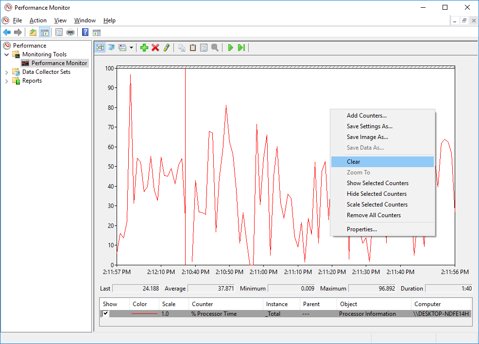
- Accédez à la fenêtre **Outils d'administration** et sélectionnez **Services**.

- Élargissez la fenêtre **Services** de manière à voir correctement le contenu. Faites défiler l'affichage du volet de droite jusqu'à ce que le service **Routage et accès distant soit visible**. Double-cliquez sur **Routage et accès distant**.
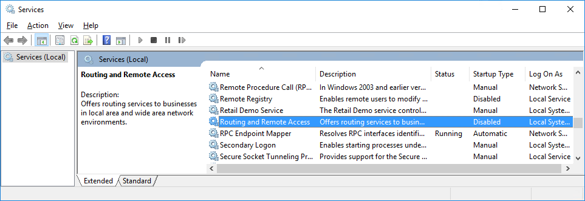
- La fenêtre **Propriétés de routage et accès distant (Ordinateur local)** s'affiche. Dans le champ du menu déroulant **Type de démarrage**, sélectionnez **Manuel**, puis cliquez sur **Appliquer**.

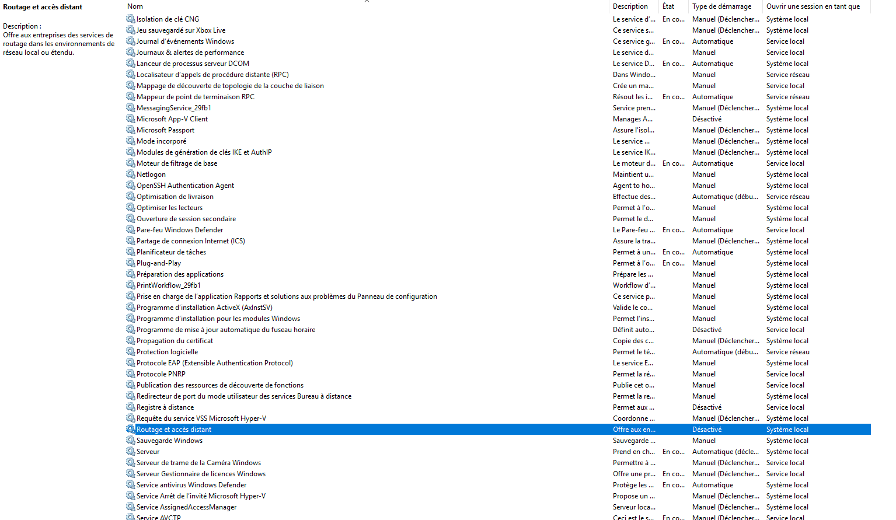

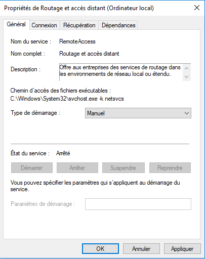

Le bouton Démarrer est désormais activé. Ne cliquez PAS encore sur le bouton Démarrer. Laissez cette fenêtre ouverte.

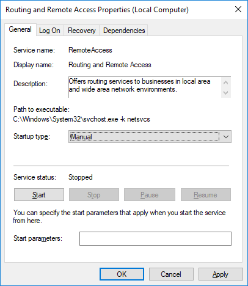
- Accédez à la fenêtre **Analyseur de performances**. Cliquez sur l'icône **Libérer l'affichage** pour démarrer l'enregistrement.

- Cliquez sur la fenêtre **Propriétés de routage et accès distant (Ordinateur local)**. Cliquez sur **Démarrer** pour démarrer le service. Une fenêtre avec une barre de progression s'affiche.

- Les boutons Arrêter et Suspendre sont maintenant actifs dans la fenêtre **Propriétés de routage et accès distant (Ordinateur local)**. Laissez cette fenêtre ouverte.

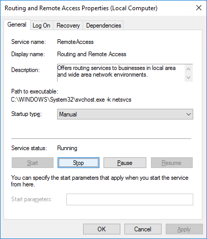
- Accédez à la fenêtre **Connexions réseau**. Appuyez sur la touche de fonction **F5** pour actualiser le contenu.

Qu'est-ce qui change dans la fenêtre après avoir démarré le service **Routage et accès à distance**?

Après avoir démarrer routage et accès à distance un menu connexion entrantes est apparu

- Accédez à la fenêtre **Propriétés de Routage et accès distant (Ordinateur local)** et cliquez sur **Arrêter**. **Remarque**: Si l'option **Arrêter** est grisée, cliquez sur **Appliquer** et modifiez l'état du service.

- Accédez à la fenêtre **Connexions réseau**.

Question:Quels changements voyez-vous dans le volet de droite après avoir arrêté le service Routage et accès distant?

Après avoir arrêter le service routage et accès à distance le menu connexion entrantes à disparu.

- Accédez à la fenêtre **Analyseur de performances** et cliquez sur l'icône **Figer l'affichage** pour arrêter l'enregistrement.

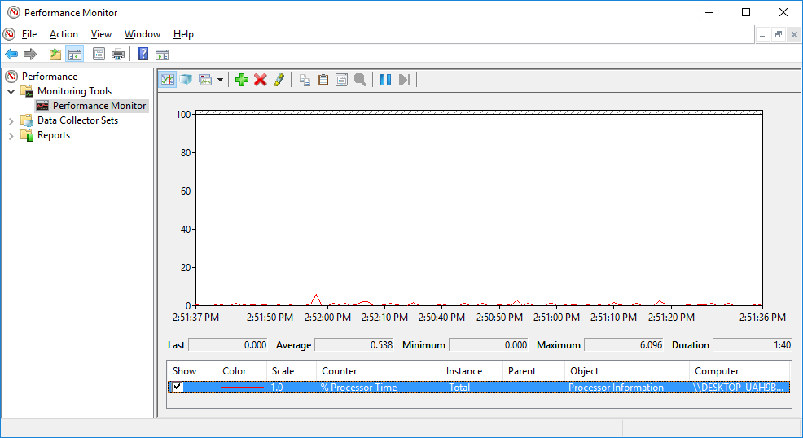

Quel compteur est le plus enregistré sur le graphique? (Astuce: regardez la couleur du graphique et la couleur du compteur).

Ce compteur affiche le termps du processeur en pourcentage et affiche un graphique en rouge

- Cliquez sur le menu déroulant **Modifier le type de graphique**, puis sélectionnez **Rapport**.
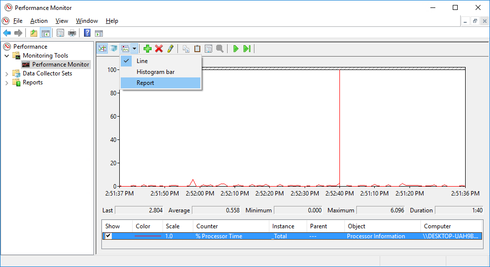
- L'affichage passe en mode Rapport.
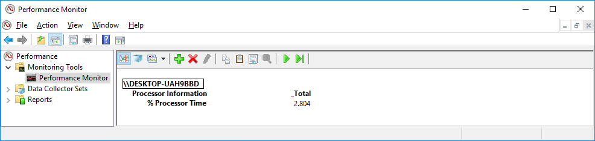

Quelles sont les valeurs affichées dans le compteur?

Selon les données il y a de total de pourcentage de 34,916

- Cliquez sur la fenêtre **Propriétés de routage et accès distant (Ordinateur local)**. Dans le champ Type de démarrage, sélectionnez **Désactivé**, puis cliquez sur **OK**.
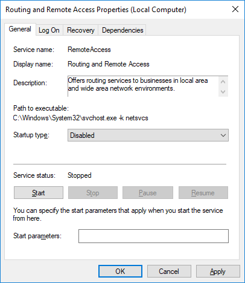
- Cliquez sur la fenêtre **Services**.

Quels sont le Statut et le Type de démarrage du service Routage et accès distant?

Le statut de routage et accès distant est seulement stopper

- Cliquez sur la fenêtre **Analyseur de performances**. Cliquez sur l'icône **Libérer l'affichage** pour démarrer l'enregistrement.

- Fermez toutes les fenêtres que vous avez ouvertes au cours de la partie 1 de ce TP.
- **Travailler dans l'utilitaire de gestion de l'ordinateur**
L'utilitaire de gestion de l'ordinateur est utilisé pour gérer un ordinateur local ou distant. Les outils de cet utilitaire sont regroupés en trois catégories: les outils système, de stockage, et les services et applications.

- Cliquez sur **Panneau de configuration** \> **Outils d'administration**. Sélectionnez **Gestion de l'ordinateur**.

- Dans la fenêtre **Gestion d'ordinateur** , développez les trois catégories en cliquant sur la **flèche** en regard d' **Outils d'administration**.

- Cliquez sur la flèche en regard de l'**Observateur d'événements**, puis cliquez sur la flèche en regard de **Journaux Windows**. Sélectionnez **Système**.
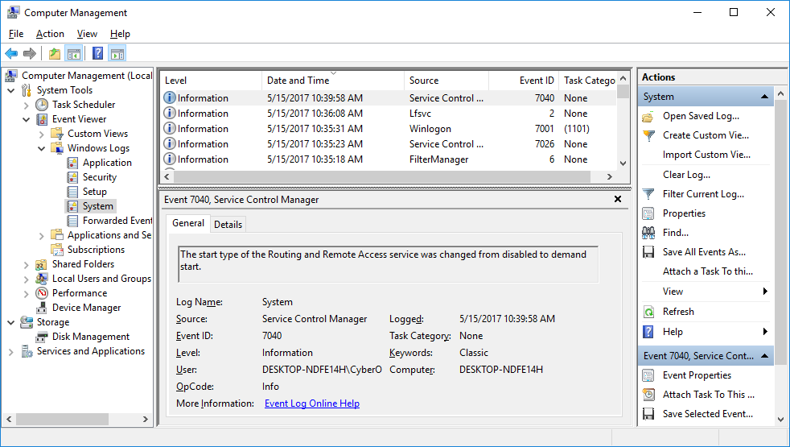
- La fenêtre **Propriétés de l'événement** s'affiche. Cliquez sur la **flèche dirigée vers le bas** pour localiser un événement du service **Routage et accès distant**. Vous devriez trouver quatre événements décrivant l'ordre de démarrage et d'arrêt du service **Routage et accès distant**.
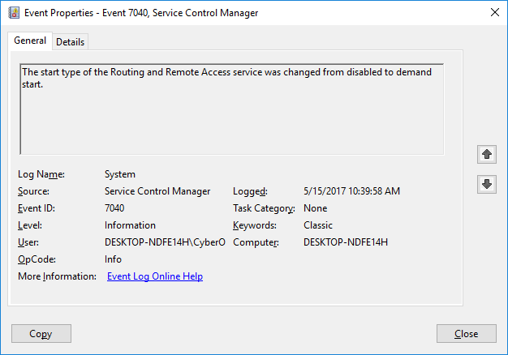

- Fermez toutes les fenêtres ouvertes.

- **Configurez les outils d'administration.**
Pour la suite de ce TP, vous allez configurer les fonctionnalités avancées de l'outil d'administration et en contrôler l'impact sur l'ordinateur.

- Cliquez sur **Panneau de configuration** \> **Outils d'administration** \> **Analyseur de performances**. La fenêtre Analyseur de performances s'affiche. Allez dans **Ensembles de collecteurs de données**. Cliquez avec le bouton droit sur **Définis par l'utilisateur**, puis cliquez sur **Nouveau** \> **Ensemble de collecteurs de données**.
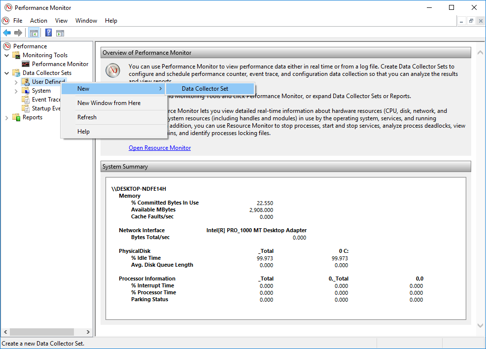
- La fenêtre **Créer un nouvel ensemble de collecteurs de données** s'affiche. Dans le champ Nom, tapez **Journaux de mémoire**. Activez le bouton radio **Créer manuellement (avancé)**, puis cliquez sur **Suivant**.

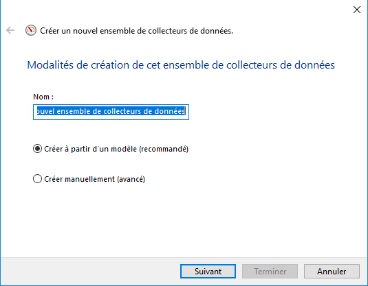

- Dans la fenêtre **Quel type de données inclure?** , sélectionnez **Compteur de performance** puis cliquez sur **Suivant**.

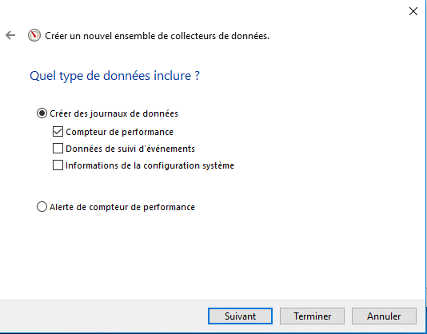

- Dans la fenêtre **Quels compteurs de performance enregistrer dans un journal?** , cliquez sur **Ajouter**.

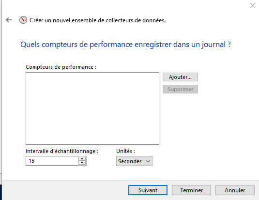

- Dans la liste des compteurs disponibles, recherchez et développez **Mémoire**. Sélectionnez **Mégaoctets disponibles** et cliquez sur **Ajouter\>\>**.
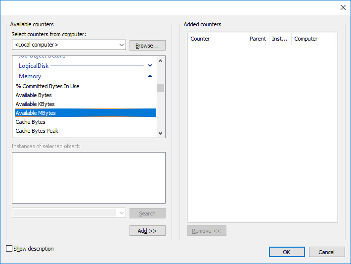
- Le compteur **Mégaoctets disponibles** doit à présent être visible dans le volet. Cliquez sur **OK**.

- Définissez le champ Intervalle d'échantillonnage sur **4** secondes. Cliquez sur **Suivant**.
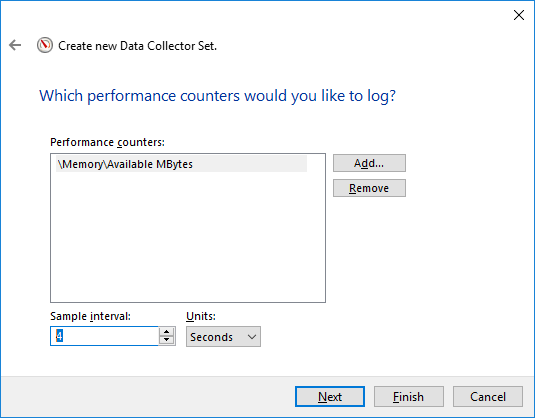
- Dans la fenêtre **Où enregistrer les données?**, cliquez sur **Parcourir**

- Dans la fenêtre **Rechercher un dossier**, sélectionnez votre lecteur **(C:)** qui est **Disque local (C:)**.
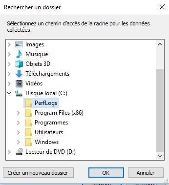
- Sélectionnez **PerfLogs** et cliquez sur **OK**.

- La fenêtre **Où enregistrer les données?** s'affiche, avec les informations relatives au répertoire que vous avez sélectionné à l'étape précédente. Cliquez sur **Next** (Suivant).

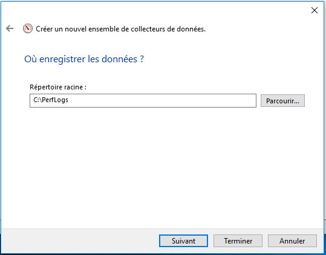

- La fenêtre **Créer l'ensemble de collecteurs de données?** cliquez sur **Fin**.

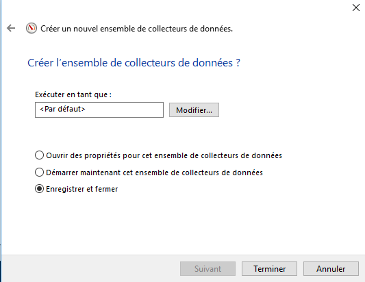

- Développez **Définis par l'utilisateur** et sélectionnez **Journaux de mémoire.** Cliquez avec le bouton droit sur **DataCollector01**, puis sélectionnez **Propriétés**.
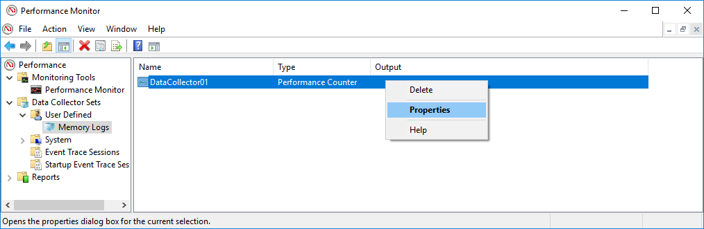
- Cliquez sur **Propriétés de DataCollector01** , définissez le **champ Format:** sur **Séparé par une virgule**.
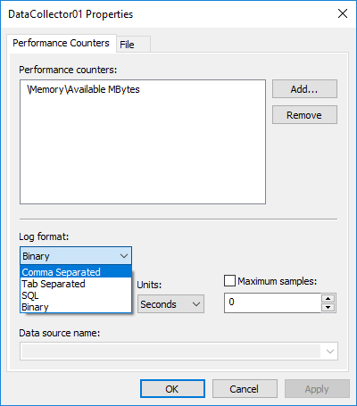
- Cliquez sur l'onglet **Fichier**.

Quel est le nom complet du chemin du fichier exemple?

C:\Perflogs\Admin\Nouvel ensemble de collecteur…\DataCollector01.csv

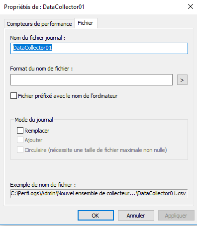
- Cliquez sur **OK**.

- Cliquez sur l'icône **Journaux de mémoire** dans le volet de gauche de l'onglet **Analyseur de performances**. Cliquez sur la **flèche verte** pour démarrer l'ensemble de collecte de données. Notez qu'une flèche verte est placée au-dessus de l'icône **Journaux de mémoire**.
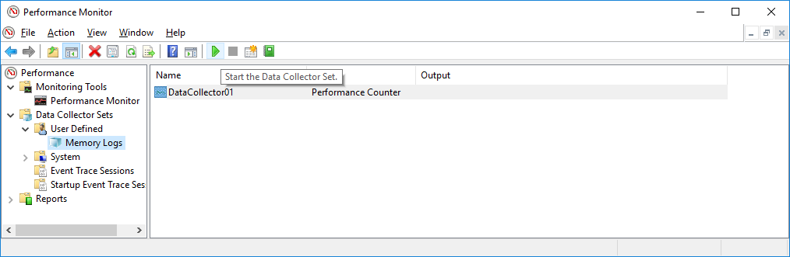
- Pour forcer l'ordinateur à utiliser une partie de la mémoire disponible, ouvrez et fermez un navigateur.

- Cliquez sur le **carré noir** pour démarrer l'ensemble de collecte de données.
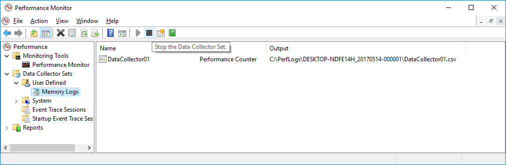

Quel changement remarquez-vous à propos de l'icône Journaux de mémoire?

Aucun changement

- Cliquez sur **Démarrer \> Ordinateur**,puis sur le **lecteur C: \> PerfLogs**. Recherchez le dossier commençant par le nom de votre PC, suivi par un horodatage, **DESKTOP-NDFE14H_20170514-000001** dans cet exemple. Double-cliquez sur le dossier pour l'ouvrir, puis double-cliquez sur le fichier **DataCollector01.csv**. **Si vous y êtes invité, cliquez sur Continuer pour autoriser l'accès au dossier.**
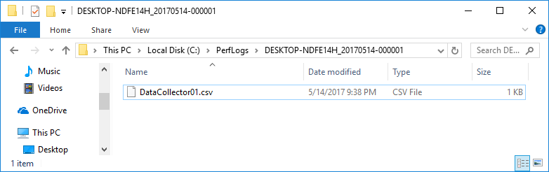

**Remarque**: si le message **Windows ne peut pas ouvrir ce fichier** s'affiche, sélectionnez la case d'option **Sélectionner un programme dans la liste des programmes installés** \> **OK** \> **Bloc-notes** \> **OK**.

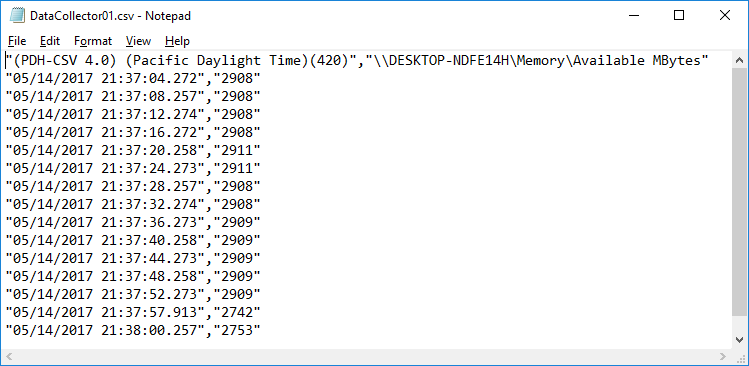

Qu'indique la colonne située le plus à droite?

Le chiffre de consomation de mémoire vive calculer par le datacollector

- Fermez le fichier **DataCollector01.csv**, ainsi que la fenêtre avec le dossier PerfLogs.

- Sélectionnez la fenêtre **Analyseur de performances**. Cliquez avec le bouton droit sur **Journaux de mémoire** \> **Supprimer**.
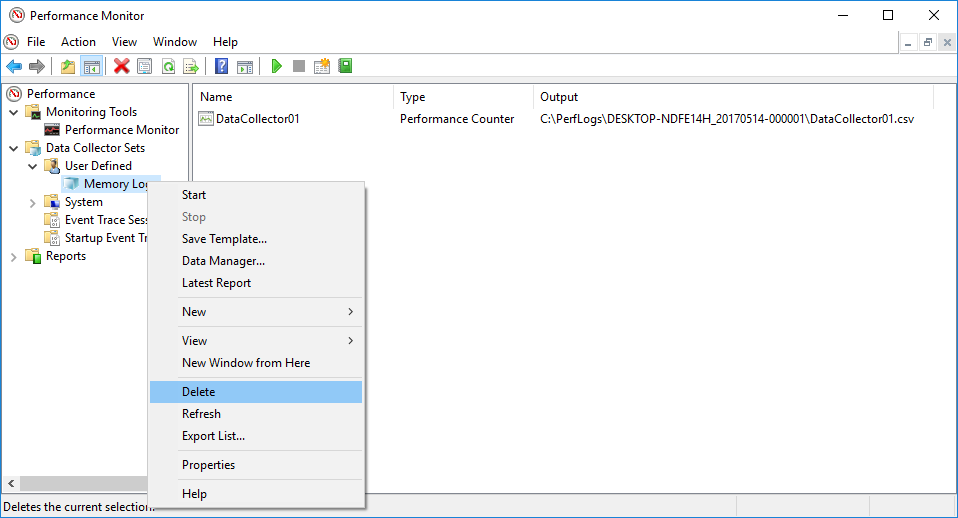
- La fenêtre **Analyseur de performances** \> **Confirmer la suppression** s'affiche. Cliquez sur **Oui**.

- Ouvrez le **lecteur (C:) \> PerfLogs**. Cliquez avec le bouton droit sur le dossier créé pour stocker le fichier journal de mémoire, puis cliquez sur **Supprimer**.

- La fenêtre Supprimer le dossier s'ouvre. Cliquez sur **Oui**.

- Fermez toutes les fenêtres ouvertes.

