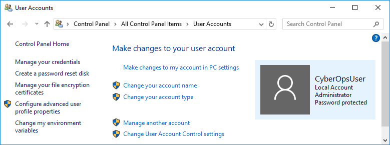
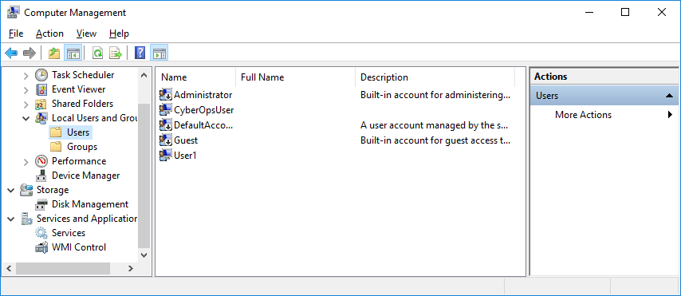
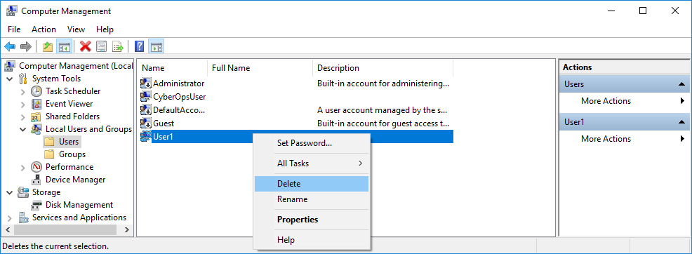

**TP – Créer des comptes d'utilisateur**

**Introduction**

Au cours de ces travaux pratiques, vous allez créer et modifier des comptes d'utilisateur dans Windows.

**Partie1: Créer un nouveau compte d'utilisateur local**

**Partie2: Afficher les propriétés du compte d'utilisateur**

**Partie3: Modifier des comptes d'utilisateur local**
- 
- **Ressources requises**
- Une machine virtuelle Windows
- 
- **Instructions**

- **Créer un nouveau compte d'utilisateur local**
  1.  **Ouvrez l'outil Compte d'utilisateur.**
      1.  Connectez-vous sur l'ordinateur Windows avec un compte administrateur. Le compte **CyberOpsUser** est utilisé dans cet exemple.

- Cliquez sur **Démarrer**\> **Panneau de configuration**. Sélectionnez **Comptes d'utilisateurs** dans la vue Petites icônes. Pour modifier l'affichage, sélectionnez **Petites icônes** dans le menu déroulant Afficher par.

**étape 2: Créez un compte utilisateur.**
- Dans la fenêtre **Comptes d'utilisateurs** , cliquez sur **Gérer un autre compte**.

- Dans la fenêtre **Gérer les comptes**, cliquez sur **Ajouter un nouvel utilisateur dans les paramètres du PC**.

- Dans la fenêtre **Paramètres** , cliquez sur **Ajouter un autre utilisateur sur ce PC**.

- Dans la fenêtre **Comment cette personne se connectera-t-elle?** , cliquez sur **Je ne dispose pas des informations de connexion de cette personne**.

- Lorsque la fenêtre **Créer votre compte** s'ouvre, cliquez sur **Ajouter un utilisateur sans compte Microsoft**.

- Dans la fenêtre **Créer un compte pour ce PC** , renseignez les informations requises pour créer le nouveau compte d'utilisateur nommé **User1**. Cliquez sur **Suivant** pour créer le nouveau compte d'utilisateur.

:

Quel type de compte d'utilisateur venez-vous de créer?

Le compte utilisateur créer est local donc sur la machine

- Essayez de vous connecter au compte d'utilisateur que vous venez de créer. Cette requête devrait aboutir.

- Accédez au dossier **C:\Utilisateurs**. Cliquez avec le bouton droit sur le dossier **User1**, sélectionnez **Propriétés**, puis l'onglet **Sécurité**.

Quels groupes ou utilisateurs ont un contrôle total sur ce dossier?

Le groupe système le compte créer dont User et administrateur de l'ordinateur.

- Ouvrez le dossier qui appartient à CyberOpsUser. Cliquez avec le bouton droit sur le dossier et sélectionnez l'onglet **Propriétés**.

:

Avez-vous pu accéder au dossier? Expliquez votre réponse.

Oui, selon la logique on peut accèder au dossier CyberOpsUser. En revanche l'utilisateur doit demander les droit administrateur pour y accèder, en tapant le mot de passe fournit par l'administrateur

- Déconnectez-vous du compte User1. Ouvrez une nouvelle session en tant que CyberOpsUser.

- Accédez au dossier **C:\Utilisateurs**. Cliquez avec le bouton droit sur le dossier et sélectionnez **Propriétés**. Cliquez sur l'onglet **Sécurité**.

Quels groupes ou utilisateurs ont un contrôle total sur ce dossier?

Dans le dossier utilisateur. Les personne ayant un contrôle total sur le dossier sont : système et Administrateur.  

  

  

- **Afficher les propriétés du compte d'utilisateur**
  1.  Cliquez sur **Démarrer**\> recherchez **Panneau de configuration**\> sélectionnez **Outils d'administration**\> sélectionnez **Gestion de l'ordinateur**.

- Sélectionnez **Utilisateurs et groupes locaux**. Cliquez sur le dossier **Utilisateurs**.

- Cliquez avec le bouton droit sur **User1** et sélectionnez **Propriétés**.

- Cliquez sur l'onglet **Membre de**.

De quel groupe User1 est-il membre?

Par défaut, User1 est membre dans le groupe utilisateur. Ce qui signifie que cet utilisateur n'a pas les même droit qu'un compte administrateur. Il faut qu'il demande la permission pour certaine tâche.

- Cliquez avec le bouton droit sur le compte **CyberOpsUser**, puis sélectionnez **Propriétés**.

:

De quel groupe cet utilisateur est-il membre?

Le compte CyberOpsUser est membre dans la logique en tant qu'adminitrateur. Ce qui signifie qu'il a un accès total du système et gère toutes les tâches.  

  

- **Modifier des comptes d'utilisateur local**
  1.  **Modifiez le type de compte.**
      1.  Accédez au **Panneau de configuration** et sélectionnez **Comptes d'utilisateurs**. Cliquez sur **Gérer un autre compte**. Sélectionnez **User1**.

- Dans la fenêtre Modifier un compte, cliquez sur le compte **User1**. Cliquez sur **Modifier le type de compte**.

- Cochez la case **Administrateur**. Cliquez sur **Modifier le type de compte**.

- Le compte User1 dispose désormais de droits d'administration.

- Accédez à **Panneau de configuration**\> **Outils d'administration**\> **Gestion de l'ordinateur**. Cliquez sur **Utilisateurs et groupes locaux**\> **Utilisateurs**.

- Cliquez avec le bouton droit sur **User1** et sélectionnez **Propriétés**. Cliquez sur l'onglet **Membre de**.

À quels groupes User1 appartient-il?

Après avoir attribuer les droits administrateurs de User. Maintenant, il fait partit de deux groupes : Administrateur et utilisateur.

- Sélectionnez **Administrateurs**, puis cliquez sur **Supprimer** pour retirer User1 du groupe d'administrateurs. Cliquez sur **OK** pour continuer.  

  
- **Supprimez le compte.**
  1.  Pour supprimer le compte, cliquez avec le bouton droit sur **User1** et sélectionnez **Supprimer**.

- Cliquez sur **OK** pour confirmer la suppression.

:

Quelle autre méthode permet de supprimer un compte d'utilisateur?

Pour suprimer un compte au lieu de passer par le panneau de configuration, on peut aller dans les paramètres pour suprimmer un compte.

- Cliquez sur démarrer (icône Windows)

- Cliquez sur l'engrenage en bas à gauche

- Dans paramètre cliquer sur comptes

- Dans autres utilisateur selectionnez le compte que vous voulez suprimer puis cliquez sur suprimer.

- **Questions de réflexion**

- Pourquoi est-ce important de protéger tous les comptes à l'aide de mots de passe forts?

Il est important d'utiliser un mot de passe fort, pour protéger les compte. Afin d'éviter toute tentative d'intrusion et vole de donné. Un bon mot de passe fort garantit la sécurité et la protection des données de manière sûr.

- Pourquoi créer un utilisateur avec des droits standard?
En tant que gestion du systèmes d'exploitation il est essentiel de créer un utilisateur en droits standard pour une meilleur stabilité du système et une gestion plus souple. De plus, le fait d'attribuer les droits utilisateur standard permet de garantir une bonne sécurité et évite : des supression de données, des fuites de données ou encore l'installation de logiciel malveillant.

