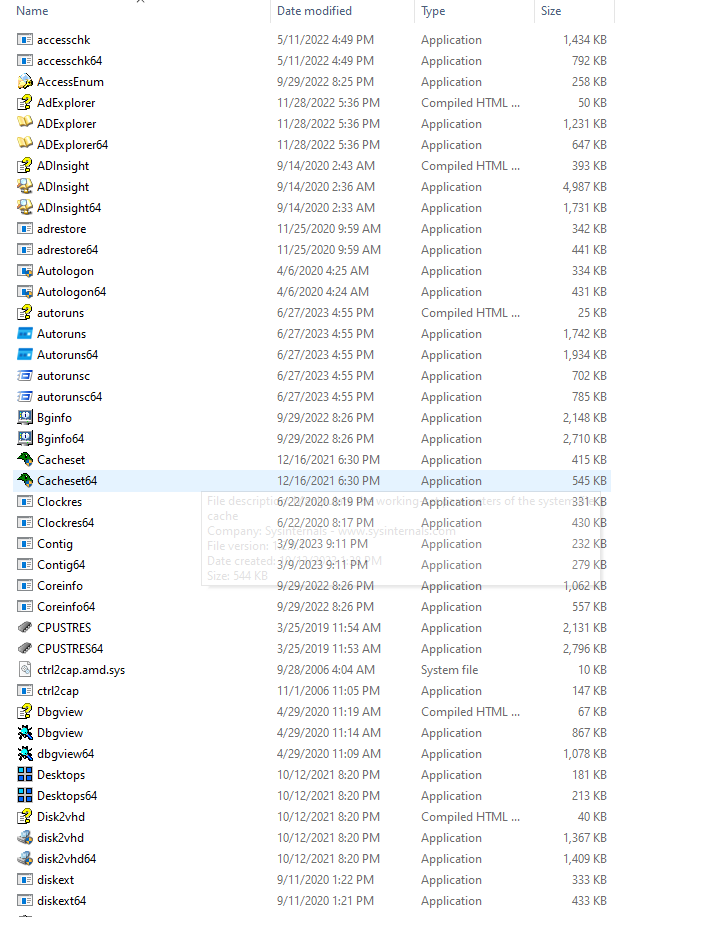
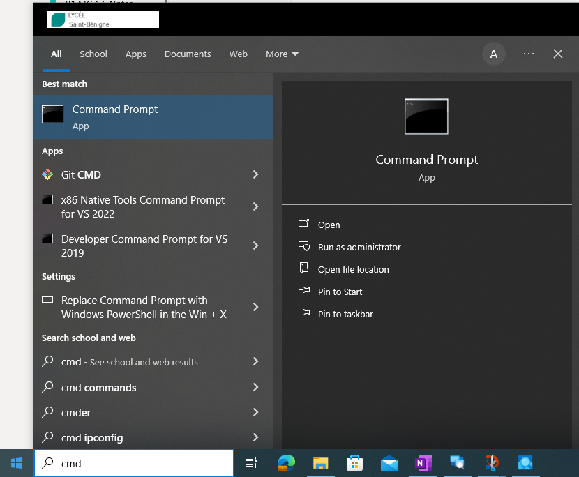
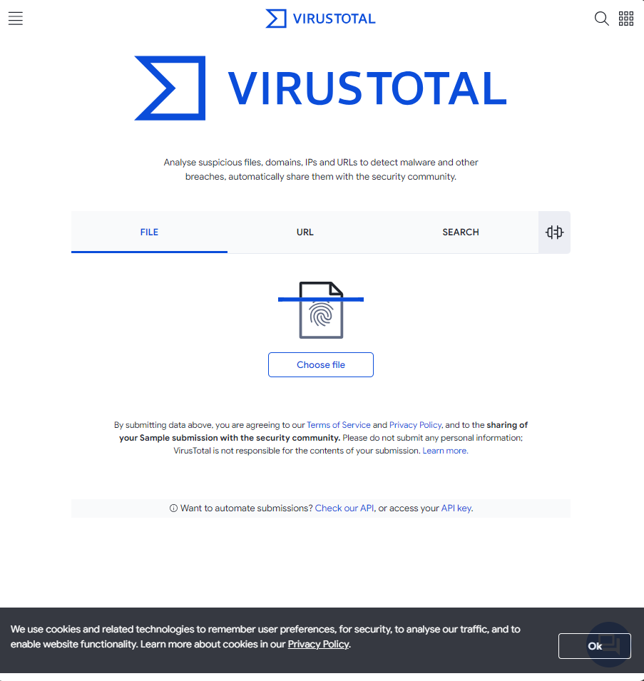

**TP – Découvrir les processus, les threads, les handles et le Registre Windows**

- **Objectifs**
Au cours de ces travaux pratiques, vous allez découvrir les processus, les threads et les handles à l'aide de Process Explorer dans SysInternals Suite. Vous allez également utiliser le Registre Windows pour modifier un paramètre.

**Partie1: découvrir les processus**

**Partie 2: découvrir les threads et les handles**

**Partie3: découvrir le Registre Windows**
- 
- **Ressources requises**
- 1 machine virtuelle Windows avec accès Internet
- 
- **Instructions**

- **Découvrir les processus**
Dans cette partie, vous allez découvrir les processus. Les processus sont des programmes ou des applications en cours d'exécution. Vous allez explorer les processus à l'aide de Process Explorer dans Windows SysInternals Suite. Vous allez également démarrer et observer un nouveau processus.

- **Télécharger Windows SysInternals Suite.**
  1.  Cliquez sur le lien suivant pour télécharger Windows SysInternals Suite:
<https://technet.microsoft.com/en-us/sysinternals/bb842062.aspx>

- Une fois le téléchargement terminé, extrayez les fichiers du dossier.

- Laissez le navigateur web ouvert pour les étapes suivantes.

- **Découvrir un processus actif.**
  1.  Accédez au dossier SysinternalsSuite contenant tous les fichiers extraits.

- Ouvrez **procexp.exe**. À l'invite, acceptez le contrat de licence d'utilisation Process Explorer.

- Process Explorer affiche une liste des processus actifs.

- Pour localiser le processus de navigateur web, faites glisser l'icône de **Find Window's Process** dans la fenêtre du navigateur ouverte. Microsoft Excel a été utilisé dans cet exemple.

- Le processus de Microsoft Edge peut être arrêté dans Process Explorer. Cliquez avec le bouton droit de la souris sur le processus sélectionné, puis sélectionnez **Kill Process**. Cliquez sur **OK** pour continuer.

Cliquez sur oui

:

Qu'est-il arrivé à la fenêtre du navigateur web lorsque le processus a été arrêté?

La feunêtre du naviguateur c'est fermer automatique après avoir tué le processus edge soit interompre le fonctionnement de edge (kill process en anglais)

- **Démarrer un autre processus.**
  1.  Ouvrez une invite de commande. (**Start** \> recherchez **Command Prompt**\> sélectionnez **Command Prompt**)

- Faites glisser l'icône de **Find Window's Process** dans la fenêtre d'invite de commande et localisez le processus de ligne de commande en surbrillance dans Process Explorer.

- Le processus de l'invite de commande est cmd.exe. Son processus parent est le processus explorer.exe. Le processus cmd.exe a un processus enfant conhost.exe.

- Accédez à la fenêtre de l'invite de commande. Lancez un ping à l'invite de commande et observez les modifications sous le processus cmd.exe.

Par exemple 8.8.8.8

L'executable Ping.exe apparaît en vert ce qui signifie qu'il est en court d'execution

Une fois que la commande ping à été éxécuter le logiciel ping.exe devient rouge ce qui signifie que le processus est en mode arrêt

Qu'est-il arrivé au cours du processus de ping?

Au bout de certain temps après l'arrêt de la commande ping le processus ping.exe disparaît automatiquement après être passé au rouge.

- En examinant la liste des processus actifs, vous constatez que le processus enfant conhost.exe semble suspect.
Pour rechercher un contenu malveillant, cliquez avec le bouton droit de la souris sur **conhost.exe** et sélectionnez **Check VirusTotal**.

Lorsque vous y êtes invité, cliquez sur **Yes** pour accepter les conditions d'utilisation de VirusTotal. Puis cliquez sur **OK** pour l'invite suivante.

- Développez la fenêtre de Process Explorer ou faites-la défiler vers la droite jusqu'à ce que vous voyiez la colonne de VirusTotal.

- Cliquez sur le lien sous la colonne de VirusTotal. Le navigateur web par défaut s'ouvre avec les résultats concernant le contenu malveillant de conhost.exe.

- Cliquez avec le bouton droit de la souris sur le processus cmd.exe et sélectionnez **Kill Process**.

:

Qu'est-il arrivé au processus enfant conhost.exe?  

Quand le processus cmd.exe à été intérompue le processus enfant conhost.exe les aussi également car s'est deux processus sont liés  

- **Découvrir les threads et les handles**
Dans cette partie, vous allez explorer les threads et les handles. Les processus sont composés d'au moins un thread. Un thread est une unité d'exécution dans un processus. Un handle est une référence abstraite aux blocs de mémoire ou aux objets gérés par un système d'exploitation. Vous allez utiliser Process Explorer (procexp.exe) dans Windows SysInternals Suite pour découvrir les threads et les handles.

- **Découvrir les threads.**
  1.  Ouvrez une invite de commande.

- Dans la fenêtre de Process Explorer, cliquez avec le bouton de la souris sur conhost.exe et sélectionnez **Properties…**. Cliquez sur l'onglet **Threads** pour afficher les threads actifs pour le processus conhost.exe. Cliquez sur **OK** pour continuer si vous y êtes invité par une boîte de dialogue d'avertissement.

- Examinez les détails du thread.

:

Quel type d'information contient la fenêtre Properties?

- Cliquez sur **OK** pour continuer.

- **Découvrir les handles.**
  1.  Dans Process Explorer, cliquez sur **View** \> select **Lower Pane View** \> **Handles** pour afficher les handles associés au processus conhost.exe.

:

Examinez les handles. Vers quoi pointent les handles?

- Fermez l'Explorateur de processus une fois terminé.

- **Découvrir le Registre Windows**
Le Registre Windows est une base de données hiérarchique qui stocke la plupart des systèmes d'exploitation et les paramètres de configuration des environnements de poste de travail.

- Pour accéder au Registre Windows, cliquez sur **Start** \> cherchez **regedit** et sélectionnez **Registry Editor**. Cliquez sur **Yes** pour permettre à cette application d'effectuer des modifications.

L'éditeur du registre est composé de cinq ruches. Ces ruches sont au niveau supérieur du registre.

- HKEY_CLASSES_ROOT est en réalité la sous-clé Classes de HKEY_LOCAL_MACHINE\Software\\ Elle stocke les informations utilisées par les applications enregistrées comme l'association d'extensions de fichier, ainsi qu'un identificateur programmatique (ProgID), l'ID de classe (CLSID) et les données d'ID d'interface (IID).

- HKEY_CURRENT_USER contient les paramètres et les configurations pour les utilisateurs qui sont actuellement connectés.

- HKEY_LOCAL_MACHINE stocke les informations de configuration spécifiques à l'ordinateur local.

- HKEY_USERS contient les paramètres et les configurations pour tous les utilisateurs sur l'ordinateur local. HKEY_CURRENT_USER est une sous-clé de HKEY_USERS.

- HKEY_CURRENT_CONFIG stocke les informations de matériel qui sont utilisées au démarrage par l'ordinateur local.

- Au cours d'une étape précédente, vous avez accepté le CLUF pour Process Explorer. Accédez à la clé de registre EulaAccepted pour Process Explorer.

Cliquez pour sélectionner Process Explorer dans **HKEY_CURRENT_USER** \> **Software** \> **Sysinternals** \> **Process Explorer**. Faites défiler la liste pour rechercher la clé **EulaAccepted**. Actuellement, la valeur de la clé de registre EulaAccepted est 0x00000001(1).

- Double-cliquez sur la clé de registre **EulaAccepted**. Actuellement, les données de la valeur sont définies sur1. La valeur1 indique que le CLUF a été accepté par l'utilisateur.

- Remplacez **1** par **0** pour les données de la valeur (Value data). La valeur 0 indique que le CLUF n'a pas été accepté. Cliquez sur **OK** pour continuer.

Quelle est la valeur de cette clé de registre dans la colonne Data?

La velaur du processus EulaAccepted est :

0x00000000 (0)

- Ouvrez **Process Explorer**. Accédez au dossier où vous avez téléchargé SysInternals. Ouvrez le dossier **SysInternalsSuite** \> Ouvrez **procexp.exe**.

:

Lorsque vous ouvrez Process Explorer, que voyez-vous?

On peut apercevoir diverse processus en court d'éxécution tel que com.docker.com msedge.exe explorer.exe cmd.exe conhost.exe

