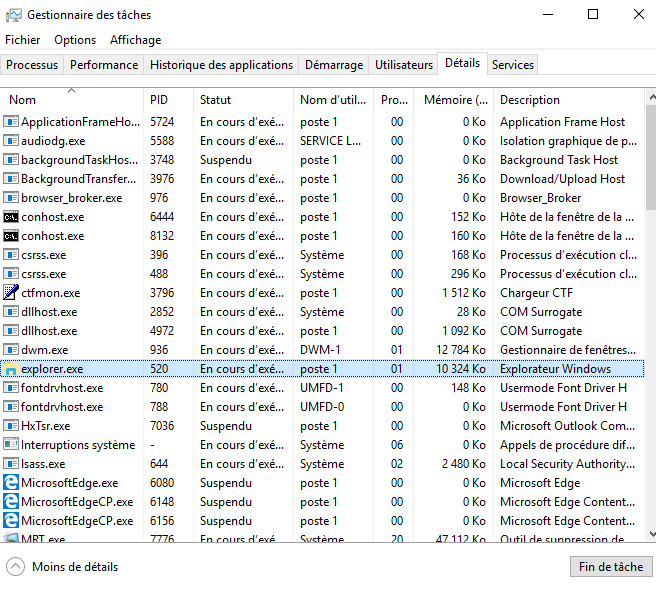

TP – Utiliser WindowsPowerShell

**Objectifs**

L'objectif de ces travaux pratiques est de découvrir certaines des fonctions de PowerShell.

**Partie 1: Accéder à la console PowerShell.**

**Partie 2: Explorer les commandes PowerShell et Invite de commande.**

**Partie 3: Explorer les applets de commande.**

**Partie 4: Explorer la commande netstat à l'aide de PowerShell.**

**Partie 5: Vider la corbeille à l'aide de PowerShell.**
- 
- **Contexte/scénario**
PowerShell est un puissant outil d'automatisation. Il s'agit à la fois d'une console de commande et d'un langage de script. Au cours de ces travaux pratiques, vous utiliserez la console pour exécuter certaines des commandes disponibles dans l'invite de commande et dans PowerShell. PowerShell dispose également de fonctions de création de scripts pour automatiser les tâches et qui s'intègrent au système d'exploitation Windows.
- 
- **Ressources requises**
- 1 machine virtuelle Windows avec PowerShell installé et un accès Internet
- 
- **Instructions**

- **Accédez à la console PowerShell.**
  1.  Cliquez sur **Démarrer**. Recherchez et sélectionnez **powershell**.

- Cliquez sur **Démarrer**. Recherchez et sélectionnez **invite de commande**.  

  

- **Explorez les commandes PowerShell et Invite de commande.**
  1.  À l'invite, saisissez **dir** dans les deux fenêtres.

Quels sont les résultats de la commande **dir**?

Sur CMD la commande dir affiche tous les dossier le nombre d'octet libres et fichier

Alors que sur powershell cela affiche que les dossier

- Essayez une commande autre que celle utilisée dans l'invite de commande, telle que **ping**, **cd** et **ipconfig**.

Quels sont les résultats?

Les resultats sont identiques en tant que cmd et powershell :

Il affiche les résultats du ping

- **Explorez les applets de commande.**
  1.  Les commandes PowerShell, ou applets de commande, se présentent sous forme de chaîne *verbe-nom*. Pour identifier la commande PowerShell permettant de répertorier les sous-répertoires et les fichiers d'un répertoire, saisissez **Get-Alias dir** à l'invite PowerShell.
PS C:\Users\CyberOpsUser\> **Get-Alias dir**

CommandTypeNameVersionSource

----------------------------

Aliasdir -\> Get-ChildItem

Quelle est la commande PowerShell pour **dir**?

Get-ChildItem

- Pour plus d'informations sur les applets de commande, effectuez une recherche sur Internet pour **Microsoft powershell cmdlets**.

Source certifié

<https://learn.microsoft.com/fr-fr/powershell/scripting/powershell-commands?view=powershell-7.3>

- Lorsque vous avez terminé, fermez la fenêtre d'invite de commande.  

  
- **Explorez la commande netstat à l'aide de PowerShell.**
  1.  À l'invite de commande PowerShell, saisissez **netstat -h** pour afficher les options disponibles pour la commande **netstat**.
PS C:\Users\CyberOpsUser\> **netstat -h**

Affiche les statistiques de protocole et les connexions réseau TCP/IP actives.

NETSTAT \[-a\] \[-b\] \[-e\] \[-f\] \[-n\] \[-o\] \[-p proto\] \[-r\] \[-s\] \[-x\] \[-t\] \[interval\]

-a Displays all connections and listening ports.

-b Affiche l'exécutable impliqué dans la création de chaque connexion ou port d'écoute. Dans certains cas, les exécutables connus hébergent plusieurs composants indépendants et, dans ce cas, la séquence des composants impliqués dans la création de la connexion ou du port d'écoute est affichée. Dans ce cas, le nom de l'exécutable est entre \[\] en bas. Au-dessus se trouve le composant qu'il a appelé, et ainsi de suite jusqu'à ce que la communication TCP/IP ait été établie. Notez que cette option peut être chronophage et échouera si vous n'avez pas toutes les autorisations nécessaires.

\<some output omitted\>

Version écran ps

- Pour afficher la table de routage avec les routes actives, saisissez **netstat -r** à l'invite.
PS C:\Users\CyberOpsUser\> **netstat -r**

===========================================================================

Liste d'interfaces

3…08 00 27 a0 c3 53 ......Intel(R) PRO/1000 MT Desktop Adapter

10…08 00 27 26 c1 78 ......Intel(R) PRO/1000 MT Desktop Adapter \#2

1...........................Software Loopback Interface 1

===========================================================================

Table de routageIPv4

===========================================================================

Routes actives:

Destination réseau Masque réseau Passerelle Interface Métrique

0.0.0.0 0.0.0.0 192.168.1.1 192.168.1.5 25

127.0.0.0 255.0.0.0 On-link 127.0.0.1 331

127.0.0.1 255.255.255.255 On-link 127.0.0.1 331

127.255.255.255 255.255.255.255 On-link 127.0.0.1 331

169.254.0.0 255.255.0.0 On-link 169.254.181.151 281

169.254.181.151 255.255.255.255 On-link 169.254.181.151 281

169.254.255.255 255.255.255.255 On-link 169.254.181.151 281

192.168.1.0 255.255.255.0 On-link 192.168.1.5 281

192.168.1.5 255.255.255.255 On-link 192.168.1.5 281

192.168.1.255 255.255.255.255 On-link 192.168.1.5 281

224.0.0.0 240.0.0.0 On-link 127.0.0.1 331

224.0.0.0 240.0.0.0 On-link 192.168.1.5 281

224.0.0.0 240.0.0.0 On-link 169.254.181.151 281

255.255.255.255 255.255.255.255 On-link 127.0.0.1 331

255.255.255.255 255.255.255.255 On-link 192.168.1.5 281

255.255.255.255 255.255.255.255 On-link 169.254.181.151 281

===========================================================================

Routes persistantes:

Néant

Table de routageIPv6

===========================================================================

Routes actives:

If Metric Network Destination Gateway

1 331 ::1/128 On-link

3 281 fe80::/64 On-link

10 281 fe80::/64 On-link

10 281 fe80::408b:14a4:7b64:b597/128

On-link

3 281 fe80::dd67:9e98:9ce0:51e/128

On-link

1 331 ff00::/8 On-link

3 281 ff00::/8 On-link

10 281 ff00::/8 On-link

===========================================================================

Routes persistantes:

Néant

Qu'est-ce que la passerelle IPv4?

La passerelle Ipv4 permet de communiquer sur d'autre réseau n'ayant pas le même masque

- Ouvrez et exécutez une deuxième commande PowerShell avec des privilèges élevés. Cliquez sur **Démarrer**. Lancez une recherche sur PowerShell, cliquez avec le bouton droit sur **Windows PowerShell** et sélectionnez **Exécuter en tant qu'administrateur**. Cliquez sur **Yes** pour autoriser cette application à effectuer des modifications sur votre appareil.

- La commande netstat peut également afficher les processus associés aux connexions TCP actives. À l'invite, saisissez la commande **netstat -abno**.
PS C:\Windows\system32\> **netstat -abno**

Connexions actives

Protocole Adresse locale Adresse distante État PID

==TCP 0.0.0.0:135 0.0.0.0:0 LISTENING 756==

==RpcSs==

==\[svchost.exe\]==

TCP 0.0.0.0:445 0.0.0.0:0 LISTENING 4

Impossible d'obtenir les informations de propriété

TCP 0.0.0.0:49664 0.0.0.0:0 LISTENING 444

Impossible d'obtenir les informations de propriété

TCP 0.0.0.0:49665 0.0.0.0:0 LISTENING 440

Programmer

\[svchost.exe\]

TCP 0.0.0.0:49666 0.0.0.0:0 LISTENING 304

EventLog

\[svchost.exe\]

TCP 0.0.0.0:49667 0.0.0.0:0 LISTENING 1856

\[spoolsv.exe\]

TCP 0.0.0.0:49668 0.0.0.0:0 LISTENING 544

\<some output omitted\>

Aperçu écran :

- Ouvrez le gestionnaire des tâches. Accédez à l'onglet **Détails**. Cliquez sur l'en-tête **PID** pour afficher les PID dans l'ordre.

- Sélectionnez l'un des PID dans les résultats de la commande netstat -abno. Le PID756 est utilisé dans cet exemple.

- Recherchez le PID sélectionné dans le gestionnaire des tâches. Cliquez avec le bouton droit sur le PID sélectionné dans le gestionnaire des tâches pour ouvrir la boîte de dialogue **Propriétés** et obtenir des informations complémentaires.

Quelles informations pouvez-vous obtenir à partir de l'onglet Détails et de la boîte de dialogue Propriétés pour le PID que vous avez sélectionné?  

Le PID affiche l'application qui est en cours d'execution dans l'exemple PID 520 que j'ai choisi est l'application explorer windows

- **Videz la corbeille à l'aide de PowerShell.**
Les commandes PowerShell simplifient la gestion des réseaux informatiques de grande envergure. Par exemple, si vous souhaitez mettre en place une nouvelle solution de sécurité sur tous les serveurs du réseau, vous pouvez utiliser un script ou une commande PowerShell pour mettre en œuvre la solution et vérifier que les services s'exécutent correctement. Vous pouvez également exécuter des commandes PowerShell pour simplifier des opérations qui auraient nécessité de nombreuses étapes avec les outils de bureau graphiques Windows.

- Ouvrez la corbeille. Vérifiez qu'elle contient des éléments pouvant être définitivement supprimés de votre PC. Si ce n'est pas le cas, restaurez ces fichiers.

- S'il n'y a aucun fichier dans la corbeille, créez-en quelques-uns, tels que des fichiers texte à l'aide du bloc-notes, et placez-les dans la corbeille.

- Dans une console PowerShell, saisissez **clear-recyclebin** à l'invite.
PS C:\Users\CyberOpsUser\> **clear-recyclebin**

Confirmer

Êtes-vous sûr de vouloir effectuer cette opération?

Exécution de l'opération «Clear-RecycleBin» sur la cible «All of the contents of the Recycle Bin» (Tout le contenu de la corbeille).

\[Y\] Yes \[A\] Yes to All \[N\] No \[L\] No to All \[S\] Suspend \[?\] Aide (la réponse par défaut est «Y»): y

Version pc

Qu'est-il arrivé aux fichiers dans la corbeille?

Lors de l'utilisation de la commande clear-recyclebin les fichiers qui sont dans la corbeille ont été suprimez définitivement de l'ordinateur ce qui signifie qu'il ne sont plus accessible via l'utilisateur.

- **Question de réflexion**

PowerShell a été conçu pour faciliter l'automatisation des tâches et la gestion de la configuration. Recherchez sur Internet les commandes que vous pourriez utiliser pour simplifier vos tâches en tant qu'analyste en sécurité. Notez vos résultats.

- Get-Process : liste tous les processus en cours d'execution

- Get-Service : Listez les services en cours d'éxecution

- Get-Eventlog : accès aux journaux Windows et recherche des événements de sécurité

- Get-NetStat : Informations sur les connexions réseau actives sur la machine

- Test-NetConnection : Teste de connexions hôtes distant

- Get-ACL : Affiche les contrôle d'accès listez pour vérifier les autorisation de fichier et dossier

- Get-ADUser : Accès et gestion d'utilisateur de l'active directory

- Get-ADGroup : Accès et gestion des groupe de l'active directory

- Invoke-WebRequest : Envoie des requête HTTP et analyse de réoponses

- Test-Path : Vérifier un fichier ou dossier existant

- Set-ExecutionPolicy : Gestion de politique d'éxecution de script powershell

- Get-ChildItem : Parcourir les fichiers et dossiers dans un répertoire

- Start-Transcript : Enregistrer l'exécution de commandes Powershell

- Get-MpThreatDetection : Accès aux informations sur les menaces

- Get-WmiObject : Interroger les informations sur windows + collecte de données système

- Get-ProcessMemory : Affiche la consomation de mémoire des processus.

- ConvertTo-SecureString : Sécuriser des informations sensible

- Export-CSV et Import-CSV : importe ou exporte des donnés en CSV (données structuré sous forme de tableau(valeurs séparées par une virgule)) pour des analyse

