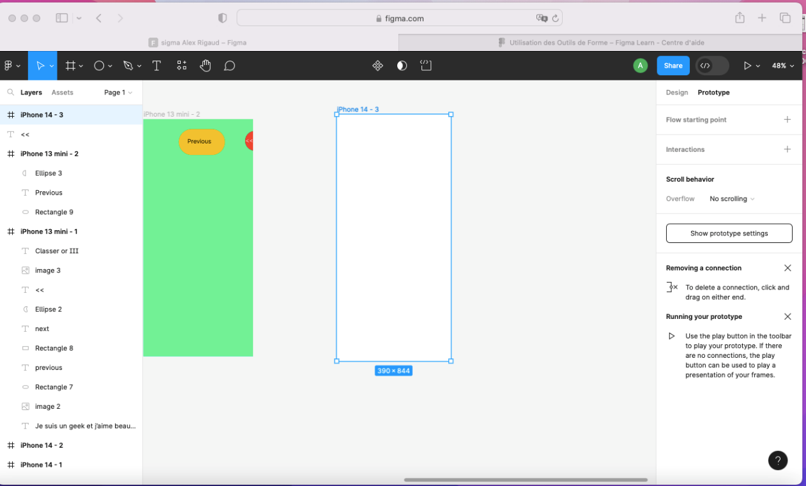
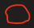
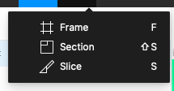
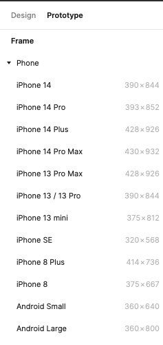
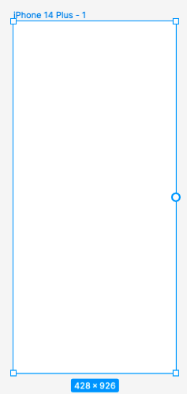
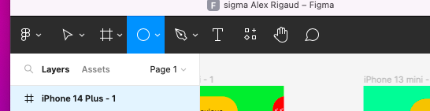
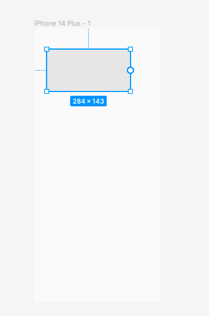
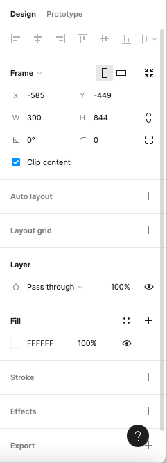
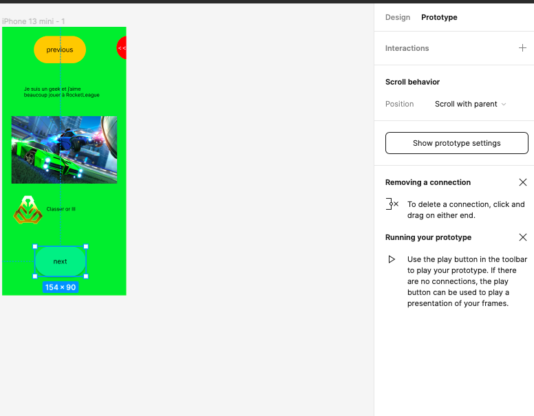

Créer un plan pour ajouter du contenue sur figma

Allez sur le site figma.com

Connectez-vous avec votre compte figma, une fois arriver sur votre compte figma faire un clic comme ci-dessous pour ajouter une premier page

Figma est un outil permettant de créer votre port-folio ou créer son propre blog

Cliquer sur "Frame"

On peut choisir différent format

Ce qui devrait donner une feuille comme ceci

On peut ajouter une forme

Ajouter une forme sur la feuille créer par exemple une forme rectangulaire

On peut changer la couleur de la page, ça bordure, l'effet …)

Créer un bouton pour changer de page cela peut être une forme ou texte allez dans
Prototype un petit + devrait s'ajouter.

