Connexion à Teams

Ouvrer teams sur votre pc en cliquant sur démarré sur Windows ou sur mac recherchez l'application teams qui est ce logo

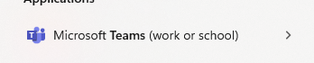

Pour mac allez sur launchpad et recherchez l'application teams

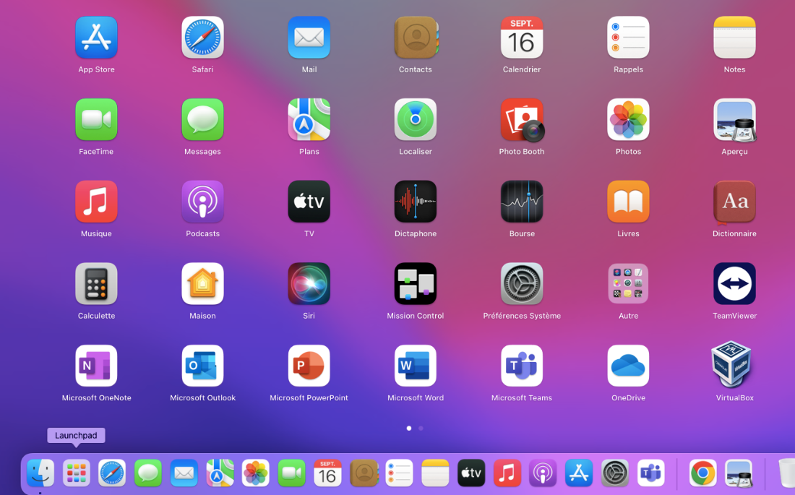

Connecter vous avez un compte Microsoft ou un compte professionnel ou étudiant pour utiliser teams

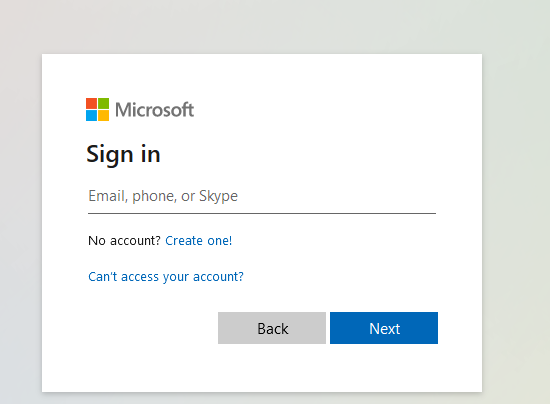

Une fois que cela est fait entrer votre mot de passe

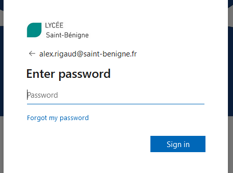

Une fois cela vous pouvez commencer a utiliser teams

Présentation de l'environnement teams

Quand vous êtes connecter plusieurs menu s'affiche sur l'interface Teams notamment les équipe en principal

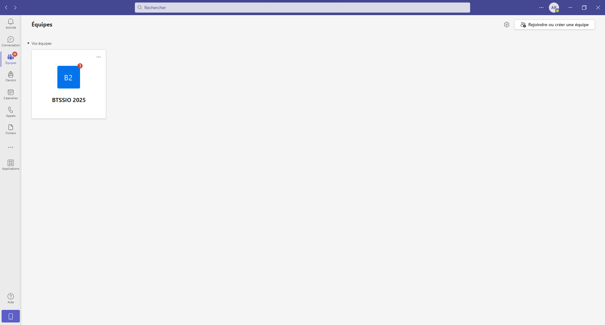

Sur Teams il y a plusieurs menu dont le menu conversation qui va servir à contacter les membre de votre équipe

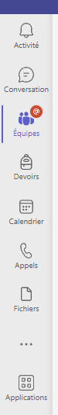

Vous pouvez rechercher les membres de votre équipe à l'aide de la barre de recherche tout en haut de l'écran
Il repérable tout à gauche en dessous de activité

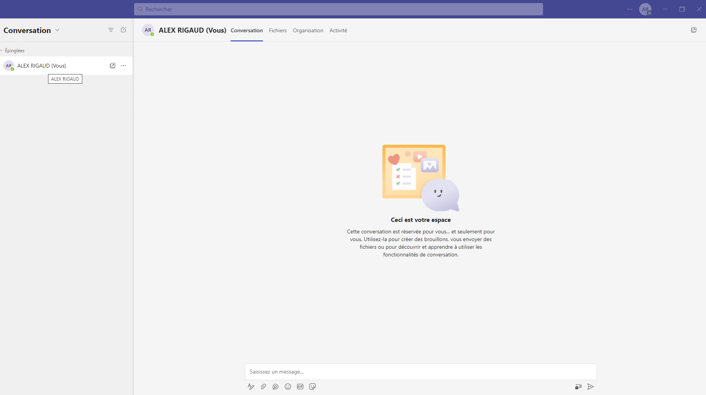

Les membres que vous avez recherche sont directement épinglé dans la barre de menu épinglés
On peut aussi voir s'il il sont disponible absent ou indisponible grâce au différent cercle par exemple :

Si le membre possède cercle vert avec une icone tchek alors la personne est disponible

Si le membre possède cercle jaune avec une icone alors la personne n'est pas disponible, occupé ou que sont compte est toujours actif mais le membre momentanément non disponible

Si le membre possède un cercle gris avec une croix c'est qu'il est inactif et n'est actuellement pas disponible pour vous répondre

Pour certaine personne notamment pour les étudiants une section devoirs teams peut être ajouter ce qui est le cas pour moi

Cet parti sert à afficher les devoir poster par des membres comme les professeurs pour les consulter

Par exemple celui qui est à faire pour demain pour cet semaine ou j'écrit ce compte rendu

Quand un devoir s'affiche et que vous voulez joindre un contenue par exemple vous pouvez faire cliquer sur joindre (soit joindre un fichier) ou en créer un nouveau

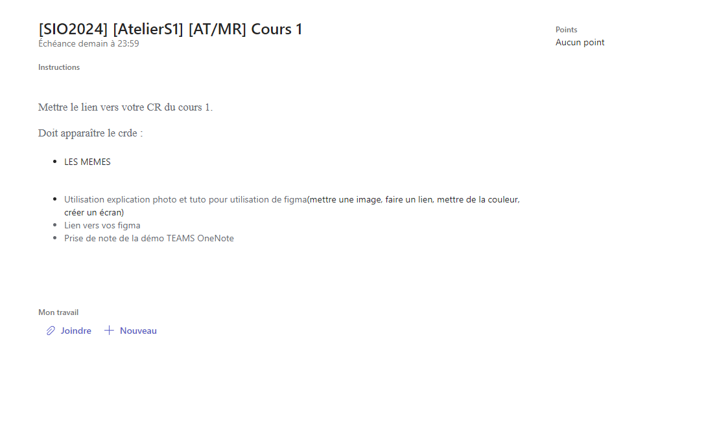
Plusieurs option vous sont proposer comme :

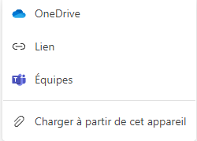

Copier un lien pointant sur votre compte office 365

OneDrive : Vous pouvez ajouter vos fichier
sur votre espace cloud partager

Lien : Ajouter un lien qui est sur votre compte teams ou
Vous avez mis votre fichier (voir ci-dessous de la parti
Copier un lien pointant sur votre compte office 365)

Equipes : Vous pouvez ajouté un fichier sur votre espace
Membre de Teams

Charger à partir de cet appareil : Vous pouvez ajouter des
Fichier stocker dans votre espace personnel en local sur votre
Appareil (voir ci-dessous après la présentation lien pointant)

Pour copier un lien sur teams permettant de joindre le fichier il faut faire un clic droit sur votre fichier ce qui devrait ouvrir une fenêtre avec ces option rechercher l'option "copier un lien pointant vers cette page" puis cliquer sur cet option.
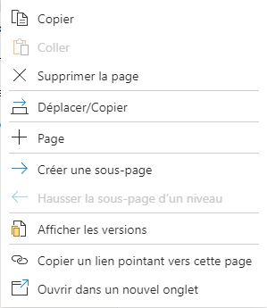

Le lien est sauvegarder vous pouvez le coller sur l'option "Lien" ce qui devrait donner une fenêtre comme ceci ci-dessous

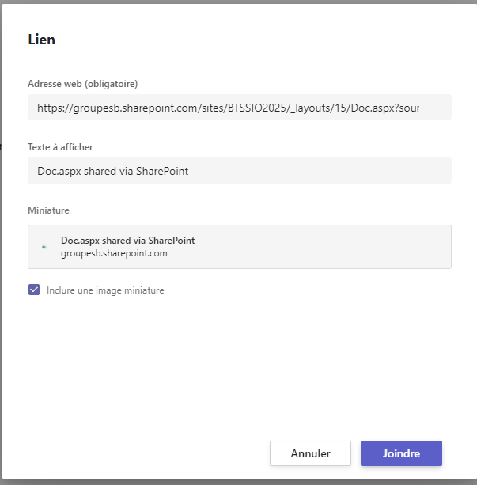

Cliquez sur joindre pour ajouter cet pièce jointe avec le lien ou pour annuler si vous vous êtes tromper

Ajouter un lien sur votre espace personnel sur votre appareil

En cliquant sur 'charger à partir de cet appareil'

Une fenêtre s'ouvre ajouté la pièce jointe puis cliquer sur ouvrir sur Windows

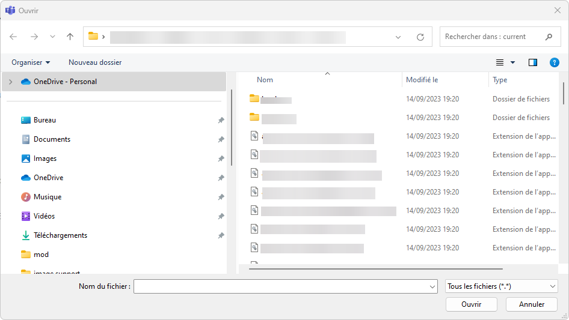

Sur Mac vous devez avoir une fenêtre comme ceci

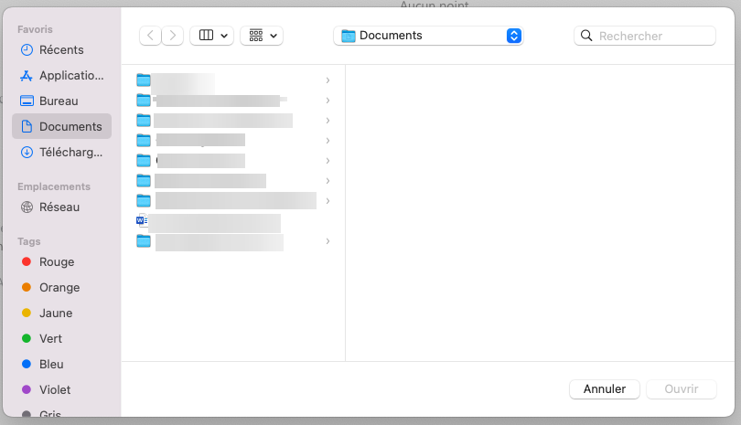

Une fois que vous avez joint vos fichier cliquez sur "Remettre" en haut à droite pour fournir votre travail à votre enseignant.

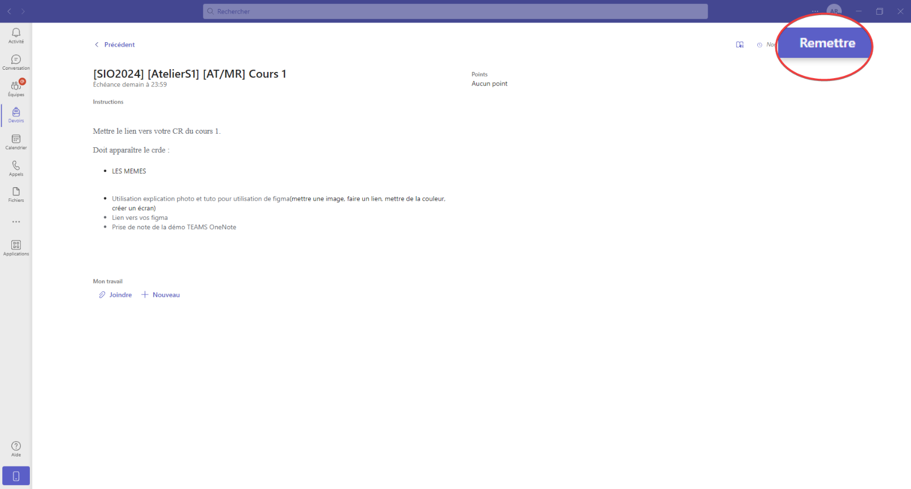

Présentation du calendrier

Présentation du calendrier

Le calendrier va servir à ajouter des réunion vous pouvez les planifier selon vos disponibilité démarrer une réunion instantané
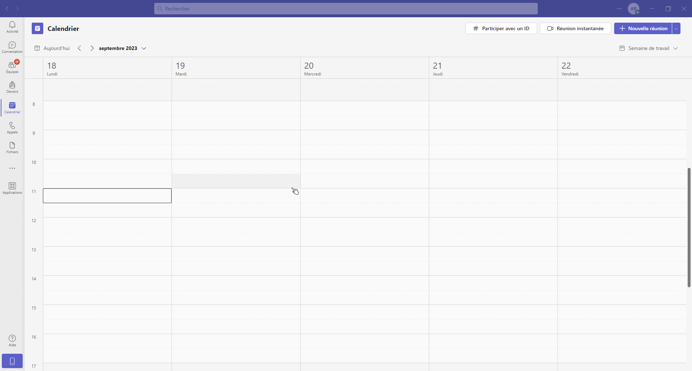

Présentation de la section appel

Cet section sert à appeler les personne il suffit de taper le nom de la personne ou l'adresse mail de la personne à contacter on peut voir différent option comme "tout" qui signifie qu'on regroupe toute les personne, manqué pour vérifier les personne que vous n'avez pas réussi à joindre ou que vous n'avez point décrocher, Entrant, cet section sert à vérifier les personne qui ont essayer de vous joindre dont les membres que vous avez décrocher pour accepter l'appel et enfin la messagerie vocal pour consulter les message vocale envoyer en cas d'appel manqué.

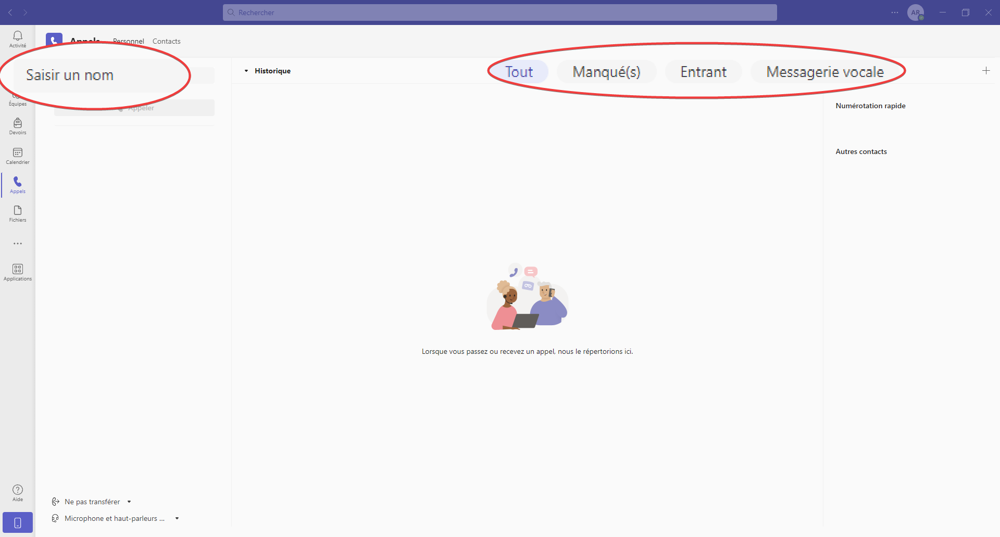

Présentation de la section fichiers

Cet section permet de consulter les fichier que vous utilisez ou que vous consulté avec vos membres

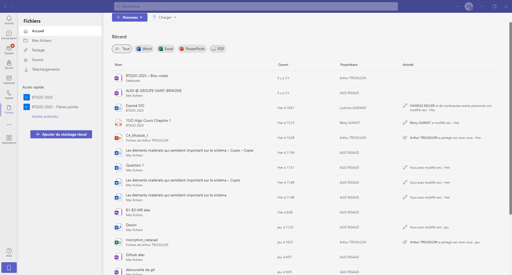

Vous pouvez également consulter vos téléchargement
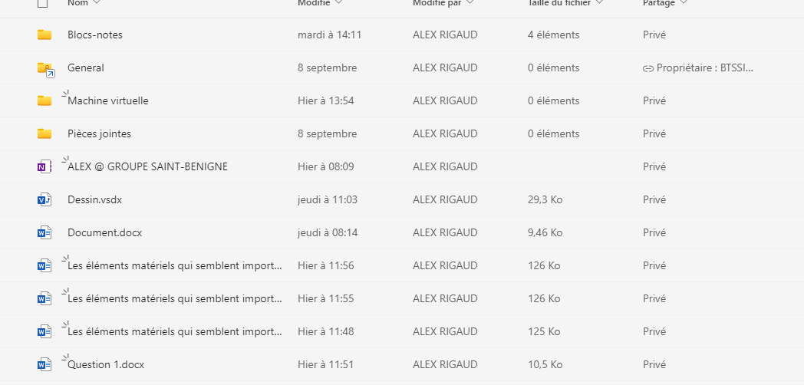

+++

Vous pouvez consultez la liste des application à utiliser.
Comme teams est constamment à jour la dernière version vous permet utiliser les applications offices directement sur teams vous n'avez pas besoin d'installer des outil de bureautique puisqu'ils sont incluent dans Teams

On peut également recherchez plus d'application à mettre sur Teams, cependant, assurer-vous qu'il soit installé pour vous seulement pour éviter tout conflit.
