<u>Le 27/05/2024</u>

<u>Coordonné du tuteur :</u>

Nom et prénom : M. Durand Hervé

Email : coralie.cuvelier@aprr.fr

Téléphone : 09 80 77 67 74

<u>Détails du stage :</u>

Découverte de la structure de l'entreprise
Présentation des 4 logiciels pour le développement de l'entreprise.
Présentation du logiciel Poweraps pour le développement d'application web.

Début de l'utilisation de PowerAps

Lors de ma premier journée, j'ai commencé à apprendre à créer des applications de type Canevas.
J'ai été aidé par M. AUBRIOT Baptiste un alternant de gestion de projet de la DISI.

Le premier exercice consistait à importer un fichier Excel depuis cet application.

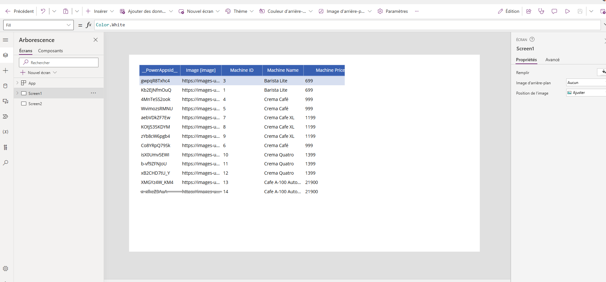

Importation d'une table de donné dans l'application

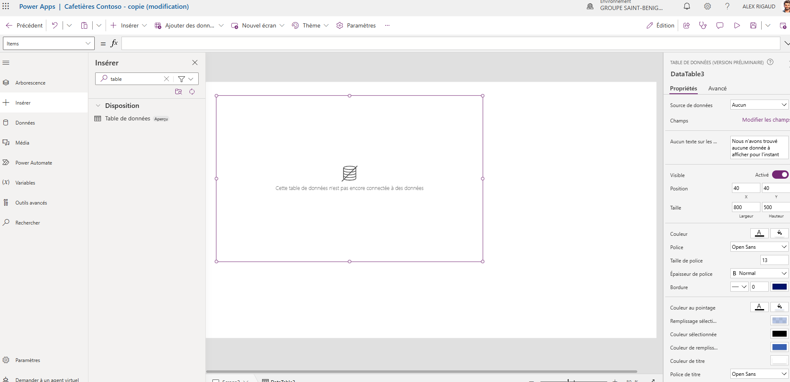

Aucune base de donné n'a été trouver donc il faut en ajouter une

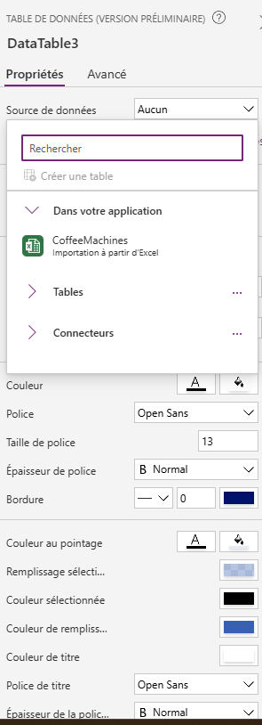
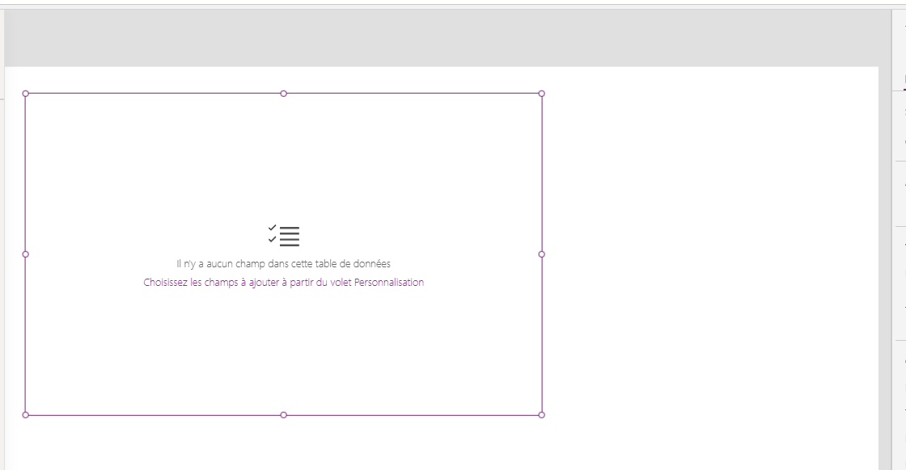

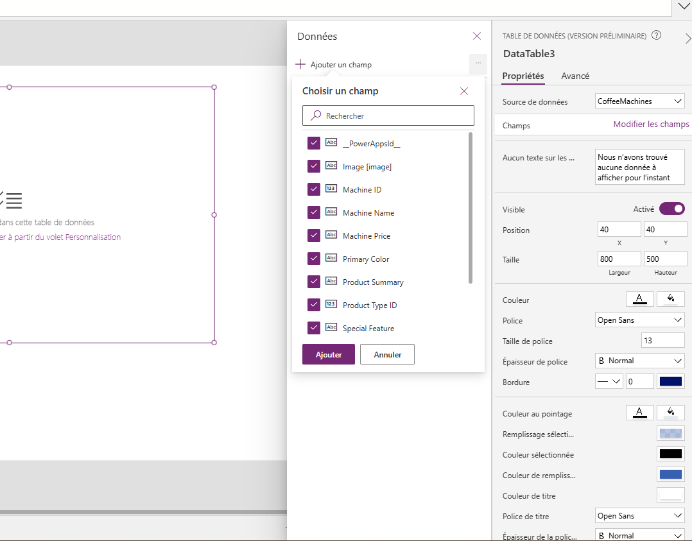

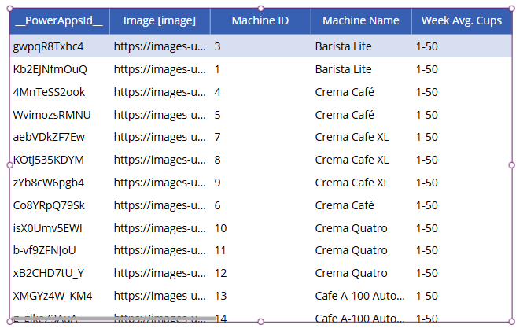

Dans la deuxième applications il fallait créer un formulaire avec le même fichier Excel

Tous d'abord il fallait créer une application en 3 pages dont :

- Premier screen, une Gallery avec le fichier excel
- Deuxième screen, tableau de donné
- Troisième screen, le Formulaire

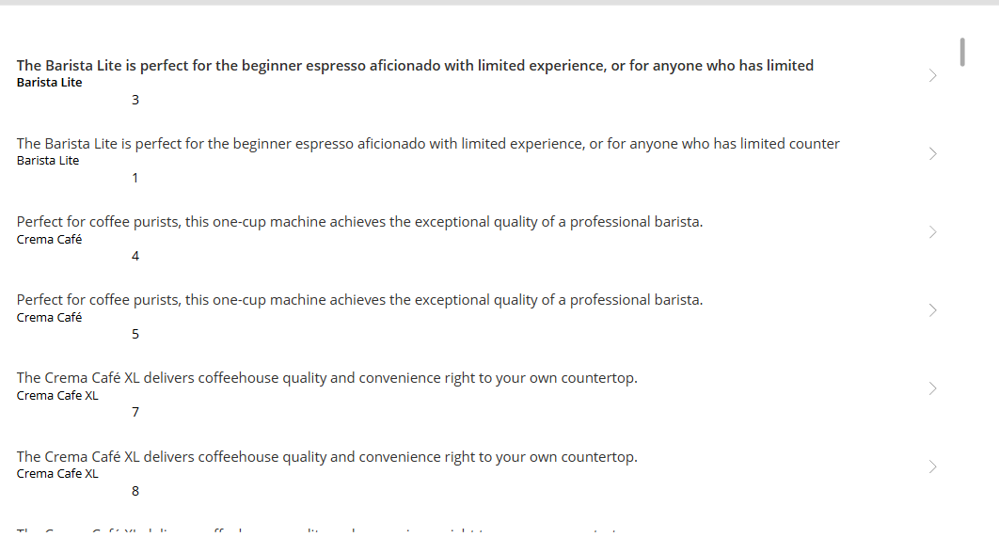

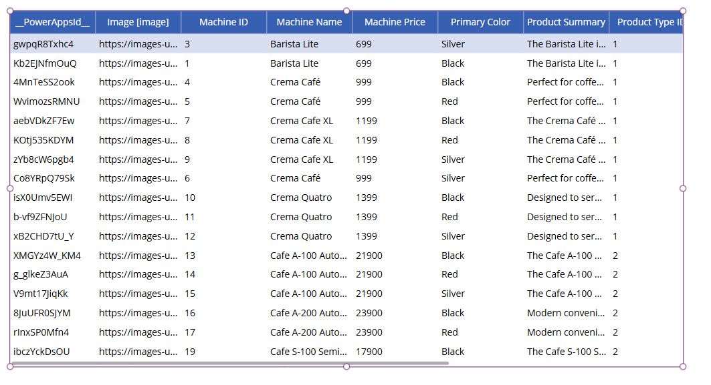

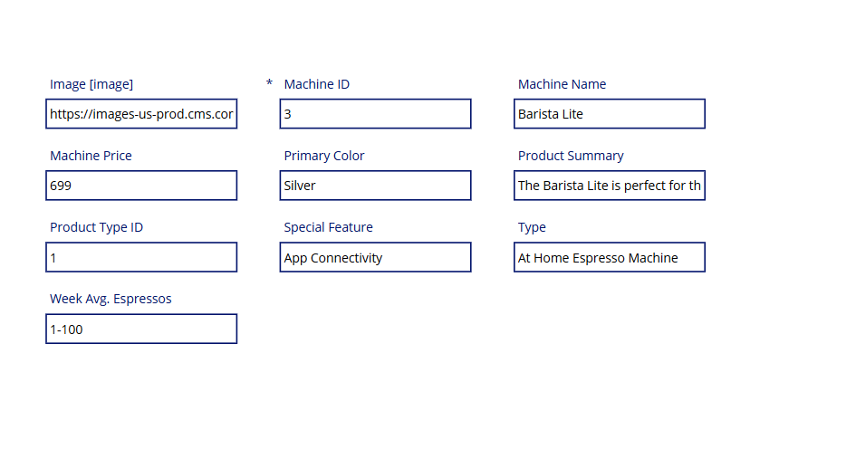

La seconde réalisation était de créer un petit script qui ajoute les informations du premier item

Navigate(Screen3);; // Permet de basculer de Screen1 à Screen3

Création d'une variable "boite" permettant de stocker le premier item.

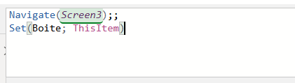

**<u>Lien :</u>**

<https://learn.microsoft.com/fr-fr/power-apps/maker/canvas-apps/>

<https://learn.microsoft.com/fr-fr/power-apps/learning-catalog/learning-catalog>

<https://learn.microsoft.com/fr-fr/power-apps/powerapps-overview>

**<u>Lien d'apprentissage :</u>**

<https://guidedtour.microsoft.com/guidedtour/guidedtour/power-platform/power-apps/3/1>

<https://learn.microsoft.com/fr-fr/power-apps/learning-catalog/app-maker>

<https://learn.microsoft.com/fr-fr/power-apps/learning-catalog/developer>  

<https://learn.microsoft.com/fr-fr/power-apps/learning-catalog/administrator>

<https://learn.microsoft.com/fr-fr/power-apps/learning-catalog/solution-architect>

**<u>Mardi 28/05/2024</u>**

Je continue à apprendre à utiliser Power Aps

Découverte des différentes propriété de Poweraps dont

Fill : Modifications de la couleur de l'arrière-plan

Onselect : Propriété permettant de définir l'action de selection ont peut inclure

Naviguate('nom-du-screen') permettant de définir la page à naviguer ou back() permettant de retourner vers la page précédente

Text : permettant de mettre du texte

DisplayMode : Permet de définir la seletion d'un objet "DisplayMod.Edit" si on veut que l'utilisateur ne puisse pas cliquer sur le bouton il faut renommer "Edit" par "Disabled".

BortderColor : Permet de définir la couleur de la bortdure du composant

**<u>Mercredi 29/05/2024</u>**

Correction exercice Test :

Création d'une page permettant

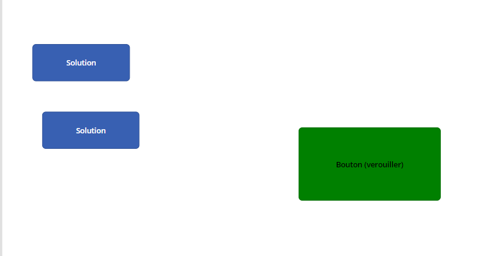

Il y a un bouton qui verouille le bouton vert et un autre qui le déverouille. Le bouton vert permet d'afficher un texte caché.

Le bouton Solution en haut à des propriété définit comme :

Onselect : Set(varBoutonLock, DisplayMode.Edit)
On définit la variable porter par le bouton vert soit activer

Text : "solution" Contient le texte du bouton

Le bouton Solution en bas à des propriété définit comme

Onselect : Set(varBoutonLock; DisplayMode.Disabled)
Désactive le bouton vert si il est activé

Bouton (verouiller) possèdent les propriéter suivante :

DispayMode : varBoutonLock
La variable définit de displayMode pour verouiller le bouton vert

Text : "Bouton (verouiller)"
Texte définit

Onselect : Set(vartext; true)
La propriété Onselect définie la variable sur texte comme étant visible

Fiil: Color.Green
Définie la couleur du bouton en vert

Le texte qui est caché ressemblant à ceci à des propriétés :

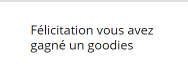

Text : Félicitation vous avez gagnez un goodies

Onselect : false

Visible : contient la variable "vartext"

Création d'une Application de test PowerAps Avec une base de donné SharePoint contenant les utilisateur et la date d'inscription.

**<u>Objectif :</u>**

Créer un Ecran 1 servant d'accueil avec un footer et header des boutons vont servir à ajoutez les personne dans la base de donné. Un bouton permettant d'aller à la page suivante.

Voici la composition de la page

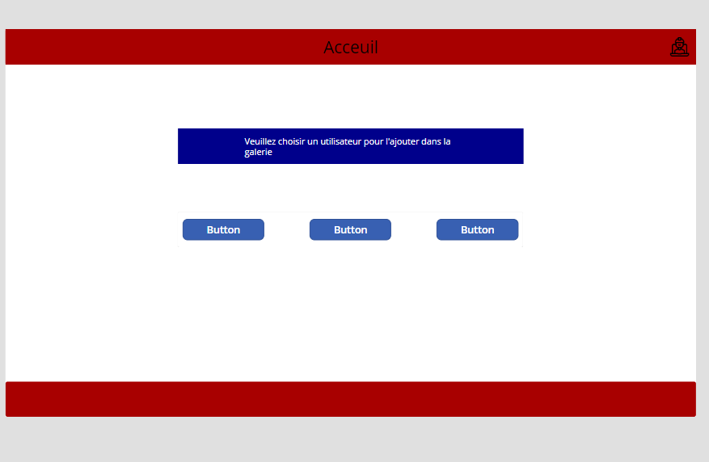

1.  Conteneur représentant le header

2.  Conteneur représentant le label

3.  Conteneur représentant les 3 boutons

4.  Conteneur représentant le footer

Lien d'aide

<https://questcequecest.com/propriete-personnalisee-en-entree-dans-power-apps/>

<https://vivasoftltd.com/how-to-create-header-and-footer-component-in-power-apps/>

- Header composant
Size:

Width =\> App.Width

Height =\> 132

Définit la largeur et la longueur du header

Si les Conteneur ont une position différente par rapport au composant

Attribuer la position au header X et Y

X = 0 ou parent.X

Y = 0 ou parent.Y

Calcule de la position X pour centrer le contrôle horizontalement.

(Parent.Width - Self.Width) / 2

Calcule de la position Y pour centrer le contrôle vertical

(Parent.Height - Self.Height) / 2

Le deuxième écran va servir à afficher les personnes avec la date et leur nom à l'intérieur d'une gallery, Si admettons un bouton avec la date et le nom sur le premier screen, le bouton du deuxième screen contenant la même nom et la date devra être cliquer pour l'ajouter à la gallery.

**<u>Jeudi 30/05/2024</u>**

Continuiez sur l'exercice

Résolution de l'erreur screen isn't recognized dans la propriéter Onselect en ajoutant

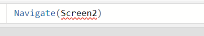

Il est possible que cet erreur apparaissent si on entre dans la propriété onselect d'un bouton ou autre élément cliquable.

Il faut aller dans le composant qui possède un conteneur

Dans Access app scope il faut cliquez sur l'interrupteur pour le basculer en on
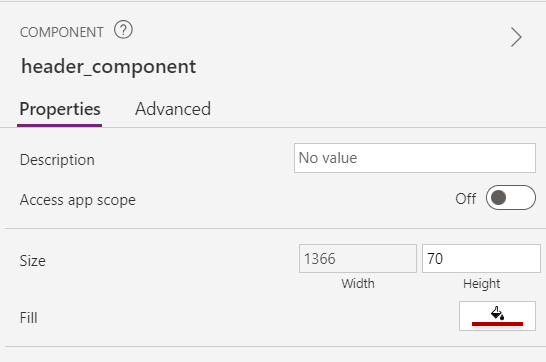

Exemple de boucle permettant de changer le label dans hc_container

Boucle Switch

La boucle Switch permet d'ajout plusieurs condition plutôt que la boucle if

Switch(
  *App*.*ActiveScreen*.Name,
  "sc_accueil",
  "Accueil",
  "sc_data",
  "Data",
  "sc_test",
  "test"
)
Cet boucle remplace le texte du label, suivant les pages qui sont sélectionner

Autre Exemple une boucle Switch permettant de cacher une icone en fonction de la page sélectionné.

Ce code est ajouté à la propriété Visible

Si l'écran accueil est sélectionner la propriété Visible sera sur false, ce qui signifie que l'icone sera caché, par contre si on selectionne l'écran data, on attribuera la propriété visible sur true, ce qui signifie que cet icone sera visible.
Switch(
*App*.*ActiveScreen*.Name,
  "sc_acceuil",
  false,
  "sc_data",
  true
)

Pour le bouton avec la flèche

Switch(
  *App*.*ActiveScreen*.Name,
  "sc_accueil",
  true,
  "sc_data",
  false
)

Création de la base de donné :

L'objectif était de finaliser l'application en créant la base de donné pour introduire des utilisateurs ainsi que leur date selectionné

Pour créer une table dans la base de donné sharepoint Il faut procéder comme suit :

Par défaut Sharepoint n'utilise pas d'option nommez Table se sera "List"

Il faut s'assurer que l'utilisateur peut éditer une base de donné

Dans le menu Home

Déroulez à droite Sur New puis cliquez sur List

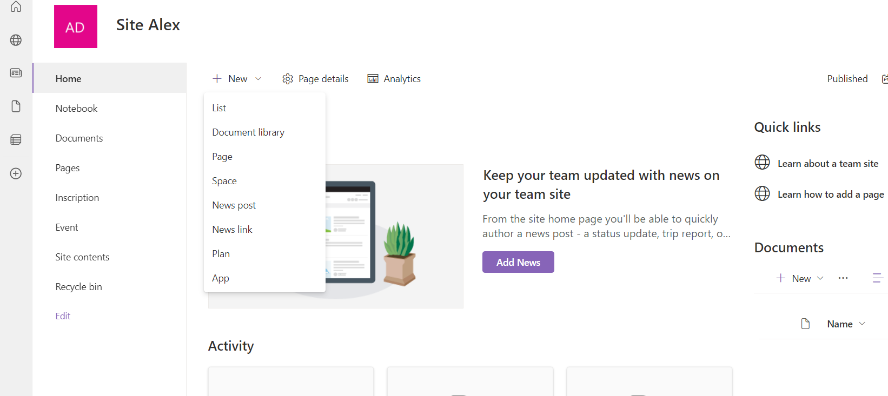

Si l'on souhait créer une liste vide on clique sur Blank List il existe plusieurs option comme on peut le constater, mais dans notre cas celle-ci sera définit comme étant vide. Cliquons sur Blank List  

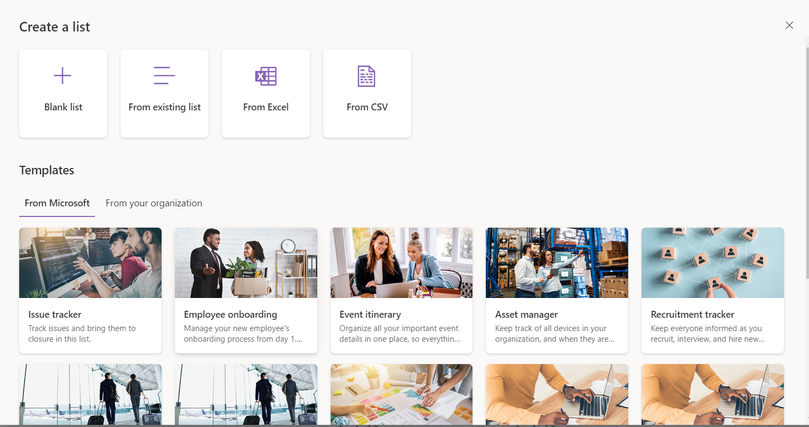

Entrez le nom de la table on peut ignorer le champ description

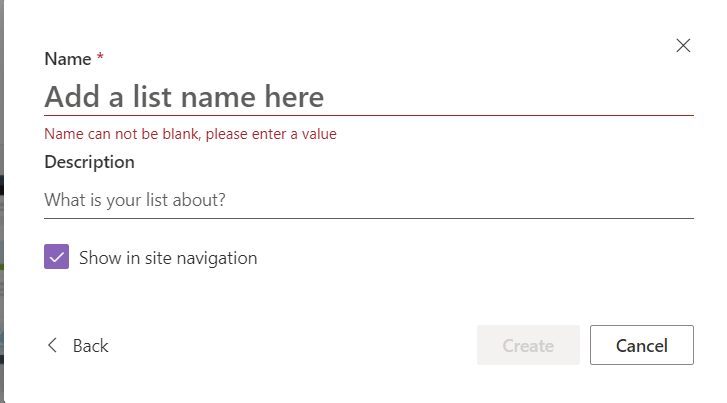

Cliquez sur Create

Cela créera une table vide

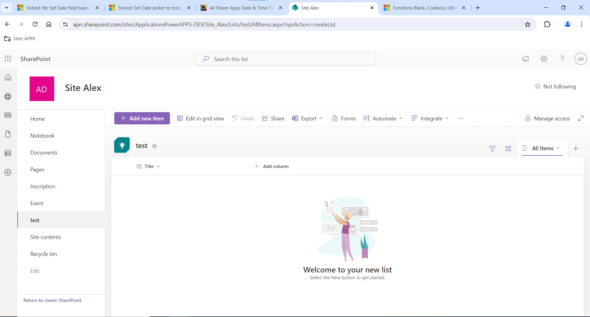

Pour suprimer une table on clique sur Edit, cliquez sur la 3 petit points de la table que vous voulez supprimez et cliquez sur "Remove" pour supprimer la table.

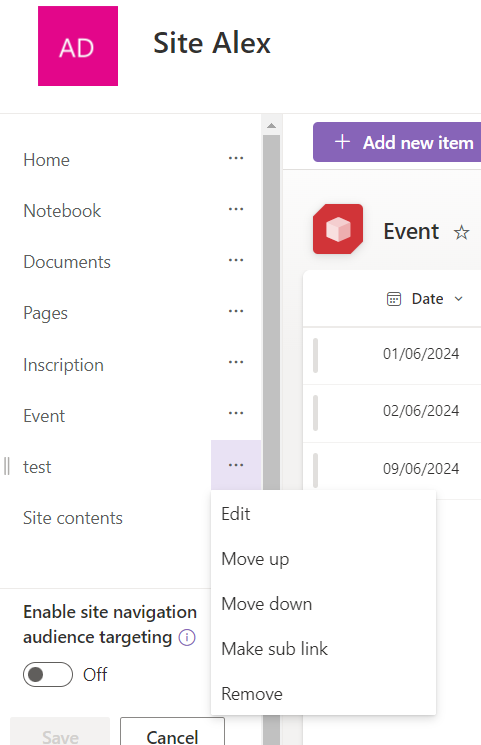

Dans Mon cas j'ai créer deux table nommer "Inscription" et une table "Event"

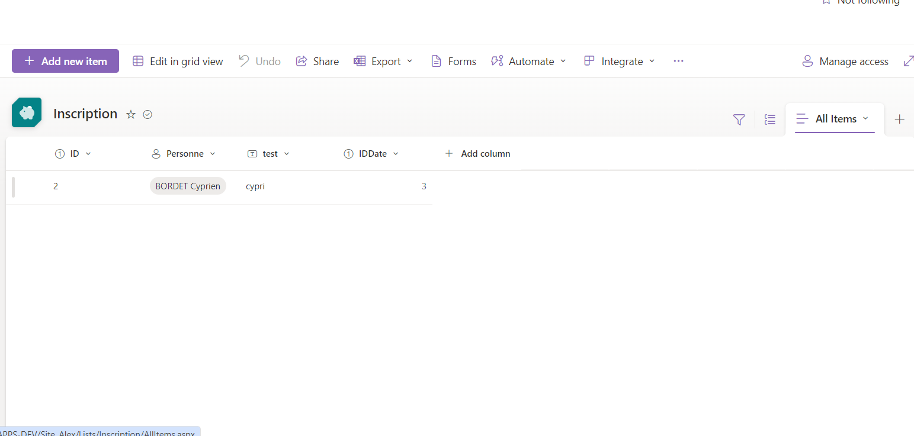

La table Inscription va servir à Stocker des utilisateur qui a une colonne nommée "personne" et auront une date affecter "IDDate" cet colonne sera relier à l'ID de la table Event qui correspond à la date choisi de l'utilisateur.

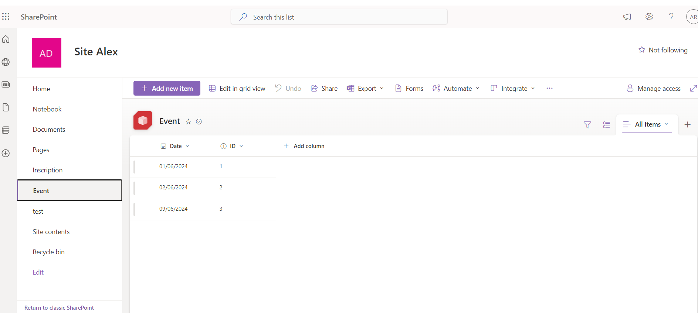

La table Event Sont les différentes dates qui sont stockées.

Pour créer une column Il faut cliquez "Add column"

On peut créer plusieurs type de collonne (Text,Person, Date and Time, Number …)

Si l'on veut mettre des utilisateur dans la Inscription Inscription il faut créer deux collone :

- Une collonne Person
- Une deuxième collone Pour prendre l'ID de la table Event dont "Number"

Et pour "Event"

- Il faut Créer une collone nommé "Date et Time"

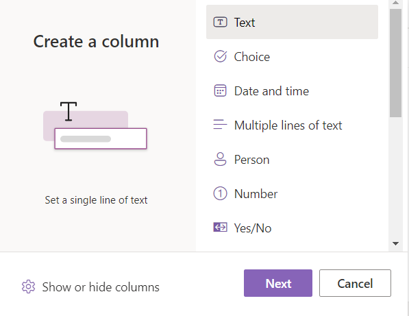
Cliquez sur Next

Nommer votre column il est conseiller de le nommé avec un nom spécifique pour le repérer plus facilement.

Cliquez sur "Save"

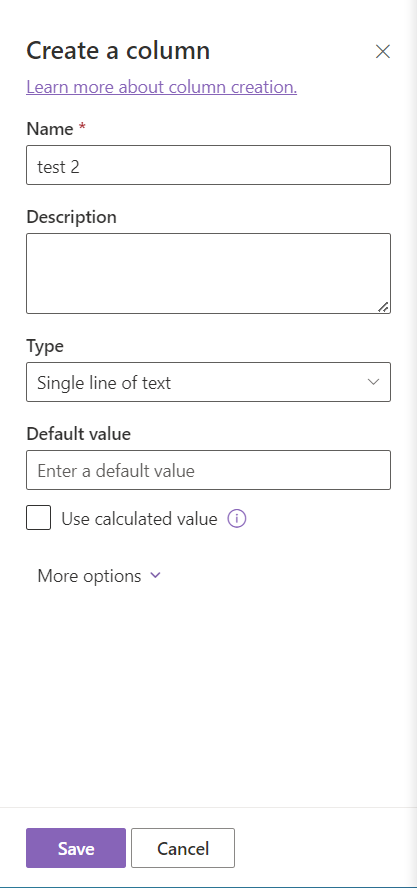

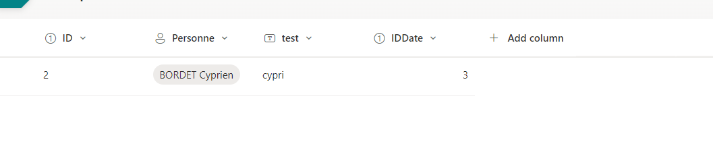

Maintenant on est sur d'avoir toutes les collone pour pouvoir stocker les utilisateur et définir une date d'inscription par défaut. Cependant lorsque l'on créait une table de donné dans SharePoint il faut s'avoir que la collone ID ne s'affiche pas directement pour l'afficher il faut Cliquez sur n'importe quel collone possédant une flèche.
En cliquant sur la flèche il faut sélectionner la partie Column Settings et cliquez sur Show/hide columns, pour afficher ou masquer les collones.

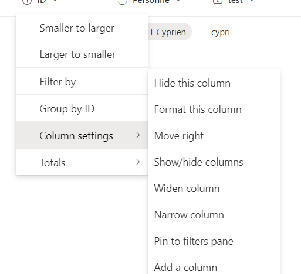

Sélectionnez La collone ID

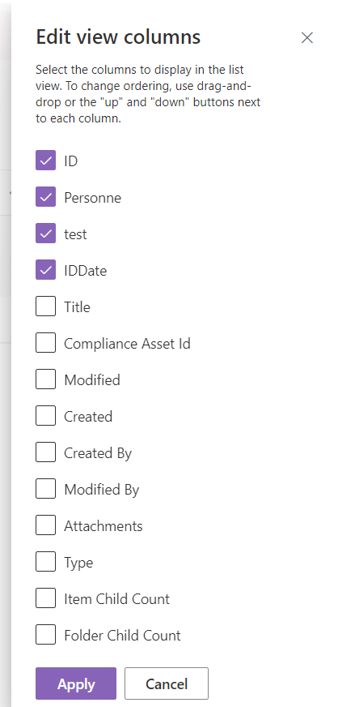

Puis cliquez sur Apply

L'application Poweraps ressemblera à ceci :

Ceci est la page d'acceuil

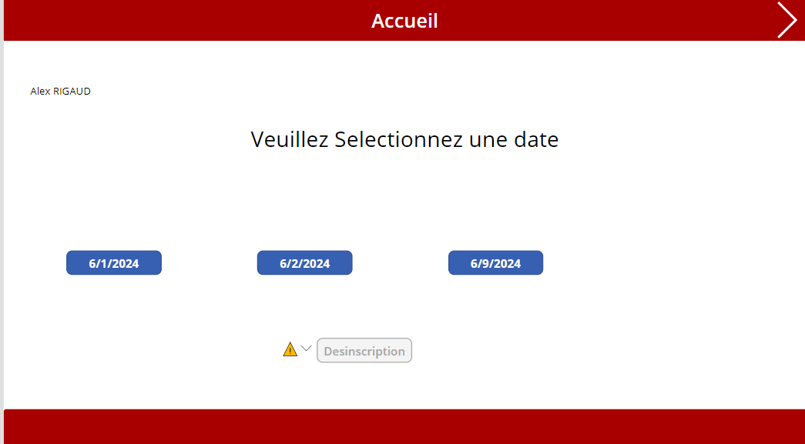

Et la page data

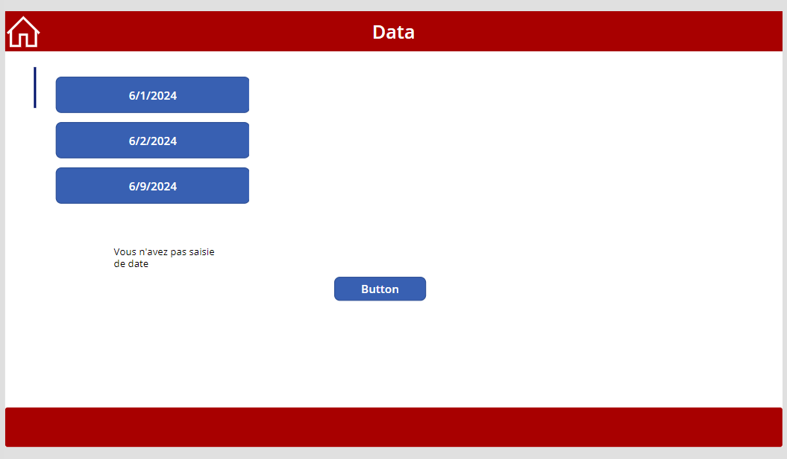

Je me suis déjà occuper de la partie de l'écran d'acceuil dans la page d'acceuil il fallait créer une gallerie à l'intérieur on ajoutera un bouton et comme la base de donné est composer de 3 dates il y aura 3 boutons. Tout à droite on ne le vois pas mais c'est une galerie qui permettra d'afficher les utilisateurs avec la date il ont choisi de s'inscrire.

Dans l'exemple ci-dessous:

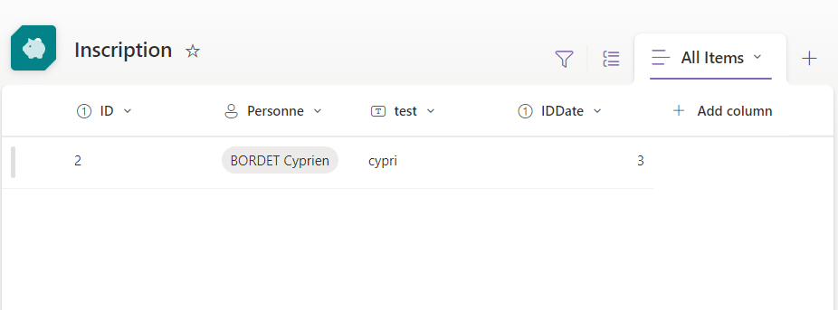

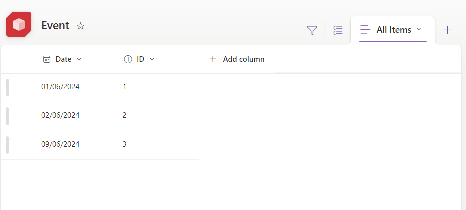

On a Deux tables dont une sont stocker les utilisateur inscris et l'autre correspond aux dates d'inscription, si on prend l'exemple de l'utilisateur Bordet Cyprien dans la table inscription, la collonne IDDate qui est de 3, correspond à la date 09/06/2024 soit l'ID qui correspond à la table Event.

Dans le coté application, si l'on clique sur le bouton dont la date est 06/09/2024

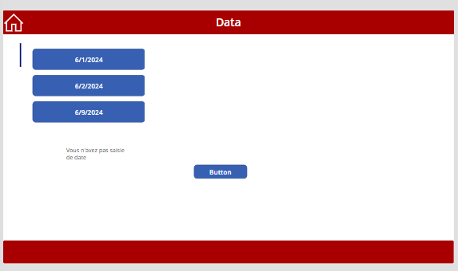

Le nom de la personne de la personne apparaîtra et ont peut voir que cela correspond bien au nom dans la vase de donné car comme mentionné il avait choisi cette date.
On peut voir également qu'il y a un label permettant de dire que l'on a choisi d'afficher la date "6/9/2024". Ceci était un test pour s'avoir quelle date à été sélectionnées. Si on clique sur une autre date par exemple "6/1/2024" il n'y aura aucune personne afficher car aucune personne ne s'est inscrite à cet date. Par conséquent cela signifie que que l'ID 1 soit la date "6/1/2024" n'a pas d'utilisateur associé a cet date, Idem si on sélectionne la date "6/2/2024".

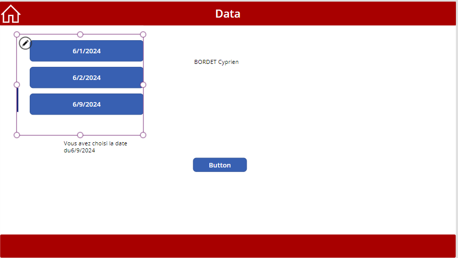

Pour pouvoir faire ce procéder faisons étape par étape.
Commençons par la gallerie

La gallerie doit avoir la table "Event" lié.

Pour lier une Data il faut aller dans la partie Data cliquez sur Add data

La base de donné est relier via sharepoint donc dans "Search" entrez "Sharepoint"
Si SharePoint à détecter un ou plusieurs comptes il faut s'assuré de prendre le bon pour importer les bonne données. Si vous ne le voyez pas faite add a connection et suivez le procéder pour trouver votre compte SharePoint. Il ne restera plus qu'à lier le site qui stocke votre base de donné.

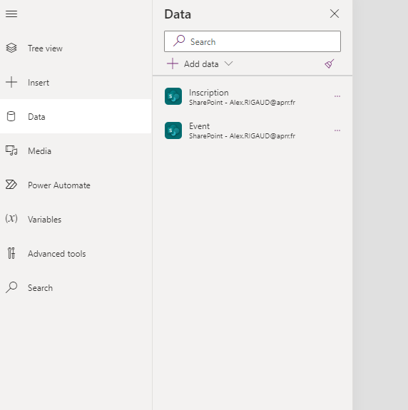

Dans la partie gallerie Aller sur Data Source et sélectionnez la table permettant d'ajouter les information. Dans notre cas on ajoute Event

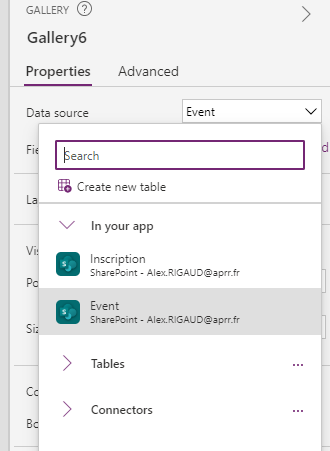

Après avoir lier une table dans la gallerie il est possible qu'il n'affichera aucun contenu. Pour afficher les donner il faut un composant qui permet de l'afficher. Par exemple il faut y ajouter (un label, un bouton …) dans notre cas on ajoutera un bouton dans la gallerie. Il y en aura 3 car il y a trois dates créer dans la table Event, les deux boutons sont un miroir du bouton qui à été créer de ce fait si on en déplace un les deux autres se déplacent.

Il est conseiller de créer un bouton relier à aucune gallerie soit dans l'écran.
Faite ensuite Ctrl X et sélectionnez la gallerie Ctrl V pour intégrer le bouton dedans.

Dans les boutons on modifiera deux propriété dont :

Onselect

Text

Dans Onselect il faut ajoutez ce code

Set(varDateSelect, ThisItem);

Ce script décrit que l'on définit une variable qui est varDateSelect
va avoir pour valeur l'item bouton "ThisItem".

Les variables sont définit dans la partie App

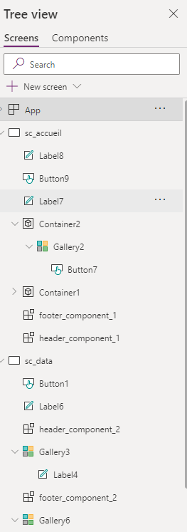

Set(
  varDateSelect,
  Blank()
);

Par défaut varDateSelect est attribuer à Blank() ce qui veut dire que c'est une variable vide.

Attention !!! Il faut faire une procédure pour appliquer les modification sur cet propriété qui est "Onstart" pour ce faire dans App cliquez sur les trois petits points puis cliquez sur Run OnStart.

Les dates ne s'afficheront pas tous de suite car "Onselect" est une propriété d'action pour afficher le contenue il faut utiliser la propriété "Text" qui permet d'afficher le contenue d'un composant.

On ajoute pour cela

ThisItem.Date

Comme le bouton ce trouve dans la gallerie possèdant la table Event, on pourra attribuer "ThisItem" à Date pour afficher les dates dans la base de donné.

Faisons un test, affichons la date sélectionné quand on clique sur l'un des boutons

Pour ce faire on insert un label dans le menu insertion

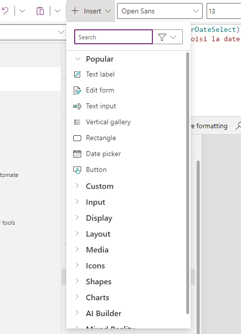

Dans ce texte allons dans la propriété "Text"

Nous allons créer une condition soit une boucle if qui dira par exemple
Si la variable varDateSelect est vide il dira "Vous n'avez pas saisie de date" dans le cas contraire il retournera Vous avez choisis la date du JJ/MM//AA.

Voici le code

Boucle If

If(IsBlank(varDateSelect),"Vous n'avez pas saisie de date",
"Vous avez choisi la date du" & varDateSelect.Date
)

Dans ce code comme la variable "varDateSelect" est vide il affichera automatiquement
Vous n'avez pas choisi de date ce qui signifie que la premier condition est exécuté automatiquement. Par contre si l'on clique sur une date il affichera le message
"Vous avez choisi la date du" & varDateSelect.Date. Pour ce faire quand l'un des boutons possèdant une date sera cliquez le label affichera ce message avec la date du bouton cliqué.

**Ressource utiliser**

[PowerApps Forms - Form Mode](https://www.youtube.com/watch?v=BnzaSDYl8mA)

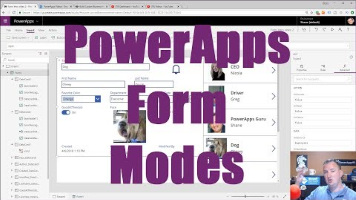

[Power Apps Advanced Forms](https://www.youtube.com/watch?v=p1tXRy_hyrQ)

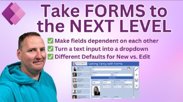

<https://www.youtube.com/results?search_query=Form+powerapps+shane>

**<u>Vendredi 31/05/2024</u>**

J'ai continuer de développer l'application

Il fallait maintenant afficher les utilisateur dans la gallerie de droite
Il faut tout d'abord s'assurez que la gallerie de droite à bien la table "Inscription"

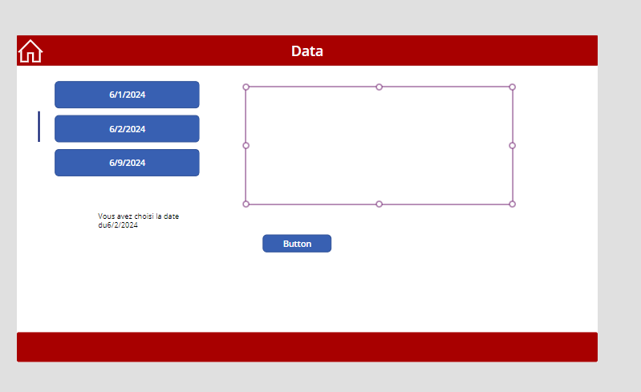

Pour ce faire utilisons les propriétés "Items" permettant de gérer le contenue de la gallerie

Dans cet propriété on ajoute ce code :

Filter(Inscription, IDDate = varDateSelect.ID)

Ce code permettant de créer un filtre dans la table inscription et vérifie l'égalité
Entre l'IDDate soit ce qui correspond à la date choisi de l'utilisateur et vérifie l'ID de l'utilisateur qui à été inscript à cet date en fonction de la date choisi.

Un autre exemple

Filter(Inscription, IDDate = LookUp(Event,varDateSelect.Date = Date).ID)

Ce code permet de filtrer la table inscription et à pour valeur la collonnne IDDate corespondant à l'id de la collobe qui stocke la date, choisi des utilisateur elle est comparer à la fonction LookUp qui permet d'éffectuer une recherche dans la table Event et la compare à la date selectionner et si elle est vrai. Si une date à été trouvé il récupère l'ID de l'élement selectionner.

On ajoute un label dans cet gallerie qui va permettre d'afficher les utilisateur

Dans la propriété "text" du label on ajoute ce code

ThisItem.Personne.DisplayName

Ce code permet d'afficher le contenue de la colonne Personne dans la table inscription, on va lui demande d'afficher seulement son nom complet.

De ce fait on pourra afficher les personnes qui ont choisi leur date d'inscription

Concentron-nous sur la page d'acceuille maintenant

La page d'acceuil va servir à ce que l'utilisateur puisse choisir une date d'inscription il sera ensuite enregistrer dans la liste "inscription" ainsi dans la deuxième page on pourra voire un second utilisateur qui se sera inscrit.

Pour ce faire analysons la page, sur cette page nous avons :

- Deux conteneurs

- Un conteneur contenant un label servant de description mais affiche la date que l'utilisateur utilisant cet application à choisi.

- Un conteneur qui stocke une galerie avec 3 boutons rassembler en un seul (deux boutons servant de miroir pour un seul).

- Un label affichant le nom inscrit

- Et un bouton de désinscription

Analysons la liste "inscription"

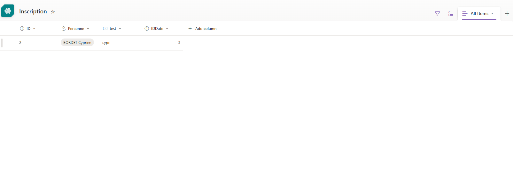

Comme on peut le constater il n'y a qu'un utilisateur inscrit à une date mais quand est il du compte actuelle qui utilise cet application

Si l'on clique sur l'une des date par exemple "06/2/2024"

L'utilisateur devrait s'ajouter à la liste "inscription"

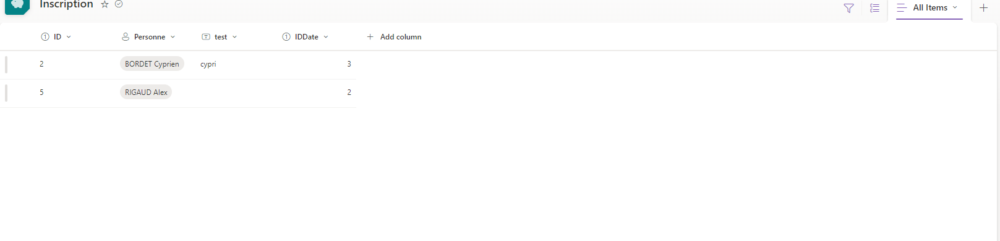

Pour Réaliser cet procédure Il faut utiliser la fonction patch sur un bouton possédant une date, il faut ensuite l'attribuer à OneSelect.

<u>Ressource utiliser :</u>

*Chaîne vide*fait référence à une chaîne qui ne contient aucun caractère.
Pour simplifier la création d’applications, les fonctionsIsBlanketCoalescetestent les valeurs*Vides*ou des chaînes vides.

*À partir de l’adresse \<<https://learn.microsoft.com/fr-fr/power-platform/power-fx/reference/function-isblank-isempty>\>*

<https://powerusers.microsoft.com/t5/Building-Power-Apps/Set-Date-field-based-on-Status-selection-Completed/m-p/1563719#M402262>

<https://powerusers.microsoft.com/t5/Building-Power-Apps/Set-Date-picker-to-today-s-date-when-a-specific-value-is/td-p/1915250>

<https://www.matthewdevaney.com/all-power-apps-date-time-functions-with-examples/>

Dans le cadre de la fonctionIsEmpty,*empty*est spécifique aux tables qui ne contiennent aucun enregistrement.
La structure de la table peut être intacte et comporter des titres de[colonne](https://learn.microsoft.com/fr-fr/power-apps/maker/canvas-apps/working-with-tables#columns), mais la table ne comporte aucune donnée.

*À partir de l’adresse \<<https://learn.microsoft.com/fr-fr/power-platform/power-fx/reference/function-isblank-isempty>\>*

Patch et Lookup

<https://learn.microsoft.com/fr-fr/power-platform/power-fx/reference/function-filter-lookup>

Patch :

Ces trois boutons sont un choix de sélection de Date en fonction de l'utilisateur. C'est l'utilisateur utilisant l'application qui va être ensuite enregistrer dans la base de donné.
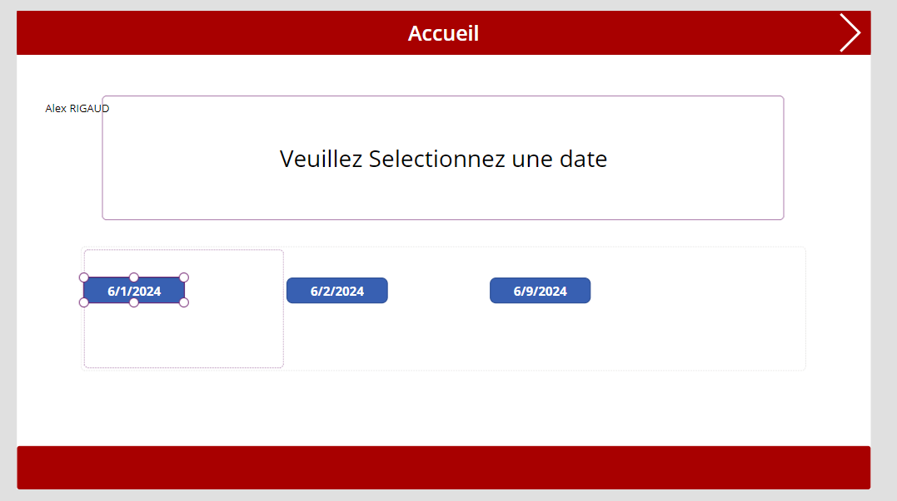

1\.

3\.
2\.

4\.

La table a été trouvé mais il manque le contenue

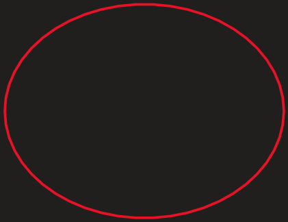
5\.

6\.
7\.

1\.

2\.

3\.

4\.

Ce code permet d'ajouter, un utilisateur dans la table inscription en fonction de la date choisi.

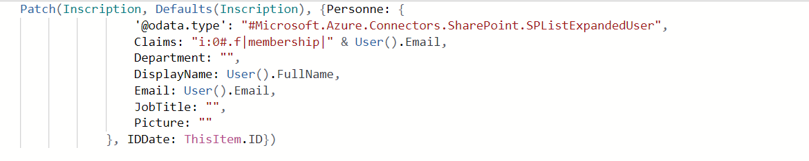

Decomposition :

**'@odata.type':** "#Microsoft.Azure.Connectors.SharePoint.SPListExpandedUser",
Cet ligne permet de spécifier le type de donné utiliser dans cet exemple on utilise sharepoint qui peut servir de base de donné.

**Claims :** Permet d'identifier le nom d'utilisateur autorisant ces caractère "i:0#.f\|membership\|"
Suivie de User().Email crée une chaîne de revendications pour l'utilisateur actuel.

**IDDate** : Un champ personnalisé dans la liste SharePoint qui est mis à jour avec l'ID de l'élément actuel (ThisItem.ID).

Prompt chagpt

Vous êtes spécialisé dans le dévelopement informatique, soit dans la conception d'une application dans PowerAps. Décrire ce code ci-dessous. Patch(Inscription, Defaults(Inscription), {Personne: { '@odata.type': "#Microsoft.Azure.Connectors.SharePoint.SPListExpandedUser", Claims: "i:0#.f\|membership\|" & User().Email, Department: "", DisplayName: User().FullName, Email: User().Email, JobTitle: "", Picture: "" }, IDDate: ThisItem.ID})  

Ce code utilise la fonction \`Patch\` de Power Apps pour mettre à jour une liste SharePoint appelée \`Inscription\` avec des informations spécifiques. Voici une description détaillée de ce que fait chaque partie du code :

\### Description Générale

\- \*\*\`Patch\`\*\* : La fonction \`Patch\` est utilisée pour créer ou mettre à jour un enregistrement dans une source de données. Dans ce cas, la source de données est une liste SharePoint nommée \`Inscription\`.

\### Décomposition du Code

\`\`\`powerapps
Patch(
Inscription,
Defaults(Inscription),
{
Personne: {
'@odata.type': "#Microsoft.Azure.Connectors.SharePoint.SPListExpandedUser",
Claims: "i:0#.f\|membership\|" & User().Email,
Department: "",
DisplayName: User().FullName,
Email: User().Email,
JobTitle: "",
Picture: ""
},
IDDate: ThisItem.ID
}
)
\`\`\`

\#### Paramètres de la Fonction Patch

1\. \*\*Inscription\*\* : La liste SharePoint où les données seront mises à jour ou ajoutées.
2\. \*\*Defaults(Inscription)\*\* : Cette fonction crée un nouvel enregistrement vierge dans la liste \`Inscription\`. Cela signifie que nous ajoutons un nouvel élément à la liste plutôt que de mettre à jour un élément existant.
3\. \*\*Objet de Mise à Jour\*\* : L'objet en JSON contenant les champs et les valeurs à ajouter ou à mettre à jour dans le nouvel enregistrement de la liste.

\#### Détails des Champs et des Valeurs

\- \*\*Personne\*\* : Un champ complexe de type utilisateur dans SharePoint. Voici les sous-champs définis dans cet objet :
\- \*\*\`@odata.type\`\*\* : Spécifie le type de données pour ce champ, ici c'est un utilisateur SharePoint étendu.
\- \*\*Claims\*\* : Utilisé pour identifier l'utilisateur. Le format \`"i:0#.f\|membership\|" & User().Email\` crée une chaîne de revendications pour l'utilisateur actuel.
\- \*\*Department\*\* : Le département de l'utilisateur. Ici, il est défini comme une chaîne vide.
\- \*\*DisplayName\*\* : Le nom complet de l'utilisateur. Utilise la fonction \`User().FullName\` pour obtenir cette information.
\- \*\*Email\*\* : L'adresse e-mail de l'utilisateur. Utilise la fonction \`User().Email\`.
\- \*\*JobTitle\*\* : Le titre du poste de l'utilisateur. Ici, il est défini comme une chaîne vide.
\- \*\*Picture\*\* : L'URL de la photo de l'utilisateur. Ici, il est défini comme une chaîne vide.

\- \*\*IDDate\*\* : Un champ personnalisé dans la liste SharePoint qui est mis à jour avec l'ID de l'élément actuel (\`ThisItem.ID\`).

\### Exemple d'Utilisation

Imaginons que vous avez une application de gestion des inscriptions où les utilisateurs s'inscrivent à des événements. Lorsque l'utilisateur clique sur un bouton pour s'inscrire à un événement, ce code est exécuté pour ajouter une nouvelle inscription à la liste SharePoint \`Inscription\`, en incluant les détails de l'utilisateur connecté (comme leur nom, e-mail, etc.) et l'ID de l'événement.

\### Résumé

Ce code Power Apps permet d'ajouter un nouvel enregistrement à la liste SharePoint \`Inscription\`. Il inclut les détails de l'utilisateur connecté, tels que son nom complet, son adresse e-mail, et un champ ID d'événement spécifique. Le \`Patch\` crée un nouvel enregistrement avec ces informations dans la liste SharePoint spécifiée.

Dans cet page on peut également apercevoir un label permettant d'afficher la date de l'utilisateur inscrit  
pour ce faire on utilise une boucle if  

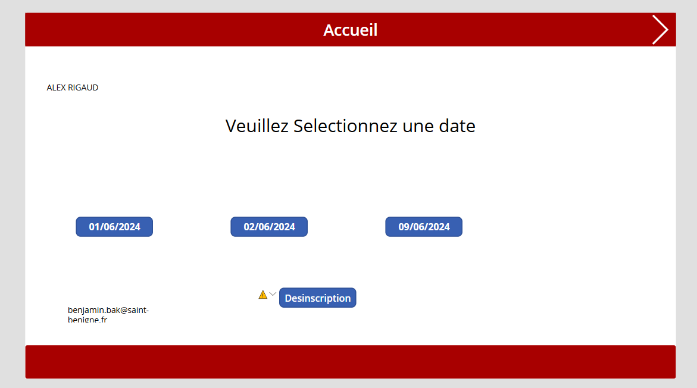

If(IsBlank(SaveUser),"Veuillez Selectionnez une date", "Vous êtes inscrit à la date du" & LookUp(Event, SaveUser.IDDate = ID).Date)

Ce code veut dire que dans la variable qui est stocker "SaveUser", si depuis un élement précis dans la table Inscription l'utilisateur courant correspond à l'utilisateur qui se trouve dans la collone Personne il affichera un message avec la date inscrit par l'utilisateur, ce procéder va être utiliser par un LookUp qui permettra de vérifier avec la variable créer si la date de la table Event correspond à la L'IDDate de la table inscription, il retournera ensuite la Date que l'utilisateur à choisi sinon si l'utilisateur ne c'est jamais inscrit il retournera la valeur du label comme étant
IsBlank, Ce qui veut dire qu'il affichera "Veuillez Selectionnez une date".

Dans la propriété OnStart on définit la variable qui permet de vérifier si l'utilisateur actuel se trouve dans la table inscription et si il est bien dans la collone Personne il sera comparer en tant que Email.

Set(
  SaveUser,
  (LookUp(
    Inscription,
    User().Email = Personne.Email
  ))
);

**Remove :**

Source

<https://learn.microsoft.com/fr-fr/power-platform/power-fx/reference/function-remove-removeif>

<https://learn.microsoft.com/fr-fr/power-platform/power-fx/reference/function-remove-removeif>

<https://learn.microsoft.com/en-us/power-platform/power-fx/reference/function-patch>

J'ai pu également créer un bouton de désinscription pour que l'utilisateur puisse ce désinscrire à la date voulue

Dans la propriété Onselect du bouton

On ajoute ce code qui permettra de supprimer un utilisateur de la liste Inscription.

Remove(
  Inscription,
  LookUp(
    Inscription,
    Lower(Personne.Email) = Lower(User().Email)
  )
);

Dans ce code on ajoute un Lookup pour vérifier si l'utilisateur courant était présent dans la collone Personne dans la table inscription.
On utilise la fonction Lower qui permet de convertit toutes les lettres d’une chaîne de texte en minuscules.

*À partir de l’adresse \<<https://learn.microsoft.com/fr-fr/dax/lower-function-dax>\>*

On peut aussi empecher l'utilisateur de cliquer sur désinscription ce qui lui permettra de s'avoir si il est inscrit ou non

Pour ce faire nous allons utiliser la propriété DisplayMode ou Visible

Dans notre cas ce sera visible

If(IsBlank(
  LookUp(
    Inscription,
    Personne.Email = User().Email
  )),
  DisplayMode.Disabled,
  DisplayMode.Edit
)

Ce code décrit que si L'utilisateur courant n'a pas été trouvé dans la table inscription et qu'il n'est pas dans la collone Personne la valeur du bouton sera vide, ce qui veut dire que
Le bouton sera définit en DisplayMode.Disabled soit inutilisable tant que l'utilisateur ne sera pas inscrit dans la liste Inscription, si l'utilisateur courant est bien inscrit alors le bouton
Sera définit en DisplayMode.Edit. Ce qui veut dire que l'utilisateur pourra se désinscrire ainsi le bouton sera attribuer à DisplayMode.Disabled.
On retrouve également le LookUp permettant de vérifier l'élément précis soit si l'utilisateur courant est inscrit à la table inscription se trouvant dans la collone personne. On vérifira son Email.

