Lundi 03/06/2024

Construire Une application d'inscription de la journée VH (voix hivernale)

Objectifs :

Les utilisateur devront choisir une région sur laquelle sont mis des dates, leur fonction et la dates inscrit
L'utilisateur doit préciser ses allergie.

Solution générer par Chatgpt permettant d'afficher la date en chiffre en français

Pour afficher la date en format numérique (par exemple, 03/06/2024), vous pouvez utiliser la fonction \`Text\` de PowerApps avec un format personnalisé. Voici comment vous pouvez le faire :

1\. Sélectionnez votre contrôle de texte dans PowerApps.
2\. Dans la propriété \`Text\` de ce contrôle, utilisez le script suivant :

\`\`\`plaintext
Text(ThisItem.Dates, "\[\$-fr-FR\]dd/mm/yyyy")
\`\`\`

Ce script formatera la date en "jour/mois/année" en utilisant le paramètre de langue français.

\### Exemple complet dans PowerApps

1\. \*\*Sélectionnez votre contrôle de texte\*\* : Cliquez sur le contrôle de texte dans votre application PowerApps où vous souhaitez afficher la date.
2\. \*\*Accédez à la propriété \`Text\`\*\* : Dans le volet des propriétés à droite, trouvez la propriété \`Text\`.
3\. \*\*Modifiez la propriété \`Text\`\*\* : Remplacez l'expression actuelle par le script suivant :

\`\`\`plaintext
Text(ThisItem.Dates, "\[\$-fr-FR\]dd/mm/yyyy")
\`\`\`

4\. \*\*Validez et publiez votre application\*\* : Après avoir entré le script, vérifiez que l'affichage de la date est correct dans le mode de prévisualisation, puis publiez votre application.

En utilisant ce script, la date sera affichée dans le format numérique souhaité, comme "03/06/2024".

Countrow

Mardi 04/06/2024

Voici la composition de l'application :

Premier page

Cet page va servir pour inscrire un utilisateur dans la base de donné

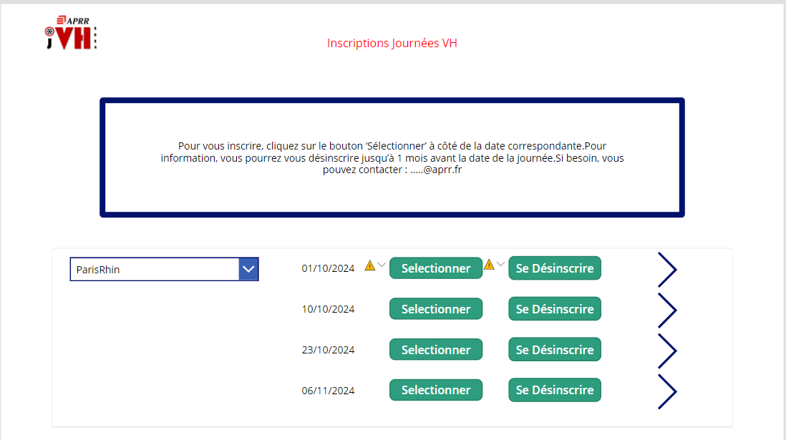

Dans la première pages on y retrouve :

Seconde page :

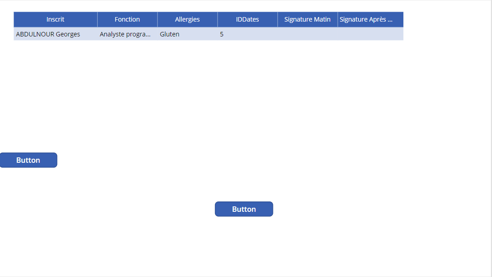

Avant de m'occuper de la partie Disign, tout à bord j'ai commencé à créer un composant header dont la partie en hauteur sert d'en tête

Ce composant à comme item :

- Une image
- Un label

Voici la composition du code du header

Header_component

Height : 90
Width : *App*.Width

Le composant à une longueur en brut de 90 tandis que pour la largeur, on se base sur la largeur de l'application.

Container2

DropShadow: DropShadow.None
Height: Parent.Height
Width: Parent.Width / 4
X: (Parent.Width - Self.Width) / 2
Y: (Parent.Height - Self.Height) / 2

Un conteneur contenant le label à pour longueur sont parent soit la longueur du composant. Pour sa largeur on lui attribue également la même dimensions que sont composant cependant on divise sa taille d'origine par 4 ce qui diminue sa dimensions. Sa position est centrer en fonction de sa largeur en X et en fonction de sa longueur en y. Pour ce faire en X on soustrait la dimensions identique au composant - la largeur du composant de lui-même et on divise par 2, ce qui aura pour but de le centrer horizontalement. Et on fait de même pour y pour le centrer en vertical.

Label

Align: Align.Center
Color: Color.Red
Size: 15
**Text: "Inscriptions Journées VH"**
**X: (Parent.Width - Self.Width) / 2**
**Y: (**Parent.Height - Self.Height) / 2

Pour le label j'ai attribué une couleur en rouge et j'ai aligné au centre, pour ce qui est de la position X et Y il est centré également horizontalement et verticalement.

Dans la page nous avons :

- Un container stockant un label qui pour description de la page
- Un Container stockant Trois autre container permettant d'afficher des pop-up
- Une gallery stockant une icone pour afficher les utilisateur inscrit selon la date, un bouton Désinscription pour que l'utilisateur puisse se désinscrire de la liste inscription, un bouton selectionner permettant de selectionner la dates choisis par l'utilisateur et les dates affichées par un label.

Le conteneur stockant le label est composé de bordure bleu foncé, la bordure est de 10 ce qui signifie que plus chiffre est grand plus la taille de bordure est grande. La border Radius permet d'arrondir les coté du conteneur ce qui le rend plus beau.

Le label qui est contenu servira de description de la page

Dans la gallerie il fallait configurer une dropDown pour qu'elle affiche deux valeurs dont ParisRhin et Rhône

Pour cela il faut aller dans la propriété Items

Et ajouter ceci

\["ParisRhin","Rhone"\]

On créer pour cela un tableaux qui servira à l'utilisateur de choix de contenue

Cet dropdown servira ensuite à afficher les date qui sont de ParisRhin si ParisRhin est selectionner par l'utilisateur ou Rhône si Dropdown est selectionner sur Rhône.

Ce qui donnera ceci

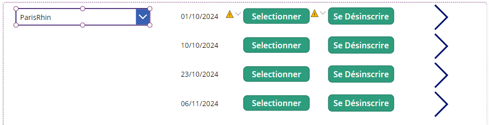

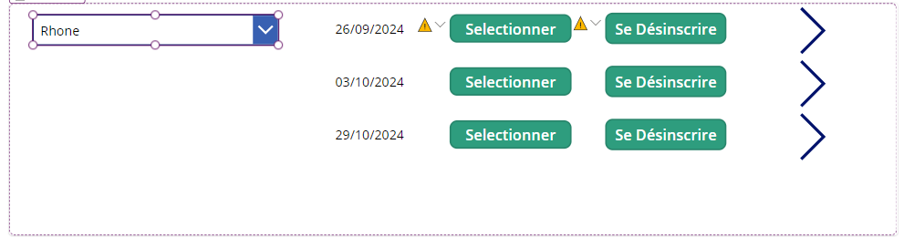

Pour faire ce procédé on va dans la galerie et on va également dans la propriété Item:

Filter(
  'Selection region et date',
  Region.Value = *Dropdown2*.SelectedText.Value
)

Ce code va permettre de filtrer en fonction de la valeur dynamique si la valeur dropdown est identique par rapport à la collone région de la liste 'Selection region et date' dans ce cas il filtrera en fonction de la région choisi.

Si on décide d'ajouter des dates il seront également filtrer.

Si on met unlabel par exemple

On met dans la propriété Text la code suivant

Text(ThisItem.Dates, "\[\$-fr-FR\]dd/mm/yyyy")

Pour rappel ce code affiche la date mais au format français

Le label affichera désormais les dates qui sont filtrer par région

On ajoute ensuite deux bouton dont un va servir pour désinscription et un autre pour inscrire la personne

Pour inscrire une personne dans la table inscription il faut évidement utiliser la fonction patch cependant dans cet application
on ne l'utilisera pas tout de suite, il faut évidement lui demander si il a des allergies si c'est le cas il devra les entrées sinon on passera à la question suivante qui est incontournable le nom de sa fonction.

Cela donnera ceci

Quand on clique sur le bouton Selectionner

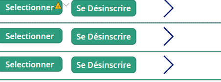

La première question s'affiche

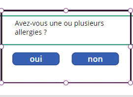

L'utilisateur à le choix entre oui ou non si il clique sur oui il entre sont
Allergies si il clique sur non le programme passera au fonction.

Si l'utilisateur choisi oui, il est confronté à cet pop up.

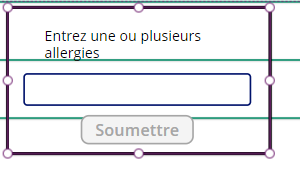
L'utilisateur devra entrer son allergie pour pouvoir cliquer sur le bouton soumettre

Il sera rediriger ensuite par ce message

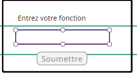

Il sera ensuite confronter à entrer sa fonction

Une fois que cela est fait l'utilisateur sera ensuite inscrit après avoir renseigné les champs requis

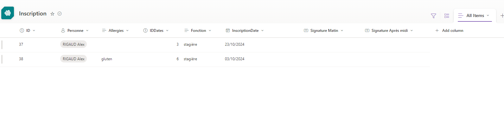

On constatera un bouton désinscription permettant de désinscrire la personne si elle est inscrit à une date

Propriété Onselect

Remove(
  Inscription,
  LookUp(
    Inscription,
    Lower(Inscrit.Email) = Lower(User().Email)
  )
);

Comment sont composer les pop up

Il y a trois conteneur qui sont créer dont 3 champs dont une présente une question par oui ou par non
Et Deux conteneurs permettant d'entrer deux champs

Ces champs seront stocker dans une variable dont deux:

UpdateContext({ VarSaveAllergie: *TextInput3*.Text });

Cet variable permet de sauvegarder la valeur dont les allergies que l'utilisateur à mentionner

UpdateContext({VarSaveFonction: *TextInput4*.Text});

Celle-ci sauvegarde la fonction de l'utilisateur

pop 1

La pop 1 possèdent un label représentant la question, on y ajoute deux bouton

Si l'utilisateur clique sur Oui l'utilisateur devra renseigner son allergies.

Dans ce cas la popup1 ainsi que tous son contenu disparaîtra et laissera place à une autre qui est la pop2

Si l'utilisateur clique sur Non cela passera directement à la popup3

Le Conteneur popup1 possèdent la variable "VarVisible" dans la propriété Visible

Dans la proptiété Onselect du Bouton_oui possède 2 variables qui sont définies dont

La variable VarVisible correspond aux conteneurs Popup1 ce qui veut dire que quand le bouton non sera
Selectionnez la Popup1 disparaîtra ainsi que tous son contenues.

Set(VarVisible, false);

Set(VarPopUpInput, true)

Ainsi la variable "VarPopUpInput" correspond à l'autre PopUp qui est la PopUp2

La PopUp2 possèdent également un label et possèdent un Text d'entrer et un bouton

Le text d'entré sera mode multiline, ce qui veut dire que la personne pourra entrez plus de contenue et sautez des ligne  
tandis que single line l'utilisateur ne pourra que écrire sur une ligne.

Dans la propriété DisplayMode on ajoute cet ligne sur le bouton soumettre

If(
  IsBlank(*TextInput3*.Text),
  DisplayMode.Disabled,
  DisplayMode.Edit
)

Si la valeur d'entré du TextInput est vide le bouton "soumettre" sera Desactiver dans le cas contraire il s'activera.

Dans la propriété Onselect on enregistre, la valeur du textInput dans une variable et on utilise une fonction qui est similaire à Set.

Comme on la vue Set permet de définir des variables mais la fonction UdpateContext le fait également. Mais les deux on des différences

Set : Définit une variable et est fonctionnels sur toutes l'application c'est pourquoi il est recommandé d'utiliser cette fonction

UdpateContext : Définit également une variable mais est utilisé seulement sur un seul écran et ne peut être définit sur un autre.

A noté que les syntaxes de la fonction Updatecontext peut être compliqué à retenir

UpdateContext({ VarSaveAllergie: *TextInput3*.Text });

Cela dit elle définit une variable qui relie le composant TextInput3 avec un attachement Text pour récupérer le contenue.
Ainsi on aura récupérer la valeur text dans VarSaveAllergie.

Mais le bouton Soumettre ne fait pas que enregistrer la valeur enregistrer il suprimme le conteneur VarPopUpInput et affiche le dernier conteneur Popup3

UpdateContext({ VarSaveAllergie: *TextInput3*.Text });
Set(VarPopUpInput, false);
Set(VarPopUpInput2, true)

Le principe est le même pour la troisième conteneur nommé Popup3

Propriété DisplayMode du bouton Soumettre de la Popup3

If(
  IsBlank(*TextInput4*.Text),
  DisplayMode.Disabled,
  DisplayMode.Edit
)

La seul chose qui change c'est que le bouton de la dernière pop-up permet d'inscire l'utilisateur

UpdateContext({VarSaveFonction: *TextInput4*.Text});

Patch(
  Inscription,
  Defaults(Inscription),
  {
    Inscrit: {
      '@odata.type': "#Microsoft.Azure.Connectors.SharePoint.SPListExpandedUser",
      Claims: "i:0#.f\|membership\|" & User().Email,
      Department: "",
      DisplayName: User().FullName,
      Email: User().Email,
      JobTitle: "",
      Picture: ""
    },
    IDDates: *Gallery4*.Selected.ID,
    Allergies: VarSaveAllergie,
    Fonction: VarSaveFonction,
    InscriptionDate: Vardate

  }
);
Set(
  VarPopUpInput2,
  false
);

Le code va permettre à l'utilisateur utilisant l'application de s'enregistrer dans la liste Inscription
Le code est exactement similaire à l'application précédente sauf que deux éléments on été ajouté dont
Allergies, Fonction et InscriptionDate
Bien evidement dans ces collone on ajoute les variable qui ont stocké les valeurs entrées par l'utilisateur.

On ajoute également une limite d'inscription de l'utilisateur. Pour ce faire on va dans la propriété Displaymode

Et on ajoute ce code :

If(
  CountRows(
    Filter(
      Inscription,
      Lower(Inscrit.Email) = Lower(User().Email) && InscriptionDate = ThisItem.Dates
    )
  ) = 0,
  DisplayMode.Edit,
  DisplayMode.Disabled
)

La fonction CountRows permet de compter en fonction du filtre appliquer, c'est-à-dire si au moins
Un utilisateur dont l'utilisateur courant à été trouvé dans la collonne Personne et qu'il à cliquer sur l'item qui à une dates et que ce dernier est inscrit sur la collone InscriptionDate, il sera Desactiver. Dans le cas contraire il sera actif.

À noter que le code permettant de désactiver le bouton Se désinscrire est similaire au code précédent

If(
  IsBlank(
    LookUp(
      Inscription,
      Personne.Email = User().Email && ThisItem.Dates = InscriptionDate
    )
  ),
  DisplayMode.Disabled,
  DisplayMode.Edit
)

Il y a aussi une icone permettant d'afficher les utilisateur qui se sont inscrit à une date.

Mais ce dernier dépendra de la sélection de l'utilisateur courant.

Pour cela sur le bouton nous allons dans la propriété OneSelect.

Navigate(*Screen2*);
Set(
  FilterDate,
  ThisItem
)

Cet icone permettra de naviguer sur l'autre page de l'application on définira une variable
Qui sera attacher à l'icone. A noter que 'ThisItem' affichera tous ce qui sera présent dans la gallerie

Dans la deuxième page il y aura un tableau et deux bouton, dont un servira pour retourner sur l'écran précédent
Et l'autre pour imprimer la liste des inscrits.

Voici un concept de test pour afficher les utilisateur inscrit ainsi que tous les champs qu'il a mis

Dans le tableau on ajoute ce code à la propriété items, ce qui aura pour but de mettre du contenues selectionné d'une liste

Filter(Inscription, FilterDate.Dates = InscriptionDate)

Ce code filtre la liste inscription, on peut voir que la variable FilterDate est définit par Dates ce qui veut dire que le filtre s'appliquera en fonction de la choisis et vérifiera si elle correspond à la collone InscriptionDate.

Pour le bouton à gauche il faut mettre un "Back()" dans la propriétés Onselect

Pour le bouton à droite ce dernier servira d'impression d'écran

Toujours dans la propriété Onselect on met cet fois ci "Print()" qui va permettre d'imprimer la page.

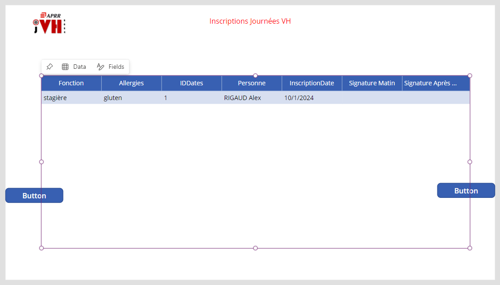

Image2

X:
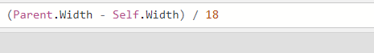

Container3 :

BorderColor: RGBA(0, 18, 107, 1)
BorderStyle: BorderStyle.Solid
BorderThickness: 10
DropShadow: DropShadow.None
RadiusBottomLeft: 6
RadiusBottomRight: 6
RadiusTopLeft: 6
RadiusTopLeft: 6
Width: (Parent.Width / 1.35 )
X: (Parent.Width - Self.Width) / 2

Label3:

Align: Align.Center
Text: "Pour vous inscrire, cliquez sur le bouton ‘Sélectionner’ à côté de la date correspondante.​Pour information, vous pourrez vous désinscrire jusqu’à 1 mois avant la date de la journée.​Si besoin, vous pouvez contacter : …..@aprr.fr"
X: (Parent.Width - Self.Width) / 2
Y: (Parent.Height - Self.Height) / 2

Container4:

Width: Parent.Width / 1.15

Seul La largeur est modifier on prend la largeur de Screen1 et on le divise par 1.15

Mercredi 05/06/2024
Je me suis occupé à remettre les réponses des utilisateurs d'une application de test en aptitude pour devenir chef de chantier

Jeudi 06/06/2024

Je me suis occupé à rendre l'application d'inscription RH plus beau

Il a eu des modification dans la deuxième pages

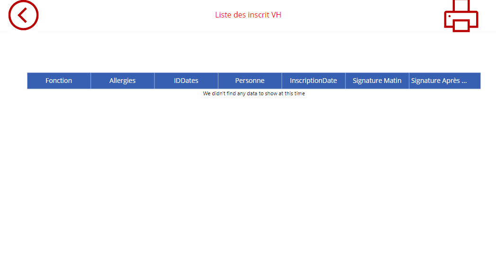

Les bouton de test on été remplacer par des icones qui sont mis sur un component nommé header_component.

En fonction de la page ces icones son caché et ne s'affichera que sur une page demandé.

Dans la propriété visible de l'icone à gauche et de droite on ajoute ce code

Switch(
  *App*.*ActiveScreen*.Name,
  "Screen_inscription",
  false,
  "Screen_print",
  true
)

Ce code veut dire que si l'icone est sur la page "Screen_inscription" il sera alors invisible sinon si il est sur "Screen_print" alors il sera visible

Pour l'icone APRR qui se trouve sur la page "Screen_inscription" se sera l'inverse

Switch(
  *App*.*ActiveScreen*.Name,
  "Screen_inscription",
  true,
  "Screen_print",
  false
)

On l'affichera dans la page "Screen_inscription" et pas dans "Screen_print".

Il y a également un label qui affiche un différent message sur les deux pages

La page "Screen_inscription" affichera "Inscription journée VH" tandis que la page "Screen_print" affichera le message "Liste des inscrit VH".

Switch(
  *App*.*ActiveScreen*.Name,
  "Screen_inscription",
  "Inscription journée VH",
  "Screen_print",
  "Liste des inscrit VH"
)

Ce code dit que si l'utilisateur est sur la page "Screen_inscription" le label affichera le message "Inscription journée VH" sinon si l'utilisateur est sur la page "Screen_print" le message sera "Liste des inscrit VH".

Il y a eu des modification sur le bouton imprimer car le bouton imprime toute la page, par conséquent les bouton sont alors visible lors de l'impression. Pour y remédier j'ai tester différente façon.

Suprimer le header_component après avoir cliquez sur le bouton et affichez l'impression mais en cela à été un echec car le bouton impression prend une capture instantanément.

Alors la solution était de créer un petit timer, pour faire simple j'ai ajouté un composant timer qui permet de laisser un temps d'impression pour imprimer la page.

Ce timer sera invisible pour éviter toute anomalie d'impression

L'utilisateur devra attendre 3 seconde pour que l'utilisateur puisse imprimer la page des inscrits

Pour ce faire on ajoute un item timer

Dans la propriété Onselect du bouton imprimer on ajoute deux variables

Set(VarStartTimer, true);
La variable pour démarrer le timer

Set(
  Var_container_visible,
  false
);

Une variable pour rendre visible ou invisible le conteneur

Pour rappel, les variable qui sont dans un composant doit être mis dans la propriété Onstart de l'application.
Pour appliquer la modification faite clique droit sur App puis sur Run OnStart.

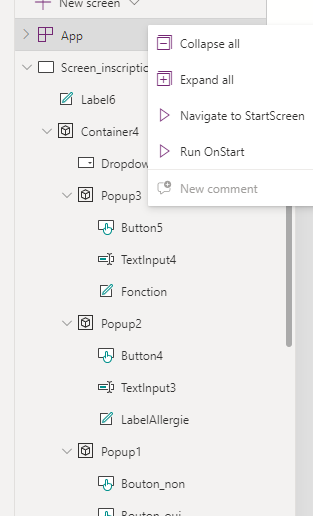

Dans les propriétés du Timer selectionnez Duration mettez-le à 3000 qui correspond à 3s.

Dans la propriété OntimerEnd on met :

Print();
Set(Var_container_visible, true)

Ce qui veut dire que quand le chrono sera à 3s ce qui correspond sa limite de temps. l'action exécutera l'impression de l'écran et rendra visible le composant header.

Cet propriété s'appelle OntimerEnd:

Print();
Set(Var_container_visible, true)

Quand Le temps sera écouler à 3 seconde soit la limite du temps l'action exécutera cet action.

Modification des couleurs de l'application

Les couleurs des bouton ainsi que des pop-up ont été améliorer

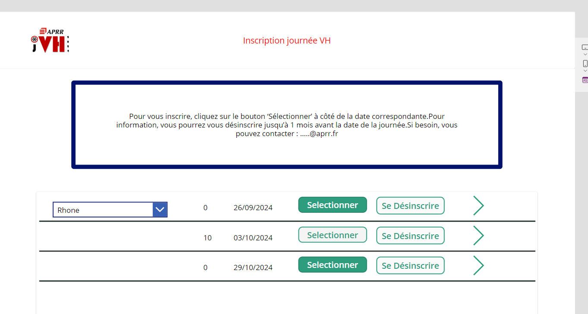

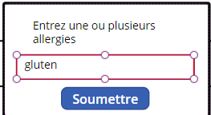

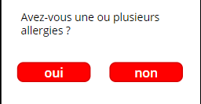

Les bouton désactivés on une couleur inverser par rapport à ceux qui sont activés

Les flèches permettant d'afficher les utilisateurs inscrits sont de la même couleurs que les boutons

Même quand on passe la souris sur un bouton il change de couleur

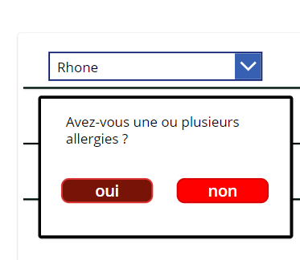

Propriété permettant de modifier la couleur des bordures des boutons désactivé

DisabledBorderColor

RGBA(46, 157, 126, 1)

Propriété permettant de mettre la couleur d'un texte de bouton

DisabledColor

Changer de couleur quand la souris est sur un bouton

HoverFill

Vendredi 07/06/2024

Finalisation de l'application et correction de bugs

- La personne qui utilise le compte ne peut s'inscrire sur plusieurs dates différente

Pour résoudre ce problème il faut supprimer le filtre qui permet de vérifier si la date choisi de l'utilisateur était égale à la colonne InscriptionDate.

If(
  CountRows(
    Filter(
      Inscription,
      Lower(Inscrit.Email) = Lower(User().Email)
    )
  ) = 0,
  DisplayMode.Edit,
  DisplayMode.Disabled
)

- Attribuer une limite à 10 utilisateur inscrit à une même date

Pour cela on ajoute une autre condition

CountRows(
    Filter(
      Inscription,
      ThisItem.Dates = InscriptionDate
    )
  ) \< 10,
  DisplayMode.Edit,
  DisplayMode.Disabled
)

On introduit un autre CountRows pour compter le nombre de personne et si en fonction de la date de l'item selectionner est égale à la colonne InscriptionDate et que le nombre
d'inscription est strictement inférieur à 10 la personne pourra cliqué sur le bouton pour s'inscrire. Sinon il sera désactiver si le nombre d'inscription dépasse de 10.

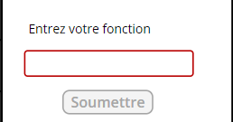
