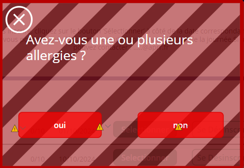
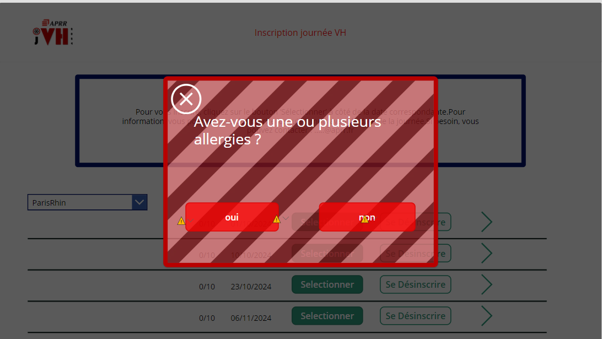
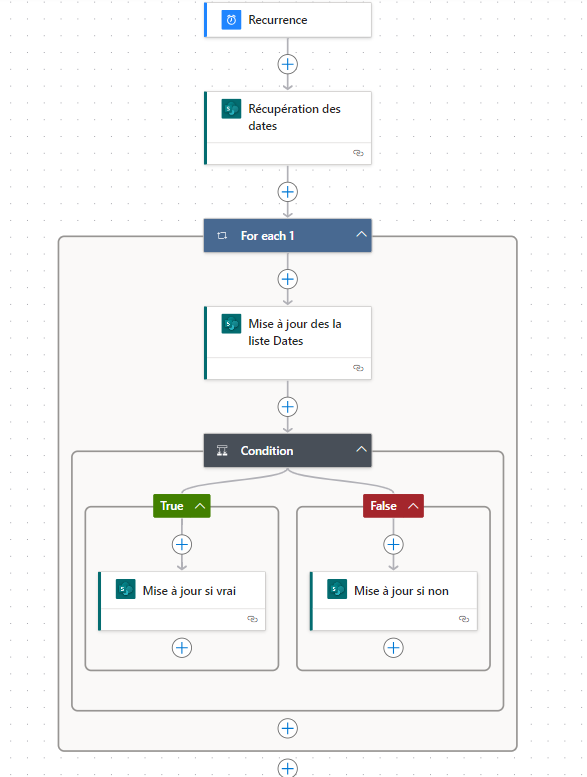

Lundi 10/06/2024

Continuité sur la modification du designe de l'application

Modifications des pop up

Les pop-ups ont changer de design

Aperçu en écran

La pop-up à été recentrer la position x et y

X: (Parent.Width - Self.Width) / 2

Y: (Parent.Height - Self.Height ) / 2

La deuxième popup prendra la position de Popup1 on ajoutera pour cela dans la propriété X et Y :

X: Popup1.X

Y: Popup2.y

J'ai également diminué le nombre de pop-up, c'est-à-dire la pop-up permettant d'entrer le nom de sa fonction à été retiré et remplacé par un champ dans le patch qui permet d'ajouter un utilisateur à une liste

On appelle le champ "Office365Users.MyProfile().JobTitle" ce qui permet de récupérer le rôle ou la fonction de l'utilisateur depuis le profil Microsoft.

Par défaut si on l'ajoute dans la colonne fonction de la liste "inscription" ce qui donnerait

Fonction: Office365Users.MyProfile().JobTitle

La table afficherait la fonction de l'utilisateur comme ceci "NOM_DE_LA_FONCTION".
Cela signifie que le champ "jobTitle" du profile Microsoft sera écrit en majuscule pour y remedier on peut
ajouter une fonction lower pour qu'il affiche le champ en minuscule ce qui donnerait ceci

Fonction: Lower(Office365Users.MyProfile().JobTitle)

Ce qui veut dire que le champ de la collone fonction sera écrit en minuscule.

On peut également jouer le jeu en mettant la première lettre en Majuscule et les autres en minuscule

Ce qui donnerait ceci

Set(VarVisibleContent, false);
Set(VarVisible, false);
Patch(
  Inscription,
  Defaults(Inscription),
  {
    Inscrit: {
      '@odata.type': "#Microsoft.Azure.Connectors.SharePoint.SPListExpandedUser",
      Claims: "i:0#.f\|membership\|" & User().Email,
      Department: "",
      DisplayName: User().FullName,
      Email: User().Email,
      JobTitle: "",
      Picture: ""
    },
    IDDates: *Gallery4*.Selected.ID,
    Allergies: VarSaveAllergie,
    Fonction:
    // Formule pour convertir la première lettre en majuscule
Upper(
  Left(
    Lower(Office365Users.MyProfile().JobTitle),
    1
  )
) & Lower(
  Mid(
    Lower(Office365Users.MyProfile().JobTitle),
    2,
    Len(Lower(Office365Users.MyProfile().JobTitle)) - 1
  )
),
    InscriptionDate: Vardate

  }
);
Set(
  VarPopUpInput2,
  false
);

Méthode touver par Chagpt

Pour mettre la première lettre en majuscule d'un mot dans Power Apps, vous pouvez combiner plusieurs fonctions de chaîne. Voici un exemple de comment vous pouvez transformer la première lettre en majuscule et les autres lettres en minuscules :

\### Utilisation des Fonctions de Chaîne

Vous pouvez utiliser les fonctions \*\*\`Upper\`\*\*, \*\*\`Lower\`\*\*, \*\*\`Left\`\*\*, \*\*\`Right\`\*\*, et \*\*\`Mid\`\*\* pour manipuler la chaîne de caractères. Voici un exemple de formule qui convertit la première lettre en majuscule et les autres lettres en minuscules.

\#### Étapes

1\. \*\*Extraire la Première Lettre\*\* : Utilisez la fonction \`Left\` pour extraire la première lettre et la fonction \`Upper\` pour la convertir en majuscule.
2\. \*\*Extraire le Reste de la Chaîne\*\* : Utilisez la fonction \`Mid\` pour extraire les caractères restants de la chaîne et la fonction \`Lower\` pour les convertir en minuscules.
3\. \*\*Concaténer les Deux Parties\*\* : Utilisez l'opérateur de concaténation (\`&\`) pour combiner les deux parties.

\### Exemple de Code

Supposons que vous avez une chaîne de caractères \`jobTitle\` obtenue à partir de \`Office365Users.MyProfile().JobTitle\`.

\`\`\`powerapps
// Variable contenant le job title en minuscules
Set(jobTitle, Lower(Office365Users.MyProfile().JobTitle));

// Formule pour convertir la première lettre en majuscule
Upper(Left(jobTitle, 1)) & Lower(Mid(jobTitle, 2, Len(jobTitle) - 1))
\`\`\`

\### Explication de la Formule

\- \*\*\`Left(jobTitle, 1)\`\*\* : Extrait la première lettre de \`jobTitle\`.
\- \*\*\`Upper(Left(jobTitle, 1))\`\*\* : Convertit la première lettre en majuscule.
\- \*\*\`Mid(jobTitle, 2, Len(jobTitle) - 1)\`\*\* : Extrait tous les caractères à partir du deuxième caractère jusqu'à la fin de \`jobTitle\`.
\- \*\*\`Lower(Mid(jobTitle, 2, Len(jobTitle) - 1))\`\*\* : Convertit les caractères extraits en minuscules.
\- \*\*\`Upper(Left(jobTitle, 1)) & Lower(Mid(jobTitle, 2, Len(jobTitle) - 1))\`\*\* : Concatène la première lettre en majuscule avec le reste de la chaîne en minuscules.

\### Exemple Complet dans un Contexte

Si vous utilisez cette formule directement dans une propriété Text d'un contrôle Label pour afficher le Job Title avec la première lettre en majuscule :

\`\`\`powerapps
Text(
Upper(Left(Lower(Office365Users.MyProfile().JobTitle), 1)) & Lower(Mid(Lower(Office365Users.MyProfile().JobTitle), 2, Len(Lower(Office365Users.MyProfile().JobTitle)) - 1)),
TextFormat.Text
)
\`\`\`

\### Remarques

\- \*\*Gestion des Cas Particuliers\*\* : Cette méthode ne gère pas les cas particuliers tels que les titres de plusieurs mots (par exemple, "directeur général" devenant "Directeur général"). Si vous avez besoin de gérer de tels cas, vous devrez écrire une fonction plus complexe qui traite chaque mot séparément.
\- \*\*Efficacité\*\* : La formule est conçue pour être utilisée dans des situations simples. Pour des chaînes plus complexes ou pour une utilisation fréquente, envisagez de créer une fonction réutilisable.

\### Conclusion

En combinant les fonctions de chaîne comme \`Upper\`, \`Lower\`, \`Left\`, et \`Mid\`, vous pouvez facilement transformer la première lettre d'une chaîne de caractères en majuscule dans Power Apps. Utilisez cette méthode pour formater les titres ou tout autre texte où une capitalisation spécifique est nécessaire.

Site permettant de tester les connaissance au niveau dévelopement
<https://www.freecodecamp.org/>

Mardi 11/06/2024

Dans l'application inscription journée VH il manque un Timer_Verrou, ce Timer_verrou va permettre d'éviter que 2 utilisateurs s'inscrive sur une même date en même temps si le quotat d'inscription est à 10, ce qui renforce la sécurité pour y remedier on insert un timer.

Dans la propriété Duration on ajoute un temps aléatoire

(RandBetween(
  0,
  3
) + Rand()) \* 1000

Dans la propriété OntimerEnd on ajoutera le patch qui était censé être dans le bouton_non du conteneur Popup2 et dans le bouton soumettre de la Popup1.

Voici la description récupérer depuis un code d'une application

/\*
Pour transposer ce timer dans un autre projet, on peut le coller dans une galerie et changer les variables suivantes :
Reporting_TestVerrou  (nom de la liste des gens déjà inscrits)
Users (nom de la colonne de la liste Reporting_TestVerrou où est enregistré l'utilisateur)
Il faudra aussi ajouter sur le bouton "S'inscrire":
UpdateContext({varStartRandomTimer: true});
Set(varDatesSelect,ThisItem.Dates);
Set(varCreneauSelect,ThisItem.Creneau);
Set(varPlaceSelect,ThisItem.Places);
et modifier les nom de variables suivants
Dates   (nom de la colonne de la liste Reporting_TestVerrou où est enregistrée la date du créneau)
Creneau  (nom de la colonne de la liste Reporting_TestVerrou où est enregistré le créneau)
Places (nom de la colonne de la liste SharePoint qui liste les créneaux où est indiqué l\<e nombre de places disponibles)

Principe de fonctionnement :
On vérifie le nombre de réservations -\> si inférieur au nombre de places - 1 -\> On réserve. Sinon, on vérifie une nouvelle fois que c'est bien la dernière place. Si oui, on patch. À la fin, on fait une dernière vérification du nombre d'inscrits et on enlève l'utilisateur si on le dépasse.
+------------------------+    +--------------------------+    +-----------------------+
\|            \|    \|             \|    \|            \|
\| Vérifier le nombre de \|    \| Si inférieur au nombre  \| oui  \|            \|
\| réservations      \|--------\| de places - 1      \|--------\|   Réserver     \|
\|            \|    \|             \|    \|            \|
+------------------------+    +--------------------------+    +-----------------------+
                   \| non                \|
                   v                  \|
               +------------------+            \|
               \|         \|            \|
               \|  Vérifier que  \|            \|
               \|  c'est bien la \|            \|
               \|  dernière place \|            \|
               \|         \|            \|
               +------------------+            \|
                   \|                  \|
                   v                  \|
               +------------------+            \|
               \|         \|            \|
               \|    Patch   \|            \|
               \|         \|            \|
               +------------------+            \|
                        \|             \|
                        v             v
                        +--------------------------+
                        \|             \|
                        \|  Dernière vérification \|
                        \|  du nombre d'inscrits  \|
                        +--------------------------+
                               \|
                               v
                        +--------------------------+

                        \|  Enlever l'utilisateur \|
                        \|  si on le dépasse    \|
                        +--------------------------+

\*/

Dans le code qui à été repris il faut juste enlever 2 CompteRows car il causerait un mauvais fonctionnement du patch

Voici ce qui à été enlever

If(
  // Vérifie si le nombre d'inscriptions pour la date et le créneau sélectionnés est supérieur ou égal au nombre de places disponibles moins 1
  CountRows(
    Filter(
      Inscription,
      Vardate = InscriptionDate && varCreneauSelect = Creneau
    )
  ) \>= varPlaceSelect - 1,

  // Condition si le créneau est déjà plein
  If(
    CountRows(
      Filter(
        Inscription,
        Vardate = InscriptionDate && varCreneauSelect = Creneau
      )
    ) \>= varPlaceSelect,
    // Notifie l'utilisateur que le créneau est complet
    Notify(
      "Le créneau a déjà été réservé par quelqu'un d'autre.",
      NotificationType.Error
    );
    // Rafraîchit les données
    Refresh(Inscription),

Le code de l'autre application resemblait en lui-même à ceci

If(
CountRows(
Filter(
Reporting,
varDatesSelect = Dates && varCreneauSelect = Creneau
)
) \>= varPlaceSelect - 1,
If(
CountRows(
Filter(
Reporting,
varDatesSelect = Dates && varCreneauSelect = Creneau
)
) \>= varPlaceSelect,
Notify(
"Le créneau a déjà été réservé par quelqu'un d'autre.",
NotificationType.Error
);
Refresh(Reporting);
,
Patch(
Reporting,
Defaults(Reporting),
{
Users: {
'@odata.type': "#Microsoft.Azure.Connectors.SharePoint.SPListExpandedUser",
Claims: "i:0#.f\|membership\|" & User().Email,
Department: "",
DisplayName: User().FullName,
Email: User().Email,
JobTitle: "",
Picture: ""
},
Creneau: varCreneauSelect,
Dates: varDatesSelect
}
)
)
,
Patch(
Reporting,
Defaults(Reporting),
{
Users: {
'@odata.type': "#Microsoft.Azure.Connectors.SharePoint.SPListExpandedUser",
Claims: "i:0#.f\|membership\|" & User().Email,
Department: "",
DisplayName: User().FullName,
Email: User().Email,
JobTitle: "",
Picture: ""
},
Creneau: varCreneauSelect,
Dates: varDatesSelect
}
)
);
// Derniere verification au cas ou deux personne se sont inscrites en même temps
If(
CountRows(
Filter(
Reporting,
varDatesSelect = Dates && varCreneauSelect = Creneau
)
) \> varPlaceSelect,
Remove(
Reporting,
LookUp(
Reporting,
Lower(Users.Email) = Lower(User().Email) && varDatesSelect = Dates && varCreneauSelect = Creneau
)
);
Notify(
"Le créneau a déjà été réservé par quelqu'un d'autre.",
NotificationType.Error
);
);
UpdateContext({varStartRandomTimer: false});
Refresh(Reporting);
Set(
varLoading,
false
)

Comme la description le dis, Si un utilisateur prend le créneau alors que la disponibilité est de moins d'une seule personne la plage de créneau sera considérer comme plein. Hors dans notre cas nous avons déjà définit la limité d'utilisateur inscrit qui était de 10. Dans le bouton Selectionner vers la propriété DisplayMode. Un CountRows à déjà été définit (enfin deux).

If(
      CountRows(
        Filter(
          Inscription,
          Lower(Inscrit.Email) = Lower(User().Email)
        )
      ) = 0 &&
      CountRows(
        Filter(
          Inscription,
          ThisItem.Dates = InscriptionDate
        )
      ) \< 10,
      DisplayMode.Edit,
      DisplayMode.Disabled
)

Si on avait ajouter le code qui est commenté en vert dans la propriété du timer soit OntimerEnd, cela aurait créer un conflit entre ces deux codes ce qui empêcherait l'inscription de l'utilisateur.

De plus le code nécessite que d'un seule patch, pour une raison inconnu dans le code le patch pour inscrire l'utilisateur dans la liste est ajouté deux fois. Mais dans ce code cela est inutile car il sera inscrit deux fois à la même dates si on l'ajoute deux fois.

Dans la propriété Start du Timer_Verrou on introduira une variable par exemple

varStartRandomTimer

Ce qui veut dire que soit le bouton bouton_non dans la Popup1 ou le bouton Soumettre définira la variable du timer dans la propriété Start à true. On l'auras deviné les deux boutons déclencherons le timer.

Bien évidement se timer ne sera pas visible par les utilisateurs donc il faudra définir la propriété Visible à false.

Modification des boutons les bordure on été enlevé quand ils sont actif et sont réactiver quand il sont inactif,

Voici le code

If(*Selectionner*.DisplayMode = DisplayMode.Edit,
  0,
  2
)

Ce code dis que si le bouton est en mode actif la bordure sera de 0 sinon elle sera de 2.

Mercredi 12/06/2024

Site des différentes propriété du timer

<https://learn.microsoft.com/fr-fr/power-apps/maker/canvas-apps/controls/control-timer>

Appelle M. Girard

1.  Créer l'azure devops
2.  Créer les récits utilisateur qualifier par les compétence du domaine B1
3.  Créer les tâches avec les qualifications des compétences B2 et B3

Visite à planifier, le 24 après-midi, 25 ou le 26 en fin de matiné

…

\#### Étapes

1\. \*\*Créer une liste SharePoint\*\*
\- Connecte-toi à ton compte SharePoint.
\- Crée une nouvelle liste appelée "Tâches".
\- Ajoute les colonnes suivantes :
\- \`Titre\` (Texte)
\- \`Description\` (Texte)
\- \`Statut\` (Choix : "À faire", "En cours", "Terminé")

2\. \*\*Créer une application PowerApps\*\*
\- Connecte-toi à PowerApps (<https://make.powerapps.com/>).
\- Sélectionne "Canvas app from blank".
\- Nommer l'application "Gestion des Tâches".
\- Choisir un format (phone ou tablet).

3\. \*\*Connecter l'application à SharePoint\*\*
\- Dans PowerApps Studio, clique sur "Data" dans le menu de gauche.
\- Ajoute une connexion vers ta liste SharePoint "Tâches".

4\. \*\*Créer un écran d'affichage des tâches\*\*
\- Ajoute un nouvel écran (Blank Screen) et nomme-le "Liste des Tâches".
\- Ajoute une galerie (Insert \> Gallery \> Vertical) à cet écran.
\- Configure la galerie pour afficher les éléments de ta liste SharePoint "Tâches".
\- Personnalise les champs affichés dans la galerie (Titre, Description, Statut).

5\. \*\*Ajouter un écran de détail des tâches\*\*
\- Ajoute un nouvel écran (Blank Screen) et nomme-le "Détail de la Tâche".
\- Ajoute des champs (Label, Text Input) pour afficher et modifier les détails de la tâche sélectionnée.
\- Configure la navigation entre la galerie et l'écran de détail en utilisant des boutons et des actions (OnSelect).

6\. \*\*Créer un écran pour ajouter des tâches\*\*
\- Ajoute un nouvel écran (Blank Screen) et nomme-le "Nouvelle Tâche".
\- Ajoute des champs (Text Input, Dropdown) pour permettre à l'utilisateur de saisir les détails de la nouvelle tâche.
\- Ajoute un bouton "Ajouter" avec une action pour créer une nouvelle tâche dans SharePoint.

7\. \*\*Configurer les actions de suppression de tâches\*\*
\- Sur l'écran de détail des tâches, ajoute un bouton "Supprimer".
\- Configure le bouton pour supprimer la tâche actuelle de SharePoint.

8\. \*\*Tester et publier l'application\*\*
\- Teste l'application en ajoutant, visualisant et supprimant des tâches.
\- Publie l'application et partage-la avec les utilisateurs de ton organisation.

\#### Ressources Utiles
\- \[Documentation PowerApps\](https://docs.microsoft.com/en-us/powerapps/maker/canvas-apps/)
\- \[Tutoriels Vidéo PowerApps\](https://www.youtube.com/playlist?list=PLCGGtLsUjhm1vKCNfngvBa1v4W_DgkU7P)
\- \[Exemples de PowerApps sur GitHub\](https://github.com/microsoft/PowerApps-Samples)

En réalisant cet exercice, tu te familiariseras avec les concepts de base de PowerApps, tels que la création de galeries, la navigation entre les écrans, et les connexions à des sources de données externes comme SharePoint. Bon courage !

Jeudi 13/06/2024

Power Automate
/ Mettre en place un flux power automate qui s'exécute une fois par jour automatiquement.

/ Power Automate
A chaque exécution le flux parcoure la liste

/ Creation d'une collone sharepoint
Créer une collone type booléen

Date Sharepoint
/ Possession d'ancienne dates et nouvelles

/ Création dans poweraps :
Créer une condition si la date selectionné est passé alors il faut mettre non au booléen, sinon il faut mettre oui.

Vendredi 14/06/2024

Schéma Automate

Dans ce schéma il y a une récurrence qui va s'exécuter tous les jours.

On va lui demander de récupérer une liste sharepoint.

Création d'une condition permettant de mettre

