Lundi 17/06/2024

3/10/2024 \< 17/06/2024

True = non

False = oui

Création d'un flux à l'aide de Power Automate.

Ce flux va permettre de mettre à jour une liste SharePoint.

1\.

Pour ce faire on va dans le site :

<https://www.microsoft.com/en-us/power-platform/products/power-automate>

2.  Connectez-vous avec un compte professionnel pour utiliser l'application

3.  Dans le menu Power Automate

4.  Dans le menu "Create" recherche le projet "Scheduled cloud flow"

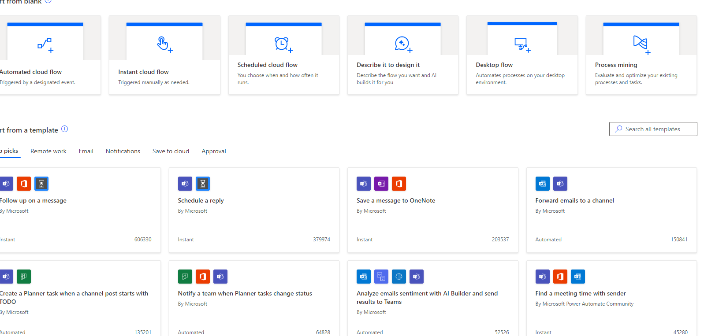

5.  Définissez ensuite la récurence dans notre cas on va le mettre à 1 fois par jour ont définira une heure par exemple 11h00

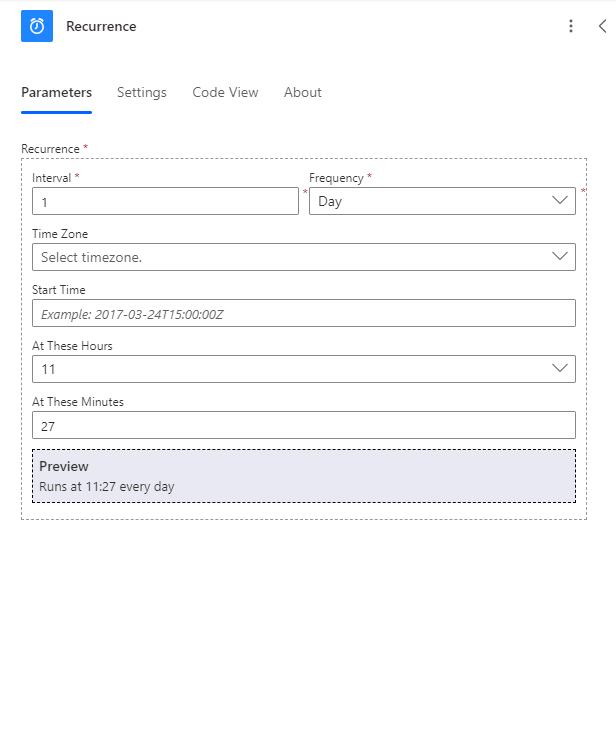

6.  La récurence va permettre de déclencher le flux à une horaire et à une période définie. Après cela on va ajouté en faisant "Add an action" quand on clique sur le +.

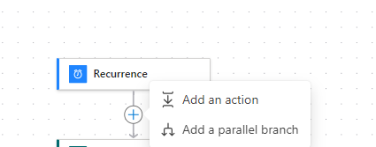

7.  On met ensuite une fonction permettant de parcourir une liste rechercher "get item" dans Sharepoint.

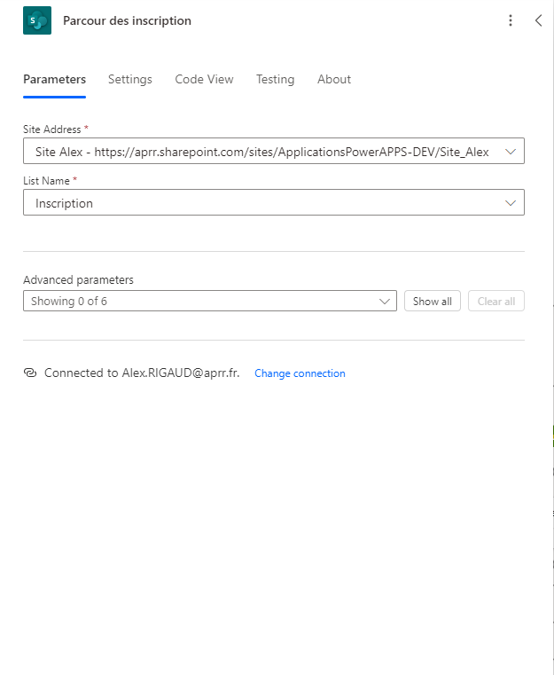
8.  Définissez le site ou se trouve la base de donné ainsi que la liste qui doit être parcourue.

Après cela on va définir une boucle nommé "Apply to each" elle va faire en fonction du nombre de collone de la liste.

9.  Pour ce faire on clique sur le + après avoir ajouté "get items" puis sur Add an action.

10. Tappez dans la barre de recherche "Apply to each".

11. Après avoir selectionner "Apply to each" dans le champ "Select An Output From Previous Steps" soit "Sélectionner une sortie des étapes précédentes" il faut mettre par défaut body/value ou "get items".

12. Dans cet boucle on va mettre une condition qui est vrai ou faux toujours en cliquant sur + et en recherchant condition.

13. Dans cet condition on veux que Si la date selectionné par l'utilisateur est inférieur à la date actuelle on veux que la collone booléen à oui dans le cas contraire la collone sera à non.
Grosse au modo si la date selectionné par l'utilisateur est périmé on mettra non à la collone booleen et oui si c'est le cas inverse.

14. Pour ce faire on clique sur la condition

15. On ajoute ceci

Dans la collone à gauche on ajoute la liste qui a été parcourue, dans cet liste l'utilisateur à choisi une date. Dans la collone du milieu on défini la condition qui est "is less than" soit inférieur à la date actuelle qui est la fonction **"utcNow()"**.

Attention sur Poweraps et sur Power Automate la fonction est différente même si c'est du lowcode.

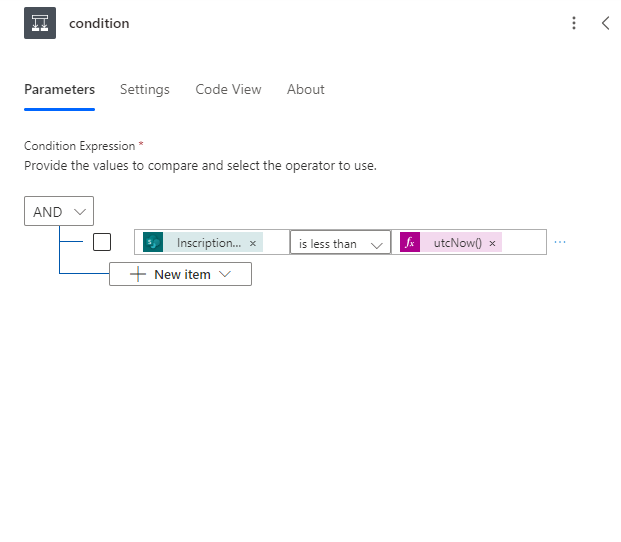

16. Après cela on ajoute dans la collone vrai la sortie de la condition vrai, on va mettre à jour la collone booleen

Dans la sortie vrai, on ajoute en appuyant sur le bouton + puis sur add an action

17. Rechercher update item pour l'option sharepoint

Dans la condition vrai on met toujours l'adress du site, la liste et dans le chap id on met ID.

Dans Advanced parameters selectionnez Boolen_dates et mettez le champ à no

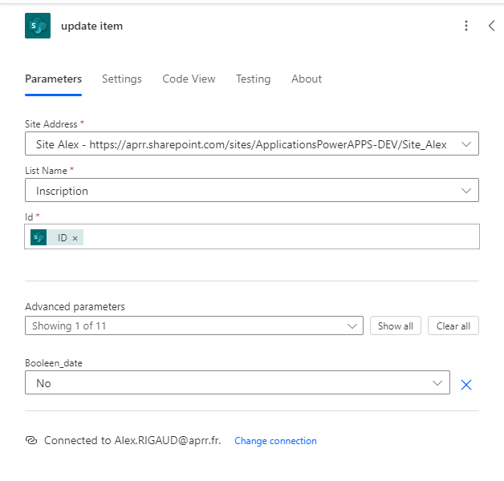

Conclusion : On à définit une collone qui dit que si la date est périmé la collone boolean date sera no. Ce qui veut dire que le champ de la collone "boolean_date" sera vide.

Faison la même chose avec la condition false

18. Dans false en cliquant toujours sur le bouton + puis sur "add an action".

19. Recherchez comme pour la partie true "update item"

20. Dans la collone Booleen_date on attribut à Yes

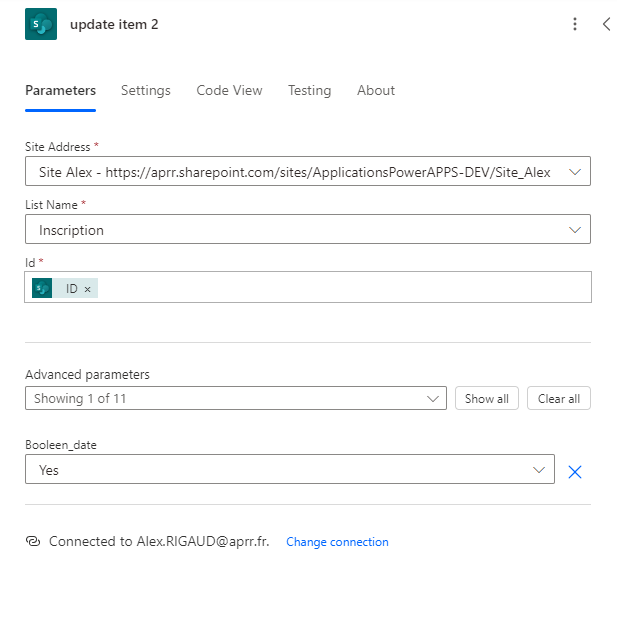

Le schéma ressemblera à ceci

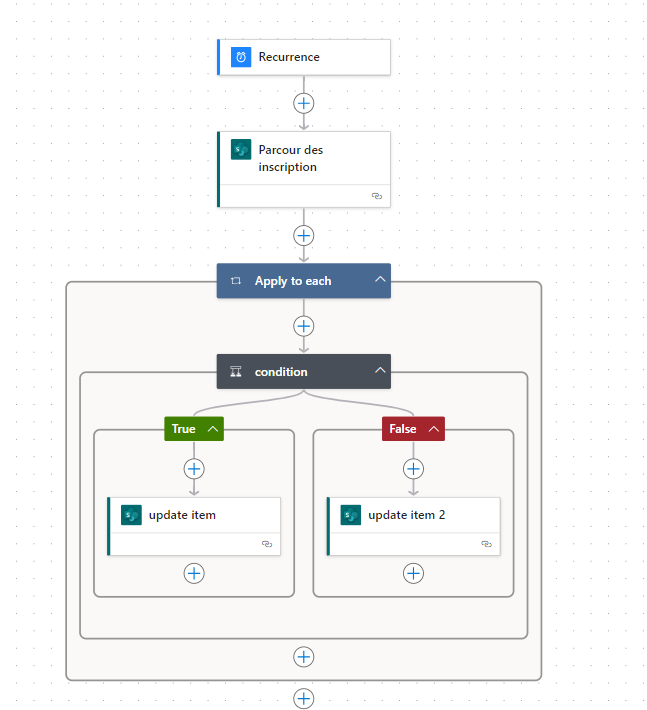

21. Faisons un test pour voir si tous fonctionne, pour cela cliquez sur "Save" en haut à droite

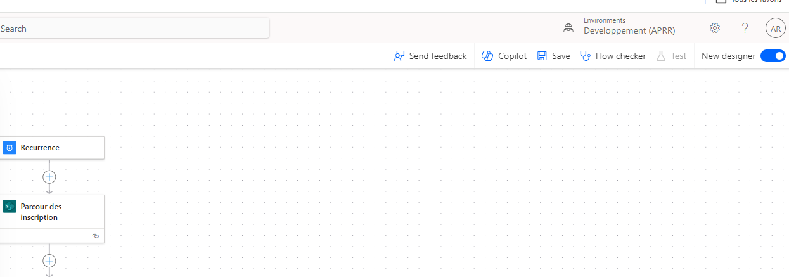

**

**

22. Il est possible que cet avertissement apparaissent fermez cet feunêtre
Cet avertissement dis qu'il n'y as pas de paramètre de restriction dans la liste sharepoint ce qui peut poser un ou plusieurs problème de sécurité.

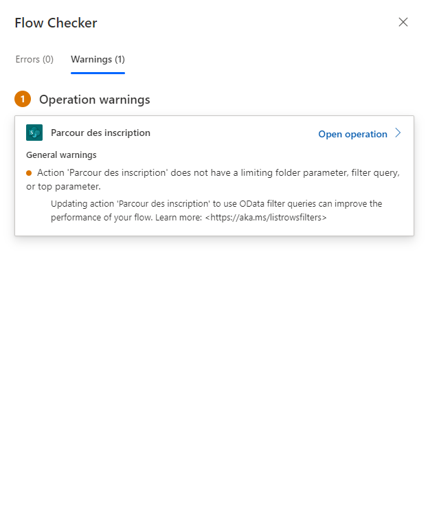

22. Une fois que cela est fait cliquez une fois de plus sur "Test".

23. Dans Test Flow il y a plusieurs choix soit le test manuel ou automatique les deux, cliquez sur n'importe lequel pour exécuté le test.

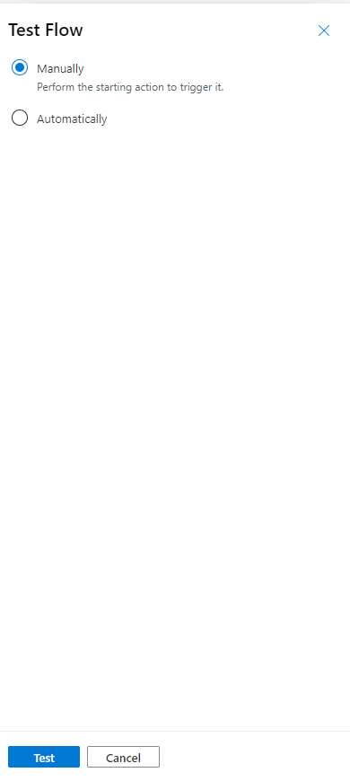

24. Par exemple dans le test manuel cliquez sur "Run flow"

25. Patientez quelque seconde et fermez cet fenêtre si ce message apparaît

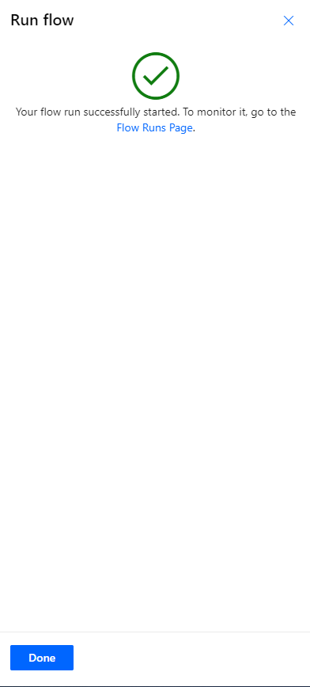

Et voilà le flux à été tester maintenant il fonctionne

Assurez-vous de bien vérifier qu'il n'y a pas d'erreur sinon le test échoue.

On peut observer un détail sur le schéma comme dans l'action true si on clique dessus.

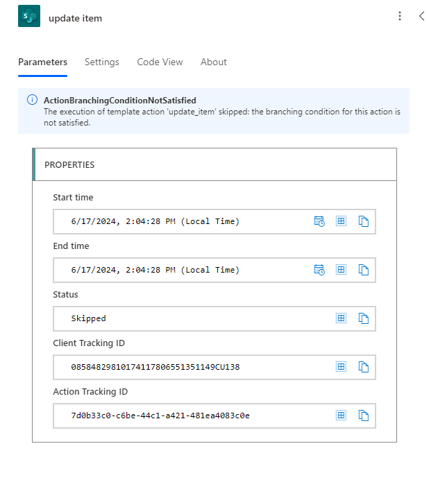

Comme on la vue tous les test du flux sont vert sauf au moment du déclenchement de la condition true.
Le message dit que la branche de la condition n'est pas satisfait, ce qui est normal car une condition ne peut pas executé à la fois true et false. Ce sera soit true ou false.

Si on regarde de plus près le test à été executé 11 fois ce qui veut dire qu'il y a 11 ligne qui on été vérifier et modifiées.

Vérifions la liste SharePoint

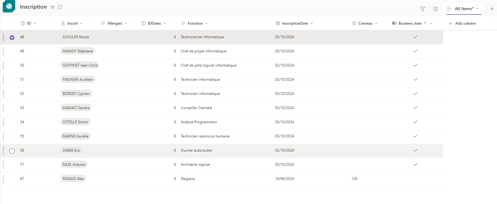
On peut voir que la liste composte 11 lignes ce qui correspond on nombre de test effectuer par le flux.

Si on clique sur la flèche on verra que jusqu'à 10 le test à effectuer la condition à false et ensuite à true puisque la dernier collone à une date périmé de la date actuelle.

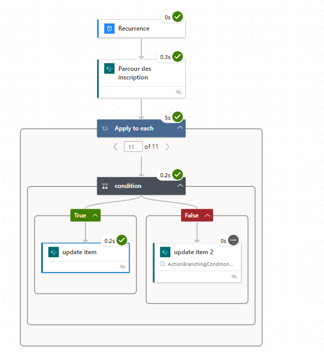

Mardi 18/06/2024

A ce jour, J'ai pue participer à une réunion du service, pour les développements de projets avenir ou en cours. Les stratégie globales de l'entreprises.

- Modification du design de l'application
- Vérification du timer

Mercredi 19/06/2024

- Correction du bug pour bloquer le bouton inscription à partir de 10 place

Ce que j'ai appris ce matin c'est que on ne peux pas mettre une variable contenant une propriété différente exemple dans un code :

Dans le Button Selectionner de l'application inscription, en analysant la propriété Onselect
If(
  CountRows(
    Filter(
      Inscription,
      Lower(Inscrit.Email) = Lower(User().Email)
    )
  ) = 0 && CountRows(
    Filter(
      Inscription,
      ThisItem.Dates = InscriptionDate
    )
  ) \< 10,
  UpdateContext({VarbuttonDisplaymode: DisplayMode.Edit}),
  UpdateContext({VarbuttonDisplaymode: DisplayMode.Disabled})
)

Une variable stocke une propriété Displaymode

Mon but consistait à faire en sorte que le bouton se désactive au moment ou l'utilisateur clique sur le bouton.

Pour ce faire il faut modifier la définition de la variable UpdateContext par Set car pour faire se procéder il faut que cet variable soit définie dans la propriété Onstart de l'aplication.

Reprenons depuis le début

Dans la propriété Onstart on définit une variable par exemple :

" DisabledButton " on définit cet variable à set ce qui donne ceci

Set(VarButtonDisabled, false);

Cet variable va être attribuer à faux pour dire que le button n'est pas desactiver

Dans le button que l'on veux desactiver quand l'utilisateur cliquera dessus, on ajoute la variable dans Onselect à true

Set(VarButtonDisabled, true);

Dans la propriété DisplayMode, on ajoute la condition :

If(VarButtonDisabled, DisplayMode.Disabled, DisplayMode.Edit)

Par défaut la variable est attribué à false donc le button sera activer si l'utilisateur clique sur le button qui doit être desactiver, la variable VarButtonDisabled sera attribué à true, ce qui veut dire que le button sera desactivé dans le cas contraire si la Variable VarButtonDisabled est définit en "false" alors le button sera actif.

Il ne reste plus qu'a mettre "Set(VarButtonDisabled, false);" dans un autre button.

Jeudi 20/06/2024

Finalisation de l'application inscription suppression de la variable "VarButtonDisabled" car elle créait un conflit avec l'application.

Modification du bouton selectionner dans la propriété DisplayMode :

If(
CountRows(
    Filter(
      Inscription,
      ThisItem.Dates = InscriptionDate
    )
  ) \< 10 && IsBlank(
    LookUp(
      Inscription,
      Lower(Inscrit.Email) = Lower(User().Email)
    )
  ),
  DisplayMode.Edit,
  DisplayMode.Disabled
)

Un LookUp à été ajouté après une vérification si le nombre de participants était supérieur à 10, permettant de vérifier si l'utilisateur était inscrit à la date selectionner. Ce qui veut dire que la condition vérifie 2 choses à présent.

Si le nombre de participants à pris 10 fois la même dates le bouton sera bloqué et également si l'utilisateur courant est inscrit à une date.

Modification, quand la popup s'affiche le fond gris reste afficher pour empêcher pendant quelque seconde que l'utilisateur puissent cliquer accidentellement sur un bouton

Dans les deux boutons qui permette de déclencher le Timer_Verrou comme le Bouton_non :

On va enlever la variable assigné au fond gris de l'application dans la propriété Onselect du Bouton.

Même chose pour le bouton "soumettre" de la deuxième popUp

Le fond gris disparaîtra une fois que le timer se sera arrêter donc il faut mettre la variable "Varvisible" à faux dans la propriété OnTimerEnd du Timer_Verrou.

Ce qui donne un rendu comme ceci :

Quand le bouton_non ou le bouton soumettre à été cliqué :

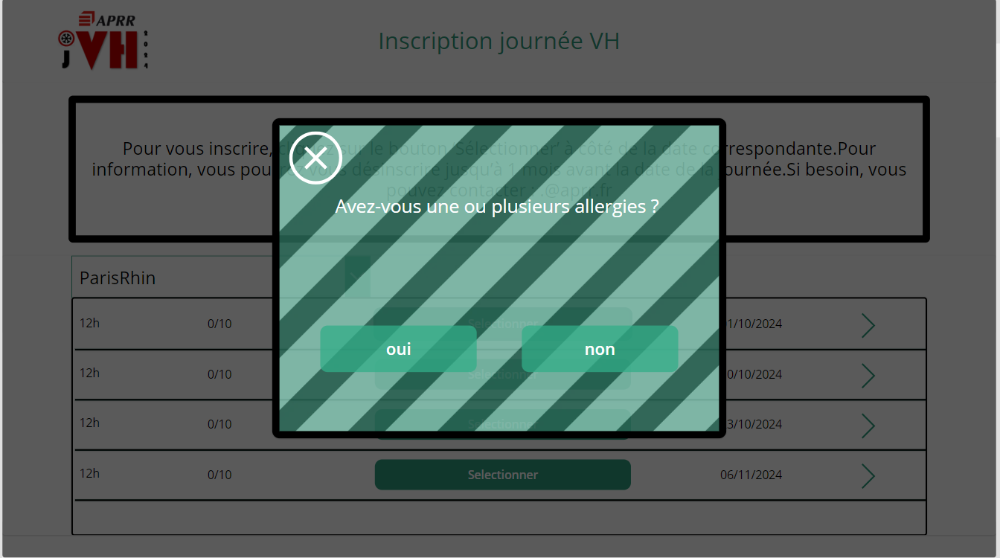

Ou

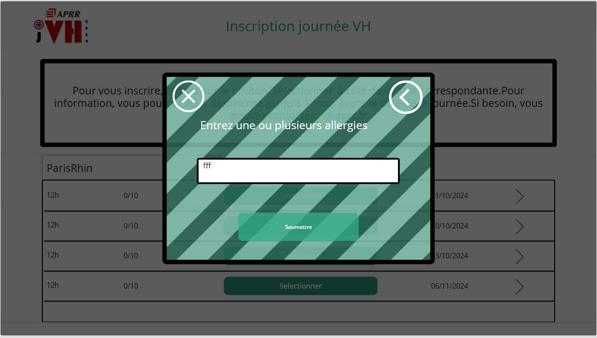

Le fond gris restera pendant un certain temps et disparaîtra une fois le temps écouler

Pendant le démarrage du timer_verrou

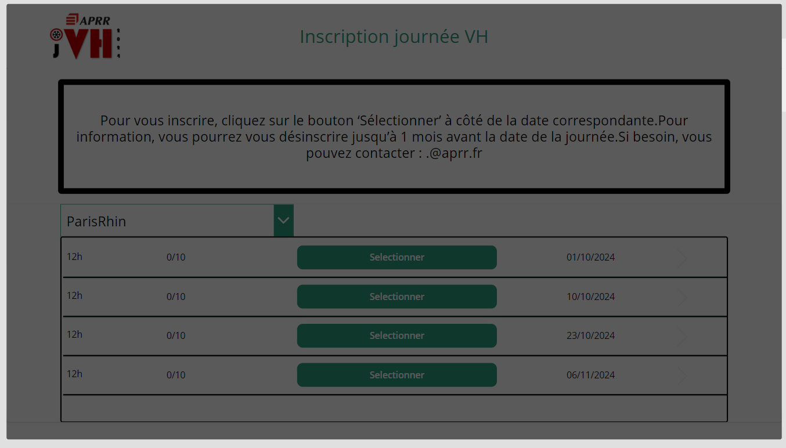

Pendant l'arrêt du Timer_Verrou

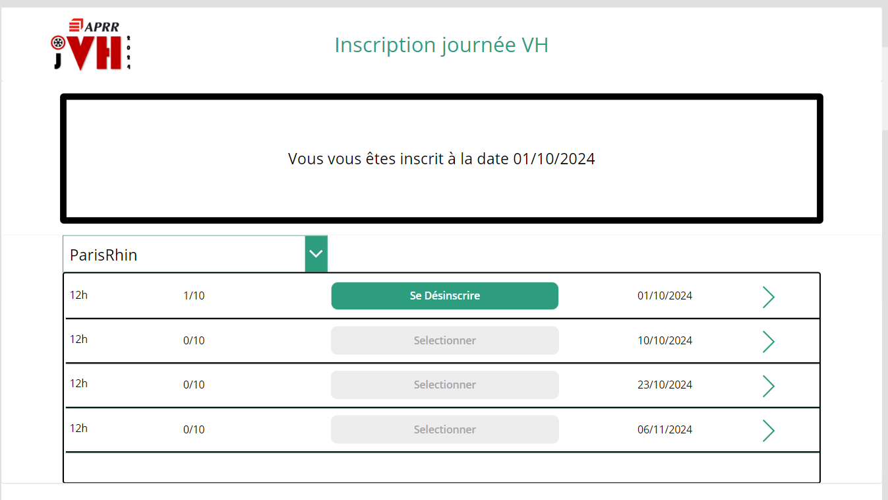

Après cela je me suis occupé de la partie responsive de l'application pour qu'elle s'adapte à toutes appareil.

Par la suite j'ai du corriger certain bug d'une application qui est une sorte de app store permettant de rechercher des applications.

Les correction apporté sont :

- Le fait de taper dans la zone de recherche le nom de l'application

- Ajout de différente couleur de domaines d'application

265 / 1297.7 = 0,2042074439392772

631 / 522.24 = 1,208256740196078

12 / 1297.7

5 / 522.24

226 / 265,00000000000006 = 0,85283018867925

93 / 630,9999999999998 = 0.1473851030111

24 / 265,00000000000006 = 0,09056603773585

298 / 630,9999999999998 = 0,4722662440571

55 / 630,9999999999998 = 0,0871632329635

30 / 201,00000000000006 = 0,14925373134328

22 / 630,9999999999998 = 0,0348652931854

167 / 265,00000000000006 = 0,63018867924528

140 / 630,9999999999998 = 0,2218700475436

53 / 265.00000000000006 = 0.2

88 / 630,9999999999998 = 0.1394611727417

11 / 2 = 5,5

22 / 265,00000000000006 = 0,08301886792453

36 / 522,24 = 0,0689

50 / 265,00000000000006 = 0,18867924528302

409 / 522,24 = 0,7832

69 / 265,00000000000006 = 0,26037735849057

36 / 522,24 = 0,0689

107 / 265,00000000000006 = 0,40377358490566

409 / 522,24 = 0,7832

Vendredi 21/06/2024

Ajout des conventions de nommages, dans l'application.

<https://www.matthewdevaney.com/power-apps-coding-standards-for-canvas-apps/power-apps-standards-naming-conventions/>

Les conventions de nommage sert à rendre claire et précis les élément utiliser dans PowerAps en simplifiant leurs nom.

Par exemple au lieu d'écrire bouton on peut dire btn.

Ajout d'un text input permettant de rechercher le nom de l'application

con_picture_resize3:
        Control: GroupContainer
        Variant: manualLayoutContainer
        Properties:
         Height: =668
         Visible: =varpopupscreen2
         Width: =391
         X: =391

161 / 265,00000000000006 = 0,60754716981132

118 / 265,00000000000006 = 0,44528301886792

151 / 522,24 = 0,2891

153 / 522,24 = 0,293

464 / 522,24 = 0,8885

262 / 1038,16 = 0,2524

37 / 153,60000000000002 = 0,24088541666667

24 / 1038,16 = 0,0231

16 / 153,60000000000002=0,10416666666667

296 / 1038,16 = 0,2851

34 / 153,60000000000002 = 0,22135416666667

313 / 1038,16 = 0,3015

17 / 153,60000000000002 = 0,11067708333333

245 / 1038,16 = 0,236

37 / 153,60000000000002 = 0,24088541666667

627 / 1038,16 = 0,604

16 / 153,60000000000002 = 0,10416666666667

47 / 1038,16 = 0,0453

35 / 153,60000000000002 = 0,22786458333333

45 / 1038,16 = 0,0433

35 / 153,60000000000002 = 0,22786458333333

16 / 153,60000000000002 = 0,10416666666667

