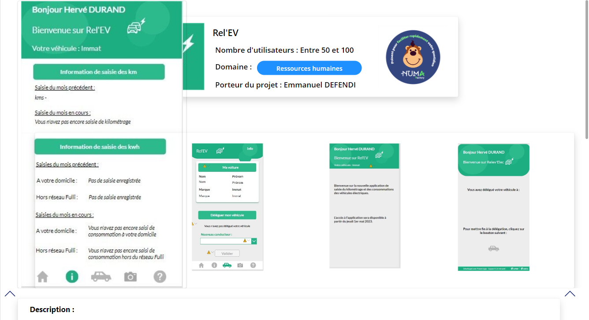
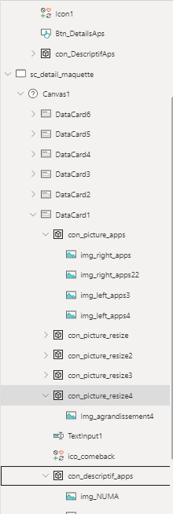

Lundi 24/06/2024

Continuité de la modification de l'application de Numa Factory

Mardi 25/06/2024

Résolution du bug de l'application.
Les images ne s'agrandissait pas toute une par une par une

J'ai tester sur une autre application PowerApps pour éviter des autres problèmes dans l'application principale

Le but était de rendre invisible l'image normal et d'afficher la même mais en grande si on clique sur l'image en normal et à l'inverse si on clique sur l'image en grand il s'affiche en normal, il y en avait 4.

Quand on clique sur l'image elle s'agrandit

Si on clique sur L'image repasse en normal.

Pour se faire j'ai utilisé la propriété visible et Onselect pour appliquer se comportement.

Dans la propriété visible de l'image en normal j'ai mis une variable pour chaque image

Visible : VarnormalScreen4
// Exemple d'une variable prise

Onselect :
Set(VarnormalScreen4, false);
Set(varpopupscreen4, true);

Dans ce code on attribue la visibilité de l'image à faux si le bouton est cliquer et à vrai pour l'image agrandit dont la variable est varpopupscreen4.

Pour afficher l'image en normal, il fallait juste faire l'inverse c'est-à-dire mettre true pour la variable "VarnormalScreen4" dans l'image agrandit et false pour la variable "varpopupscreen4".

Le procédé était le même pour les 3 autres images.

La seule petite modification était de rendre invisible une image en grande si on décide de cliquer sur une autre pour l'agrandir.

Si par exemple on prend l'image dont sa variable prend la propriété Visible qui est "Varnormalscreen4", "Varnormalscreen3" pour les deux images normal et "varpopupscreen4", "varpopupscreen3".

Dans la prorpiété onselect de l'image n°1

Il suffit juste de définir les deux variables dont "Varnormalscreen3"et "varpopupscreen3" ce qui donnerait ceci.

Onselect :
Set(Varnormalscreen4, false);
Set(varpopupscreen4, true);
Set(varpopupscreen3, false);
Set(Varnormalscreen3, true)

Pour l'image n°2 le principe est le même sauf que c'est l'inverse

Onselect:
Set(Varnormalscreen3, false);
Set(varpopupscreen3, true);
Set(Varnormalscreen4, true);
Set(varpopupscreen4, false)

Faire ceci pour les autres images.

A ne pas oublier de définir dans l'écran que les images normal doivent être définie en visible si l'utilisateur consulte la page.

Pour ce faire on va sur l'écran qui stocke les éléments

Dans la propriété OnVisible il faut intégrer ceci:

Set(Varnormalscreen1, true);
Set(Varnormalscreen22, true);
Set(Varnormalscreen3, true);
Set(Varnormalscreen4, true);
Set(varpopupscreen1, false);
Set(varpopupscreen22, false);
Set(varpopupscreen3, false);
Set(varpopupscreen4, false)

Cela permet a l'utilisateur de pouvoir consulter une autre application sans avoir des images invisibles

Mercredi 26/06/2024

Jeudi 27/06/2024

Réunion pédagogique, au lycée Saint-benigne:

- Démontrer les compétences mis en œuvre pendant nos expérience.

Trouver une alternance

Sbinformation

366 / 1038,16 = 0,3525

Vendredi 28/06/2024

- Correction des convention dans l'application Numa Factory

Ressource utilisé :

Naming Convention Poweraps : <https://www.matthewdevaney.com/power-apps-coding-standards-for-canvas-apps/power-apps-standards-naming-conventions/#:~:text=vid-,Variable%20Names,the%20current%20user's%20email%20address>.

Attestation de stage :

[attestation de stage - SIO 2024.pdf](resources/6480da8b985340679fa5a01ec538a3d8.pdf)

Tableau de synthèse : [6- Annexe 6-1 - Tableau de synthèse - Epreuve E4 - BTS SIO 2025 – Copie](https://groupesb-my.sharepoint.com/:x:/r/personal/alex_rigaud_saint-benigne_fr/_layouts/15/Doc.aspx?sourcedoc=%7BFCC6A27C-9EE0-458A-B71B-2BE613CBEAC0%7D&file=6-%20Annexe%206-1%20-%20Tableau%20de%20synth%C3%A8se%20-%20Epreuve%20E4%20-%20BTS%20SIO%202025%20%E2%80%93%20Copie.xlsx&action=default&mobileredirect=true&wdsle=0)

