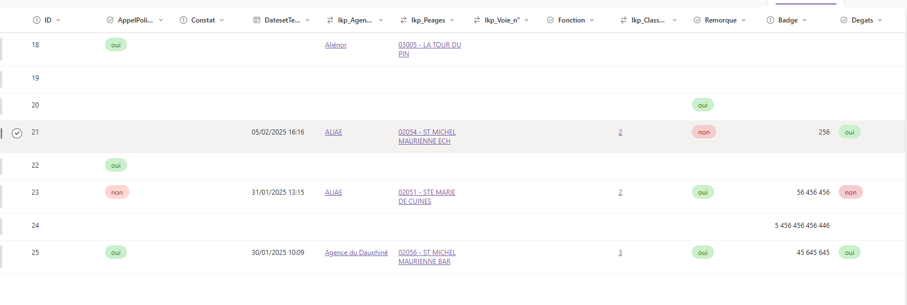
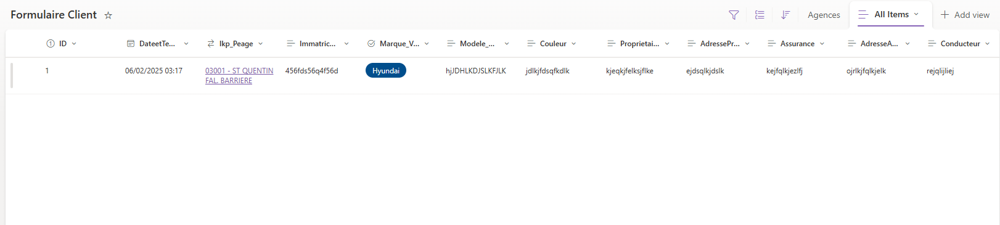
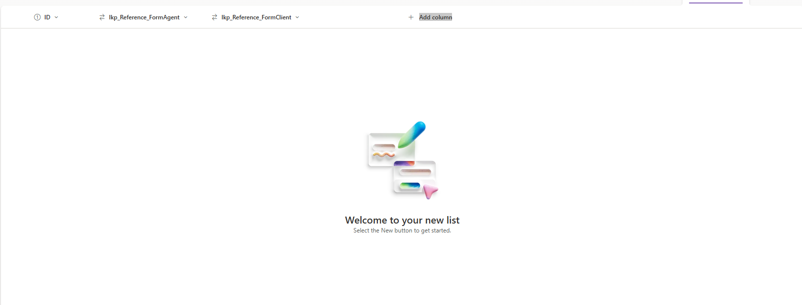

Modification de la procedure du formulaire :

- Ajout d'une liste Sharepoint Pour référencer les deux formulaire partie Agent et Client

Formulaire Agent :

Formulaire Client :

Reference Formulaire:

La table resemblerait à ceci :

Deux lookup seront attribué pour :

Referencer le formulaire de l'agent

Referencer le formulaire du client

Prochaine objectif mettre un ecran d'acceuil pour que la personne puisse accèder à un nouveau formulaire ou le modifier.

