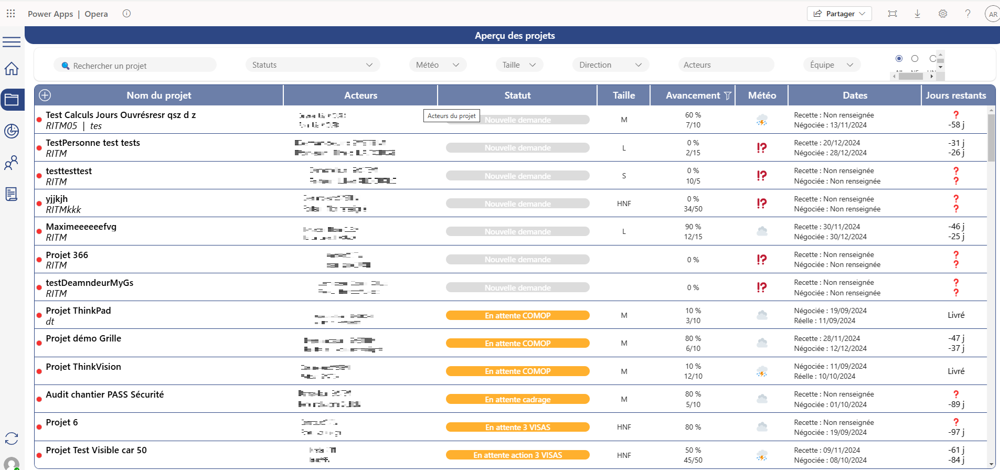
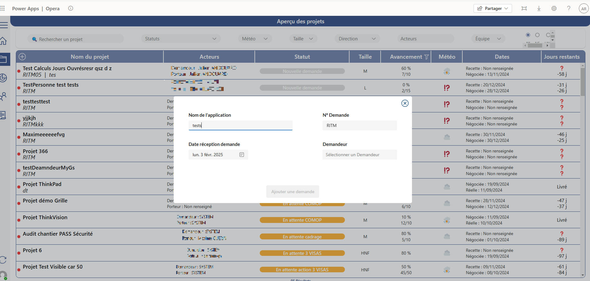
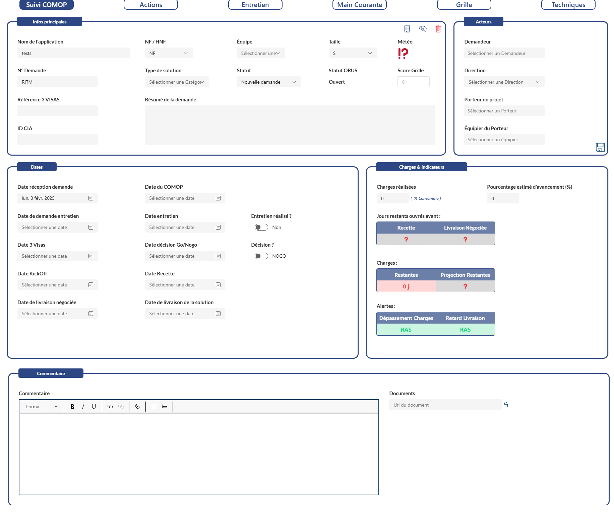
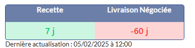
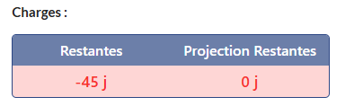
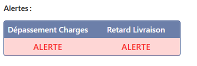

Lundi 03/02/2025

Modification d'une application de gestion de projet

Pendant mon premier jours de stage j'ai découvert une application de gestion de projet. Chaque projet est liée à chaque type que ce soit NumaFactory ou HorsNumaFactory.

Voici la page permettant de visualiser tous les projets créer. Dans cette page on peut créer des projet.

Il suffit simplement de cliquer sur le Button + en haut à gauche à coté de Nom du projet.

Dans ce projet on nous demande :
- Le numéro RITM, soit le numéro de demande du projet.
- La date de réception demandée, la date sur lequel le projet doit être livrée.
- Demandeur, celui qu'on n'a attribuer le projet.
- 

Après avoir créé une tâche on peut voir qu'elle apparaît dans la page "aperçu des projets". Cependant il manque des champs requis. Ces requis apparaisse sous une forme de point rouge et on aperçoit ces champs requis sous forme de d'info bulle. Pour remplir ces champs il suffit de cliquer sur l'une des tâche

Cela basculera sur la page Suivi NF COMOP pour éditer les informations du projet.

Selon les informations aperçu on peut voir des champs comme :

Champs info principal :

Nom de l'application : (nom de l'application renseigné)

NF/HNF : Définir ci c'est un projet Numma factory et Hors Numma factory

Equipe : (Définir l'équipe charger du projet)

Taille : Taille du projet définie permettant de mesurer son estimation de temps.

Météo : Suivant l'icône de soleil à temps orageux cela va de bien à mauvais

N° Demande : Théoriquement le numéro d'attribution du projet

Référence 3 Visas : (???)

ID CIA : (???)

Type de solution : Type de projet à développer par exemple : Application, Formulaire, Automatisation ou tableau de bord.

Statut : Définir le statut du projet pour s'avoir son avancement

Acteurs :

Demandeur : Celui qu'on n'a attribuer le projet

Direction : La direction chargé du projet

Porteur du projet : Le propriétaire du projet créer

Equipier du Porteur : Equipe qui sera chargé du projet

Dates :

Date réception demande : La date sur lequel on planifie, .

Date du COMOP : (???) Date de réunion de l'état d'avancement de la numma factory

Date de demande entretien : Date pour fixer un entretien concernant le projet

Date entretien : Date d'entretien fixer pour parler du projet

Entretien réalisé ? : Champ permettant de s'avoir si l'entretien est réaliser ou non.

Date 3 Visas : (???) Procédure de mise en place pour développer le projet

Date décision Go/Nogo : Date de décision pour démarrer le projet.

Décision ? : Prise de décision approuver ou refuser par la direction.

Date KickOff : Date pour planifier le démarrage des activité.

Date Recette : (???)

Date de livraison négociée : Date de la négociation pour la livraison du projet

Date de livraison de la solution : Date pour la livraison de la solution choisis

Charges & Indicateurs :

Charges réalisées : Pourcentage de réalisation des charge effectuer

Pourcentage estimé d'avancement (%) : estimation des charges restante

Jours restants ouvrés avant :

Définit le temps restante pour livrer le projet calculé par la charge réaliser et le pourcentage de livraison négocié

Charges :

Informe le nombre de jours restant pour rendre le projet

Alertes :

Alerte si le nombre de charges est dépassé

**Commentaire :**

Commentaire : Un commentaire peut être laissé pour ajouter des détail descriptif en cas de problème par exemple.

