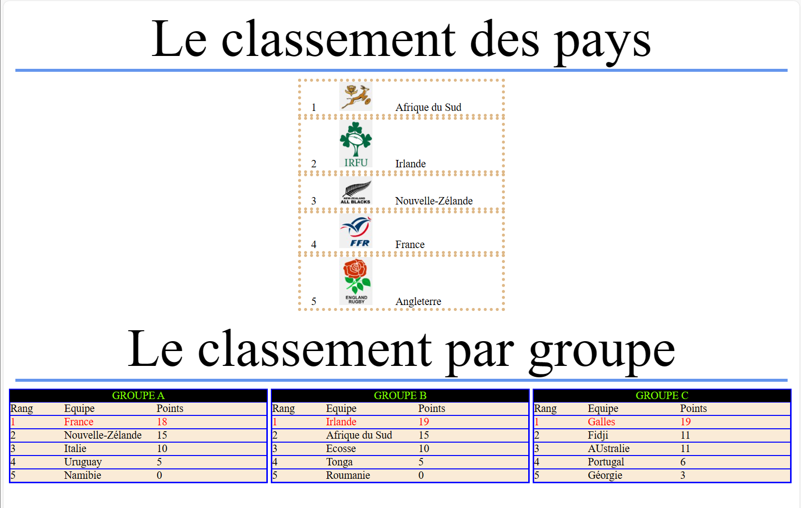

TP Rugby
Friday, November 17, 2023
9:34 AM

Le classement des pays

1
<https://www.les-sports.info/images/equipes/518.jpg>
Afrique du Sud

2
<https://www.les-sports.info/images/equipes/173.png>
Irlande

3
<https://www.les-sports.info/images/equipes/516.jpg>
Nouvelle-Zélande

4
<https://www.les-sports.info/images/equipes/171.jpg>
France

5
<https://www.les-sports.info/images/equipes/172.jpg>
Angleterre

Le classement par groupe

GROUPE A

Rang
Equipe
Points

1
France
18

2
Nouvelle-Zélande
15

3
Italie
10

4
Uruguay
5

5
Namibie
0

GROUPE B

Rang
Equipe
Points

1
Irlande
19

2
Afrique du Sud
15

3
Ecosse
10

4
Tonga
5

5
Roumanie
0

GROUPE C

Rang
Equipe
Points

1
Galles
19

2
Fidji
11

3
AUstralie
11

4
Portugal
6

5
Géorgie
3
IL N'Y A QUE DES DIV

[texte.txt](resources/d8482d81b3f64c17b4fd0828f8134521.txt)
