Partiel
Thursday, December 21, 2023
9:49 AM

Pariel 1 : HTML CSS JAVASCRIPT

- [style.css](resources/f053404c603e435087a28dcdd414d0e9.css)
- [index.html](resources/b409412aca1d4f1a84258fda77ed819b.html)
- [script.js](resources/8a124af76adc41619e3c8ba941127c53.js)

Préambule :

- Durant ce partiel vous devez archiver votre code dans votre repo (PartielHTMLCSSJS)
- Vous devez reproduire le site présenté ci-dessous
- Pour cela vous devez utiliser le langage HTML CSS JAVASCRIPT
- CHAQUE étape doit être archivé sur votre repo avec en commentaire le nom de l'étape
- CHAQUE ETAPE EST INDEPENDANTE ET PEUT DONC ETRE TRAITE DANS L'ORDRE QUE VOUS
- VOULEZ

LE CODE DOIT ETRE COMMENTE

Balise à utiliser :

- Footer
- Nav
- Table
- Div
- Img
- Label
- Input
- H1
- Article
- Section
- p

Css :
- Background
- Background-image
- Opacity
- Color
- Position
- Width
- Left
- Top
- Bottom
- Top
- Text-align
- Flex
- Margin
- Display
- Border
- Font-size

Sujet :

Voici la page du site :
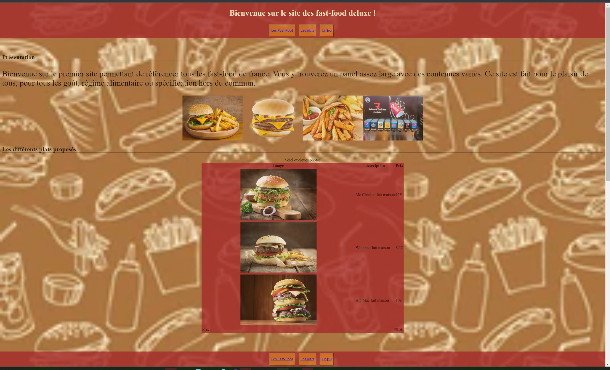

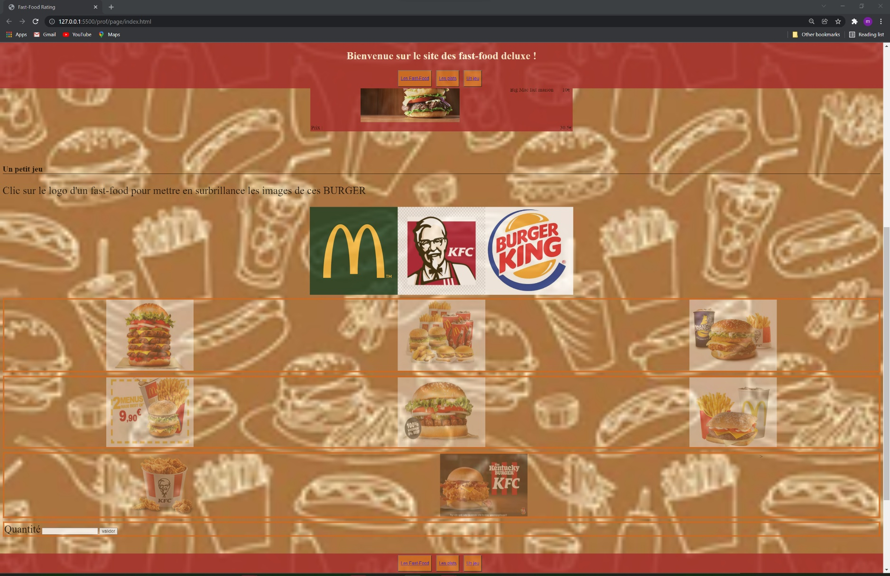

Etape 1 : EN PREMIERE

Reproduire l'architecture du site :

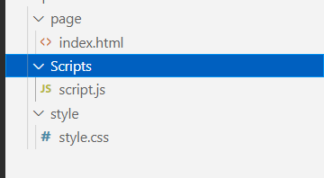

Etape CSS partie 1 : ecrire le moins de css possible

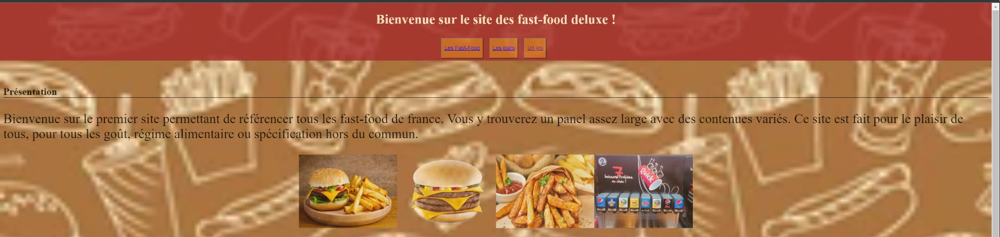

1.  La page doit avoir une image de fond =\> <https://image.shutterstock.com/image-vector/fast-food-seamless-background-260nw-129582053.jpg>
2.  Le site possède une opacité de 80 %
3.  L'entête et le pied de page :
    1.  Voici les couleurs à utiliser : brown, cornsilk
    2.  Ne bouge pas dans le site reste en haut et en bas
4.  Les boutons de navigation permettent d'aller vers la section de la page correspondante :
    1.  Couleur : chocolate
    2.  50 de taille
    3.  Un espace de 5px en bas en haut et 10 à droite
5.  Les images ont une taille de 10% et son aligner au milieu
6.  Les titres sont soulignés en noir
7.  Tous les "label" et les "texte" sont en police 2em

Etape GAME :

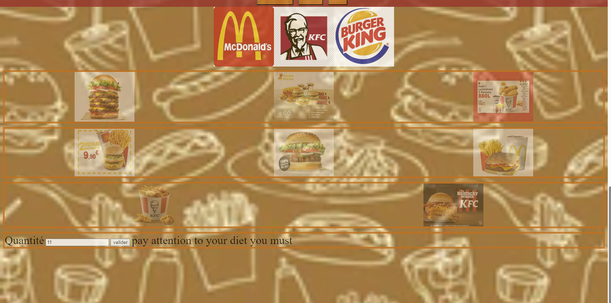

1.  Proposer une bonne sémantique du code HTML
2.  Réalisation du code JAVASCRIPT
    1.  Lors du choix de la quantité dans l'input
        1.  Si le choix est inférieur à 10 le message suivant s'affiche =\> Stay fit you will
        2.  Si le choix est supérieur à 10 le message suivant s'affiche =\>
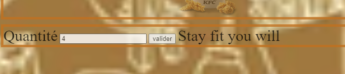

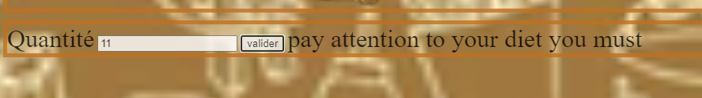

2.  Lors du clic sur une image logo de votre burger les images des menus s'affiche en clair
    1.  Exemple MC DO :
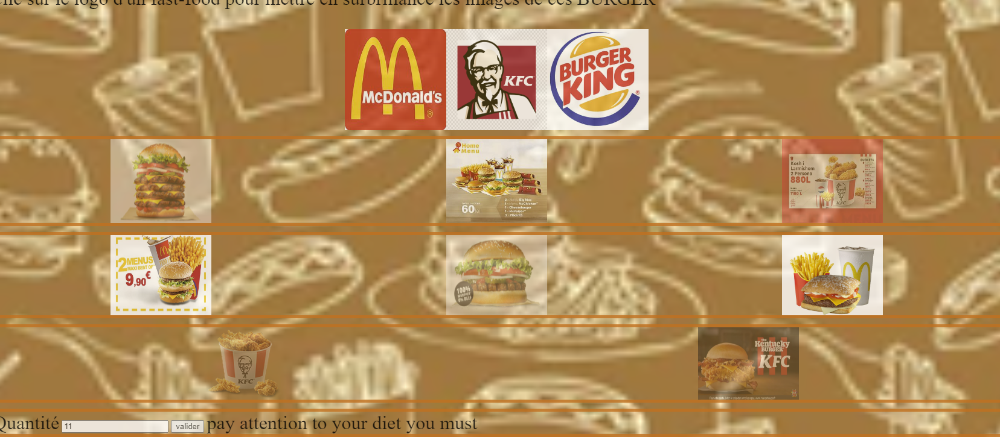

2.  Exemple pour KFC :

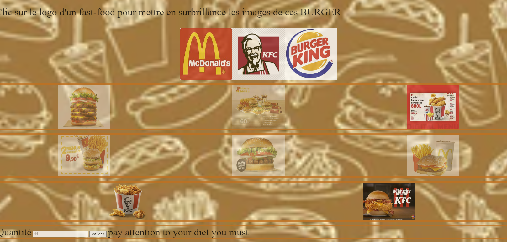

iii\. Exemple pour BurgerKing :

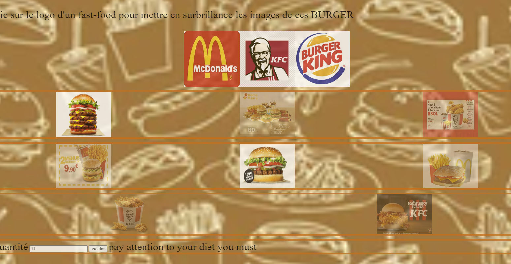

1.  Reproduire la mise en forme

Etape Plats proposés :

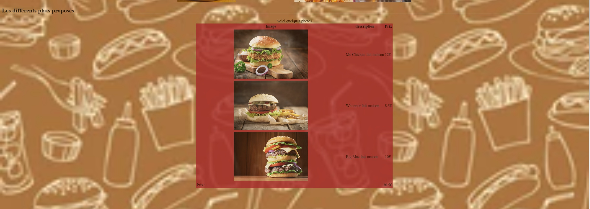

1.  Un titre
2.  Un tableau avec les images la description et un prix
3.  Une ligne de fin de tableau pour le total
4.  Faire le css correspondant
    1.  Brown pour la couleur
    2.  Centrer les images dans le td =\> utilisation d'un sélecteur pour les premier td, 50% de taille
    3.  Le prix total est aligné à gauche =\> utilisation d'un sélecteur
