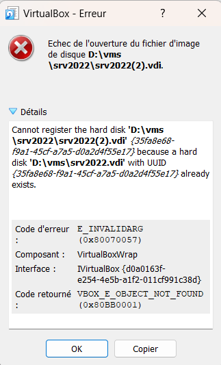
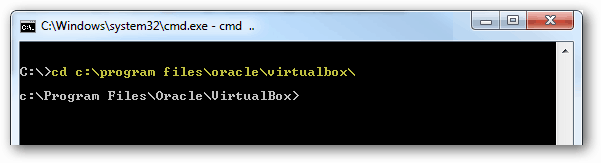
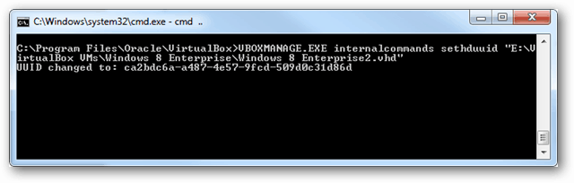
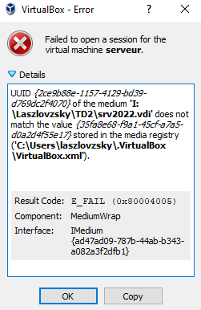

A l'importation d'un disque dur virtuel ou lors de la création d'une VM, on veut attacher un disque dur virtuel déjà utilisé dans VirtualBox.

On obtient parfois l'erreur :

Cette erreur indique que l'identifiant unique du disque (UUID) est déjà existant dans VirtualBox.

Pour résoudre le problème, on va changer cet identifiant.

Lancer une console avec les droits administrateur.

Se placer dans le dossier de Virtual Box, par défaut :

cd "c:\Program Files\Oracle\VirtualBox"

Taper la commande suivante, en remplaçant pathtovhdfile par le chemin vers le disque dur virtuel (le premier indiqué dans le message d'erreur).

VBOXMANAGE.EXE internalcommands sethduuid “pathtovhdfile”

Dans l'exemple du message d'erreur çi-dessus :
d:\vms\srv2022\srv2022(2).vdi

La 2ème VM devrait maintenant pouvoir démarrer

Si après ça la première VM ne fonctionne plus, à cause du message d'erreur suivant :

Il faut ouvrir le Gestionnaire de médias virtuels (Virtual Media Manager)

Sélectionner le disque qui pose problème (avec un panneau attention)

Cliquer sur Libérer

Cliquer sur Supprimer

Cliquer sur Ajouter

Chercher le disque et valider

Le disque devrait ré-apparaître dans la liste mais sans le panneau attention

Fermer le gestionnaire de médias virtuels

La première VM devrait démarrer
