**==Objectifs :==**

Etablir une connexion sécurisée (authentifiée et chiffrée) en ligne de commande vers un serveur Linux
Transférer des fichiers de façon sécurisée (authentifiée et chiffrée) depuis et vers un serveur Linux
Découvrir les protocoles SSH (Secure Shell), SCP (Secure Copy), et SFTP (Secure File Transfer Protocol)
Installer, configurer et utiliser les logiciels OpenSSH Server, OpenSSH client, Putty, FileZilla Server et WinSCP

**==Pré-requis :==** un serveur Linux, un client Linux, un client Windows
le réseau est correctement configuré sur les machines, elles communiquent entre elles et ont accès à Internet.

**==Introduction== :**

Pour se connecter à un serveur à partir d’un ordinateur, plusieurs protocoles sont disponibles. En effet, la compatibilité des systèmes d’exploitation rend plus facile l’utilisation de certains protocoles plutôt que d’autres. Ces systèmes d’exploitation sont dotés de spécificités bien particulières car ils n’ont pas les mêmes langages ni les mêmes manière de fonctionner, de réagir, de nous présenter les choses. Nous pouvons avoir des systèmes à interfaces graphiques, d’autres sans, en ligne de commande (CLI = Command Line Interface).

Dans ce TP, nous allons nous connecter à un serveur Linux dépourvu d'interface graphique (GUI = Graphic User Interface). Il nous sera donc nécessaire d'utiliser des protocoles en ligne de commande. Nous allons utiliser trois protocoles de connexions à distance : le protocole SSH (Secure Shell) pour les commandes et les protocole SCP (Secure Copy) et SFTP (Secure File Transfer Protocol) pour le transfert des fichiers. Nous établirons une connexion entre 2 machines Linux, et une connexion entre une machine Windows et une machine Linux.

**==ADMINISTRATION EN LIGNE DE COMMANDE==**

**==Connexion SSH Linux / Linux :==**

***Configuration du serveur Linux :***

Le protocole SSH (Secure Shell, ou Shell Sécurisé) sous Linux est simple à installer. Il faut installer «openssh» sur les deux machines à l’aide d’une commande pour pouvoir se connecter à distance.

On met à jour la liste des paquets disponibles avec la commande

\#apt update

On installe le paquet OpenSSH Server avec la commande

\#apt install openssh-server

On valide avec O + Entrée

On édite le fichier de configuration /etc/ssh/sshd_config dans nano avec la commande

\#nano /etc/ssh/sshd_config

On parcours ce fichier jusqu'à la section Authentication

On active l'option PermitRootLogin en supprimant le dièse (#) en début de ligne

On modifie l'option PermitRootLogin en remplaçant prohibit-password par yes pour autoriser le compte root à se connecter en SSH

On enregistre les modifications avec Ctrl + O puis Entrée, et on quitte avec Ctrl + X

On redémarre le service SSH avec la commande

\#service sshd restart

On vérifie si le serveur SSH est bien opérationnel avec la commande

\#service sshd status

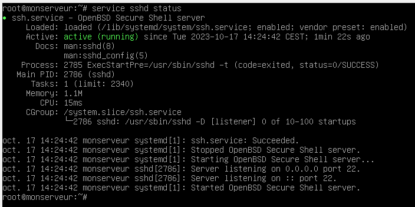

Le serveur SSH est à présent configuré.

***Configuration du client Linux :***

On se place à présent sur le client Linux.

Comme sur le serveur, on met à jour la liste des paquets disponibles avec la commande

\#apt update

Puis on installe le paquet OpenSSH Server avec la commande

\#apt install openssh-client

On se connecte en ligne de commande, depuis le client vers le serveur, avec la commande

\#ssh utilisateur@adresse_IP_du_serveur

Par exemple

\#ssh root@10.0.1.100

Lors de la toute première connexion au serveur SSH, le serveur vous demande de vérifier et de valider l'identité de celui-ci au moyen de son empreinte numérique.

Répondez yes pour accepter le certificat. Si vous acceptez, ce certificat sera installé sur le client et il ne sera pas nécessaire de valider à nouveau l'identité de ce serveur lors des prochaines connexions.

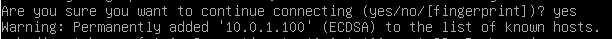

Identifiez-vous

Vous êtes bien depuis le client, connecté sur le serveur. Vous pouvez le voir en vérifiant le hostname présent dans le prompt (nom du serveur dans l'invite de commande).

Si vous affichez l'état du service, vous verrez l'historique du service et des connexions ou tentatives de connexions (ici par exemple le service a :
- Été stoppé
- Été démarré
- Refusé une connexion à cause d'un mauvais mot de passe
- Accepté une connexion

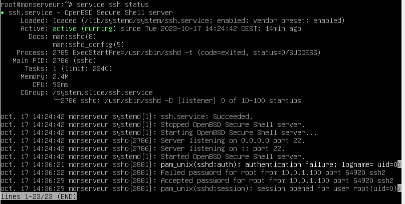

Vous pouvez donc maintenant administrer votre serveur Linux à distance, en ligne de commande, de manière sécurisée (authentifiée et chiffrée), depuis votre client Linux

**==Connexion SSH Windows / Linux :==**

Il n'y a rien à faire sur le serveur Linux car SSH y est déjà installé et configuré.

Sur un client Windows, on va télécharger et installer un client SSH, comme Putty : [Download PuTTY: latest release (0.79) (greenend.org.uk)](https://www.chiark.greenend.org.uk/~sgtatham/putty/latest.html)

Le client SSH est très simple, il faut juste indiquer l'adresse IP du serveur Linux, le port (22 par défaut) et valider :

Comme pour la connexion depuis le client Linux, lors de la toute première connexion au serveur SSH, le serveur vous demande de vérifier et de valider l'identité de celui-ci au moyen de son empreinte numérique.

Répondez oui pour accepter le certificat. Si vous acceptez, ce certificat sera installé sur le client et il ne sera pas nécessaire de valider à nouveau l'identité de ce serveur lors des prochaines connexions.

Identifiez-vous

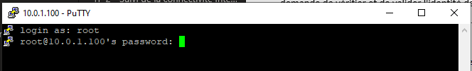

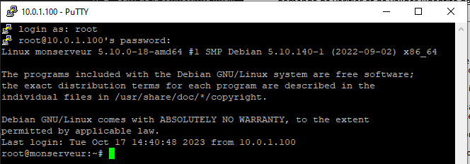

Une fois connecté depuis le client Windows, affichez l'état du service SSH avec la commande

\#service ssh status

Et observez les informations concernant la connexion depuis Windows.

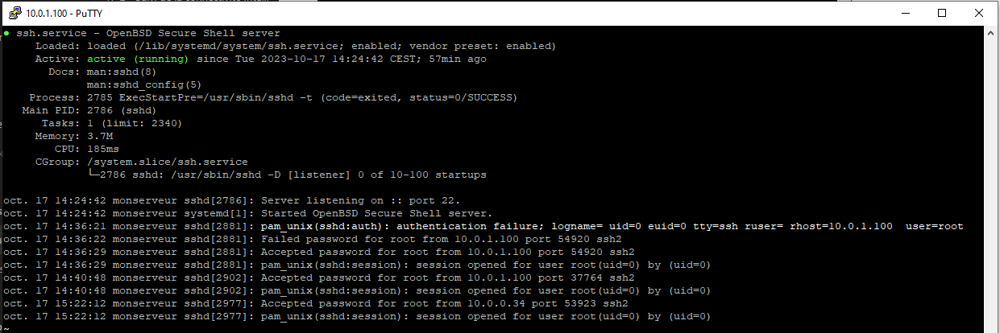

Vous pouvez donc maintenant administrer votre serveur Linux à distance, en ligne de commande, de manière sécurisée (authentifiée et chiffrée), depuis votre client Windows, avec un logiciel en interface graphique.

**==TRANSFERT DE FICHIERS==**

SFTP (Secure File Transfer Protocol) et SCP (Secure Copy, ou Copie Sécurisée) utilisent tous les deux un canal de communication sécurisé (chiffré et authentifié) en SSH pour permettre la gestion de fichiers et de dossiers via une interface graphique à distance.

Ces 2 protocoles sont très proches et se basent tous les 2 sur SSH. La différence et la comparaison entre les 2 est présentée ici : [SCP vs SFTP](https://bluefinch-esbd.com/fr/blog/scp-vs-sftp/)

***==SFTP==***

Il n'y a rien à faire sur le serveur Linux car SSH y est déjà installé et configuré.

Sur un client Windows, on va télécharger et installer un client graphique prenant en charge SFTP comme FileZilla Client.

[Download FileZilla Client for Windows (64bit x86) (filezilla-project.org)](https://filezilla-project.org/download.php?platform=win64)

Quand on passe la souris sur la zone "Hôte", une infobulle apparait, indiquant la syntaxe à utiliser selon le protocole souhaité.

(FTP n'est pas sécurisé, FTPS et FTPES utilisent SSL/TLS pour sécuriser les communications). Nous souhaitons utiliser le protocole SFTP car c'est celui qui se base sur SSH.

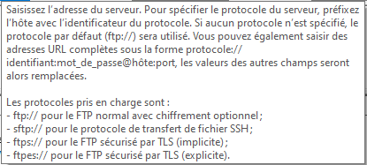

On va donc indiquer sftp://Adresse_IP_du_serveur, l'utilisateur, le mot de passe et le port (22 par défaut). On valide la connexion.

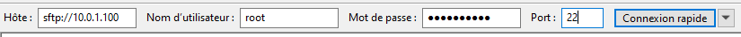

L'interface est celle d'un explorateur de fichier avec à gauche l'arborescence locale du client Windows.
A droite l'arborescence distante du serveur Linux.

En haut les logs (fichiers journaux).

En bas la liste des fichiers en file d'attente, les transferts échoués et réussis.

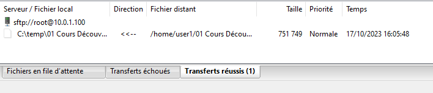

Clic droit ou glisser déposer pour gérer les fichiers.

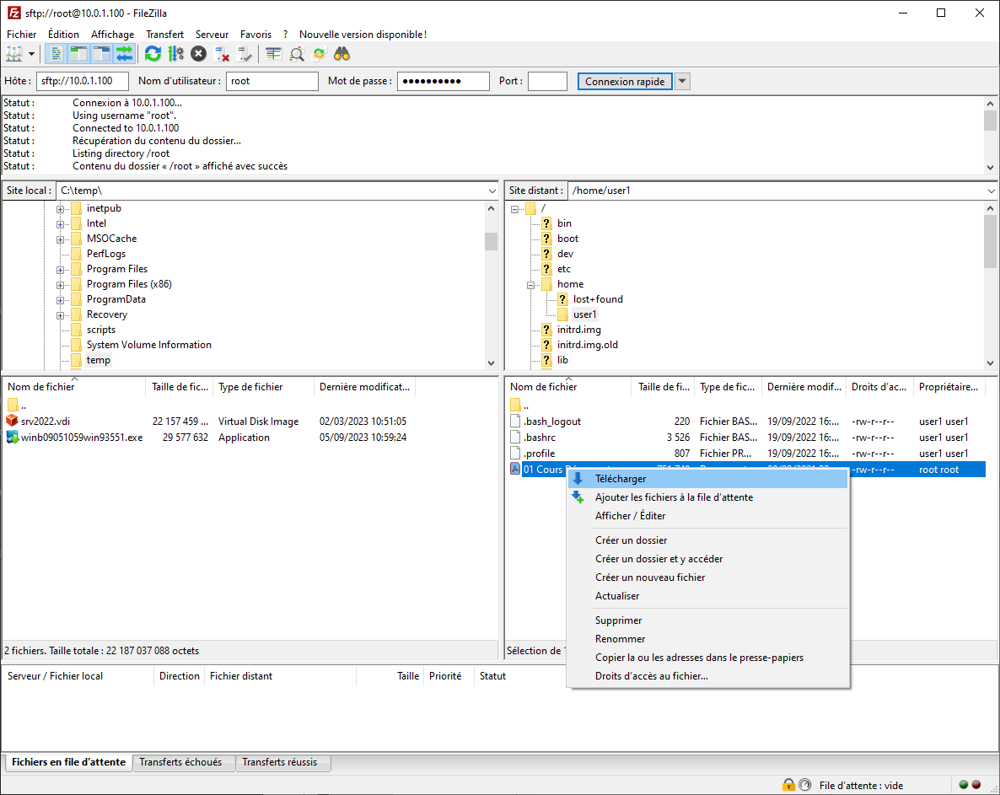

Clic droit pour créer, supprimer, modifier, renommer ou pour la gestion des permissions (droits d'accès).

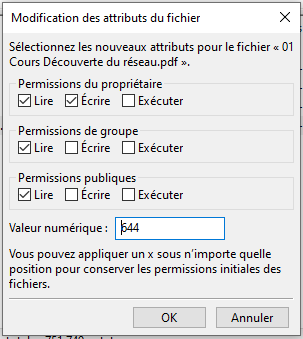

**==SCP==**

Il n'y a rien à faire sur le serveur Linux car SSH y est déjà installé et configuré.

Sur un client Windows, on va télécharger et installer un client graphique prenant en charge SCP comme WinSCP.

[WinSCP :: Official Site :: Download](https://winscp.net/eng/download.php)

WinSCP permet le transfert de fichiers en SCP et en SFTP. Ces 2 protocoles sont très proches et se basent tous les 2 sur SSH. La différence et la comparaison entre les 2 est présentée ici : [SCP vs SFTP](https://bluefinch-esbd.com/fr/blog/scp-vs-sftp/)

Comme on a déjà testé SFTP avec FileZilla on va cette fois utiliser SCP.

Remplissez l'adresse IP, le n° de port (22 par défaut), l'identifiant, le mot de passe et validez la connexion.

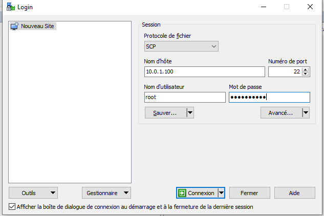

Comme pour la connexion depuis le client Linux et le client Windows en ligne de commande, lors de la toute première connexion au serveur SSH, le serveur vous demande de vérifier et de valider l'identité de celui-ci au moyen de son empreinte numérique.

Répondez oui pour accepter le certificat. Si vous acceptez, ce certificat sera installé sur le client et il ne sera pas nécessaire de valider à nouveau l'identité de ce serveur lors des prochaines connexions.

L'interface est celle d'un explorateur de fichier avec en haut à gauche l'arborescence locale du client Windows.
En haut à droite l'arborescence distante du serveur Linux.

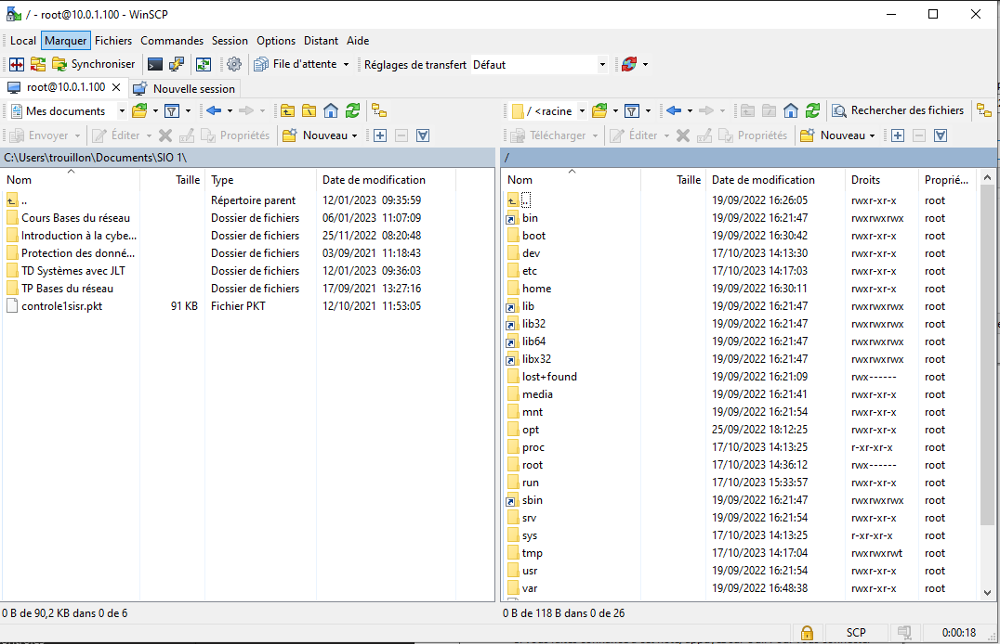

Utilisez l'interface graphique pour transférer (envoi et réception) des fichiers dans les 2 sens.

Utilisez l'interface graphique pour :

- Créer
- Modifier
- Renommer
- supprimer,
- Changer les permissions d'accès…

De fichiers et de dossiers d'exmple et de tests que vous placez dans /home

On peut le faire via un clic droit, un glisser-déposer, ou les menus/boutons du logiciels. Par exemple un clic droit puis transférer.

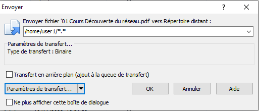

Le fichier a bien été transféré vers le serveur Linux

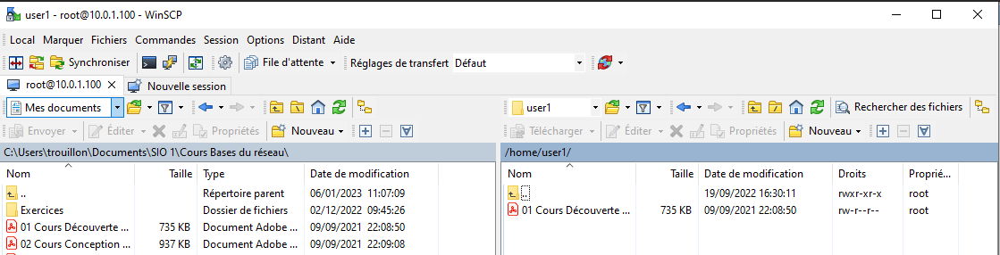

Testez des transferts de fichiers dans les 2 sens, créez des fichiers, des dossiers. Renommez un fichier, supprimez en un.

Modifiez les droits d'accès.

Editez un fichier de configuration :

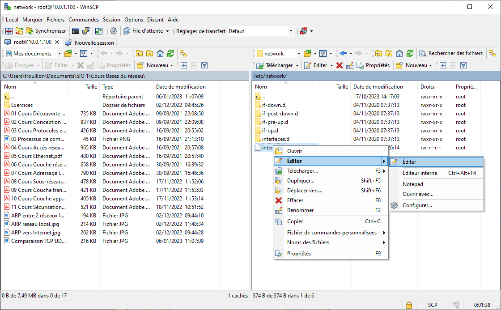

Ce bouton permet de lancer directement une connexion en ligne de commande SSH avec Putty :

