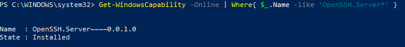
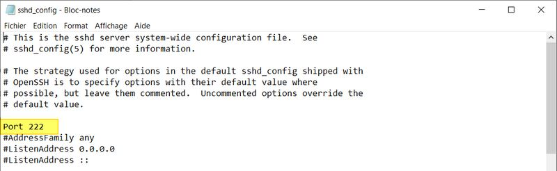
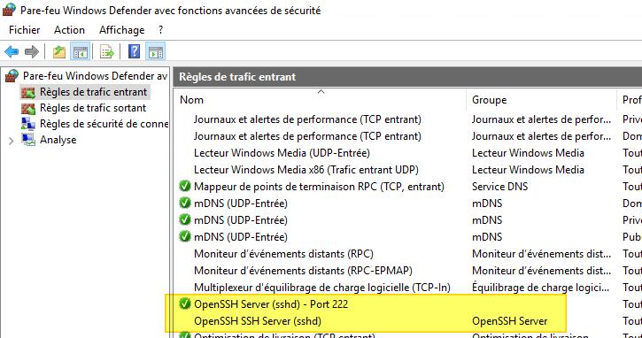

**==Objectifs :==**

Etablir une connexion sécurisée (authentifiée et chiffrée) en ligne de commande vers un serveur Windows
Transférer des fichiers de façon sécurisée (authentifiée et chiffrée) depuis et vers un serveur Windows
Découvrir les protocoles et commandes SSH (Secure Shell), SCP (Secure Copy) et SFTP (Secure File Transfer Protocol) sous Windows
Installer, configurer et utiliser les logiciels OpenSSH Server, OpenSSH client en ligne de commande sous Windows

**==Pré-requis :==** un client Windows, un serveur Windows, un serveur Linux avec un serveur SSH configuré (TP précédent)
le réseau est correctement configuré sur les machines, elles communiquent entre elles et ont accès à Internet.

**==Introduction== :**

Pour se connecter à un serveur à partir d’un ordinateur, plusieurs protocoles sont disponibles. En effet, la compatibilité des systèmes d’exploitation rend plus facile l’utilisation de certains protocoles plutôt que d’autres. Ces systèmes d’exploitation sont dotés de spécificités bien particulières car ils n’ont pas les mêmes langages ni les mêmes manière de fonctionner, de réagir, de nous présenter les choses. Nous pouvons avoir des systèmes à interfaces graphiques, d’autres sans, en ligne de commande (CLI = Command Line Interface).

Dans ce TP, nous allons nous connecter à un serveur Windows qui pourrait être dépourvu d'interface graphique (GUI = Graphic User Interface), un serveur en mode core par exemple. Il nous sera donc nécessaire d'utiliser des protocoles en ligne de commande. Nous allons utiliser deux protocoles de connexions à distance : le protocole SSH (Secure Shell) pour les commandes et les protocoles SCP (Secure Copy) et SFTP (Secure File Transfer Protocol) pour le transfert des fichiers. Nous établirons une connexion entre 2 machines Windows mais aussi entre une machine Windows et une machine Linux.

**==ADMINISTRATION EN LIGNE DE COMMANDE==**

**==Installation du serveur SSH sous Windows :==**

***Installation***

Le serveur SSH (Secure Shell, ou Shell Sécurisé) sous Windows est simple à installer. Lancez une invite de commande PowerShell avec les droits Administrateur.

Il faut installer «openssh server» sur le client à l’aide de cette commande :

Add-WindowsCapability -Online -Name OpenSSH.Server\~\~\~~0.0.1.0

L'installation d'OpenSSH Server ne nécessite pas de redémarrer votre machine.
À titre d'information, voici comment désinstaller le server SSH si besoin :
Remove-WindowsCapability -Online -Name OpenSSH.Server\~\~\~~0.0.1.0

**

***Vérification***

Une fois l'installation terminée, vérifier la présence du serveur SSH avec la commande :

Get-WindowsCapability -Online \| Where{ \$\_.Name -like 'OpenSSH.Server\*' }

***Démarrage automatique du serveur***

Pour définir le mode de démarrage du service Serveur SSH sur "Automatique" au lieu de "Manuel", on utilise la commande :

Set-Service -Name "sshd" -StartupType Automatic

***Démarrage du service***

Pour démarrer le serveur OpenSSH qui s'appelle le service "sshd" correspondant à "OpenSSH SSH Server", on va utiliser la commande suivante :

Start-Service -Name "sshd"

***Vérification de l'état du service***

La commande ci-dessous vous permettra de vérifier qu'il est bien en cours d'exécution :

Get-Service -Name "sshd"

**==Configuration du serveur SSH sous Windows :==**

Sur Windows, la configuration d'OpenSSH est stockée à l'emplacement ci-dessous où l'on va trouver le fichier sshd_config :

C:\ProgramData\ssh\\

Au sein du fichier sshd_config, nous allons retrouver les options classiques d'OpenSSH. Nous pouvons le configurer de la même façon qu'on l'a fait sous Linux précédemment.

Consultez le lien suivant pour plus de détails sur la configuration de ce fichier : <https://www.it-connect.fr/chapitres/openssh-configuration-du-serveur-ssh/>

Attention toutefois, certaines options sont spécifiques à Linux et doivent être adaptées pour Windows.

Allez dans le dossier C:\ProgramData\ssh\\ et éditez le fichier sshd_config **<u>avec les droits d'administrateur</u>**.

***Modifier le port d'écoute du service***

Pour modifier le port d'écoute par défaut (recommandé) et utiliser un autre port que le n°22, il faut modifier l'option "Port". Pour modifier le fichier de configuration, vous devez ouvrir l'éditeur de texte en tant qu'administrateur pour avoir le droit d'enregistrer le fichier.

Ensuite, il faut décommenter la ligne "#Port 22" et changer le numéro de port, comme ceci :

***Redémarrage du service***

Après chaque modification de la configuration, il est indispensable de redémarrer le service SSH pour charger les nouveaux paramètres. PowerShell permet de le faire facilement avec la commande :

Restart-Service "sshd"

**==Configuration pare-feu via PowerShell :==**

Lors de l'installation d'OpenSSH Server, une règle est créée pour autoriser les connexions sur le port 22.

Voici la commande pour créer une règle de pare-feu qui autorise les connexions entrantes sur le port 222 :

New-NetFirewallRule -Name sshd -DisplayName 'OpenSSH Server (sshd) - Port 222' -Enabled True -Direction Inbound -Protocol TCP -Action Allow -LocalPort 222

Créez cette règle personnalisée en l'adaptant à votre configuration, et vérifiez ensuite sa prise en compte dans l'interface graphique du pare-feu :

Profitez-en pour désactiver la règle créée par défaut puisqu'elle n'est plus utile.

Connectez-vous à votre serveur SSH Windows depuis un client SSH Windows et depuis un client SSH Linux et faites des tests de transferts de fichier.
