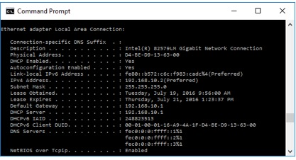

**Travaux pratiques– Détermination de l'adresse MAC d'un hôte**
- **Objectifs**
- Déterminer l'adresse MAC d'un ordinateur Windows sur un réseau Ethernet filaire ou sans-fil à l'aide de la commande **ipconfig /all**.
- Déterminer le fabricant d'un ordinateur ou de sa carte réseau à partir de son adresse MAC.
- **Contexte/scénario**
Chaque ordinateur d'un réseau local Ethernet dispose d'une adresse MAC (Media Access Control) stockée sur la carte réseau. Les adresses MAC des ordinateurs se présentent généralement sous la forme d'une combinaison de 6 fois 2 caractères hexadécimaux séparés par des tirets ou des signes deux-points (par exemple: 15-EF-A3-45-9B-57). La commande **ipconfig /all** affiche l'adresse MAC de l'ordinateur.
- **Ressources requises**
- PC s'exécutant sous Windowsavec au moins une carte réseau Ethernet
- Connectivité à Internet
- **Repérer l'adresse MAC sur un ordinateur**
Dans cette partie des travaux pratiques, vous déterminerez l'adresse MAC d'un ordinateur à l'aide de la commande Windows **ipconfig**.
- **Ouvrez une fenêtre d'invite de commandes Windows.**
Faites un clic droit sur le bouton **Démarrer** et sélectionnez **Invite de commandes**.

- **Utilisez la commande ipconfig /all.**
Saisissez la commande **ipconfig /all** à l'invite de commandes. Appuyez sur Entrée. (La figure ci-dessous illustre les résultats tels qu'ils se présentent généralement, mais votre ordinateur peut afficher d'autres informations.)

- **Recherchez des adresses MAC (physiques) dans la fenêtre de résultats de la commande *ipconfig /all*.**
Dans le tableau ci-dessous, indiquez la description de la carte Ethernet et l'adresse physique (MAC):
| **Description** | **Adresse physique** |
|-----------------|----------------------|
|                |                     |
|                |                     |
|                |                     |
Combien d'adresses MAC avez-vous trouvées sur votre ordinateur?

A quoi correspondent-elles? \_\_\_\_\_\_\_\_\_\_\_\_\_\_\_\_\_\_\_\_\_\_
- **Analyse des différentes parties composant une adresse MAC**
Chaque interface réseau Ethernet est dotée d'une adresse physique qui lui est attribuée lors de sa fabrication. Ces adresses comportent 48bits (6octets) et sont présentées sous la forme hexadécimale. Les adresses MAC se décomposent en deux parties. La première, composée des 3premiers octets, correspond au fournisseur qui a fabriqué l'interface réseau. Cette partie est appelée OUI (Organizationally Unique Identifier). Tout fournisseur souhaitant fabriquer et vendre des interfaces réseau Ethernet doit s'enregistrer auprès de l'IEEE afin de recevoir un OUI.

La deuxième partie de l'adresse, les 3octets restants, correspond à l'ID unique associé à l'interface. Toutes les adresses MAC qui commencent par le même OUI doivent avoir un ID différent.

Dans l'exemple utilisé pour les travaux pratiques, l'adresse MAC physique pour l'interface LAN Ethernet est D4-BE-D9-13-63-00.
| **OUI du fabricant** | **Identifiant unique pour l'interface** | **Nom du fabricant** |
|----|----|----|
| D4-BE-D9 | 13-63-00 | Dell Incorporated |
- **Faites une liste des adresses MAC que vous et vos camarades avez trouvées à l'étape3 de la partie1.**
Faites une liste des OUI des fabricants à 3octets et des identifiants d'interface uniques à 3octets. Renseignez aussi le nom du fabricant grâce à l’étape suivante.
| **OUI du fabricant** | **Identifiant unique pour l'interface** | **Nom du fabricant** |
|----|----|----|
| D4-BE-D9 | 13-63-00 | Dell Incorporated |
|  |  |  |
|  |  |  |
- **Cherchez à quels fabricants appartiennent les OUI que vous avez inscrits dans le tableau.**
  1.  Pour ce faire, utilisez l'outil de recherche très simple fourni par Wireshark.org sur <https://www.wireshark.org/tools/oui-lookup.html>. Ou alors, trouvez d'autres façons d'identifier un OUI en cherchant OUI.txt sur Internet.

- À partir des informations récoltées, mettez à jour la colonne fabricant dans le tableau à l'étapeprécédente. Combien de fabricants différents avez-vous trouvés?
- **Observations**
  1.  Pourquoi un ordinateur peut-il avoir plusieurs adresses MAC?
\_\_\_\_\_\_\_\_\_\_\_\_\_\_\_\_\_\_\_\_\_\_\_\_\_\_\_\_\_\_\_\_\_\_\_\_\_\_\_\_\_\_\_\_\_\_\_\_\_\_\_\_\_\_\_\_\_\_\_\_\_\_\_\_\_\_\_\_\_\_\_\_\_\_\_\_\_\_\_\_\_\_\_\_\_\_\_

\_\_\_\_\_\_\_\_\_\_\_\_\_\_\_\_\_\_\_\_\_\_\_\_\_\_\_\_\_\_\_\_\_\_\_\_\_\_\_\_\_\_\_\_\_\_\_\_\_\_\_\_\_\_\_\_\_\_\_\_\_\_\_\_\_\_\_\_\_\_\_\_\_\_\_\_\_\_\_\_\_\_\_\_\_\_\_

\_\_\_\_\_\_\_\_\_\_\_\_\_\_\_\_\_\_\_\_\_\_\_\_\_\_\_\_\_\_\_\_\_\_\_\_\_\_\_\_\_\_\_\_\_\_\_\_\_\_\_\_\_\_\_\_\_\_\_\_\_\_\_\_\_\_\_\_\_\_\_\_\_\_\_\_\_\_\_\_\_\_\_\_\_\_\_
- L'exemple de fenêtre de résultats de la commande **ipconfig /all** illustrée plus haut ne contenait qu'une seule adresse MAC. Imaginons que cette fenêtre de résultats ait été celle d'un autre ordinateur également équipé d'une carte réseau Ethernet sans fil. En quoi aurait-elle été différente?
\_\_\_\_\_\_\_\_\_\_\_\_\_\_\_\_\_\_\_\_\_\_\_\_\_\_\_\_\_\_\_\_\_\_\_\_\_\_\_\_\_\_\_\_\_\_\_\_\_\_\_\_\_\_\_\_\_\_\_\_\_\_\_\_\_\_\_\_\_\_\_\_\_\_\_\_\_\_\_\_\_\_\_\_\_\_\_

\_\_\_\_\_\_\_\_\_\_\_\_\_\_\_\_\_\_\_\_\_\_\_\_\_\_\_\_\_\_\_\_\_\_\_\_\_\_\_\_\_\_\_\_\_\_\_\_\_\_\_\_\_\_\_\_\_\_\_\_\_\_\_\_\_\_\_\_\_\_\_\_\_\_\_\_\_\_\_\_\_\_\_\_\_\_\_

\_\_\_\_\_\_\_\_\_\_\_\_\_\_\_\_\_\_\_\_\_\_\_\_\_\_\_\_\_\_\_\_\_\_\_\_\_\_\_\_\_\_\_\_\_\_\_\_\_\_\_\_\_\_\_\_\_\_\_\_\_\_\_\_\_\_\_\_\_\_\_\_\_\_\_\_\_\_\_\_\_\_\_\_\_\_\_
- Essayez de débrancher le câble réseau ou de couper la connexion sans-fil, puis exécutez une nouvelle fois la commande **ipconfig /all**. Quelles modifications remarquez-vous? L'adresseMAC s'affiche-t-elle encore? Peut-elle changer?
\_\_\_\_\_\_\_\_\_\_\_\_\_\_\_\_\_\_\_\_\_\_\_\_\_\_\_\_\_\_\_\_\_\_\_\_\_\_\_\_\_\_\_\_\_\_\_\_\_\_\_\_\_\_\_\_\_\_\_\_\_\_\_\_\_\_\_\_\_\_\_\_\_\_\_\_\_\_\_\_\_\_\_\_\_\_\_

\_\_\_\_\_\_\_\_\_\_\_\_\_\_\_\_\_\_\_\_\_\_\_\_\_\_\_\_\_\_\_\_\_\_\_\_\_\_\_\_\_\_\_\_\_\_\_\_\_\_\_\_\_\_\_\_\_\_\_\_\_\_\_\_\_\_\_\_\_\_\_\_\_\_\_\_\_\_\_\_\_\_\_\_\_\_\_

\_\_\_\_\_\_\_\_\_\_\_\_\_\_\_\_\_\_\_\_\_\_\_\_\_\_\_\_\_\_\_\_\_\_\_\_\_\_\_\_\_\_\_\_\_\_\_\_\_\_\_\_\_\_\_\_\_\_\_\_\_\_\_\_\_\_\_\_\_\_\_\_\_\_\_\_\_\_\_\_\_\_\_\_\_\_\_
- Quels autres noms peuvent désigner l'adresseMAC?
\_\_\_\_\_\_\_\_\_\_\_\_\_\_\_\_\_\_\_\_\_\_\_\_\_\_\_\_\_\_\_\_\_\_\_\_\_\_\_\_\_\_\_\_\_\_\_\_\_\_\_\_\_\_\_\_\_\_\_\_\_\_\_\_\_\_\_\_\_\_\_\_\_\_\_\_\_\_\_\_\_\_\_\_\_\_\_

\_\_\_\_\_\_\_\_\_\_\_\_\_\_\_\_\_\_\_\_\_\_\_\_\_\_\_\_\_\_\_\_\_\_\_\_\_\_\_\_\_\_\_\_\_\_\_\_\_\_\_\_\_\_\_\_\_\_\_\_\_\_\_\_\_\_\_\_\_\_\_\_\_\_\_\_\_\_\_\_\_\_\_\_\_\_\_

\_\_\_\_\_\_\_\_\_\_\_\_\_\_\_\_\_\_\_\_\_\_\_\_\_\_\_\_\_\_\_\_\_\_\_\_\_\_\_\_\_\_\_\_\_\_\_\_\_\_\_\_\_\_\_\_\_\_\_\_\_\_\_\_\_\_\_\_\_\_\_\_\_\_\_\_\_\_\_\_\_\_\_\_\_\_\_
