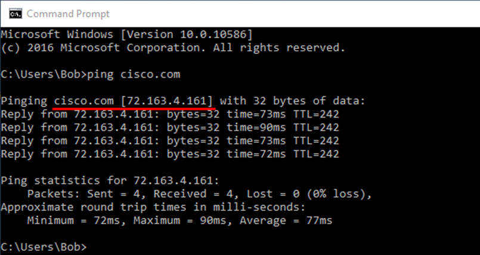
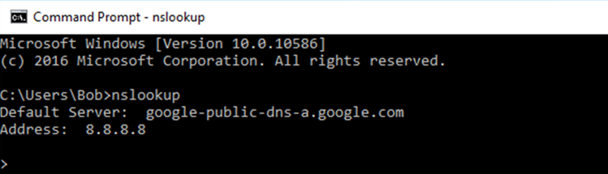
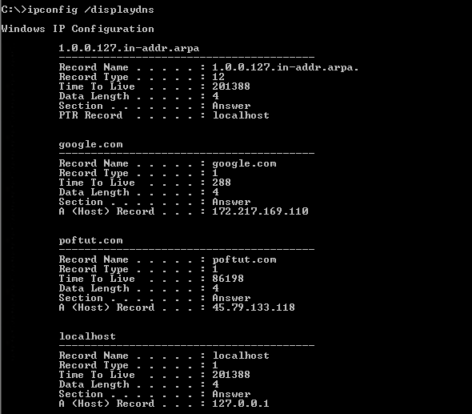
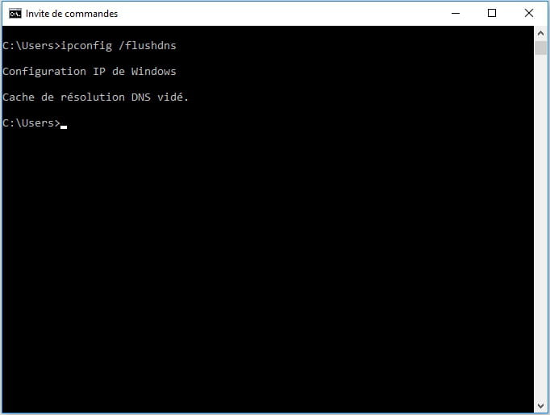

**Travaux pratiques– Observation de la résolution de noms DNS**
- **Objectifs**
- Observer la conversion d'une URL en adresseIP.
- Observer la recherche DNS à l'aide de la commande nslookup.
- Observer la mise en cache des associations entre noms de domaine et adresses IP à l'aide de la commande ipconfig /displaydns
- Vider le cache des résolutions DNS à l'aide de la commande ipconfig /flushdns
- **Contexte/scénario**
Le système de noms de domaine (DNS) est invoqué lorsque vous saisissez une URL, comme [http://www.cisco.com](http://www.cisco.com/), dans un navigateur Web. La première partie de l'URL décrit le protocole utilisé. Les protocoles courants sont HTTP (Hypertext Transfer Protocol), HTTPS (Hypertext Transfer Protocol over Secure Socket Layer) et FTP (File Transfer Protocol).

Le système DNS utilise la deuxième partie de l'URL, en l'occurrence [www.cisco.com.](http://www.cisco.com/)Il convertit le nom de domaine (comme [www.cisco.com](http://www.cisco.com)) en adresse IP pour autoriser l'hôte source à atteindre l'hôte de destination.

Pour ces travaux pratiques, travaillez par deux.
- **Ressources requises**
- 1ordinateur (Windows10) avec connexion Internet
  1.  **Observez la conversion DNS.**
      1.  Cliquez avec le bouton droit de la souris sur **Démarrer**, puis sélectionnez **Invite de commandes**.
      2.  À l'invite de commandes, saisissez **ping cisco.com**, puis appuyez sur Entrée. L'ordinateur doit convertir cisco.com en adresse IP pour savoir où envoyer les paquets ICMP (Internet Control Message Protocol). La commande ping est un type de paquet ICMP.
      3.  La première ligne de l'écran affiche l'adresse cisco.com, convertie en adresse IP par le système DNS. Vous devez pouvoir voir l'effet du système DNS même si votre établissement dispose d'un pare-feu qui empêche d'exécuter la commande ping ou si Cisco empêche d'effectuer ce type de commande sur son serveur Web.
====

Quelle adresseIP s'affiche à l'écran?

Est-ce la même que celle de la capture d'écran?

La résolution de cisco.com aboutit-elle toujours à la même adresseIP? Expliquez votre réponse.

\_\_\_\_\_\_\_\_\_\_\_\_\_\_\_\_\_\_\_\_\_\_\_\_\_\_\_\_\_\_\_\_\_\_\_\_\_\_\_\_\_\_\_\_\_\_\_\_\_\_\_\_\_\_\_\_\_\_\_\_\_\_\_\_\_\_\_\_\_\_\_\_\_\_\_\_\_\_\_\_\_\_\_\_
- Avec un autre élève, discutez d'une ou deux autres applications (en dehors de la commande **ping**) où l'ordinateur peut avoir besoin d'utiliser le DNS pour convertir le nom de domaine en adresseIP.
\_\_\_\_\_\_\_\_\_\_\_\_\_\_\_\_\_\_\_\_\_\_\_\_\_\_\_\_\_\_\_\_\_\_\_\_\_\_\_\_\_\_\_\_\_\_\_\_\_\_\_\_\_\_\_\_\_\_\_\_\_\_\_\_\_\_\_\_\_\_\_\_\_\_\_\_\_\_\_\_\_\_\_\_
- **Vérifiez le fonctionnement du système DNS à l'aide de la commande nslookup.**
  1.  À l'invite de commandes, saisissez **nslookup**, puis appuyez sur Entrée.

L'image ci-dessus montre que le serveur DNS par défaut a été paramétré pour faire appel à un serveur DNS Google. Sous quel nom votre serveur par défaut est-il affiché? \_\_\_\_\_\_\_\_\_\_\_\_\_\_\_\_\_\_\_\_\_\_\_\_\_\_\_\_\_
- Après avoir saisi la commande **nslookup**, notez que la ligne d'invite de commandes commence désormais uniquement par **\>**. Il s'agit de l'invite **nslookup**. Dans cette invite, vous pouvez saisir des commandes liées au système DNS.
À l'invite de commandes, saisissez**?** pour afficher la liste de toutes les commandes disponibles pouvant être utilisées en mode **nslookup**.

Citez trois commandes pouvant être utilisées avec **nslookup**.

\_\_\_\_\_\_\_\_\_\_\_\_\_\_\_\_\_\_\_\_\_\_\_\_\_\_\_\_\_\_\_\_\_\_\_\_\_\_\_\_\_\_\_\_\_\_\_\_\_\_\_\_\_\_\_\_\_\_\_\_\_\_\_\_\_\_\_\_\_\_\_\_\_\_\_\_\_\_\_\_\_\_\_\_

\_\_\_\_\_\_\_\_\_\_\_\_\_\_\_\_\_\_\_\_\_\_\_\_\_\_\_\_\_\_\_\_\_\_\_\_\_\_\_\_\_\_\_\_\_\_\_\_\_\_\_\_\_\_\_\_\_\_\_\_\_\_\_\_\_\_\_\_\_\_\_\_\_\_\_\_\_\_\_\_\_\_\_\_

\_\_\_\_\_\_\_\_\_\_\_\_\_\_\_\_\_\_\_\_\_\_\_\_\_\_\_\_\_\_\_\_\_\_\_\_\_\_\_\_\_\_\_\_\_\_\_\_\_\_\_\_\_\_\_\_\_\_\_\_\_\_\_\_\_\_\_\_\_\_\_\_\_\_\_\_\_\_\_\_\_\_\_\_
- À l'invite **nslookup**, saisissez **cisco.com**.
Quelle est l'adresseIP convertie?

L'adresseIP correspond-elle à une adresseIPv4 ou à une adresseIPv6?

Est-ce la même adresse IP que celle affichée avec la commande ping?

À l'invite de commandes, saisissez l'adresseIP du serveur Web Cisco que vous venez de trouver. Quel est le résultat du nom?

==\_\_\_\_\_\_\_\_\_\_\_\_\_\_\_\_\_\_\_\_\_\_\_\_\_\_\_\_\_\_\_\_\_\_\_\_\_\_\_\_\_\_\_\_\_\_\_\_\_\_\_\_\_\_\_\_\_\_\_\_\_\_\_\_\_\_\_\_\_\_\_\_\_\_\_\_\_\_\_\_\_\_\_\_==
- **Identifiez les serveurs de messagerie à l'aide de la commande nslookup.**
  1.  Pour identifier les serveurs de messagerie à l'aide de **la commande nslookup**, saisissez **set type=mx**.
  2.  À l'invite de commandes, saisissez **cisco.com**.
====

Quels sont les noms des serveurs de messagerie Cisco identifiés dans le champ **mail exchanger**?

\_\_\_\_\_\_\_\_\_\_\_\_\_\_\_\_\_\_\_\_\_\_\_\_\_\_\_\_\_\_\_\_\_\_\_\_\_\_\_\_\_\_\_\_\_\_\_\_\_\_\_\_\_\_\_\_\_\_\_\_\_\_\_\_\_\_\_\_\_\_\_\_\_\_\_\_\_\_\_\_\_\_\_\_

\_\_\_\_\_\_\_\_\_\_\_\_\_\_\_\_\_\_\_\_\_\_\_\_\_\_\_\_\_\_\_\_\_\_\_\_\_\_\_\_\_\_\_\_\_\_\_\_\_\_\_\_\_\_\_\_\_\_\_\_\_\_\_\_\_\_\_\_\_\_\_\_\_\_\_\_\_\_\_\_\_\_\_\_

\_\_\_\_\_\_\_\_\_\_\_\_\_\_\_\_\_\_\_\_\_\_\_\_\_\_\_\_\_\_\_\_\_\_\_\_\_\_\_\_\_\_\_\_\_\_\_\_\_\_\_\_\_\_\_\_\_\_\_\_\_\_\_\_\_\_\_\_\_\_\_\_\_\_\_\_\_\_\_\_\_\_\_\_
- À l'invite de commandes, saisissez **exit** pour revenir à l'invite de commandes d'origine.
- À l'invite de commandes, saisissez **ipconfig /all**.
- Indiquez les adresses IP de tous les serveurs DNS qu'utilise l'ordinateur de votre établissement.
==\_\_\_\_\_\_\_\_\_\_\_\_\_\_\_\_\_\_\_\_\_\_\_\_\_\_\_\_\_\_\_\_\_\_\_\_\_\_\_\_\_\_\_\_\_\_\_\_\_\_\_\_\_\_\_\_\_\_\_\_\_\_\_\_\_\_\_\_\_\_\_\_\_\_\_\_\_\_\_\_\_\_\_\_==
- Saisissez **exit** pour fermer la fenêtre de l'invite de commandes.
- **Observations**
  1.  Si votre établissement n'avait pas de serveur DNS, quel impact cela aurait-il sur l'utilisation d'Internet?
\_\_\_\_\_\_\_\_\_\_\_\_\_\_\_\_\_\_\_\_\_\_\_\_\_\_\_\_\_\_\_\_\_\_\_\_\_\_\_\_\_\_\_\_\_\_\_\_\_\_\_\_\_\_\_\_\_\_\_\_\_\_\_\_\_\_\_\_\_\_\_\_\_\_\_\_\_\_\_\_\_\_\_\_\_\_\_

\_\_\_\_\_\_\_\_\_\_\_\_\_\_\_\_\_\_\_\_\_\_\_\_\_\_\_\_\_\_\_\_\_\_\_\_\_\_\_\_\_\_\_\_\_\_\_\_\_\_\_\_\_\_\_\_\_\_\_\_\_\_\_\_\_\_\_\_\_\_\_\_\_\_\_\_\_\_\_\_\_\_\_\_\_\_\_

\_\_\_\_\_\_\_\_\_\_\_\_\_\_\_\_\_\_\_\_\_\_\_\_\_\_\_\_\_\_\_\_\_\_\_\_\_\_\_\_\_\_\_\_\_\_\_\_\_\_\_\_\_\_\_\_\_\_\_\_\_\_\_\_\_\_\_\_\_\_\_\_\_\_\_\_\_\_\_\_\_\_\_\_\_\_\_
- Certaines sociétés ne dédient pas un serveur au système DNS. Au lieu de cela, le serveur DNS propose également d'autres fonctions. À votre avis, quelles fonctions peut proposer un serveur DNS? Utilisez la commande **ipconfig /all** pour vous aider.
\_\_\_\_\_\_\_\_\_\_\_\_\_\_\_\_\_\_\_\_\_\_\_\_\_\_\_\_\_\_\_\_\_\_\_\_\_\_\_\_\_\_\_\_\_\_\_\_\_\_\_\_\_\_\_\_\_\_\_\_\_\_\_\_\_\_\_\_\_\_\_\_\_\_\_\_\_\_\_\_\_\_\_\_\_\_\_

\_\_\_\_\_\_\_\_\_\_\_\_\_\_\_\_\_\_\_\_\_\_\_\_\_\_\_\_\_\_\_\_\_\_\_\_\_\_\_\_\_\_\_\_\_\_\_\_\_\_\_\_\_\_\_\_\_\_\_\_\_\_\_\_\_\_\_\_\_\_\_\_\_\_\_\_\_\_\_\_\_\_\_\_\_\_\_

\_\_\_\_\_\_\_\_\_\_\_\_\_\_\_\_\_\_\_\_\_\_\_\_\_\_\_\_\_\_\_\_\_\_\_\_\_\_\_\_\_\_\_\_\_\_\_\_\_\_\_\_\_\_\_\_\_\_\_\_\_\_\_\_\_\_\_\_\_\_\_\_\_\_\_\_\_\_\_\_\_\_\_\_\_\_\_

**étape 4 : Observez la mise en cache des résolutions DNS.**

- Dans l'invite de commandes, saisissez ping suivi d'un nom de domaine. Utilisez le nom de domaine de votre choix
- Répétez l'opération pour plusieurs noms de domaine différents, par exemple ceux de sites web connus.
- À l'invite de commandes, saisissez **ipconfig /displaydns**, puis appuyez sur Entrée.

A quoi correspondent les informations affichées ?

- Saisissez **ipconfig /flushdns** et validez.

- Que s'est-il passé ? A quoi sert cette commande. Vérifiez le résultat en saisissant à nouveau ipconfig /displaydns.

