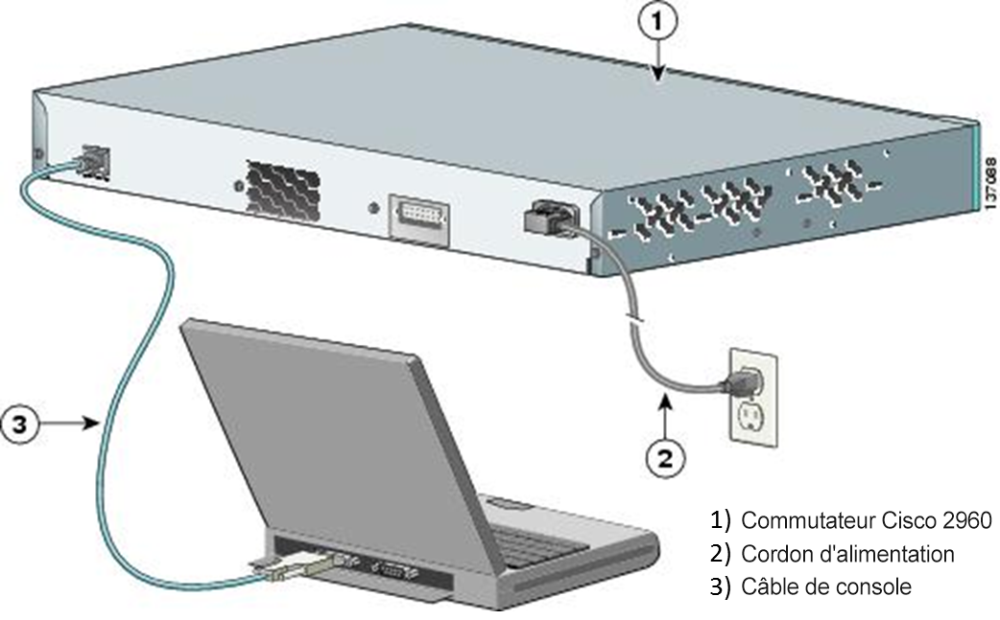
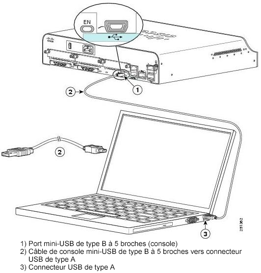

**TP– Connexion à un équipement via le port console**
- 
- **Maquette [1_2 TP Connexion à un équipement via le port console.pka](https://groupesb-my.sharepoint.com/:u:/g/personal/arthur_trouillon_saint-benigne_fr/ESZkx2DpdkpKpoOk23ia364BDkDiWR5jB0bJ32wXEYuOGw)**

- **Objectifs**

Connecter un ordinateur à l'interface de console d’un commutateur et d’un routeur.

Utiliser un programme de terminal pour communiquer avec le commutateur et le routeur.

Supprimez les paramètres enregistrés précédemment afin que l'appareil retrouve son état par défaut.

- **Contexte/scénario**

Les différents modèles de routeurs et commutateurs Cisco sont utilisés dans les réseaux de tous types. Ces appareils sont initialement gérés à l'aide d'une connexion de console locale, puis de façon régulière à l'aide d'une connexion distante. Presque tous les appareils Cisco possèdent un port de console en série auquel vous pouvez vous connecter.

Au cours de ces travaux pratiques, vous apprendrez à accéder à un appareil Cisco par le biais d'une connexion locale directe au port de console, à l'aide d'un programme d'émulation de terminal. Vous découvrirez également comment configurer les paramètres du port série pour la connexion console. Après avoir établi une connexion console avec l'appareil Cisco, vous observerez le processus de mise en route d’un appareil puis vous devrez effacer les configurations enregistrées, et enfin recharger l'appareil.

- **Connectez-vous au commutateur.**
  1.  Sélectionnez **Terminaux** dans les options proposées dans l'angle inférieur gauche. Faites glisser et déposez un ordinateur générique dans la zone de travail.
  2.  Sélectionnez **Connexions** dans les options proposées dans l'angle inférieur gauche. Sélectionnez un câble de type **Console**. Cliquez sur **PC0**, puis attribuez le câble au connecteur **RS232**. Cliquez sur **Switch0**, puis sélectionnez **Console**.
Sur des équipements réels, cela donnerait ceci:

- **Observez le processus de mise en route à l'aide d'un terminal.**
  1.  Cliquez sur **PC0**.
  2.  Sélectionnez **Bureau** \> **Terminal**.
  3.  Examinez la configuration du terminal. Cliquez sur **OK** pour continuer.
  4.  Le terminal affiche les éléments correspondant à la mise en route du commutateur.
  5.  Appuyez sur **Entrée** pour accéder à l'invite.
  6.  Pour redémarrer le commutateur et observer le processus de mise en route, saisissez **enable** à l'invite de commandes.
Switch\> **enable**
- Saisissez **reload** à l'invite pour lancer le redémarrage du commutateur. Appuyez sur **Entrée** pour confirmer.
Switch# **reload**

Proceed with reload? \[confirm\]

**Étape 3: Connectez un routeur Cisco et un ordinateur ensemble à l'aide d'un câble pour console.**
- Sélectionnez **Terminaux** dans les options proposées dans l'angle inférieur gauche. Faites glisser et déposez un ordinateur générique dans la zone de travail.
- Sélectionnez **Appareils réseau** puis **Routeurs** et choisissez un modèle de routeur générique dans la zone de travail.
- Sélectionnez **Connexions**. Sélectionnez un câble de type **Console**. Cliquez sur **PC1**, puis attribuez le câble au connecteur **RS232**. Cliquez sur **Router0**, puis sélectionnez **Console**
Sur des équipements réels récents\*, cela donnerait ceci:

**\* Remarque:** les portsCOM en série ne sont plus disponibles sur la plupart des ordinateurs aujourd'hui. Un adaptateur USBversDB9 peut être utilisé avec le câble pour console, pour la connexion console entre l'ordinateur et un équipement Cisco. Ces adaptateurs USBversDB9 peuvent être achetés dans n'importe quel commerce de matériel informatique.

Si vous utilisez un adaptateur USBversDB9 pour vous connecter au portCOM, vous devrez peut-être installer un pilote pour l'adaptateur fourni par le fabricant de votre ordinateur.

**Remarque**: On trouve également des câbles console mini-USB. Si vous utilisez un câble de console mini-USB, connectez-le au port mini-USB de l'appareil, et vous serez peut-être invité à installer un pilote.

**Étape 4: Utilisez le terminal pour ouvrir une session en mode console avec l'équipement.**
- Cliquez sur **PC1**.
- Sélectionnez **Bureau** \> **Terminal**.
- Examinez la configuration du terminal. Cliquez sur **OK** pour continuer.
- Le terminal affiche les éléments correspondant à la mise en route du routeur.
- Appuyez sur **Entrée** pour accéder à l'invite.
- Pour redémarrer le routeur et observer le processus de mise en route, saisissez **enable** à l'invite de commandes.
Router\> **enable**
- Saisissez **reload** à l'invite pour lancer le redémarrage du routeur. Appuyez sur **Entrée** pour confirmer.
Router# **reload**

Proceed with reload? \[confirm\]

Terminal est un programme d'émulation de terminal. Ce programme vous permet d'accéder à la sortie du terminal du routeur. Il vous permet également de configurer le routeur sans passer par le réseau, quand celui-ci n’est pas encore configuré.

**Remarque**: sur un ordinateur réel, vous pouvez utiliser un logiciel de terminal comme puTTy

****

