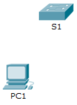

**TP- Utilisation de Cisco IOS**
- 
- **Maquette [1_3 TP Utilisation de Cisco IOS.pka](https://groupesb-my.sharepoint.com/:u:/g/personal/arthur_trouillon_saint-benigne_fr/Ef4dwsA_C89DuA8ESkO5gmABFB1A5kGSTWi2bSSv4TxhPA)**

**Topologie**

- 
- **Objectifs**

**Partie1: Établir des connexions de base, accéder à l'interface en ligne de commande et découvrir l'Aide**

**Partie2: Découvrir les modes d'exécution**

**Partie3: Régler l'horloge**
- 
- **Contexte**

Cet exercice vous permettra d'acquérir les aptitudes nécessaires à l'utilisation de CiscoIOS, notamment les différents modes d'accès utilisateur, les divers modes de configuration, ainsi que les commandes régulièrement utilisées. Vous accéderez également à l'aide contextuelle en configurant la commande **clock**.

- **Établir des connexions de base, accéder à l'interface en ligne de commande et découvrir l'Aide**

Dans la partie1 de cet exercice, vous connecterez un ordinateur à un commutateur par le biais d'une connexion console et découvrirez divers modes de commande et fonctions d'aide.

- **Raccordez PC1 à S1 à l'aide d'un câble de console.**
  1.  Cliquez sur l'icône **Connexions** (celle ayant la forme d'un éclair) située dans le coin inférieur gauche de la fenêtre Packet Tracer.
  2.  Sélectionnez le câble Console bleu clair en cliquant dessus. Le pointeur de la souris prend une apparence similaire à celle d'un connecteur sur lequel pend un câble.
  3.  Cliquez sur **PC1**. Une fenêtre affiche une option relative à une connexion RS-232.
  4.  Faites glisser l'autre extrémité de la connexion console vers le commutateur S1, puis cliquez sur le commutateur afin d'accéder à la liste des connexions.
  5.  Sélectionnez le port **Console** afin d'établir la connexion.

- **Établissez une session de terminal avec S1.**
  1.  Cliquez sur **PC1** puis sélectionnez l'onglet **Bureau**.
  2.  Cliquez sur l'icône de l'application **Terminal**. Vérifiez que les paramètres de configuration des ports par défaut sont corrects.
Quelle est la valeur du paramètre des bits par seconde?
- Cliquez sur **OK**.
- L'écran qui s'affiche peut contenir plusieurs messages. Le message suivant doit figurer quelque part sur l'écran: Press RETURN to get started!(Appuyez sur ENTRÉE pour démarrer). Appuyez sur ENTRÉE.
Quelle est l'invite affichée à l'écran?

- **Découvrez l'Aide IOS.**
  1.  L'IOS peut fournir de l'aide sur les commandes en fonction du niveau auquel l'utilisateur accède. L'invite actuellement affichée est appelée **User EXEC** (mode d'exécution utilisateur) et le périphérique attend une commande. La forme la plus simple de l'aide consiste à entrer un point d'interrogation (?) à l'invite afin d'afficher la liste des commandes.
S1\> **?**

Quelle commande commence par la lettre «C»?
- À l'invite, tapez **t**, suivi d'un point d'interrogation (**?**).
S1\> **t?**

Quelles sont les commandes affichées?
- À l'invite, tapez **te**, suivi d'un point d'interrogation (**?**).
S1\> **te?**

Quelles sont les commandes affichées?

Ce type d'aide porte le nom d'aide **contextuelle**. Elle fournit davantage d'informations une fois que les commandes sont développées.

- **Découvrir les modes d'exécution**
Dans la partie2 de cet exercice, vous passerez en mode d'exécution privilégié et exécuterez des commandes supplémentaires.

- **Passez en mode d'exécution privilégié.**
  1.  À l'invite, tapez un point d'interrogation (**?**).
S1\> **?**

Quelle information affichée décrit la commande **enable**?
- Tapez **en** et appuyez sur la touche **Tab**.
S1\> **en\<Tab\>**

Que voyez-vous apparaître après avoir appuyé sur la touche **Tab**?

La touche Tabulation peut être utilisée pour compléter une commande partielle. Lorsque vous ne tapez qu'une partie d'une commande, la touche **Tab** peut être utilisée pour compléter cette commande. Si les caractères saisis sont suffisants pour identifier la commande, comme dans le cas de la commande **enable**, le reste de cette commande s'affiche.

Que se passerait-il si vous saisissiez **te\<Tab\>** à l'invite?

\_\_\_\_\_\_\_\_\_\_\_\_\_\_\_\_\_\_\_\_\_\_\_\_\_\_\_\_\_\_\_\_\_\_\_\_\_\_\_\_\_\_\_\_\_\_\_\_\_\_\_\_\_\_\_\_\_\_\_\_\_\_\_\_\_\_\_\_\_\_\_\_\_\_\_\_\_\_\_\_\_\_\_\_

\_\_\_\_\_\_\_\_\_\_\_\_\_\_\_\_\_\_\_\_\_\_\_\_\_\_\_\_\_\_\_\_\_\_\_\_\_\_\_\_\_\_\_\_\_\_\_\_\_\_\_\_\_\_\_\_\_\_\_\_\_\_\_\_\_\_\_\_\_\_\_\_\_\_\_\_\_\_\_\_\_\_\_\_

\_\_\_\_\_\_\_\_\_\_\_\_\_\_\_\_\_\_\_\_\_\_\_\_\_\_\_\_\_\_\_\_\_\_\_\_\_\_\_\_\_\_\_\_\_\_\_\_\_\_\_\_\_\_\_\_\_\_\_\_\_\_\_\_\_\_\_\_\_\_\_\_\_\_\_\_\_\_\_\_\_\_\_\_

\_\_\_\_\_\_\_\_\_\_\_\_\_\_\_\_\_\_\_\_\_\_\_\_\_\_\_\_\_\_\_\_\_\_\_\_\_\_\_\_\_\_\_\_\_\_\_\_\_\_\_\_\_\_\_\_\_\_\_\_\_\_\_\_\_\_\_\_\_\_\_\_\_\_\_\_\_\_\_\_\_\_\_\_
- Entrez la commande **enable** et appuyez sur Entrée. Quel changement observez-vous sur l'invite?
\_\_\_\_\_\_\_\_\_\_\_\_\_\_\_\_\_\_\_\_\_\_\_\_\_\_\_\_\_\_\_\_\_\_\_\_\_\_\_\_\_\_\_\_\_\_\_\_\_\_\_\_\_\_\_\_\_\_\_\_\_\_\_\_\_\_\_\_\_\_\_\_\_\_\_\_\_\_\_\_\_\_\_\_

\_\_\_\_\_\_\_\_\_\_\_\_\_\_\_\_\_\_\_\_\_\_\_\_\_\_\_\_\_\_\_\_\_\_\_\_\_\_\_\_\_\_\_\_\_\_\_\_\_\_\_\_\_\_\_\_\_\_\_\_\_\_\_\_\_\_\_\_\_\_\_\_\_\_\_\_\_\_\_\_\_\_\_\_
- À l'invite, tapez le point d'interrogation (**?**).
S1# **?**

Une seule commande commence par la lettre «C» en mode d'exécution utilisateur. Combien de commandes sont affichées maintenant que le mode d'exécution privilégié est actif? (**Conseil**: pour afficher uniquement les commandes commençant par «C», vous pouvez taper «c?».)

\_\_\_\_\_\_\_\_\_\_\_\_\_\_\_\_\_\_\_\_\_\_\_\_\_\_\_\_\_\_\_\_\_\_\_\_\_\_\_\_\_\_\_\_\_\_\_\_\_\_\_\_\_\_\_\_\_\_\_\_\_\_\_\_\_\_\_\_\_\_\_\_\_\_\_\_\_\_\_\_\_\_\_\_

\_\_\_\_\_\_\_\_\_\_\_\_\_\_\_\_\_\_\_\_\_\_\_\_\_\_\_\_\_\_\_\_\_\_\_\_\_\_\_\_\_\_\_\_\_\_\_\_\_\_\_\_\_\_\_\_\_\_\_\_\_\_\_\_\_\_\_\_\_\_\_\_\_\_\_\_\_\_\_\_\_\_\_\_

- **Passez en mode de configuration globale.**
  1.  Lorsque vous êtes en mode d'exécution privilégié, **configure** est l'une des commandes qui commencent par la lettre «C». Tapez soit la commande complète, soit suffisamment de lettres pour qu'elle soit identifiable. Appuyez sur la touche \<**Tab**\> pour exécuter la commande, puis sur Entrée.
S1# **configure**

Quel est le message affiché?

\_\_\_\_\_\_\_\_\_\_\_\_\_\_\_\_\_\_\_\_\_\_\_\_\_\_\_\_\_\_\_\_\_\_\_\_\_\_\_\_\_\_\_\_\_\_\_\_\_\_\_\_\_\_\_\_\_\_\_\_\_\_\_\_\_\_\_\_\_\_\_\_\_\_\_\_\_\_\_\_\_\_\_\_
- Appuyez sur Entrée pour accepter le paramètre par défaut qui est inclus entre crochets **\[terminal\]**.
Quel changement observez-vous sur l'invite?
- Il s'agit du mode de configuration globale. Ce mode sera examiné en détail dans les prochains exercices et à l'occasion des travaux pratiques. Pour l'instant, revenez en mode d'exécution privilégié en tapant **end**, **exit** ou **Ctrl-Z**.
S1(config)# **exit**

S1#

- **Régler l'horloge**
  1.  **Utilisez la commande clock.**
      1.  Utilisez la commande **clock** pour examiner plus en détail l'aide et la syntaxe de la commande. Tapez **show clock** à l'invite du mode d'exécution privilégié.
S1# **show clock**

Quelle information s'affiche? Quelle est l'année affichée?

\_\_\_\_\_\_\_\_\_\_\_\_\_\_\_\_\_\_\_\_\_\_\_\_\_\_\_\_\_\_\_\_\_\_\_\_\_\_\_\_\_\_\_\_\_\_\_\_\_\_\_\_\_\_\_\_\_\_\_\_\_\_\_\_\_\_\_\_\_\_\_\_\_\_\_\_\_\_\_\_\_\_\_\_
- Utilisez l'aide contextuelle et la commande **clock** pour régler l'heure du commutateur à l'heure actuelle. Entrez la commande **clock** et appuyez sur Entrée.
S1# **clock\<ENTER\>**

Quelle information s'affiche?
- Le message «% Incomplete command» (commande incomplète) est renvoyé par l'IOS. Il indique que la commande **clock** requiert plus de paramètres. Lorsque des informations supplémentaires sont nécessaires, vous pouvez obtenir de l'aide en insérant un espace après la commande suivi du point d'interrogation (?).
S1# **clock ?**

Quelle information s'affiche?

- Réglez l'horloge à l'aide de la commande **clock set**. Poursuivez pas à pas l'exécution de la commande.
S1# **clock set ?**

Quelle est l'information demandée?

Qu'auriez-vous vu s'afficher si seule la commande **clock set** avait été entrée, sans demande d'aide par le biais du point d'interrogation?
- En tenant compte des informations demandées lors de l'exécution de la commande **clock set ?**, entrez 3 heures de l'après-midi en utilisant le format 24 heures, c'est-à-dire 15:00:00. Vérifiez si d'autres paramètres sont requis.
S1# **clock set 15:00:00 ?**

Le résultat renvoie une demande pour plus d'informations:

\<1-31\> Day of the month

MONTH Month of the year
- Essayez de définir la date au 01/31/2035 en utilisant le format demandé. Il peut être nécessaire de demander une assistance supplémentaire en utilisant l'aide contextuelle pour terminer le processus. Lorsque vous avez terminé, exécutez la commande **show clock** pour afficher les paramètres de l'horloge. Le résultat de la commande devrait s'afficher comme suit:
S1# **show clock**

\*15:0:4.869 UTC Tue Jan 312035
- En cas d'échec, essayez la commande suivante afin d'obtenir le résultat ci-dessus:
S1# **clock set 15:00:00 31 Jan 2035**

- **Examinez d'autres messages de commande.**
  1.  IOS fournit divers résultats pour les commandes incorrectes ou incomplètes. Continuez à utiliser la commande **clock** pour découvrir des messages supplémentaires que vous êtes susceptible de rencontrer en apprenant à utiliser IOS.
  2.  Exécutez la commande suivante et notez les messages:
S1# **cl**

Quelle information a été renvoyée?

S1# **clock**

Quelle information a été renvoyée?

S1# **clock set 25:00:00**

Quelle information a été renvoyée?

\_\_\_\_\_\_\_\_\_\_\_\_\_\_\_\_\_\_\_\_\_\_\_\_\_\_\_\_\_\_\_\_\_\_\_\_\_\_\_\_\_\_\_\_\_\_\_\_\_\_\_\_\_\_\_\_\_\_\_\_\_\_\_\_\_\_\_\_\_\_\_\_\_\_\_\_\_\_\_\_\_\_\_\_

\_\_\_\_\_\_\_\_\_\_\_\_\_\_\_\_\_\_\_\_\_\_\_\_\_\_\_\_\_\_\_\_\_\_\_\_\_\_\_\_\_\_\_\_\_\_\_\_\_\_\_\_\_\_\_\_\_\_\_\_\_\_\_\_\_\_\_\_\_\_\_\_\_\_\_\_\_\_\_\_\_\_\_\_

S1# **clock set 15:00:00 32**

Quelle information a été renvoyée?

\_\_\_\_\_\_\_\_\_\_\_\_\_\_\_\_\_\_\_\_\_\_\_\_\_\_\_\_\_\_\_\_\_\_\_\_\_\_\_\_\_\_\_\_\_\_\_\_\_\_\_\_\_\_\_\_\_\_\_\_\_\_\_\_\_\_\_\_\_\_\_\_\_\_\_\_\_\_\_\_\_\_\_\_

\_\_\_\_\_\_\_\_\_\_\_\_\_\_\_\_\_\_\_\_\_\_\_\_\_\_\_\_\_\_\_\_\_\_\_\_\_\_\_\_\_\_\_\_\_\_\_\_\_\_\_\_\_\_\_\_\_\_\_\_\_\_\_\_\_\_\_\_\_\_\_\_\_\_\_\_\_\_\_\_\_\_\_\_
