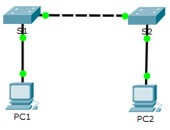

**TP– Mise en œuvre de la connectivité de base**
- 
- **Maquette [1_5 TP Connectivité de base.pka](https://groupesb-my.sharepoint.com/:u:/g/personal/arthur_trouillon_saint-benigne_fr/EXyGFS7Eox1BnngETZLPlnIBQhfLW6DRuspqgpb3S4u36Q)**

- **Topologie**

- 
- **Table d'adressage**

| **Appareil** | **Interface** | **AdresseIP** | **Masque de sous-réseau** |
|--------------|---------------|----------------|---------------------------|
| S1           | VLAN1        | 192.168.1.253  | 255.255.255.0             |
| S2           | VLAN1        | 192.168.1.254  | 255.255.255.0             |
| PC1          | Carte réseau  | 192.168.1.1    | 255.255.255.0             |
| PC2          | Carte réseau  | 192.168.1.2    | 255.255.255.0             |
- 
- **Objectifs**

**Partie1: Effectuer la configuration de base des commutateurs S1 et S2**

**Partie2: Configurer les ordinateurs**

**Partie3: Configurer l'interface de gestion des commutateurs**
- 
- **Contexte**

Au cours de cet exercice, vous allez effectuer des configurations de base sur les commutateurs. Vous mettrez ensuite en œuvre la connectivité de base en configurant l'adressageIP sur les commutateurs et les ordinateurs. Après la configuration de l'adressage IP, vous utiliserez plusieurs commandes **show** pour vérifier les configurations et la commande **ping** pour vérifier la connectivité de base entre les appareils.

- **Effectuer la configuration de base des commutateurs S1 et S2**
  1.  **Configurez S1 avec un nom d'hôte.**
      1.  Cliquez sur **S1** puis sur l'onglet **CLI**.
      2.  Passez en mode d'exécution privilégié. Passez ensuite en mode de configuration globale.
Switch\> **enable**

Switch# **configure terminal**

Enter configuration commands, one per line. End with CNTL/Z.
- Configurez le nom d'hôte du commutateur en tant que S1.
Switch(config)# **hostname S1**

S1(config)#

- **Configurez le mot de passe de console ainsi que celui du mode d'exécution privilégié.**
  1.  Attribuez **cisco** comme mot de passe de console, puis activez la connexion.
S1(config)# **line console 0**

S1(config-line)# **password cisco**

S1(config-line)# **login**

S1(config-line)# **exit**
- Utilisez **class** comme mot de passe pour le mode d'exécution privilégié crypté.
S1(config)# **enable secret class**

- **Vérifiez les configurations de mot de passe pour S1.**
  1.  Pour vérifier la bonne configuration des mots de passe, saisissez **end** afin de quitter le mode de configuration globale. Saisissez **exit** pour quitter le mode d'exécution privilégié.
S1(config)# **end**

S1#

%SYS-5-CONFIG_I: Configured from console by console

S1# **exit**
- Appuyez sur **Entrée** et vous serez invité à saisir un mot de passe pour accéder au mode d'exécution utilisateur.
Quel mot de passe avez-vous utilisé?
- Saisissez **enable** pour passer en mode d'exécution privilégié. Saisissez le mot de passe lorsque vous y êtes invité.
Quel mot de passe avez-vous utilisé?
- Saisissez **configure terminal** pour passer en mode de configuration globale.

- **Configurez une bannière MOTD (message of the day ou message du jour).**
Dans cette étape, vous allez configurer une bannière MOTD pour afficher un avertissement d'accès non autorisé. Voici un exemple de texte:

Accès autorisé uniquement. Tout contrevenant sera poursuivi conformément à la loi.

Utilisez la commande **banner motd** avec le message exemple. Vous pouvez choisir un autre message.

S1(config)# **banner motd " Acces autorise uniquement. Tout contrevenant sera poursuivi conformement a la loi."**

- **Enregistrez le fichier de configuration dans la mémoire NVRAM.**
  1.  Quittez le mode d'exécution privilégié.
S1(config)# **exit**

S1#

%SYS-5-CONFIG_I: Configured from console by console

S1#
- Utilisez la commande **copy running-config startup-config** pour enregistrer la configuration.
S1# **copy running-config startup-config**

Destination filename \[startup-config\]?

Building configuration...

\[OK\]

- **Répétez les étapes1 à5 surS2 en adaptant le nom d’hôte.**

- **Configurer les ordinateurs**
  1.  **Configurez les deux ordinateurs avec des adressesIP.**
      1.  Cliquez sur **PC1,** puis sur l'onglet **Bureau**.
      2.  Cliquez sur **Configuration IP**. Dans la **table d'adressage** ci-dessus, vous pouvez constater que l'adresseIP de PC1 est 192.168.1.1 et que le masque de sous-réseau est 255.255.255.0. Saisissez ces informations pour PC1 dans la fenêtre **Configuration IP**.
      3.  Répétez les étapes1a et 1b pour PC2 en adaptant les configurations.

- **Testez la connectivité avec les commutateurs.**
  1.  Cliquez sur **PC1**. Fermez la fenêtre **Configuration IP** si elle est toujours ouverte. Dans l'onglet **Bureau**, cliquez sur **Invite de commandes**.
  2.  Tapez la commande **ping** et l'adresseIP de S1, puis appuyez sur **Entrée**.
Packet Tracer PC Command Line 1.0

PC\> **ping 192.168.1.253**

Avez-vous réussi? Expliquez votre réponse.

\_\_\_\_\_\_\_\_\_\_\_\_\_\_\_\_\_\_\_\_\_\_\_\_\_\_\_\_\_\_\_\_\_\_\_\_\_\_\_\_\_\_\_\_\_\_\_\_\_\_\_\_\_\_\_\_\_\_\_\_\_\_\_\_\_\_\_\_\_\_\_\_\_\_\_\_\_\_\_\_\_\_\_\_

- **Configurer l'interface de gestion des commutateurs**
  1.  **Configurez S1 avec une adresseIP.**
Les commutateurs peuvent être utilisés sans configuration. Ils transmettent les informations d'un port à un autre en fonction des adresses MAC de contrôle d'accès au support. Pourquoi un commutateur a-t-il besoin d'une adresseIP?

\_\_\_\_\_\_\_\_\_\_\_\_\_\_\_\_\_\_\_\_\_\_\_\_\_\_\_\_\_\_\_\_\_\_\_\_\_\_\_\_\_\_\_\_\_\_\_\_\_\_\_\_\_\_\_\_\_\_\_\_\_\_\_\_\_\_\_\_\_\_\_\_\_\_\_\_\_\_\_\_\_\_\_\_\_\_\_

\_\_\_\_\_\_\_\_\_\_\_\_\_\_\_\_\_\_\_\_\_\_\_\_\_\_\_\_\_\_\_\_\_\_\_\_\_\_\_\_\_\_\_\_\_\_\_\_\_\_\_\_\_\_\_\_\_\_\_\_\_\_\_\_\_\_\_\_\_\_\_\_\_\_\_\_\_\_\_\_\_\_\_\_\_\_\_
- En mode de configuration globale, saisissez les commandes suivantes pour configurer S1 avec une adresseIP dans le réseau local virtuel VLAN1.
S1#**configure terminal**

Enter configuration commands, one per line. End with CNTL/Z.

S1(config)# **interface vlan 1**

S1(config-if)# **ip address 192.168.1.253 255.255.255.0**

S1(config-if)# **no shutdown**

%LINEPROTO-5-UPDOWN: Line protocol on Interface Vlan1, changed state to up

S1(config-if)#

S1(config-if)# **exit**

S1#

À quoi sert la commande **no shutdown**?

\_\_\_\_\_\_\_\_\_\_\_\_\_\_\_\_\_\_\_\_\_\_\_\_\_\_\_\_\_\_\_\_\_\_\_\_\_\_\_\_\_\_\_\_\_\_\_\_\_\_\_\_\_\_\_\_\_\_\_\_\_\_\_\_\_\_\_\_\_\_\_\_\_\_\_\_\_\_\_\_\_\_\_\_
- Enregistrez la configuration.
S1# **copy running-config startup-config**

Destination filename \[startup-config\]?

Building configuration...

\[OK\]

S1#
- Vérifiez la configuration de l'adresseIP sur S1.
S1# **show ip interface brief**

\<résultat omis\>

Vlan1 192.168.1.253 YES manual up up

- **Configurez S2 avec une adresseIP.**
Utilisez Informations de la table d'adressage pour répéter le processus décrit à l'étape1 pour configurer S2 et lui attribuer une adresseIP. N'oubliez pas de vérifier vos paramètres et de les enregistrer.

- **Vérifiez la connectivité du réseau.**
La commande **ping** permet de vérifier la connectivité réseau. Il est très important de disposer d'une connectivité sur tout le réseau.
- Cliquez sur **PC1,** puis sur l'onglet **Bureau**.
- Ouvrez **Invite de commandes**.
  1.  Envoyez une requête ping à l'adresseIP de PC2.
  2.  Envoyez une requête ping à l'adresseIP de S1.
  3.  Envoyez une requête ping à l'adresseIP de S2.
- Sur PC2, envoyez une requête ping aux autres appareils du réseau.
- Sur S1, envoyez une requête ping aux autres appareils du réseau. La requête ping envoyée à PC1 est présentée ci-dessous à titre d'exemple.
S1\> **ping 192.168.1.1**

Type escape sequence to abort.

Sending 5, 100-byte ICMP Echos to 192.168.1.1, timeout is 2 seconds:

!!!!!

Success rate is 100 percent (5/5), round-trip min/avg/max = 0/0/1 ms
- Sur S2, envoyez une requête ping aux autres appareils du réseau.

Toutes les requêtes ping doivent aboutir. Si le résultat de votre première requête ping est 80%, recommencez; il devrait maintenant être égal à 100%. Si vous ne pouvez envoyer de requête ping à aucun des appareils, vérifiez votre configuration pour vous assurer qu'elle ne comporte pas d'erreurs.
