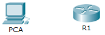

**TP– Configuration des paramètres initiaux du routeur**
- 
- **Maquette [1_6 TP Paramètres initiaux.pka](https://groupesb-my.sharepoint.com/:u:/g/personal/arthur_trouillon_saint-benigne_fr/EflAmjHVeRtAtvEMV4ZXoigBGWOA5xP2v7W2hUEbMdeVXg)**

**Topologie**

- 
- 
- **Objectifs**

**Partie1: Vérifier la configuration par défaut du routeur**

**Partie2: Configurer et vérifier la configuration initiale du routeur**

**Partie3: Enregistrer le fichier de configuration en cours**
- 
- **Contexte**

Au cours de cet exercice, vous allez effectuer des configurations de base sur les routeurs. Vous sécuriserez l'accès au port de console et CLI à l'aide de mots de passe cryptés et configurer les messages affichés lors de la connexion des utilisateurs au routeur. Ces bannières avertiront les intrus que l'accès est interdit. Enfin, vous allez vérifier et enregistrer votre configuration en cours.

- **Vérifier la configuration par défaut du routeur**
  1.  **Établissez une connexion console avec R1.**
      1.  Choisissez le câble bleu **Console** parmi les connexions disponibles.
      2.  Cliquez sur **PCA** et sélectionnez **RS 232**.
      3.  Faites glisser le câble, cliquez sur **R1**, puis sélectionnez **Console**.
      4.  Cliquez sur **PCA**\> onglet **Bureau** \> **Terminal**.
      5.  Cliquez sur **OK** et appuyez sur **Entrée**. Vous êtes maintenant en mesure de configurer **R1**.

- **Accédez au mode privilégié et examinez la configuration actuelle.**
Vous pouvez accéder à l'ensemble des commandes du routeur en mode d'exécution privilégié. Toutefois, comme un grand nombre de commandes du mode privilégié permettent de configurer des paramètres système, l'accès privilégié doit être protégé par mot de passe pour empêcher toute utilisation non autorisée.
- Accédez au mode d'exécution privilégié en saisissant la commande **enable**.
Router\> **enable**

Router#

Notez que l'invite a changé dans la configuration pour représenter le mode d'exécution privilégié.
- Saisissez la commande **show running-config**.
Router# **show running-config**
- Répondez aux questions suivantes:
Quel est le nom d'hôte du routeur?

Combien d'interfaces Fast Ethernet le routeur possède-t-il?

Combien d'interfaces Gigabit Ethernet le routeur possède-t-il?

Combien d'interfaces série le routeur possède-t-il?

Quelle est la plage de valeurs affichée pour les lignes vty?
- Examinez le contenu actuel de la mémoire vive non volatile (NVRAM).
Router# **show startup-config**

startup-config is not present

Pourquoi le routeur répond-il avec le message startup-config is not present?

\_\_\_\_\_\_\_\_\_\_\_\_\_\_\_\_\_\_\_\_\_\_\_\_\_\_\_\_\_\_\_\_\_\_\_\_\_\_\_\_\_\_\_\_\_\_\_\_\_\_\_\_\_\_\_\_\_\_\_\_\_\_\_\_\_\_\_\_\_\_\_\_\_\_\_\_\_\_\_\_\_\_\_\_

\_\_\_\_\_\_\_\_\_\_\_\_\_\_\_\_\_\_\_\_\_\_\_\_\_\_\_\_\_\_\_\_\_\_\_\_\_\_\_\_\_\_\_\_\_\_\_\_\_\_\_\_\_\_\_\_\_\_\_\_\_\_\_\_\_\_\_\_\_\_\_\_\_\_\_\_\_\_\_\_\_\_\_\_

- **Configurer et vérifier la configuration initiale du routeur**
Pour configurer les paramètres d'un routeur, vous devrez peut-être passer d'un mode de configuration à l'autre. Notez que l'invite change lorsque vous utilisez le routeur.

- **Configurez les paramètres initiaux du routeur R1.**
**Remarque**: si vous avez du mal à vous souvenir des commandes, référez-vous au contenu de cette rubrique. Les commandes sont les mêmes que celles que vous avez configurées sur le commutateur.
- Configurez **R1** comme nom d'hôte.
- Attribuez **letmein** comme mot de passe console, puis activez la connexion.
- Attribuez **itsasecret** comme mot de passe pour le mode d'exécution privilégié crypté.
- Cryptez tous les mots de passe en clair.
- Configurez une bannière MOTD (message of the day ou message du jour) pour avertir les utilisateurs en cas d'accès non autorisé. La bannière peut, par exemple, afficher le message **Unauthorized access is strictly prohibited** (Tout accès non autorisé est strictement interdit).

- **Vérifiez les paramètres initiaux du routeur R1.**
  1.  Vérifiez les paramètres initiaux en affichant la configuration de R1. Quelle commande utilisez-vous?
\_\_\_\_\_\_\_\_\_\_\_\_\_\_\_\_\_\_\_\_\_\_\_\_\_\_\_\_\_\_\_\_\_\_\_\_\_\_\_\_\_\_\_\_\_\_\_\_\_\_\_\_\_\_\_\_\_\_\_\_\_\_\_\_\_\_\_\_\_\_\_\_\_\_\_\_\_\_\_\_\_\_\_\_
- Quittez la session actuelle en mode console jusqu'à ce que le message suivant apparaisse:
R1 con0 is now available

Press RETURN to get started.
- Appuyez sur **Entrée** pour obtenir le message suivant:
Unauthorized access is strictly prohibited. (Accès non autorisé strictement interdit.)

User Access Verification

Password:

Pourquoi chaque routeur doit-il avoir une bannière de message du jour (MOTD)?

\_\_\_\_\_\_\_\_\_\_\_\_\_\_\_\_\_\_\_\_\_\_\_\_\_\_\_\_\_\_\_\_\_\_\_\_\_\_\_\_\_\_\_\_\_\_\_\_\_\_\_\_\_\_\_\_\_\_\_\_\_\_\_\_\_\_\_\_\_\_\_\_\_\_\_\_\_\_\_\_\_\_\_\_

\_\_\_\_\_\_\_\_\_\_\_\_\_\_\_\_\_\_\_\_\_\_\_\_\_\_\_\_\_\_\_\_\_\_\_\_\_\_\_\_\_\_\_\_\_\_\_\_\_\_\_\_\_\_\_\_\_\_\_\_\_\_\_\_\_\_\_\_\_\_\_\_\_\_\_\_\_\_\_\_\_\_\_\_

\_\_\_\_\_\_\_\_\_\_\_\_\_\_\_\_\_\_\_\_\_\_\_\_\_\_\_\_\_\_\_\_\_\_\_\_\_\_\_\_\_\_\_\_\_\_\_\_\_\_\_\_\_\_\_\_\_\_\_\_\_\_\_\_\_\_\_\_\_\_\_\_\_\_\_\_\_\_\_\_\_\_\_\_

Si vous n'êtes pas invité à saisir un mot de passe, quelle commande de ligne de console avez-vous oublié de configurer?

\_\_\_\_\_\_\_\_\_\_\_\_\_\_\_\_\_\_\_\_\_\_\_\_\_\_\_\_\_\_\_\_\_\_\_\_\_\_\_\_\_\_\_\_\_\_\_\_\_\_\_\_\_\_\_\_\_\_\_\_\_\_\_\_\_\_\_\_\_\_\_\_\_\_\_\_\_\_\_\_\_\_\_\_
- Saisissez les mots de passe requis pour revenir au mode d'exécution privilégié.
Si vous configurez d'autres mots de passe sur le routeur, s'affichent-ils dans le fichier de configuration en texte clair ou cryptés? Expliquez votre réponse.

\_\_\_\_\_\_\_\_\_\_\_\_\_\_\_\_\_\_\_\_\_\_\_\_\_\_\_\_\_\_\_\_\_\_\_\_\_\_\_\_\_\_\_\_\_\_\_\_\_\_\_\_\_\_\_\_\_\_\_\_\_\_\_\_\_\_\_\_\_\_\_\_\_\_\_\_\_\_\_\_\_\_\_\_

\_\_\_\_\_\_\_\_\_\_\_\_\_\_\_\_\_\_\_\_\_\_\_\_\_\_\_\_\_\_\_\_\_\_\_\_\_\_\_\_\_\_\_\_\_\_\_\_\_\_\_\_\_\_\_\_\_\_\_\_\_\_\_\_\_\_\_\_\_\_\_\_\_\_\_\_\_\_\_\_\_\_\_\_

- **Enregistrer le fichier de configuration en cours**
  1.  **Enregistrez le fichier de configuration dans la mémoire NVRAM.**
      1.  Vous avez configuré les paramètres initiaux du routeur **R1**. Enregistrez le fichier de configuration en cours dans la mémoire vive non volatile pour vous assurer que les modifications apportées seront conservées en cas de redémarrage du système ou de coupure de courant.
Quelle commande avez-vous exécutée pour enregistrer la configuration dans la mémoire NVRAM?

\_\_\_\_\_\_\_\_\_\_\_\_\_\_\_\_\_\_\_\_\_\_\_\_\_\_\_\_\_\_\_\_\_\_\_\_\_\_\_\_\_\_\_\_\_\_\_\_\_\_\_\_\_\_\_\_\_\_\_\_\_\_\_\_\_\_\_\_\_\_\_\_\_\_\_\_\_\_\_\_\_\_\_\_

Quelle est la version la plus courte et non ambiguë de cette commande?

\_\_\_\_\_\_\_\_\_\_\_\_\_\_\_\_\_\_\_\_\_\_\_\_\_\_\_\_\_\_\_\_\_\_\_\_\_\_\_\_\_\_\_\_\_\_\_\_\_\_\_\_\_\_\_\_\_\_\_\_\_\_\_\_\_\_\_\_\_\_\_\_\_\_\_\_\_\_\_\_\_\_\_\_

Quelle commande affiche le contenu de la mémoire NVRAM?

\_\_\_\_\_\_\_\_\_\_\_\_\_\_\_\_\_\_\_\_\_\_\_\_\_\_\_\_\_\_\_\_\_\_\_\_\_\_\_\_\_\_\_\_\_\_\_\_\_\_\_\_\_\_\_\_\_\_\_\_\_\_\_\_\_\_\_\_\_\_\_\_\_\_\_\_\_\_\_\_\_\_\_\_
- Vérifiez que tous les paramètres configurés ont été enregistrés. Si ce n'est pas le cas, analysez le résultat et déterminez quelles commandes n'ont pas été exécutées ou ont été saisies incorrectement. Vous pouvez également cliquer sur **Vérifier les résultats** dans la fenêtre d'instructions.

- **Enregistrez le fichier de configuration initiale dans la mémoire Flash.**
Vous en apprendrez plus sur la gestion du stockage Flash d'un routeur dans les chapitres ultérieurs. Toutefois, sachez qu'en guise de procédure de sauvegarde supplémentaire, vous pouvez enregistrer votre fichier de configuration initiale dans la mémoire Flash. Par défaut, le routeur continue à charger la configuration initiale à partir de la mémoire NVRAM, mais si cette mémoire est endommagée, vous pouvez restaurer la configuration initiale en la copiant à partir de la mémoire Flash.

Procédez comme suit pour enregistrer la configuration initiale dans la mémoire Flash.
- Examinez le contenu de la mémoire Flash à l'aide de la commande **show flash**:
R1# **show flash**

Combien de fichiers sont actuellement stockés dans la mémoire Flash?

Selon vous, lequel de ces fichiers est le fichier d'image IOS?

\_\_\_\_\_\_\_\_\_\_\_\_\_\_\_\_\_\_\_\_\_\_\_\_\_\_\_\_\_\_\_\_\_\_\_\_\_\_\_\_\_\_\_\_\_\_\_\_\_\_\_\_\_\_\_\_\_\_\_\_\_\_\_\_\_\_\_\_\_\_\_\_\_\_\_\_\_\_\_\_\_\_\_\_

Pourquoi pensez-vous que ce fichier est le fichier d'image IOS?

\_\_\_\_\_\_\_\_\_\_\_\_\_\_\_\_\_\_\_\_\_\_\_\_\_\_\_\_\_\_\_\_\_\_\_\_\_\_\_\_\_\_\_\_\_\_\_\_\_\_\_\_\_\_\_\_\_\_\_\_\_\_\_\_\_\_\_\_\_\_\_\_\_\_\_\_\_\_\_\_\_\_\_\_

\_\_\_\_\_\_\_\_\_\_\_\_\_\_\_\_\_\_\_\_\_\_\_\_\_\_\_\_\_\_\_\_\_\_\_\_\_\_\_\_\_\_\_\_\_\_\_\_\_\_\_\_\_\_\_\_\_\_\_\_\_\_\_\_\_\_\_\_\_\_\_\_\_\_\_\_\_\_\_\_\_\_\_\_
- Enregistrez le fichier de configuration initiale dans la mémoire Flash à l'aide des commandes suivantes:
R1# **copy startup-config flash**

Destination filename \[startup-config\]

Le routeur vous invite à stocker le fichier dans la mémoire Flash avec le nom entre parenthèses. Si le nom vous convient, appuyez sur **Entrée**, sinon, tapez un nom approprié et appuyez sur **Entrée**.
- Utilisez la commande **show flash** pour vérifier que le fichier de configuration initiale est à présent stocké dans la mémoire Flash.
