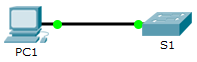

**TP– Configuration de SSH**

**Maquette [1_7 TP Configuration de SSH.pka](https://groupesb-my.sharepoint.com/:u:/g/personal/arthur_trouillon_saint-benigne_fr/ETyJO-uhkt1Hkur3tCLpguQBKLyluPvJvYkG8spLiuoqOg)**

**Topologie**

**Table d'adressage**

| **Appareil** | **Interface** | **AdresseIP** | **Masque de sous-réseau** |
|--------------|---------------|----------------|---------------------------|
| S1           | VLAN1        | 10.10.10.2     | 255.255.255.0             |
| PC1          | Carte réseau  | 10.10.10.10    | 255.255.255.0             |
- 
- **Objectifs**

**Partie1: Sécuriser les mots de passe**

**Partie2: Crypter les communications**

**Partie3: Vérifier l'implémentation de SSH**
- 
- **Contexte**

SSH doit remplacer Telnet pour les connexions de gestion via le réseau. Telnet utilise des communications non sécurisées en texte clair. SSH assure la sécurité des connexions distantes en fournissant un cryptage fort de toutes les données transmises entre les appareils. Dans cet exercice, vous allez sécuriser un commutateur distant avec le cryptage de mot de passe et SSH.

- **Sécuriser les mots de passe**
  1.  À partir de l'invite de commande de **PC1**, établissez une connexion Telnet vers **S1**. Le mot de passe d'exécution privilégié et utilisateur est **cisco**.
PC\> **telnet 10.10.10.2**

Trying 10.10.10.2 ...Open

Contrôle de l'accès de l'utilisateur

Password:

S1\>enable

Password:

S1#
- Enregistrez la configuration actuelle de sorte que toutes les éventuelles erreurs commises soient annulées en basculant l'interrupteur de **S1**.
S1# **copy running-config startup-config**

Destination filename \[startup-config\]?

Building configuration...

\[OK\]
- Affichez la configuration en cours et notez que les mots de passe sont en texte clair. Saisissez la commande permettant de crypter les mots de passe en clair:
S1(config)# **service password-encryption**
- Vérifiez que les mots de passe sont cryptés.

- **Crypter les communications**
  1.  **Définissez le nom de domaineIP et générez des clés sécurisées.**
L'utilisation de Telnet n'est généralement pas fiable, car les données sont transmises en texte clair. Par conséquent, utilisez SSH chaque fois qu'il est disponible.
- Définissez le nom de domaine sur **netacad.pka.**
S1(config)# **ip domain-name netacad.pka**
- Des clés sécurisées sont nécessaires pour crypter les données. Générez les clés RSA en spécifiant une longueur de1024.
S1(config)# **crypto key generate rsa**

The name for the keys will be: S1.netacad.pka

Choose the size of the key modulus in the range of 360 to 2048 for your

General Purpose Keys. Choosing a key modulus greater than 512 may take

a few minutes.

How many bits in the modulus \[512\]: **1024**

% Generating 1024 bit RSA keys, keys will be non-exportable...\[OK\]

- **Créez un utilisateur SSH et reconfigurez les lignes VTY pour un accès SSH uniquement.**
- Créez un utilisateur **administrateur** en utilisant **cisco** comme mot de passe secret.
S1(config)# **username administrator secret cisco**
- Configurer les lignes VTY pour vérifier les informations de connexion dans la base de données et pour autoriser uniquement l'accès à distance SSH. Supprimez le mot de passe pour les lignes vty.
S1(config)# **line vty 0 15**

S1(config-line)# **login local**

S1(config-line)# **transport input ssh**

S1(config-line)# **no password cisco**

- **Vérifier l'implémentation de SSH**
  1.  Quittez la session Telnet et tentez de vous reconnecter en utilisant Telnet. La tentative doit échouer.
  2.  Tentez de vous connecter via SSH. Tapez **ssh** et appuyez sur **Entrée** sans définir aucun paramètre afin d'afficher les instructions d'utilisation de la commande. Indice: l'option **-l**est la lettre «L» et non pas le chiffre 1.
  3.  Une fois correctement connecté, passez en mode d'exécution privilégié et enregistrez la configuration. Si vous n'avez pas pu accéder à **S1**, mettez-le hors tension et recommencez depuis la Partie1.
