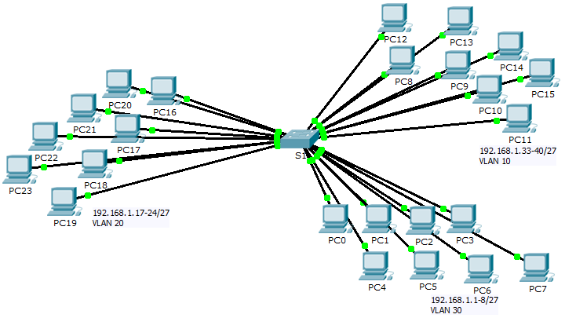

**TP - Observer la diffusion**

**Maquette : [6.1.1.5 Packet Tracer - Who Hears the Broadcast.pka](https://groupesb-my.sharepoint.com/:u:/g/personal/arthur_trouillon_saint-benigne_fr/ES8hGrQKNYlJsA7x937dTvIBdfJu_GZMoUHc4aHMKg87wQ)**

**Topologie**

**Objectifs**

**Partie 1 : observation du trafic de diffusion dans une implémentation VLAN**

**Partie 2 : réponse aux questions de révision**

**Scénario**

Dans cet exercice, un commutateur Catalyst 2960 24 ports est entièrement rempli. Tous les ports sont utilisés. Vous allez observer le trafic de diffusion lors d’une implémentation de VLAN et répondre à quelques questions de réflexion.

1.  **observation du trafic de diffusion lors d’une mise en œuvre de réseau local virtuel**

1.  **Utilisez la commande ping pour générer du trafic.**

1.  Cliquez sur **PC0**, puis sur l’onglet **Desktop**\> **Command Prompt**.

2.  Saisissez la commande **ping 192.168.1.8**. La requête ping doit réussir.

Contrairement à un LAN, un VLAN est un domaine de diffusion créé par des commutateurs. Dans le mode **Simulation** de Packet Tracer, envoyez une requête ping aux périphériques finaux sur leur propre VLAN. En vous basant sur vos observations, répondez aux questions de l’Étape 2.

2.  **Générez et examinez le trafic de diffusion.**

1.  Basculez en mode **Simulation**.

2.  Cliquez sur **Edit Filters** dans le panneau de simulation. Désactivez la case à cocher **Show All/None**. Cochez la case **ICMP**.

3.  Cliquez sur l’outil **Add Complex PDU**; il s’agit de l’icône en forme d’enveloppe ouverte dans la barre d’outils de droite.

4.  Amenez le pointeur de la souris au-dessus de la topologie. Il prend alors la forme d’une enveloppe avec un signe plus (+).

5.  Cliquez sur **PC0** pour qu’il serve de source à ce message test, et la boîte de dialogue **Create Complex PDU** apparaît. Entrez les valeurs suivantes :

- Destination IP Address: 255.255.255.255 (adresse de diffusion)

- Sequence Number (numéro de séquence) : 1

- One Shot Time: 0

Dans les paramètres PDU, la valeur par défaut de **Select Application:** (sélectionner l’application) est PING. Indiquez au moins trois autres applications disponibles.

6.  Cliquez sur **Create PDU** (créer une PDU). Ce paquet de diffusion test apparaît désormais dans la section **Simulation Panel Event List.** Il apparaît également dans la fenêtre PDU List (liste des PDU). Il s’agit de la première unité de données de protocole pour le Scénario 0.

7.  Cliquez à deux reprises sur **Capture/Forward** (capture/avance). Qu’est-il arrivé au paquet ?

8.  Répétez cette procédure pour **PC8** et **PC16**.

2.  **Questions de réflexion**

1.  Si un PC du VLAN 10 envoie un message de diffusion, quels périphériques le reçoivent ?

2.  Si un PC du VLAN 20 envoie un message de diffusion, quels périphériques le reçoivent ?

3.  Si un PC du VLAN 30 envoie un message de diffusion, quels périphériques le reçoivent ?

4.  Qu’arrive-t-il à une trame envoyée depuis un PC du VLAN 10 vers un PC du VLAN 30 ?

5.  Quels ports du commutateur s’allument si un PC connecté au port 11 envoie un message de monodiffusion à un PC connecté au port 13 ?

6.  Quels ports du commutateur s’allument si un PC connecté au port 2 envoie un message de monodiffusion à un PC connecté au port 23 ?

7.  En termes de ports, quels sont les domaines de collision sur le commutateur ?

8.  En termes de ports, quels sont les domaines de diffusion sur le commutateur ?

