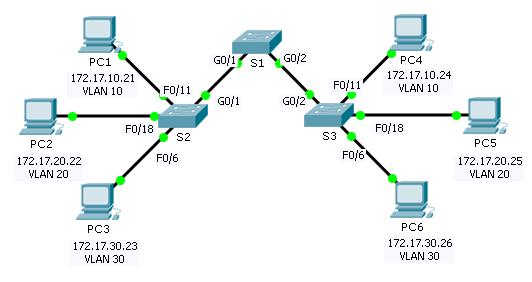

**TP: configuration des VLAN**

**Maquette [2_2 - TP - Configuration des VLAN.pka](https://groupesb-my.sharepoint.com/:u:/g/personal/arthur_trouillon_saint-benigne_fr/EROep2wdmNxJiBnydvEHP_sBrRStXsmuqIUfVVi5SiIA7Q)**

**Topologie**

**Table d’adressage**
<table>
<colgroup>
<col style="width: 17%" />
<col style="width: 22%" />
<col style="width: 22%" />
<col style="width: 24%" />
<col style="width: 13%" />
</colgroup>
<thead>
<tr class="header">
<th><strong>Appareil</strong></th>
<th><strong>Interface</strong></th>
<th><strong>Adresse IP</strong></th>
<th>
<strong>Masque de</strong>

<strong>sous-réseau</strong>
</th>
<th><strong>VLAN</strong></th>
</tr>
</thead>
<tbody>
<tr class="odd">
<td>PC1</td>
<td>Carte réseau</td>
<td>172.17.10.21</td>
<td>255.255.255.0</td>
<td>10</td>
</tr>
<tr class="even">
<td>PC2</td>
<td>Carte réseau</td>
<td>172.17.20.22</td>
<td>255.255.255.0</td>
<td>20</td>
</tr>
<tr class="odd">
<td>PC3</td>
<td>Carte réseau</td>
<td>172.17.30.23</td>
<td>255.255.255.0</td>
<td>30</td>
</tr>
<tr class="even">
<td>PC4</td>
<td>Carte réseau</td>
<td>172.17.10.24</td>
<td>255.255.255.0</td>
<td>10</td>
</tr>
<tr class="odd">
<td>PC5</td>
<td>Carte réseau</td>
<td>172.17.20.25</td>
<td>255.255.255.0</td>
<td>20</td>
</tr>
<tr class="even">
<td>PC6</td>
<td>Carte réseau</td>
<td>172.17.30.26</td>
<td>255.255.255.0</td>
<td>30</td>
</tr>
</tbody>
</table>
**Objectifs**

**Partie1: vérification de la configuration de VLAN par défaut**

**Partie2: configuration des VLAN**

**Partie3: attribution des VLAN aux ports**

**Contexte**

Les réseaux locaux virtuels (VLAN) sont utiles pour l’administration de groupes logiques, car ils permettent de déplacer, modifier ou ajouter facilement des membres de groupe. Cet exercice porte sur la création et l’attribution d’un nom de VLAN et sur l’attribution de ports d’accès à des VLAN spécifiques.
1.  **affichage de la configuration par défaut du réseau local virtuel**
    1.  **Affichage des réseaux locaux virtuels actuels**
Sur S1, exécutez la commande qui affiche tous les VLAN configurés. Par défaut, toutes les interfaces sont affectées au VLAN1.
2.  **Vérification de la connectivité entre les PC sur le même réseau**
Notez que chaque PC peut envoyer une requête ping à l’autre PC qui se trouve sur le même réseau.
- PC1 peut envoyer une requête ping à PC4
- PC2 peut envoyer une requête ping à PC5
- PC3 peut envoyer une requête ping à PC6
Les requêtes ping vers des PC sur des réseaux différents échouent.

Quel avantage la configuration en cours tire-t-elle d’une configuration de réseaux locaux virtuels?
2.  **configuration des réseaux locaux virtuels**
    1.  **Créez et nommez des VLAN sur S1.**
Créez les VLAN suivants. Les noms sont sensibles à la casse.
- VLAN 10: Faculty/Staff
- VLAN 20: Students
- VLAN 30: Guest(Default)
- VLAN 99: Management&Native
  2.  **Vérification de la configuration des réseaux locaux virtuels**
Quelle commande permet d’afficher uniquement le nom, le statut et les ports VLAN associés sur un commutateur?

3.  **Création des réseaux locaux virtuels sur S2 et S3**
En utilisant les mêmes commandes qu’à l’Étape1, créez et nommez les mêmes VLAN sur S2 et S3.
4.  **Vérification de la configuration des réseaux locaux virtuels**
3.  **Affectation des réseaux locaux virtuels aux ports**
    1.  **Attribution de réseaux locaux virtuels aux ports actifs sur S2**
Attribuez les VLAN aux ports suivants:
- VLAN 10: Fast Ethernet 0/11
- VLAN 20: Fast Ethernet 0/18
- VLAN 30: Fast Ethernet 0/6
  2.  **Attribuez des réseaux locaux virtuels aux ports actifs sur S3.**
S3 utilise les mêmes attributions de ports d’accès VLAN que S2.
3.  **Vérification de la perte de connectivité**
Auparavant, les PC qui partageaient le même réseau pouvaient envoyer des requêtes ping entre eux avec succès. Essayez une requête ping entre PC1 et PC4.

Bien que les ports d’accès soient attribués aux VLAN appropriés, les requêtes ping ont-elles abouti? Pourquoi?

Comment résoudre ce problème?

