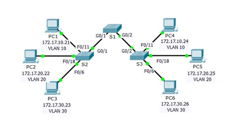

**TP: configuration des trunks**

**Maquette [2_3 - TP - Configuration des trunks.pka](https://groupesb-my.sharepoint.com/:u:/g/personal/arthur_trouillon_saint-benigne_fr/Ee5cFdEr0OpLpq355o206kYBrPnqgaapcZaURILoSBxMIA)**

**Topologie**

**Table d’adressage**
| **Appareil** | **Interface** | **Adresse IP** | **Masque de sous-réseau** | **Port de commutateur** | **VLAN** |
|----|----|----|----|----|----|
| PC1 | Carte réseau | 172.17.10.21 | 255.255.255.0 | S2 F0/11 | 10 |
| PC2 | Carte réseau | 172.17.20.22 | 255.255.255.0 | S2 F0/18 | 20 |
| PC3 | Carte réseau | 172.17.30.23 | 255.255.255.0 | S2 F0/6 | 30 |
| PC4 | Carte réseau | 172.17.10.24 | 255.255.255.0 | S3 F0/11 | 10 |
| PC5 | Carte réseau | 172.17.20.25 | 255.255.255.0 | S3 F0/18 | 20 |
| PC6 | Carte réseau | 172.17.30.26 | 255.255.255.0 | S3 F0/6 | 30 |
**Objectifs**

**Partie1: vérification des VLAN**

**Partie2: configuration des trunks**

**Contexte**

Les trunks sont nécessaires pour transmettre les informations VLAN entre les commutateurs. Un port sur un commutateur est soit un port d’accès soit un port trunk. Les ports d’accès transportent le trafic d’un VLAN spécifique attribué au port. Un port trunk est par défaut membre de tous les VLAN et achemine par conséquent le trafic de tous les VLAN. Cet exercice porte sur la création de ports trunk et sur leur attribution à un VLAN natif autre que celui par défaut.
1.  **Vérification des VLAN**
    1.  **affichage des réseaux locaux virtuels actuels**
        1.  Sur **S1**, exécutez la commande qui affiche tous les VLAN configurés. Au total, il devrait y avoir dixVLAN. Notez que l’ensemble des 24ports d’accès sur le commutateur sont attribués au VLAN1.
        2.  Sur **S2** et **S3**, affichez tous les VLAN et vérifiez qu’ils sont configurés et attribués aux ports du commutateur approprié conformément à l’**Addressing Table** (table d’adressage).
    2.  **Vérifiez la perte de connectivité entre les PC situés sur le même réseau.**
Bien que **PC1** et **PC4** se trouvent sur le même réseau, ils ne peuvent pas s’envoyer mutuellement des requêtes ping. Cela s’explique par le fait que les ports connectant les commutateurs sont attribués au VLAN1 par défaut. Pour assurer la connectivité entre les PC d’un même réseau et d’un même VLAN, il faut configurer des trunks.
2.  **Configuration des trunks**
    1.  **Configurez le trunking sur S1 et utilisez le VLAN99 comme VLAN natif.**
        1.  Configurez les interfacesG0/1 et G0/2 sur S1 pour le système de trunk.
        2.  Configurez le VLAN99 en tant que VLAN natif pour les interfaces G0/1 et G0/2 sur **S1**.
Le port agrégé met environ une minute à s’activer à cause du Spanning Tree. Cliquez sur **Fast Forward Time** pour accélérer le processus. Une fois les ports actifs, vous recevrez régulièrement les messages Syslog suivants:

%CDP-4-NATIVE_VLAN_MISMATCH: Native VLAN mismatch discovered on GigabitEthernet0/2 (99), with S3 GigabitEthernet0/2 (1).

%CDP-4-NATIVE_VLAN_MISMATCH: Native VLAN mismatch discovered on GigabitEthernet0/1 (99), with S2 GigabitEthernet0/1 (1).

Vous avez configuré le VLAN99 comme VLAN natif sur S1. Cependant, S2 et S3 utilisent le VLAN1 comme VLAN natif par défaut, comme l’indique le message Syslog.

Malgré une non-concordance actuelle du VLAN natif, les requêtes ping entre les PC d’un même VLAN aboutissent. Pourquoi?
2.  **Vérifier que le système de trunk est activé sur S2 et S3.**
Sur **S2** et **S3**, exécutez la commande **show interface trunk** pour vérifier que le protocole DTP a bien négocié le trunking avec S1 sur S2 et S3. Le résultat affiche également des informations sur les interfaces trunk sur S2 et S3.

Quels VLAN actifs sont autorisés à traverser le trunk?

3.  **Corriger la différence de VLAN natif sur S2 et S3.**
    1.  Configurez le VLAN99 comme VLAN natif pour les interfaces appropriées sur S2 et S3.
    2.  Utilisez la commande **show interface trunk** pour vérifier la configuration du VLAN natif.
4.  **Vérifier les configurations sur S2 et S3.**
    1.  Exécutez la commande **show interface** *interface* **switchport** pour vérifier que le VLAN natif est désormais 99.
    2.  Utilisez la commande **show vlan** pour afficher les informations relatives aux VLAN configurés. Pourquoi le portG0/1 sur S2 n’est plus attribué au VLAN1?

