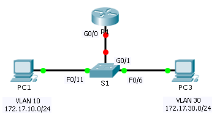

**TP: configuration du routage inter-VLAN de type router-on-a-stick**

**Maquette [2_4 - TP - Configuration du routage inter-VLAN.pka](https://groupesb-my.sharepoint.com/:u:/g/personal/arthur_trouillon_saint-benigne_fr/Ed4cZhPZC9BJgSrOC90-SQgBVqc_UL7IXwJn1b4_Sjljug)**

**Topologie**

**Table d’adressage**
| **Appareil** | **Interface** | **Adresse IPv4** | **Masque de sous-réseau** | **Passerelle par défaut** |
|----|----|----|----|----|
| R1 | G0/0,10 | 172.17.10.1 | 255.255.255.0 | N/A |
|  | G0/0,30 | 172.17.30.1 | 255.255.255.0 | N/A |
| PC1 | Carte réseau | 172.17.10.10 | 255.255.255.0 | 172.17.10.1 |
| PC2 | Carte réseau | 172.17.30.10 | 255.255.255.0 | 172.17.30.1 |
**Objectifs**

**Partie1: tester la connectivité sans routage inter-VLAN**

**Partie2: ajouter des VLAN à un commutateur**

**Partie3: configurer des sous-interfaces**

**Partie4: tester la connectivité avec routage inter-VLAN**

**Scénario**

Dans cet exercice, vous vérifierez la connectivité avant d’implémenter le routage inter-VLAN. Vous configurerez ensuite les VLAN et le routage inter-VLAN. Enfin, vous activerez le trunking et vérifierez la connectivité entre les VLAN.
1.  **test de la connectivité sans routage entre réseaux locaux virtuels**
    1.  **Requête ping entre PC1 et PC3**
Attendez que le commutateur converge ou cliquez sur **Fast Forward Time** plusieurs fois. Lorsque les témoins de liaison sont verts pour **PC1** et **PC3**, envoyez une requête ping de **PC1** vers **PC3**. Puisque les deux PC se trouvent sur des réseaux distincts et que **R1** n’est pas configuré, la requête ping échoue.
2.  **Passez en mode Simulation pour contrôler les requêtes ping.**
    1.  Passez en mode Simulation en cliquant sur l’onglet **Simulation** ou en appuyant sur **Maj+S**.
    2.  Cliquez sur **Capture/Forward** pour voir les étapes empruntées par la requête ping entre **PC1** et **PC3**. Remarquez que la requête ping ne quitte jamais **PC1**.
    3.  Quel processus a échoué et pourquoi?
2.  **Ajout de VLAN à un commutateur**
    1.  **création des réseaux locaux virtuels sur S1**
Revenez au mode **Realtime** et créez le VLAN10 et le VLAN30 sur **S1**.
2.  **Affecter des réseaux locaux virtuels aux ports**
    1.  Configurez les interfaces F0/6 et F0/11 comme ports d’accès et attribuez les VLAN.
- Attribuez **PC1** au VLAN10.
- Attribuez **PC3** au VLAN30.
  2.  Utilisez la commande **show vlan brief** pour vérifier la configuration des VLAN.
S1# **show vlan brief**

****

VLAN Name Status Ports

---- -------------------------------- --------- -------------------------------

1 default active Fa0/1, Fa0/2, Fa0/3, Fa0/4

Fa0/5, Fa0/7, Fa0/8, Fa0/9

Fa0/10, Fa0/12, Fa0/13, Fa0/14

Fa0/15, Fa0/16, Fa0/17, Fa0/18

Fa0/19, Fa0/20, Fa0/21, Fa0/22

Fa0/23, Fa0/24, Gig0/0, Gig1/2

10 VLAN0010 active Fa0/11

30 VLAN0030 active Fa0/6

1002 fddi-default active

1003 token-ring-default active

1004 fddinet-default active

1005 trnet-default active
3.  **Test de la connectivité entre PC1 et PC3**
À partir de **PC1**, envoyez une requête ping à **PC3**. Les requêtes ping doivent encore échouer.

Pourquoi les requêtes ping n’ont-elles pas abouti?

3.  **Configuration des sous-interfaces**
    1.  **Configurez des sous-interfaces sur R1 en utilisant l’encapsulation 802.1Q.**
        1.  Créez la sous-interface G0/0.10.
- Choisissez le type d’encapsulation 802.1Q et attribuez le VLAN10 à la sous-interface.
- Consultez la **table d’adressage** et attribuez l’adresseIP adéquate.
  2.  Répétez l’opération pour la sous-interface G0/0.30.
  2.  **Vérifiez la configuration.**
      1.  Utilisez la commande **show ip interface brief** pour vérifier la configuration des sous-interfaces. Les deux sous-interfaces sont désactivées. Les sous-interfaces sont des interfaces virtuelles associées à une interface physique. Par conséquent, afin d’activer les sous-interfaces, vous devez activer l’interface physique à laquelle elles sont associées.
      2.  Activez l’interface G0/0. Vérifiez que les sous-interfaces sont désormais actives.
4.  **Test de la connectivité avec routage inter-VLAN**
    1.  **Requête ping entre PC1 et PC3**
À partir de **PC1**, envoyez une requête ping à **PC3**. Les requêtes ping doivent encore échouer.
2.  **Activez le trunking.**
    1.  Sur **S1**, exécutez la commande **show vlan**.
À quel VLAN G0/1 est-elle attribuée?

2.  Comme le routeur a été configuré avec plusieurs sous-interfaces attribuées à différents VLAN, le port de commutateur connecté au routeur doit être configuré en tant que trunk. Activez le système de trunk sur l’interface G0/1.
3.  Comment déterminer si une interface est en mode trunk grâce à la commande **show vlan**?

4.  Lancez la commande **show interface trunk** pour vérifier si l’interface a été configurée en mode trunk.
3.  **Passez en mode Simulation pour contrôler les requêtes ping.**
    1.  Passez en mode **Simulation** en cliquant sur l’onglet **Simulation** ou en appuyant sur **Maj+S**.
    2.  Cliquez sur **Capture/Forward** pour voir les étapes empruntées par la requête ping entre **PC1** et **PC3**.
    3.  Vous devriez voir les requêtes et les réponses ARP entre **S1** et **R1**. Ensuite, vous verrez les requêtes et les réponses ARP entre **R1** et **S3**. **PC1** peut encapsuler une requête d’écho ICMP avec les informations de couche liaison de données appropriées, et R1 acheminera la requête jusqu’à **PC3**.
**Remarque:** une fois le processus ARP terminé, il vous faudra peut-être cliquer sur Reset Simulation pour voir que le processus ICMP est terminé.
