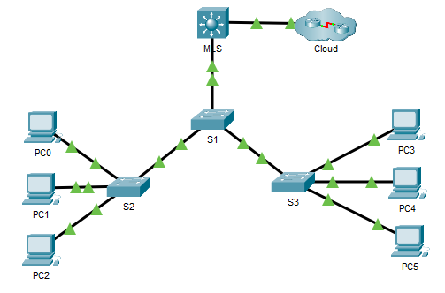

**TP - Configuration du routage inter-VLAN sur switch de niveau 3**

**Maquette :**
[**4.3.8-packet-tracer---configure-layer-3-switching-and-inter-vlan-routing_fr-FR.pka**](https://groupesb-my.sharepoint.com/:u:/g/personal/arthur_trouillon_saint-benigne_fr/ETQnGFB0r4pDssTw_6Y5kBgB4SDFd5x5haQdqWhJR1sOSg)

**Topologie**

**Table d'adressage**

| **Appareil** | **Interface** | **Adresse IP / Préfixe** |
|--------------|---------------|--------------------------|
| MLS          | VLAN 10       | 192.168.10.254 /24       |
|             | VLAN 20       | 192.168.20.254 /24       |
|             | VLAN 30       | 192.168.30.254/24        |
|             | VLAN 99       | 192.168.99.254/24        |
|             | G0/2          | 209.165.200.225          |
| PC0          | Carte réseau  | 192.168.10.1             |
| PC1          | Carte réseau  | 192.168.20.1             |
| PC2          | Carte réseau  | 192.168.30.1             |
| PC3          | Carte réseau  | 192.168.10.2/24          |
| PC4          | Carte réseau  | 192.168.20.2/24          |
| PC5          | Carte réseau  | 192.168.30.2             |
| S1           | VLAN 99       | 192.168.99.1             |
| S2           | VLAN 99       | 192.168.99.2             |
| S3           | VLAN 99       | 192.168.99.3             |

**Objectifs**

**Partie 1: Configurer la commutation de couche 3**
**Partie 2: Configurer le routage inter-VLAN**

**Contexte/scénario**

Un commutateur multicouche comme le Cisco Catalyst 3650 est capable d'assurer à la fois la commutation de la couche 2 et le routage de la couche 3. Cette double fonctionnalité est l'un des bénéfices des commutateurs multicouches. Un avantage pour une petite ou moyenne entreprise serait la possibilité d'acheter un seul commutateur multicouche au lieu de périphérique de réseau de commutation et de routage séparés. Les capacités d'un commutateur multicouche comprennent la possibilité de passer d'un VLAN à un autre en utilisant plusieurs interfaces virtuelles commutées (SVI), ainsi que la possibilité de convertir un port de commutation de couche 2 en une interface de couche 3.

**Instructions**

**Tâche 1 : Configurer la commutation de couche 3**

Dans la Partie 1, vous allez configurer le port Gigabit Ethernet 0/2 sur le commutateur MLS multicouche en tant que port routé et vérifier que vous pouvez envoyer une requête ping sur une autre adresse de couche 3.

1.1.a.Sur le commutateur multicouche (MLS), configurez G0/2 en tant que port routé et attribuez une adresse IP en fonction de la table d'adressage.

MLS(config)# **interface g0/2**

MLS(config-if)# **no switchport**

MLS(config-if)# **ip address 209.165.200.225 255.255.255.252**

1.1.b.Vérifiez la connectivité dans le **cloud** en envoyant une requête ping à 209.165.200.226.

MLS# **ping 209.165.200.226**

Type escape sequence to abort.

Sending 5, 100-byte ICMP Echos to 209.165.200.226, timeout is 2 seconds:

!!!!!

Success rate is 100 percent (5/5), round-trip min/avg/max = 0/0/0 ms

**Tâche 2 :Configurer le routage inter-VLAN**

**Étape 2.1:Ajoutez de réseaux VLAN.**

Ajoutez des réseaux VLAN au MLS en vous reportant au tableau ci-dessous. La notation Packet Tracer est sensible à la casse, alors tapez les noms exactement comme indiqué.

| Numéro de VLAN | Nom du VLAN |
|----------------|-------------|
| 10             | Personnel   |
| 20             | Élève       |
| 30             | Faculté     |

**Étape 2.2:Configurez l'interface SVI sur le MLS.**

Configurez et activez l'interface SVI sur les réseaux VLAN 10, 20, 30 et 99 conformément à la table d'adressage. La configuration du réseau VLAN 10 est indiquée ci-dessous.

MLS(config)# **interface vlan 10**

MLS(config-if)# **ip address 192.168.10.254 255.255.255.0**

**Étape 2.3:Configurez le trunking sur MLS.**

La configuration du trunk diffère légèrement sur un commutateur de la couche 3. Sur le commutateur de la couche 3, l'interface de trunk doit être encapsulée avec le protocole dot1q, mais il n'est pas nécessaire de spécifier les numéros de VLAN comme c'est le cas lorsqu'on travaille avec un routeur et des sous-interfaces.

2.3.a.Sur MLS, configurez l'interface **g0/1**.

2.3.b.Configurez l'interface comme un port de trunk statique.

MLS(config-if)# **switchport mode trunk**

2.3.c.Spécifiez le VLAN natif comme 99.

MLS(config-if)# **switchport trunk native vlan 99**

2.3.d.Encapsulez le lien avec le protocole dot1q.

MLS(config-if)# **switchport trunk encapsulation dot1q**

**Remarque:** Packet Tracer peut ne pas marquer l'encapsulation du trunk.

**Étape 2.4:Configurez le trunking sur S1.**

2.4.a.Configurez l'interface **g0/1** de S1 en tant que trunk statique.

2.4.b.Configurez le VLAN natif sur le trunk.

**Étape 2.5:Activez le routage.**

2.5.a.Utilisez la commande **show ip route**. Existe-t-il des routes actives?

2.5.b.Saisissez la commande **ip routing** pour activer le routage en mode de configuration globale.

MLS(config)# **ip routing**

2.5.c.Utilisez la commande **show ip route** pour vérifier que le routage est activé.

MLS# **show ip route**

Codes: C - connected, S - static, I - IGRP, R - RIP, M - mobile, B - BGP

D - EIGRP, EX - EIGRP external, O - OSPF, IA - OSPF inter area

N1 - OSPF NSSA external type 1, N2 - OSPF NSSA external type 2

E1 - OSPF external type 1, E2 - OSPF external type 2, E - EGP

i - IS-IS, L1 - IS-IS level-1, L2 - IS-IS level-2, ia - IS-IS inter area

\* - candidate default, U - per-user static route, o - ODR

P - periodic downloaded static route

Gateway of last resort is not set

C 192.168.10.0/24 is directly connected, Vlan10

C 192.168.20.0/24 is directly connected, Vlan20

C 192.168.30.0/24 is directly connected, Vlan30

C 192.168.99.0/24 is directly connected, Vlan99

209.165.200.0/30 is subnetted, 1 subnets

C 209.165.200.224 is directly connected, GigabitEthernet0/2

**Étape 2.6:Vérifiez la connectivité de bout en bout.**

2.6.a.Envoyez une requête ping à PC3 ou MLS depuis PC0 pour vérifier la connectivité au sein du réseau VLAN 10.

2.6.b.Envoyez une requête ping à PC4 ou MLS depuis PC1 pour vérifier la connectivité au sein du réseau VLAN 20.

2.6.c.Envoyez une requête ping à PC5 ou MLS depuis PC2 pour vérifier la connectivité au sein du réseau VLAN 30.

2.6.d.Envoyez une requête ping à S2, S3 ou MLS depuis S1 pour vérifier la connectivité au sein du réseau VLAN 99.

2.6.e.Pour vérifier le routage inter-VLAN, envoyez une requête ping aux périphériques en dehors du réseau VLAN de l'expéditeur.

2.6.f.À partir de n'importe quel périphérique, envoyez une requête ping à l'adresse suivante au sein du **cloud**: 209.165.200.226

Le commutateur de la couche 3 assure désormais le routage entre les VLAN et fournit une connectivité routée vers le cloud.
