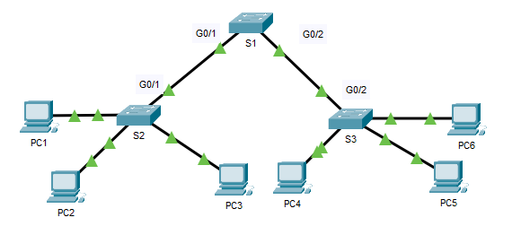

​​**TP - Configuration de DTP​******

****

**Maquette : [3.5.5-packet-tracer---configure-dtp_fr-FR 1.pka](https://groupesb-my.sharepoint.com/:u:/g/personal/arthur_trouillon_saint-benigne_fr/EcZ7id1szc5Mkz0sD3wXT7wBxXUoP48yJjt1--sLcCgNEA)**

**Topologie**

**Table d'adressage**

| **Appareil** | **Interface** | **Adresse IP** | **Masque de sous-réseau** |
|---------------|----------------|-----------------|----------------------------|
| PC1          | Carte réseau  | 192.168.10.1   | 255.255.255.0             |
| PC2          | Carte réseau  | 192.168.20.1   | 255.255.255.0             |
| PC3          | Carte réseau  | 192.168.30.1   | 255.255.255.0             |
| PC4          | Carte réseau  | 192.168.30.2   | 255.255.255.0             |
| PC5          | Carte réseau  | 192.168.20.2   | 255.255.255.0             |
| PC6          | Carte réseau  | 192.168.10.2   | 255.255.255.0             |
| S1           | VLAN 99       | 192.168.99.1   | 255.255.255.0             |
| S2           | VLAN 99       | 192.168.99.2   | 255.255.255.0             |
| S3           | VLAN 99       | 192.168.99.3   | 255.255.255.0             |

**Objectifs**

- Configurer le trunking statique
- Configuration et vérification du protocole DTP

**Contexte/scénario**

À mesure que le nombre de commutateurs augmente sur un réseau, la gestion des VLANs et des trunks peut devenir complexe. Pour faciliter certaines configurations de VLAN et de trunking, la négociation de trunk entre les périphériques réseau est gérée par le protocole DTP (Dynamic Trunking Protocol), et est automatiquement activée sur les commutateurs Catalyst 2960 et Catalyst 3650.

Dans cet exercice, vous configurerez des trunks entre les commutateurs. Vous attribuerez des ports aux VLANs et vérifierez la connectivité de bout en bout entre les hôtes d'un même VLAN. Vous configurerez les trunks entre les commutateurs, et vous configurerez le VLAN 999 comme le VLAN natif.

**Instructions**

- **Vérifiez la configuration VLAN.**

Vérifiez les VLANs configurés sur les commutateurs.

- Sur S1, accédez au mode EXEC privilégié et entrez la commande **show vlan brief** pour vérifier les VLANs présents.

S1# **show vlan brief**

VLAN Name Status Ports

---- -------------------------------- --------- -------------------------------

1 default active Fa0/1, Fa0/2, Fa0/3, Fa0/4

 Fa0/5, Fa0/6, Fa0/7, Fa0/8

 Fa0/9, Fa0/10, Fa0/11, Fa0/12

 Fa0/13, Fa0/14, Fa0/15, Fa0/16

 Fa0/17, Fa0/18, Fa0/19, Fa0/20

 Fa0/21, Fa0/22, Fa0/23, Fa0/24

 Gig0/1, Gig0/2

99 Management active

999 Native active

1002 fddi-default active

1003 token-ring-default active

1004 fddinet-default active

1005 trnet-default active

- Répétez l'étape 1a sur S2 et S3.

Quels VLANs sont configurés sur les commutateurs ?

- Sur S2, créez un VLAN 10 et nommez-le Red.

S2(config)# **vlan 10**

S2(config-vlan)# **name Red**

- Créez les VLANs 20 et 30 conformément au tableau ci-dessous.

| **Numéro de VLAN** | **Nom du VLAN** |
|---------------------|------------------|
| 10                 | Red             |
| 20                 | Blue            |
| 30                 | Yellow          |

- Vérifiez que les nouveaux VLANs ont bien été ajoutés. Exécutez la commande **show vlan brief** en mode d'exécution privilégié.

En plus des VLANs par défaut, quels VLANs sont configurés sur S2 ?

- Répétez les étapes précédentes pour créer les VLANs supplémentaires sur S3.

- **Attribution de VLAN aux ports.**
****

Exécutez la commande **switchport mode access** pour définir le mode d'accès des liaisons d'accès. Utilisez la commande **switchport access vlan** *vlan-id* pour attribuer un VLAN à un port d'accès.

<table>
<colgroup>
<col style="width: 30%" />
<col style="width: 36%" />
<col style="width: 32%" />
</colgroup>
<thead>
<tr class="header">
<th><strong>Ports</strong></th>
<th><strong>Contrôles</strong></th>
<th><strong>Réseau</strong></th>
</tr>
</thead>
<tbody>
<tr class="odd">
<td>
S2 F0/1 – 8

S3 F0/1 – 8
</td>
<td>VLAN 10 (Red)</td>
<td>192.168.10.0 /24</td>
</tr>
<tr class="even">
<td>
S2 F0/9 – 16

S3 F0/9 – 16
</td>
<td>VLAN 20 (Blue)</td>
<td>192.168.20.0 /24</td>
</tr>
<tr class="odd">
<td>
S2 F0/17 – 24

S3 F0/17 – 24
</td>
<td>VLAN 30 (Yellow)</td>
<td>192.168.30.0 /24</td>
</tr>
</tbody>
</table>

- Attribuez des VLANs aux ports sur S2 en utilisant les attributions du tableau ci-dessus.

S2(config-if)# **interface range f0/1 - 8**

S2(config-if-range)# **switchport mode access**

S2(config-if-range)# **switchport access vlan 10**

S2 (config-if-range) \# **plage d'interface f0/9 -16**

S2(config-if-range)# **switchport mode access**

S2(config-if-range)# **switchport access vlan 20**

S2(config-if-range)# **interface range f0/17 - 24**

S2(config-if-range)# **switchport mode access**

S2(config-if-range)# **switchport access vlan 30**

- Attribuez des VLANs aux ports sur S3 en utilisant les attributions du tableau ci-dessus.

Maintenant que vous avez les ports attribués aux VLAN, essayez de faire un ping de **PC1** à **PC6** .

La requête ping a-t-elle abouti ? Expliquez votre réponse.

- **Configuration de trunks sur S1, S2 et S3.**

Le protocole DTP (Dynamic Trunking Protocol) gère les trunks entre les commutateurs Cisco. Actuellement, tous les switchports sont en mode "trunking" par défaut, c'est-à-dire en mode automatique dynamique. À cette étape, vous modifierez le mode de trunking sur dynamic desirable pour la liaison entre les commutateurs S1 et S2. La liaison entre les commutateurs S1 et S3 sera définie en tant que trunk statique. Utilisez le VLAN 999 en tant que VLAN natif dans cette topologie.

- Sur le commutateur S1, configurez la liaison de trunk en dynamique désirable sur l'interface GigabitEthernet 0/1. La configuration de S1 est affichée ci-dessous.

S1(config)# **interface g0/1**

S1(config-if)# **switchport mode dynamic desirable**

Quel sera le résultat de la négociation de trunk entre S1 et S2 ?

- Sur le commutateur S2, vérifiez que le trunk a été négocié en entrant la commande **show interfaces trunk** . L'interface GigabiteEthernet 0/1 doit apparaître dans la sortie.

Quels sont le mode et l'état de ce port ?

- Pour la liaison trunk entre S1 et S3, configurez l'interface GigabitEthernet 0/2 comme une liaison trunk statique sur S1. De plus, désactivez la négociation DTP sur l'interface G0/2 sur S1.

S1(config)# **interface g0/2**

S1(config-if)# **switchport mode trunk**

S1(config-if)# **switchport nonegotiate**

- Utilisez la commande **show dtp** pour vérifier l'état de DTP.

S1# **montrer dtp**

Global DTP information

 Sending DTP Hello packets every 30 seconds

 Dynamic Trunk timeout is 300 seconds

 1 interfaces using DTP

- Vérifiez que le trunking est activé sur tous les commutateurs à l'aide de la commande **show interfaces trunk**.

S1# **show interfaces trunk**

Port Mode Encapsulation Status Native vlan

Gig0/1 desirable n-802.1q trunking 1

Gig0/2 on 802.1q trunking 1

Port Vlans allowed on trunk

Gig0/1 1-1005

Gig0/2 1-1005

Port Vlans allowed and active in management domain

Gig0/1 1,99,999

Gig0/2 1,99,999

Port Vlans in spanning tree forwarding state and not pruned

Gig0/1 1,99,999

Gig0/2 1,99,999

Quel est actuellement le VLAN natif pour ces trunks?

- Configurez le VLAN 999 en tant que VLAN natif pour les trunks sur S1.

S1(config)# **interface range g0/1 - 2**

S1(config-if-range)# **switchport trunk native vlan 999**

Quels messages avez-vous reçus sur S1 ? Quelles corrections apporteriez-vous ?

- Sur S2 et S3, configurez le VLAN 999 en tant que VLAN natif.

- Vérifiez que le trunking est bien configuré sur tous les commutateurs. Vous devriez pouvoir envoyer une requête ping d'un commutateur à un autre dans la topologie en utilisant les adresses IP configurées dans l'interface SVI.

- Tentative de ping de PC1 à PC6.

Pourquoi le ping a-t-il échoué ? (Conseil : regardez la sortie '**show vlan brief**' des trois commutateurs. Comparez les sorties du '**show interface trunk**' sur tous les commutateurs.)

- Corrigez la configuration si nécessaire.

- **Reconfigurez le trunk sur S3.**

- Lancer la commande ‘**show interface trunk**’ sur **S3**.

Quel est le mode et l'encapsulation sur G0/2 ?

- Configurez **G0/2** pour qu'il corresponde à **G0/2** sur **S1** .

Quel est le mode et l'encapsulation sur G0/2 après le changement ?

Quel est l'état '**Négociation de la trunking**' affiché ?

- **Vérification de la connectivité de bout en bout.**

- De PC1 ping PC6.

- De PC2 ping PC5.

- De PC3 ping PC4.
