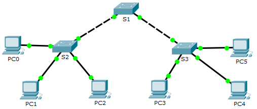

**TP : configuration des protocoles DTP et VTP**

**Maquette : [2.1.4.4 Packet Tracer - Configure VLANs, VTP, and DTP.pka](https://groupesb-my.sharepoint.com/:u:/g/personal/arthur_trouillon_saint-benigne_fr/EWilapQQd6hAj90HDgI7Hi8B3boZTlC-xz_SH0jXR-jv4g)**

**Topologie**

**Table d'adressage**

| **Appareil** | **Interface** | **Adresse IP** | **Masque de sous-réseau** |
|---------------|----------------|-----------------|----------------------------|
| PC0          | Carte réseau  | 192.168.10.1   | 255.255.255.0             |
| PC1          | Carte réseau  | 192.168.20.1   | 255.255.255.0             |
| PC2          | Carte réseau  | 192.168.30.1   | 255.255.255.0             |
| PC3          | Carte réseau  | 192.168.30.2   | 255.255.255.0             |
| PC4          | Carte réseau  | 192.168.20.2   | 255.255.255.0             |
| PC5          | Carte réseau  | 192.168.10.2   | 255.255.255.0             |
| S1           | VLAN 99       | 192.168.99.1   | 255.255.255.0             |
| S2           | VLAN 99       | 192.168.99.2   | 255.255.255.0             |
| S3           | VLAN 99       | 192.168.99.3   | 255.255.255.0             |

**Objectifs**

**Partie 1 : configuration et vérification du protocole DTP**

**Partie 2 : configuration et vérification du protocole VTP**

**Contexte/scénario**

À mesure que le nombre de commutateurs augmente sur un réseau, la gestion des VLAN et des trunks peut devenir complexe. Pour simplifier la configuration des VLAN et du trunking, le protocole VTP (VLAN Trunking Protocol) permet aux administrateurs du réseau d'automatiser la gestion des VLAN. La négociation de trunk entre les appareils réseau est gérée par le protocole DTP (Dynamic Trunking Protocol) et est activée automatiquement sur les commutateurs Catalyst 2960 et Catalyst 3560.

Dans cet exercice, vous configurerez des trunks entre les commutateurs. Vous configurerez un serveur VTP et des clients VTP dans le même domaine VTP. Vous observerez le comportement de VTP lorsqu'un commutateur est en mode VTP transparent. Vous attribuerez des ports aux VLAN et vous vérifierez la connectivité de bout en bout avec le même VLAN.

1.  **Configuration et vérification du protocole DTP**

Dans la Partie 1, vous configurerez des trunks entre les commutateurs et vous définirez le VLAN 999 en tant que VLAN natif.

1.  **Vérification de la configuration VLAN.**

Vérifiez les VLAN configurés sur les commutateurs.

1.  Sur S1, cliquez sur l'onglet**CLI**. À l'invite, saisissez **enable**, puis exécutez la commande **show vlan brief** pour vérifier les VLAN configurés sur S1.

S1# **show vlan brief**

VLAN Name Status Ports

---- -------------------------------- --------- -------------------------------

1 default active Fa0/1, Fa0/2, Fa0/3, Fa0/4

 Fa0/5, Fa0/6, Fa0/7, Fa0/8

 Fa0/9, Fa0/10, Fa0/11, Fa0/12

 Fa0/13, Fa0/14, Fa0/15, Fa0/16

 Fa0/17, Fa0/18, Fa0/19, Fa0/20

 Fa0/21, Fa0/22, Fa0/23, Fa0/24

 Gig0/1, Gig0/2

99 Management active

999 VLAN0999 active

1002 fddi-default active

1003 token-ring-default active

1004 fddinet-default active

1005 trnet-default active

2.  Répétez l'étape a. sur S2 et S3. Quels VLAN sont configurés sur les commutateurs ?

2.  **Configuration de trunks sur S1, S2 et S3.**

Le protocole DTP (Dynamic Trunking Protocol) gère les trunks entre les commutateurs Cisco. Actuellement, tous les ports de commutateur sont en mode de trunking par défaut, soit dynamic auto. À cette étape, vous modifierez le mode de trunking sur dynamic desirable pour la liaison entre les commutateurs S1 et S2. La liaison entre les commutateurs S1 et S3 sera définie en tant que trunk statique. Utilisez le VLAN 999 en tant que VLAN natif dans cette topologie.

1.  Sur les commutateurs S1 et S2, définissez le trunk sur dynamic desirable dans l'interface GigabitEthernet0/1. La configuration de S1 est affichée ci-dessous.

S1(config)# **interface g0/1**

S1(config-if)# **switchport mode dynamic desirable**

2.  Pour le trunk entre S1 et S3, configurez un trunk statique dans l'interface GigabitEthernet0/2.

S1(config)# interface g0/2

S1(config-if)# switchport mode trunk

S3(config)# interface g0/2

S3(config-if)# switchport mode trunk

3.  Vérifiez que le trunking est activé sur tous les commutateurs à l'aide de la commande **show interfaces trunk**.

S1# **show interfaces trunk**

Port Mode Encapsulation Status Native vlan

Gig0/1 desirable n-802.1q trunking 1

Gig0/2 on 802.1q trunking 1

Port Vlans allowed on trunk

Gig0/1 1-1005

Gig0/2 1-1005

Port Vlans allowed and active in management domain

Gig0/1 1,99,999

Gig0/2 1,99,999

Port Vlans in spanning tree forwarding state and not pruned

Gig0/1 none

Gig0/2 none

Quel est actuellement le VLAN natif pour ces trunks? 

4.  Configurez le VLAN 999 en tant que VLAN natif pour les trunks sur S1.

S1(config)# **interface range g0/1 - 2**

S1(config-if-range)# **switchport trunk native vlan 999**

Quels messages avez-vous reçus sur S1 ? Quelles corrections apporteriez-vous ?

5.  Sur S2 et S3, configurez le VLAN 999 en tant que VLAN natif.

6.  Vérifiez que le trunking est bien configuré sur tous les commutateurs. Vous devriez pouvoir envoyer une requête ping d'un commutateur à un autre dans la topologie en utilisant les adresses IP configurées dans l'interface SVI.

2.  **Configuration et vérification du protocole VTP**

S1 sera configuré en tant que serveur VTP et S2 en tant que client VTP. Tous les commutateurs seront configurés pour être dans le domaine VTP **CCNA**et utiliser le mot de passe VTP **cisco**.

Les VLAN peuvent être créés sur le serveur VTP et distribués à d'autres commutateurs dans le domaine VTP. Dans cette partie, vous créerez 3 nouveaux VLAN sur le serveur VTP, soit S1. Ces VLAN seront distribués à S2 via VTP. Observez le comportement du mode VTP transparent.

1.  **Configuration de S1 en tant que serveur VTP.**

Configurez S1 en tant que serveur VTP dans le domaine**CCNA** avec le mot de passe **cisco**.

1.  Configurez S1 en tant que serveur VTP.

S1(config)# **vtp mode server**

Setting device to VTP SERVER mode

2.  Configurez **CCNA** en tant que nom de domaine VTP.

S1(config)# **vtp domain CCNA**

Changing VTP domain name from NULL to CCNA

3.  Définissez **cisco** comme mot de passe VTP.

S1(config)# **vtp password cisco**

Setting device VLAN database password to cisco

2.  **Vérification de VTP sur S1.**

1.  Exécutez la commande **show vtp status** sur les commutateurs pour vérifier que le mode et le domaine VTP sont bien configurés.

S1# **show vtp status**

VTP Version : 2

Configuration Revision : 0

Maximum VLANs supported locally : 255

Number of existing VLANs : 7

VTP Operating Mode : Server

VTP Domain Name : CCNA

VTP Pruning Mode : Disabled

VTP V2 Mode : Disabled

VTP Traps Generation : Disabled

MD5 digest : 0x8C 0x29 0x40 0xDD 0x7F 0x7A 0x63 0x17

Configuration last modified by 0.0.0.0 at 0-0-00 00:00:00

Local updater ID is 192.168.99.1 on interface Vl99 (lowest numbered VLAN interface found)

2.  Pour vérifier le mot de passe VTP, utilisez la commande **show vtp password**.

S1# **show vtp password**

VTP Password: cisco

3.  **Ajout de S2 et S3 au domaine VTP.**

Pour que S2 et S3 acceptent les annonces VTP de S1, ils doivent appartenir au même domaine VTP. Configurez S2 en tant que client VTP avec **CCNA** comme nom de domaine VTP et **cisco**comme mot de passe VTP. Les noms de domaine VTP sont sensibles à la casse.

1.  Configurez S2 en tant que client VTP dans le domaine VTP**CCNA** avec le mot de passe VTP **cisco**.

S2(config)# **vtp mode client**

Setting device to VTP CLIENT mode

S2(config)# **vtp domain CCNA**

Changing VTP domain name from NULL to CCNA

S2(config)# **vtp password cisco**

Setting device VLAN database password to cisco

2.  Pour vérifier le mot de passe VTP, utilisez la commande **show vtp password**.

S2# **show vtp password**

VTP Password: cisco

3.  ConfigurezS3 de sorte qu'il soit dans le domaine VTP **CCNA** avec le mot de passe VTP **cisco**. Le commutateur S3 sera configuré en mode VTP transparent.

S3(config)#**vtp mode Transparent**

S3(config)# **vtp domain CCNA**

Changing VTP domain name from NULL to CCNA

S3(config)# **vtp password cisco**

Setting device VLAN database password to cisco

4.  Exécutez la commande **show vtp status** sur tous les commutateurs pour répondre à la question suivante.

Notez que le numéro de révision de la configuration sur les trois commutateurs est 0. Expliquez votre réponse.

4.  **Création de plusieurs VLAN sur S1.**

1.  Sur S1, créez le VLAN 10 et nommez-le Red.

S1(config)# **vlan 10**

S1(config-vlan)# **name Red**

2.  Créez les VLAN 20 et 30 conformément au tableau ci-dessous.

| **Numéro de VLAN** | **Nom du VLAN** |
|---------------------|------------------|
| 10                 | Red             |
| 20                 | Blue            |
| 30                 | Yellow          |

3.  Vérifiez que les nouveaux VLAN ont bien été ajoutés. Exécutez la commande **show vlan brief** en mode d'exécution privilégié.

Quels VLAN sont configurés sur S1 ?

4.  Exécutez la commande **show vtp status** sur S1 et S2 pour vérifier que le mode et le domaine VTP sont bien configurés. Le résultat pour S2 est présenté ici :

S2# **show vtp status**

VTP Version : 2

Configuration Revision : 6

Maximum VLANs supported locally : 255

Number of existing VLANs : 10

VTP Operating Mode : Client

VTP Domain Name : CCNA

VTP Pruning Mode : Disabled

VTP V2 Mode : Disabled

VTP Traps Generation : Disabled

MD5 digest : 0xE6 0x56 0x05 0xE0 0x7A 0x63 0xFB 0x33

Configuration last modified by 192.168.99.1 at 3-1-93 00:21:07

Combien de VLAN sont configurés sur S2 ? Est-ce que S2 possède les mêmes VLAN que S1 ? Expliquez votre réponse.

5.  **Observation du mode VTP transparent.**

S3 est actuellement configuré en mode VTP transparent.

1.  Exécutez la commande **show vtp status** pour répondre à la question suivante.****

Combien de VLAN sont actuellement configurés sur S3 ? Quel est le numéro de révision de la configuration ? Expliquez votre réponse.

Comment modifieriez-vous le nombre de VLAN sur S3 ?

2.  Définissez le mode VTP sur client sur S3.

Utilisez les commandes show pour vérifier que le mode VTP a bien été modifié. Combien de VLAN sont maintenant présents sur S3 ?

**Remarque**: les annonces VTP sont diffusées sur l'ensemble du domaine de gestion toutes les cinq minutes ou en cas de changement de la configuration des VLAN. Pour accélérer ce processus, vous pouvez basculer du mode Realtime au mode Simulation jusqu'à la prochaine série de mises à jour. Cependant, vous devrez sans doute effectuer cette opération plusieurs fois parce que l'horloge de PacketTracer n'avancera que de 10 secondes à chaque fois. Vous pouvez aussi basculer un des commutateurs clients en mode transparent, puis revenir en mode client.

6.  **Affectation de VLAN aux ports.**

Exécutez la commande **switchport mode access** pour définir le mode d'accès des liaisons d'accès. Utilisez la commande **switchport access vlan** *id-vlan* pour affecter un VLAN à un port d'accès

.
<table>
<colgroup>
<col style="width: 36%" />
<col style="width: 32%" />
<col style="width: 31%" />
</colgroup>
<thead>
<tr class="header">
<th><strong>Ports</strong></th>
<th><strong>Contrôles</strong></th>
<th><strong>Réseau</strong></th>
</tr>
</thead>
<tbody>
<tr class="odd">
<td>
S2 F0/1 – 8

S3 F0/1 – 8
</td>
<td>VLAN 10 (Red)</td>
<td>192.168.10.0 /24</td>
</tr>
<tr class="even">
<td>
S2 F0/9 – 16

S3 F0/9 – 16
</td>
<td>VLAN 20 (Blue)</td>
<td>192.168.20.0 /24</td>
</tr>
<tr class="odd">
<td>
S2 F0/17 – 24

S3 F0/17 – 24
</td>
<td>VLAN 30 (Yellow)</td>
<td>192.168.30.0 /24</td>
</tr>
</tbody>
</table>

1.  Attribuez des VLAN aux ports sur S2 en utilisant les affectations du tableau ci-dessus.

S2(config-if)# **interface range f0/1 - 8**

S2(config-if-range)# **switchport mode access**

S2(config-if-range)# **switchport access vlan 10**

S2(config-if-range)# **interface range f0/9 -16**

S2(config-if-range)# **switchport mode access**

S2(config-if-range)# **switchport access vlan 20**

S2(config-if-range)# **interface range f0/17 - 24**

S2(config-if-range)# **switchport mode access**

S2(config-if-range)# **switchport access vlan 30**

2.  Attribuez des VLAN aux ports sur S3 en utilisant les affectations du tableau ci-dessus.

7.  **Vérification de la connectivité de bout en bout.**

1.  Envoyez une requête ping de PC0 vers PC5.

2.  Envoyez une requête ping de PC1 vers PC4.

3.  Envoyez une requête ping de PC2 vers PC3.

