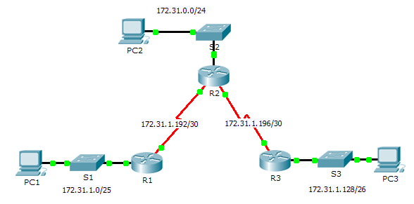

**TP: configuration des routes statiques et par défaut IPv4**
- **Maquette [TP - Configuration des routes statiques et par défaut IPv4.pka](https://groupesb-my.sharepoint.com/:u:/g/personal/arthur_trouillon_saint-benigne_fr/EXO-sHW21H1LvSUFRCt3bS0B7kbJVpJoY-eFUtLSIZw8xw)**

**Topologie**

- **Table d’adressage**
<table>
<colgroup>
<col style="width: 13%" />
<col style="width: 17%" />
<col style="width: 19%" />
<col style="width: 22%" />
<col style="width: 26%" />
</colgroup>
<thead>
<tr class="header">
<th><strong>Appareil</strong></th>
<th><strong>Interface</strong></th>
<th><strong>Adresse IPv4</strong></th>
<th>
<strong>Masque de</strong>

<strong>sous-réseau</strong>
</th>
<th><strong>Passerelle par défaut</strong></th>
</tr>
</thead>
<tbody>
<tr class="odd">
<td>R1</td>
<td>G0/0</td>
<td>172.31.1.1</td>
<td>255.255.255.128</td>
<td>N/A</td>
</tr>
<tr class="even">
<td></td>
<td>S0/0/0</td>
<td>172.31.1.194</td>
<td>255.255.255.252</td>
<td>N/A</td>
</tr>
<tr class="odd">
<td>R2</td>
<td>G0/0</td>
<td>172.31.0.1</td>
<td>255.255.255.0</td>
<td>N/A</td>
</tr>
<tr class="even">
<td></td>
<td>S0/0/0</td>
<td>172.31.1.193</td>
<td>255.255.255.252</td>
<td>N/A</td>
</tr>
<tr class="odd">
<td></td>
<td>S0/0/1</td>
<td>172.31.1.197</td>
<td>255.255.255.252</td>
<td>N/A</td>
</tr>
<tr class="even">
<td>R3</td>
<td>G0/0</td>
<td>172.31.1.129</td>
<td>255.255.255.192</td>
<td>N/A</td>
</tr>
<tr class="odd">
<td></td>
<td>S0/0/1</td>
<td>172.31.1.198</td>
<td>255.255.255.252</td>
<td>N/A</td>
</tr>
<tr class="even">
<td>PC1</td>
<td>Carte réseau</td>
<td>172.31.1.126</td>
<td>255.255.255.128</td>
<td>172.31.1.1</td>
</tr>
<tr class="odd">
<td>PC2</td>
<td>Carte réseau</td>
<td>172.31.0.254</td>
<td>255.255.255.0</td>
<td>172.31.0.1</td>
</tr>
<tr class="even">
<td>PC3</td>
<td>Carte réseau</td>
<td>172.31.1.190</td>
<td>255.255.255.192</td>
<td>172.31.1.129</td>
</tr>
</tbody>
</table>
- **Objectifs**
**Partie1: examen du réseau et évaluation des besoins en routage statique**

**Partie2: configuration des routes statiques et par défaut**

**Partie3: vérification de la connectivité**
- **Contexte**
Dans cet exercice, vous allez configurer des routes statiques et par défaut. Une route statique est une route saisie manuellement par l’administrateur réseau pour créer une route fiable et sécurisée. Quatre routes statiques différentes sont utilisées dans cet exercice: une route statique récursive, une route statique reliée directement, une route statique entièrement spécifiée et une route par défaut.
- **Examen du réseau et évaluation des besoins en routage statique**
  1.  Observez le schéma de topologie et indiquez le nombre total de réseaux.
  2.  Combien de réseaux sont connectés directement à R1, R2 et R3?
  3.  Combien de routes statiques sont nécessaires à chaque routeur pour atteindre les réseaux qui ne sont pas connectés directement?

- Testez la connectivité avec les LAN de R2 et R3 en envoyant une requête ping à PC2 et à PC3 à partir de PC1.
Pourquoi n’avez-vous pas réussi?
- **Configuration des routes statiques et par défaut**
  1.  **Configurez les routes statiques récursives sur R1.**
      1.  Qu’est-ce qu’une route statique récursive?

- Pourquoi une route statique récursive nécessite deux recherches dans la table de routage?

- Configurez une route statique récursive vers chaque réseau qui n’est pas connecté directement à R1, y compris la liaison WAN entre R2 et R3.
- Testez la connectivité vers le LAN de R2 et envoyez une requête ping aux adressesIP de PC2 et PC3.
Pourquoi n’avez-vous pas réussi?

- **Configurez les routes statiques reliées directement sur R2.**
  1.  Quelle est la différence entre une route statique reliée directement et une route statique récursive?

- Configurez une route statique reliée directement à partir de R2 vers chaque réseau qui n’est pas connecté directement.
- Quelle commande permet d’afficher uniquement les réseaux connectés directement?
- Quelle commande permet d’afficher uniquement les routes statiques indiquées dans la table de routage?
- Lorsque vous affichez la table de routage complète, comment pouvez-vous distinguer une route statique reliée directement d’un réseau connecté directement?

- **Configurez une route par défaut sur R3.**
  1.  Quelle est la différence entre une route par défaut et une route statique normale?

- Configurez une route par défaut sur R3 de sorte que chaque réseau qui n’est pas connecté directement soit accessible.
- Comment une route statique est-elle affichée dans la table de routage?
- **Documentez les commandes pour les routes entièrement définies.**
**Remarque:** Packet Tracer ne prend pas actuellement en charge la configuration des routes statiques entièrement définies. Par conséquent, dans cette étape, documentez la configuration des routes entièrement spécifiées.
- Expliquez ce qu’est une route entièrement spécifiée.

- Quelle commande fournit une route statique entièrement spécifiée à partir de R3 vers le LAN de R2?

- Indiquez par écrit une route entièrement spécifiée à partir de R3 vers le réseau entre R2 et R1. Ne configurez pas la route; calculez-la seulement.

- Indiquez par écrit une route statique entièrement spécifiée à partir de R3 vers le LAN de R1. Ne configurez pas la route; calculez-la seulement.

- **Vérifiez les configurations de routes statiques.**
Utilisez les commandes **show** appropriées pour vérifier les bonnes configurations.

Quelles commandes **show** pouvez-vous utiliser pour vérifier que les routes statiques sont configurées correctement?

- **Vérification de la connectivité**
Chaque périphérique doit maintenant pouvoir envoyer une requête ping à tout autre périphérique. Si ce n’est pas le cas, vérifiez les configurations des routes statiques et par défaut.
