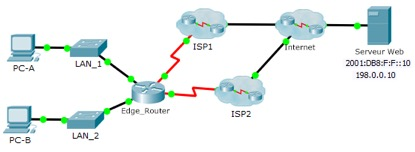

**TP–Configuration des routes statiques flottantes**

**Maquette**

[**TP - Configuration des routes statiques flottantes.pka**](https://groupesb-my.sharepoint.com/:u:/g/personal/arthur_trouillon_saint-benigne_fr/EXwM9mgQC1VArjpolzbg6hABkwi2ilSYPVQGBK8uexaAuQ)

- **Topologie**

- **Objectifs**
**Partie1: Configurer une route statique flottanteIPv4**

**Partie2: Tester le basculement vers la route statique flottanteIPv4**
- **Contexte**
Dans cette activité, vous configurerez des routes statiques flottantesIPv4. Ces routes sont manuellement configurées avec une distance administrative supérieure à celle de la route principale et, par conséquent, ne seront pas inscrites dans la table de routage jusqu’à l’échec de la route principale. Vous testerez le basculement vers les routes de sauvegarde, puis vous restaurerez la connectivité à la route principale.
- **Configurer une route statique flottanteIPv4**
  1.  **Configurez une route statique par défautIPv4.**
      1.  Configurez une route statique par défaut connectée directement depuis le routeur**Edge_Router** vers Internet. La route principale par défaut doit traverser **FAI1**.
      2.  Affichez le contenu de la table de routage. Vérifiez que la route par défaut est visible dans la table de routage.
      3.  Quelle commande est utilisée pour tracer un chemin d’un PC à une destination?

Depuis **PC-A**, tracez la route vers **Serveur Web**. La route doit démarrer à la passerelle par défaut 192.168.10.1 et passer par l’adresse 10.10.10.1. Si ce n’est pas le cas, vérifiez votre configuration de route statique par défaut.
- **Configurez une route statique flottanteIPv4.**
  1.  Quelle est la distance administrative d’une route statique?

- Configurez une route statique flottante par défaut avec une distance administrative de 5. La route doit pointer sur **ISP2**.
- Consultez la configuration en cours et vérifiez que la route statique flottante par défautIPv4 y est, tout comme la route statique par défautIPv4.
- Affichez le contenu de la table de routage. Est-ce que la route statique flottanteIPv4 est présente dans la table de routage?
- Expliquez votre réponse
- **Tester le basculement vers la route statique flottanteIPv4**
  1.  Sur **Routeur_périphérique**, désactivez via un accès administratif l’interface de sortie de la route principale.
  2.  Vérifiez que la route statique flottanteIPv4 est désormais dans la table de routage.
  3.  Tracez la route entre **PC-A** et **Serveur Web**.
La route de secours a-t-elle fonctionné?

Si ce n’est pas le cas, attendez encore quelques secondes pour la convergence, puis testez à nouveau. Si la route de secours ne fonctionne toujours pas, étudiez votre configuration de route statique flottante.
- Restaurez la connectivité avec la route principale.
- Tracez la route entre **PC-A** et **Web Server** pour vous assurer que la route principale est restaurée.
