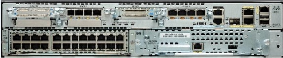

Password Recovery for the 2900 Integrated Services Router

Save

[Translations](https://www.cisco.com/c/en/us/support/docs/routers/2800-series-integrated-services-routers/112033-c2900-password-recovery-00.html)

Download

Print

**Updated:**May 2, 2014

**Document ID:**112033

Bias-Free Language

**Contents**

[**Introduction**](https://www.cisco.com/c/en/us/support/docs/routers/2800-series-integrated-services-routers/112033-c2900-password-recovery-00.html#intro)

[**Prerequisites**](https://www.cisco.com/c/en/us/support/docs/routers/2800-series-integrated-services-routers/112033-c2900-password-recovery-00.html#prereq)

[Requirements](https://www.cisco.com/c/en/us/support/docs/routers/2800-series-integrated-services-routers/112033-c2900-password-recovery-00.html#req)

[Components Used](https://www.cisco.com/c/en/us/support/docs/routers/2800-series-integrated-services-routers/112033-c2900-password-recovery-00.html#hw)

[Related Products](https://www.cisco.com/c/en/us/support/docs/routers/2800-series-integrated-services-routers/112033-c2900-password-recovery-00.html#rel)

[Conventions](https://www.cisco.com/c/en/us/support/docs/routers/2800-series-integrated-services-routers/112033-c2900-password-recovery-00.html#conv)

[**Step-by-Step Procedure**](https://www.cisco.com/c/en/us/support/docs/routers/2800-series-integrated-services-routers/112033-c2900-password-recovery-00.html#procedure)

[**Example of Password Recovery Procedure**](https://www.cisco.com/c/en/us/support/docs/routers/2800-series-integrated-services-routers/112033-c2900-password-recovery-00.html#example)

[**Related Information**](https://www.cisco.com/c/en/us/support/docs/routers/2800-series-integrated-services-routers/112033-c2900-password-recovery-00.html#related_info)

**Introduction**

This document describes how to recover the**enable password**and the**enable secret**passwords. These passwords protect access to privileged EXEC and configuration modes. The**enable password**password can be recovered, but the**enable secret**password is encrypted and must be replaced with a new password. Use the procedure described in this document in order to replace the**enable secret**password.

**Prerequisites**

**Requirements**

There are no specific requirements for this document.

**Components Used**

The information in this document is based on these hardware versions:
- Cisco 2900 Series Integrated Services Router (ISR)
The information in this document was created from the devices in a specific lab environment. All of the devices used in this document started with a cleared (default) configuration. If your network is live, make sure that you understand the potential impact of any command.

**Related Products**

Refer to[Password Recovery Procedures](https://www.cisco.com/en/US/products/sw/iosswrel/ps1831/products_tech_note09186a00801746e6.shtml)for information on how to recover passwords for related products.

**Conventions**

Refer to[Cisco Technical Tips Conventions](https://www.cisco.com/en/US/tech/tk801/tk36/technologies_tech_note09186a0080121ac5.shtml)for more information on document conventions.

**Step-by-Step Procedure**

Perform these steps in order to recover your password:
- Either switch off or shut down the router.
- Remove the compact flash that is on the rear of the router. This image shows the rear of the 2951 router:

For more information, refer to[Back Panel Slots and Connectors on the Cisco 2921 and 2951 Routers](https://www.cisco.com/en/US/docs/routers/access/2900/hardware/installation/guide/Overview.html#wp1082928).
- Switch on the router.
- Once the router is on Rommon mode, reinsert the compact flash.
- Type[confreg](https://www.cisco.com/en/US/docs/ios/12_1/configfun/command/reference/frd2005.html#wp1017963)**0x2142**at therommon 1\>prompt in order to boot from Flash.  
  This step bypasses the startup configuration where the passwords are stored.
- Type**reset**at therommon 2\>prompt.  
  The router reboots, but ignores the saved configuration.
- Type**no**after each setup question, or press**Ctrl-C**in order to skip the initial setup procedure.
- Type**enable**at theRouter\>prompt.  
  You are in enable mode and should see theRouter#prompt.
- Type**configure memory**or**copy startup-config running-config**in order to copy the nonvolatile RAM (NVRAM) into memory.

**Warning:**Do**not**enter**copy running-config startup-config**or**write**. These commands erase your startup configuration.
- Issue the[show running-config](https://www.cisco.com/en/US/docs/ios/12_1/configfun/command/reference/frd2002.html#wp1019218)****command.  
  The**show running-config**command shows the configuration of the router. In this configuration, the**shutdown**command appears under all interfaces, which indicates all interfaces are currently shut down. In addition, the passwords (enable password, enable secret, vty, and console passwords) are in either an encrypted or unencrypted format. You can reuse unencrypted passwords. You must change encrypted passwords to a new password.
- Type**configure terminal**.  
  Thehostname(config)#prompt appears.
- Type**enable secret \<***password***\>**in order to change the**enable secret**password. For example:  
  hostname(config)#**enable secret** *cisco*
- Issue the**no shutdown**command on every interface that you use.  
  If you issue a[show ip interface brief](https://www.cisco.com/en/US/docs/ios/12_0/interface/command/reference/irshowip.html#wp1028374)****command, every interface that you want to use should display*up up*.
- Type[config-register](https://www.cisco.com/en/US/docs/ios/12_1/configfun/command/reference/frd2005.html#wp1017888)*\<configuration_register_setting\>*****. Where*\<configuration_register_setting\>*****is either the value you recorded in step 2 or*0x2102*****. For example:  
  hostname(config)#**config-register** *0x2102*
- Press**Ctrl-z**or**end**in order to leave the configuration mode.  
  Thehostname#prompt appears.
- Type[write memory](https://www.cisco.com/en/US/docs/ios/12_1/configfun/command/reference/frd2004.html#wp1018899)****or**copy running-config startup-config**in order to commit the changes.
**Example of Password Recovery Procedure**

This section provides an example of the password recovery procedure. This example was created with a Cisco 2900 Series ISR. Even if you do not use a Cisco 2900 Series ISR, this output provides an example of what you should experience on your product.

Router\>**  
**[enable](https://www.cisco.com/en/US/docs/ios/12_1/configfun/command/reference/frd1001.html#wp1017605)

Password:  
Password:  
Password:  
% Bad secrets

Router\>**  
**[show version](https://www.cisco.com/en/US/docs/ios/12_1/configfun/command/reference/frd2005.html#wp1018366)

Cisco IOS Software, C2900 Software (C2900-UNIVERSALK9-M), Version 15.0(1)M1,  
RELEASE SOFTWARE (fc1)  
Technical Support: <http://www.cisco.com/techsupport>  
Copyright (c) 1986-2009 by Cisco Systems, Inc.  
Compiled Wed 02-Dec-09 15:23 by prod_rel_team

ROM: System Bootstrap, Version 15.0(1r)M1, RELEASE SOFTWARE (fc1)

c2921-CCP-1-xfr uptime is 2 weeks, 22 hours, 15 minutes  
System returned to ROM by reload at 06:06:52 PCTime Mon Apr 2 1900  
System restarted at 06:08:03 PCTime Mon Apr 2 1900  
System image file is "flash:c2900-universalk9-mz.SPA.150-1.M1.bin"  
Last reload reason: Reload Command

This product contains cryptographic features and is subject to United  
States and local country laws governing import, export, transfer and  
use. Delivery of Cisco cryptographic products does not imply  
third-party authority to import, export, distribute or use encryption.  
Importers, exporters, distributors and users are responsible for  
compliance with U.S. and local country laws. By using this product you  
agree to comply with applicable laws and regulations. If you are unable  
to comply with U.S. and local laws, return this product immediately.

A summary of U.S. laws governing Cisco cryptographic products may be found at:  
<http://www.cisco.com/wwl/export/crypto/tool/stqrg.html>

If you require further assistance please contact us by sending email to  
export@cisco.com.

Cisco CISCO2921/K9 (revision 1.0) with 475136K/49152K bytes of memory.  
Processor board ID FHH1230P04Y  
1 DSL controller  
3 Gigabit Ethernet interfaces  
9 terminal lines  
1 Virtual Private Network (VPN) Module  
1 Cable Modem interface  
1 cisco Integrated Service Engine-2(s)  
Cisco Foundation 2.2.1 in slot 1  
DRAM configuration is 64 bits wide with parity enabled.  
255K bytes of non-volatile configuration memory.  
248472K bytes of ATA System CompactFlash 0 (Read/Write)  
62720K bytes of ATA CompactFlash 1 (Read/Write)

Technology Package License Information for Module:'c2900'

----------------------------------------------------------------  
Technology Technology-package Technology-package  
Current Type Next reboot  
-----------------------------------------------------------------  
ipbase ipbasek9 Permanent ipbasek9  
security securityk9 Permanent securityk9  
uc uck9 Permanent uck9  
data datak9 Permanent datak9

**Configuration register is 0x2102**

Router\>

!--- Execute Steps 1 through 4 from Step-by-Step Procedure.

!

rommon 1 \> **confreg 0x2142**

You must reset or power cycle for new config to take effect

rommon 2 \> **reset**

System Bootstrap, Version 15.0(1r)M1, RELEASE SOFTWARE (fc1)  
Copyright (c) 2009 by cisco Systems, Inc.  
TAC:Home:SW:IOS:Specials for info  
C2900 platform with 524288 Kbytes of main memory

program load complete, entry point: 0x80008000, size: 0x6fdb4c

Self decompressing the image : \###############################  
\##############################################################  
\##############################################################  
\##############################################################  
\############################### \[OK\]

Restricted Rights Legend

Use, duplication, or disclosure by the Government is  
subject to restrictions as set forth in subparagraph  
(c) of the Commercial Computer Software - Restricted  
Rights clause at FAR sec. 52.227-19 and subparagraph  
(c) (1) (ii) of the Rights in Technical Data and Computer  
Software clause at DFARS sec. 252.227-7013.

cisco Systems, Inc.  
170 West Tasman Drive  
San Jose, California 95134-1706

Cisco IOS Software, C2900 Software (C2900-UNIVERSALK9-M), Version 15.0(1)M1,  
RELEASE SOFTWARE (fc1)  
Technical Support: <http://www.cisco.com/techsupport>  
Copyright (c) 1986-2009 by Cisco Systems, Inc.  
Compiled Wed 02-Dec-09 15:23 by prod_rel_team

Cisco CISCO2921/K9 (revision 1.0) with 475136K/49152K bytes of memory.  
Processor board ID FHH1230P04Y  
1 DSL controller  
3 Gigabit Ethernet interfaces  
9 terminal lines  
1 Virtual Private Network (VPN) Module  
1 Cable Modem interface  
1 cisco Integrated Service Engine-2(s)  
Cisco Foundation 2.2.1 in slot 1  
DRAM configuration is 64 bits wide with parity enabled.  
255K bytes of non-volatile configuration memory.  
248472K bytes of ATA System CompactFlash 0 (Read/Write)  
62720K bytes of ATA CompactFlash 1 (Read/Write)

--- System Configuration Dialog ---

Would you like to enter the initial configuration dialog? \[yes/no\]: **n**

Press RETURN to get started!

00:00:19: %LINK-3-UPDOWN: Interface BRI0/0, changed state to up  
00:00:19: %LINK-3-UPDOWN: Interface Ethernet0/0, changed state to up  
00:00:19: %LINK-3-UPDOWN: Interface Ethernet0/1, changed state to up  
00:00:19: %LINK-3-UPDOWN: Interface Serial0/0, changed state to down  
00:00:19: %LINK-3-UPDOWN: Interface Serial0/1, changed state to down  
00:00:20: %LINEPROTO-5-UPDOWN: Line protocol on Interface BRI0/0,  
changed state to down  
00:00:20: %LINEPROTO-5-UPDOWN: Line protocol on Interface Ethernet0/0,  
changed state to up  
Router\>  
00:00:20: %LINEPROTO-5-UPDOWN: Line protocol on Interface Ethernet0/1,  
changed state to up  
00:00:20: %LINEPROTO-5-UPDOWN: Line protocol on Interface Serial0/0,  
changed state to down  
00:00:20: %LINEPROTO-5-UPDOWN: Line protocol on Interface Serial0/1,  
changed state to down  
00:00:50: %SYS-5-RESTART: System restarted --  
Cisco IOS Software, C2900 Software (C2900-UNIVERSALK9-M), Version 15.0(1)M1,  
RELEASE SOFTWARE (fc1)  
Technical Support: <http://www.cisco.com/techsupport>  
Copyright (c) 1986-2009 by Cisco Systems, Inc.  
Compiled Wed 02-Dec-09 15:23 by prod_rel_team  
00:00:50: %LINK-5-CHANGED: Interface BRI0/0,  
changed state to administratively down  
00:00:52: %LINK-5-CHANGED: Interface Ethernet0/0,  
changed state to administratively down  
00:00:52: %LINK-5-CHANGED: Interface Serial0/0,  
changed state to administratively down  
00:00:52: %LINK-5-CHANGED: Interface Ethernet0/1,  
changed state to administratively down  
00:00:52: %LINK-5-CHANGED: Interface Serial0/1,  
changed state to administratively down  
00:00:53: %LINEPROTO-5-UPDOWN: Line protocol on Interface Ethernet0/0,  
changed state to down  
00:00:53: %LINEPROTO-5-UPDOWN: Line protocol on Interface Ethernet0/1,  
changed state to down  
Router\>  
Router\>**enable**  
Router#**copy startup-config running-config**  
Destination filename \[running-config\]?  
1324 bytes copied in 2.35 secs (662 bytes/sec)  
Router#  
00:01:24: %LINEPROTO-5-UPDOWN: Line protocol on Interface BRI0/0:1,  
changed state to down  
00:01:24: %LINEPROTO-5-UPDOWN: Line protocol on Interface BRI0/0:2,  
changed state to down  
Router#**configure terminal**  
Enter configuration commands, one per line. End with CNTL/Z.  
Router(config)#**enable secret \< password \>**  
Router(config)#**^Z**  
00:01:54: %SYS-5-CONFIG_I: Configured from console by console  
Router#**show ip interface brief**

Interface IP-Address OK? Method Status Protocol  
Ethernet0/0 10.200.40.37 YES TFTP **administratively down** down  
Serial0/0 unassigned YES TFTP **administratively down** down  
BRI0/0 193.251.121.157 YES unset **administratively down** down  
BRI0/0:1 unassigned YES unset **administratively down** down  
BRI0/0:2 unassigned YES unset **administratively down** down  
Ethernet0/1 unassigned YES TFTP **administratively down** down  
Serial0/1 unassigned YES TFTP **administratively down** down  
Loopback0 193.251.121.157 YES TFTP up up  
Router#**configure terminal**  
Enter configuration commands, one per line. End with CNTL/Z.  
Router(config)#**interface Ethernet0/0**  
Router(config-if)#**no shutdown**  
Router(config-if)#  
00:02:14: %LINK-3-UPDOWN: Interface Ethernet0/0, changed state to up  
00:02:15: %LINEPROTO-5-UPDOWN: Line protocol on Interface Ethernet0/0,  
changed state to up  
Router(config-if)#**interface BRI0/0**  
Router(config-if)#**no shutdown**  
Router(config-if)#  
00:02:26: %LINK-3-UPDOWN: Interface BRI0/0:1, changed state to down  
00:02:26: %LINK-3-UPDOWN: Interface BRI0/0:2, changed state to down  
00:02:26: %LINK-3-UPDOWN: Interface BRI0/0, changed state to up  
00:02:115964116991: %ISDN-6-LAYER2UP: Layer 2 for Interface BR0/0,  
TEI 68 changed to up  
Router(config-if)#**^Z**  
Router#  
00:02:35: %SYS-5-CONFIG_I: Configured from console by console  
Router#**copy running-config startup-config**  
Destination filename \[startup-config\]?  
Building configuration...  
\[OK\]  
Router#**show version**  
Cisco IOS Software, C2900 Software (C2900-UNIVERSALK9-M), Version 15.0(1)M1,  
RELEASE SOFTWARE (fc1)  
Technical Support: <http://www.cisco.com/techsupport>  
Copyright (c) 1986-2009 by Cisco Systems, Inc.  
Compiled Wed 02-Dec-09 15:23 by prod_rel_team

ROM: System Bootstrap, Version 15.0(1r)M1, RELEASE SOFTWARE (fc1)

c2921-CCP-1-xfr uptime is 2 weeks, 22 hours, 15 minutes  
System returned to ROM by reload at 06:06:52 PCTime Mon Apr 2 1900  
System restarted at 06:08:03 PCTime Mon Apr 2 1900  
System image file is "flash:c2900-universalk9-mz.SPA.150-1.M1.bin"  
Last reload reason: Reload Command

Cisco CISCO2921/K9 (revision 1.0) with 475136K/49152K bytes of memory.  
Processor board ID FHH1230P04Y  
1 DSL controller  
3 Gigabit Ethernet interfaces  
9 terminal lines  
1 Virtual Private Network (VPN) Module  
1 Cable Modem interface  
1 cisco Integrated Service Engine-2(s)  
Cisco Foundation 2.2.1 in slot 1  
DRAM configuration is 64 bits wide with parity enabled.  
255K bytes of non-volatile configuration memory.  
248472K bytes of ATA System CompactFlash 0 (Read/Write)  
62720K bytes of ATA CompactFlash 1 (Read/Write)

Configuration register is 0x2102

Router#**configure terminal**  
Enter configuration commands, one per line. End with CNTL/Z.  
Router(config)#**config-register 0x2102**  
Router(config)#^Z  
00:03:20: %SYS-5-CONFIG_I: Configured from console by console

Router#**show version**  
Cisco IOS Software, C2900 Software (C2900-UNIVERSALK9-M), Version 15.0(1)M1,  
RELEASE SOFTWARE (fc1)  
Technical Support: <http://www.cisco.com/techsupport>  
Copyright (c) 1986-2009 by Cisco Systems, Inc.  
Compiled Wed 02-Dec-09 15:23 by prod_rel_team

ROM: System Bootstrap, Version 15.0(1r)M1, RELEASE SOFTWARE (fc1)

c2921-CCP-1-xfr uptime is 2 weeks, 22 hours, 15 minutes  
System returned to ROM by reload at 06:06:52 PCTime Mon Apr 2 1900  
System restarted at 06:08:03 PCTime Mon Apr 2 1900  
System image file is "flash:c2900-universalk9-mz.SPA.150-1.M1.bin"  
Last reload reason: Reload Command

Cisco CISCO2921/K9 (revision 1.0) with 475136K/49152K bytes of memory.  
Processor board ID FHH1230P04Y  
1 DSL controller  
3 Gigabit Ethernet interfaces  
9 terminal lines  
1 Virtual Private Network (VPN) Module  
1 Cable Modem interface  
1 cisco Integrated Service Engine-2(s)  
Cisco Foundation 2.2.1 in slot 1  
DRAM configuration is 64 bits wide with parity enabled.  
255K bytes of non-volatile configuration memory.  
248472K bytes of ATA System CompactFlash 0 (Read/Write)  
62720K bytes of ATA CompactFlash 1 (Read/Write)

Configuration register is 0x2142 (will be **0x2102** at next reload)

Router#

**Note:**In order to recover your password whenpassword recovery functionality is disabled, refer to the[Recovering a Device](https://www.cisco.com/en/US/docs/ios/12_3/12_3y/12_3ya8/gtnsvpwd.html#wp1027258)section of[No Service Password-Recovery](https://www.cisco.com/en/US/docs/ios/12_3/12_3y/12_3ya8/gtnsvpwd.html).

*À partir de l’adresse \<<https://www.cisco.com/c/en/us/support/docs/routers/2800-series-integrated-services-routers/112033-c2900-password-recovery-00.html>\>*

